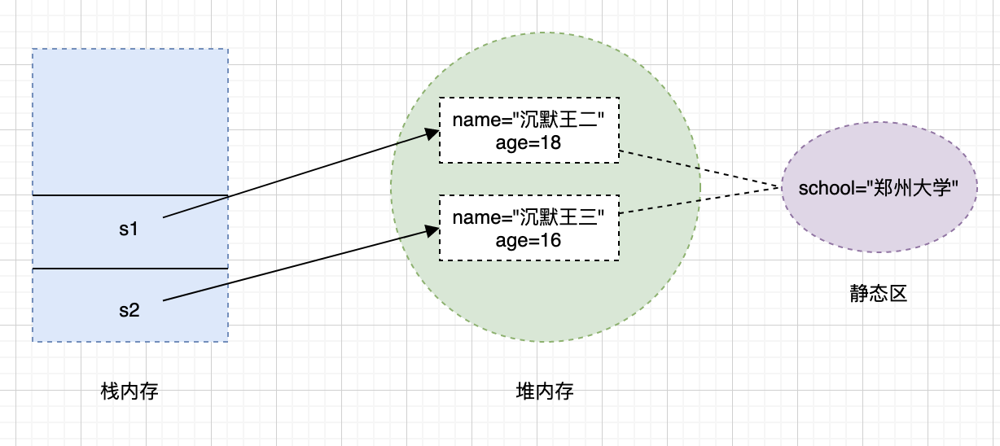

## static关键字

用于修饰成员变量，成员方法，代码块以及内部类，表示这是静态的，归属于整个类

## 静态变量

被 **`static`** 修饰的成员变量

### 特点

- 该变量被类的所有对象共享
- 静态变量不属于单个对象而属于整个类
- 随着类的加载而加载，在对象的产生之前存在
- 静态变量只会获取一次内存空间，所以任何对象对它的修改都会得到保留。如果一个实例修改了静态变量的值，其他实例也会看到这个更改。

### 内存原理

```java
public class Student {
    String name;
    int age;
    static String school = "华南理工大学";

    public Student(String name, int age) {
        this.name = name;
        this.age = age;
    }

    public static void main(String[] args) {
        Student s1 = new Student("沉默王二", 18);
        Student s2 = new Student("沉默王三", 16);
    }
}
```



- **`s1`** 和 **`s2`** 这两个引用变量存放在栈区（stack）
- 沉默王二+18 这个对象和沉默王三+16 这个对象存放在堆区（heap）
- school 这个静态变量存放在公共的地址（静态区）。

### 调用方式

- 类名.静态变量（推荐）
- 对象名.静态变量

## 静态方法

被 **`static`** 修饰的成员方法

### 特点

- 无须依赖类的实例就可以使用
- 只能访问静态变量和其他静态方法
- 不能使用 **`this`** 关键字，因为 **`this`** 代表当前对象实例，而静态方法属于类，不属于任何实例。
- 静态方法可以被重载（同类中方法名相同，但参数不同），但不能被子类重写（因为方法绑定在编译时已确定）
- 静态方法不具有多态性，即不支持方法的运行时动态绑定。

### 典型使用场景

- 工具类
- 工厂方法

### 调用方式

- 类名.静态方法（推荐）
- 对象名.静态方法

## 静态方法和实例方法的区别

| 特性     | 静态方法                   | 实例方法                                       |
| -------- | -------------------------- | ---------------------------------------------- |
| 关键字   | static                     | 无                                             |
| 归属     | 类                         | 对象                                           |
| 调用方式 | 通过类名或对象调用         | 通过对象调用                                   |
| 访问权限 | 只能访问静态变量和静态方法 | 可以访问实例变量、实例方法、静态变量和静态方法 |
| 典型用途 | 工具类方法、工厂方法       | 操作对象实例变量、与对象状态相关的操作         |
| 生命周期 | 类加载时存在，类卸载时消失 | 对象创建时存在，对象销毁时消失                 |