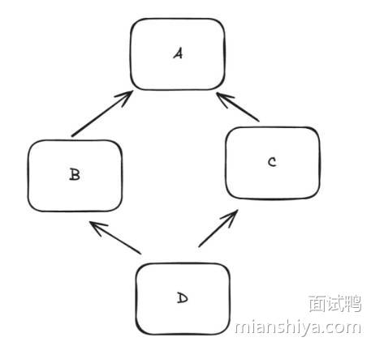

## 回答重点

### 概述

**Java 中的继承机制**是面向对象编程的核心特性之一，允许一个类（子类）继承另一个类（父类）的属性和方法。继承机制使得类之间可以形成层次结构，支持代码重用和扩展。它是实现多态、抽象和代码复用的关键机制。

### **优缺点**

**优点**：

- **代码复用**：子类可以复用父类的代码，减少重复实现。
- **易于维护**：可以通过修改父类代码来影响所有子类。

**缺点**：

- **紧耦合**：子类依赖于父类的实现，父类的修改可能会影响子类。
- **灵活性差**：继承层次结构可能会变得复杂，不易于调整或扩展。


### **基本概念**

子类继承父类的字段和方法，可以重用和扩展父类的功能。Java 使用 `extends` 关键字来表示类的继承关系。

Java 支持单继承，即一个类只能直接继承一个父类。子类可以继承父类的所有公共和受保护的成员，但不能继承父类的私有成员。

子类构造方法首先调用父类的无参构造方法，如果父类没有无参构造方法，子类必须显式调用父类的其他构造方法。

```java
// 父类
public class Animal {
   protected String name;

   public Animal(String name) {
       this.name = name;
   }

   public void eat() {
       System.out.println(name + " is eating.");
   }
}

// 子类
public class Dog extends Animal {
   public Dog(String name) {
       super(name);
   }

   public void bark() {
       System.out.println(name + " is barking.");
   }
}

// 使用继承
public class Main {
   public static void main(String[] args) {
       Dog dog = new Dog("Buddy");
       dog.eat();  // 继承自 Animal
       dog.bark(); // Dog 自有的方法
   }
}

```


### **super 关键字**

`super` 关键字可以用来调用父类的方法或构造方法。

```java
public void eat() {
    super.eat(); // 调用父类的 eat 方法
}
```

`super` 关键字也可以用来访问父类的字段。

```java
public void display() {
 System.out.println(super.name); // 访问父类的 name 字段
}
```

## 为什么不支持多继承

多继承会产生菱形继承的问题



BC 继承了 A，然后 D 继承了 BC, 假设此时要调用 D 内定义在 A 的方法，因为 B 和 C 都有不同的实现，此时就会出现歧义，不知道应该调用哪个了

### 为什么接口可以多实现？

在 Java8 之前接口是无法定义具体方法实现的，所以即使有多个接口必须子类自己实现，所以并不会发生歧义。

Java8 之后出了默认方法（default method），此时不就又出现的多继承的菱形继承问题了？

所以 Java 强制规定，如果多个接口内有相同的默认方法，子类必须重写这个方法。