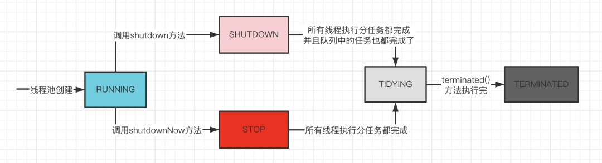

## 什么是线程池

线程池其实是一种池化的技术实现，池化技术的核心思想就是实现资源的复用，避免资源的重复创建和销毁带来的性能开销。线程池可以管理一堆线程，让线程执行完任务之后不进行销毁，而是继续去处理其它线程已经提交的任务。

线程池的优点

- **降低资源消耗**。通过重复利用已创建的线程降低线程创建和销毁造成的消耗。
- **提高响应速度**。当任务到达时，任务可以不需要等到线程创建就能立即执行。
- **提高线程的可管理性**。线程是稀缺资源，如果无限制的创建，不仅会消耗系统资源，还会降低系统的稳定性，使用线程池可以进行统一的分配，调优和监控。

## **`Executor`** 框架

**`Executor`** 框架不仅包括了线程池的管理，还提供了线程工厂、队列以及拒绝策略等，`Executor` 框架让并发编程变得更加简单。

### 框架的组成部分

- **任务(`Runnable` /`Callable`)**：执行任务需要实现的 **`Runnable` 接口** 或 **`Callable`接口**。**`Runnable` 接口**或 **`Callable` 接口** 实现类都可以被 **`ThreadPoolExecutor`** 或 **`ScheduledThreadPoolExecutor`** 执行。
- **任务的执行器(`Executor`)**：任务执行机制的核心接口 **`Executor`** ，以及继承自 `Executor` 接口的 **`ExecutorService` 接口。`ThreadPoolExecutor`** 和 **`ScheduledThreadPoolExecutor`** 这两个关键类实现了 **`ExecutorService`** 接口。
- **异步计算的结果(`Future`)**：**`Future`** 接口以及 **`Future`** 接口的实现类 **`FutureTask`** 类都可以代表异步计算的结果。

### 使用流程

- 主线程首先要创建实现 **`Runnable`** 或者 **`Callable`** 接口的任务对象。

- 提交任务

  - 把创建完成的实现 **`Runnable`/`Callable`** 接口的 对象直接交给 **`ExecutorService`** 执行:
    - **`ExecutorService.execute（Runnable command）`**
  - 把 **`Runnable`** 对象或 **`Callable`** 对象提交给 **`ExecutorService`** 执行
    - **`ExecutorService.submit（Runnable task）`**
    - **`ExecutorService.submit（Callable <T> task）`**

- 执行 **`ExecutorService.submit（…）`**，**`ExecutorService`** 将返回一个实现 **`Future`** 接口的对象

- 最后，主线程可以执行 **`FutureTask.get()`** 方法来等待任务执行完成。

  

**示例代码**

```java
// 提交Runnable任务
class Task implements Runnable {
    @Override
    public void run() {
        // 线程执行的代码
    }
}

public static void main(String[] args) {
    ExecutorService executor = Executors.newFixedThreadPool(10);  // 创建固定大小的线程池
    for (int i = 0; i < 10; i++) {
        executor.submit(new Task());  // 提交任务到线程池执行
    }
    executor.shutdown();  // 关闭线程池
}

//提交Callable任务
import java.util.concurrent.*;

class Task implements Callable<String> {
    @Override
    public String call() {
        return "Task executed by " + Thread.currentThread().getName();
    }
}

public class CallableExample {
    public static void main(String[] args) {
        ExecutorService executor = Executors.newFixedThreadPool(10);  // 创建固定大小的线程池
        Future<String>[] results = new Future[10];  // 存储任务的返回结果
        
        for (int i = 0; i < 10; i++) {
            results[i] = executor.submit(new Task());  // 提交 Callable 任务
        }
        
        // 获取任务的返回结果
        for (Future<String> result : results) {
            try {
                System.out.println(result.get());  // get() 方法会阻塞直到结果可用
            } catch (InterruptedException | ExecutionException e) {
                e.printStackTrace();
            }
        }

        executor.shutdown();  // 关闭线程池
    }
}
```


## 创建线程池的方法

### 使用 **`ThreadPoolExecutor`** 直接创建线程池

常见构造函数

```java
public ThreadPoolExecutor(int corePoolSize,
                          int maximumPoolSize,
                          long keepAliveTime,
                          TimeUnit unit,
                          BlockingQueue<Runnable> workQueue,
                          ThreadFactory threadFactory,
                          RejectedExecutionHandler handler)
```

- **`corePoolSize`** ：核心线程数，线程池会始终保持这个数量的线程，即使它们处于空闲状态。

- **`maximumPoolSize`** ：最大线程数，当任务队列已满且核心线程已满时，线程池会创建新线程，最多创建到 **`maximumPoolSize`** 。

- **`keepAliveTime`** ：当线程池中的线程数量超过 **`corePoolSize`** 时，空闲线程的存活时间，超过该时间的空闲线程会被回收。

- **`unit`** ：**`keepAliveTime`** 的时间单位，例如 **`TimeUnit.SECONDS`** 。

- **`workQueue`** ：任务队列，用于存放待执行的任务，常见的选择包括：

  - **`ArrayBlockingQueue<Runnable>(capacity)`** ：有界队列，适用于任务数可预测的情况。

  - **`LinkedBlockingQueue<Runnable>()`** ：无界队列，适用于任务数量不确定但不希望拒绝任务的情况（可能导致线程数不会超过 `corePoolSize`）。

  - **`SynchronousQueue<Runnable>()`** ：不存储任务的队列，每个任务必须有可用线程立即执行，否则会创建新线程（可能导致线程数迅速增长）。

- **`threadFactory`** ：用于创建线程的工厂，可以自定义线程名称、优先级等，常用 `Executors.defaultThreadFactory()` 作为默认实现。

- **`handler`** ：拒绝策略，当任务队列满且线程数量已达到 **`maximumPoolSize`** 时，会触发拒绝策略，常见的策略包括：

  - **`AbortPolicy`**（默认）：直接抛出 `RejectedExecutionException`，拒绝任务。
  - **`CallerRunsPolicy`** ：让提交任务的线程自己执行任务，避免任务丢失。
  - **`DiscardPolicy`** ：丢弃任务，不做任何处理。
  - **`DiscardOldestPolicy`** ：丢弃队列中最老的任务，并尝试再次提交新任务。


### 使用 **`Executors`** 工厂类

**通过 `Executor` 框架的工具类 `Executors` 来创建内置线程池。**

```java
ExecutorService fixedThreadPool = Executors.newFixedThreadPool(4);  // 固定大小线程池
ExecutorService cachedThreadPool = Executors.newCachedThreadPool(); // 可伸缩线程池
ExecutorService singleThreadExecutor = Executors.newSingleThreadExecutor(); // 单线程池
ExecutorService scheduledThreadPool = Executors.newScheduledThreadPool(2); // 定时任务线程池
ExecutorService pool = Executors.newWorkStealingPool(); //任务窃取线程池
```

- **`FixedThreadPool`** ：固定线程数量的线程池。该线程池中的线程数量始终不变。当有一个新的任务提交时，线程池中若有空闲线程，则立即执行。若没有，则新的任务会被暂存在一个任务队列中，待有线程空闲时，便处理在任务队列中的任务。**适合负载稳定的场景，任务数量确定且不需要动态调整线程数。**
- **`SingleThreadExecutor`** ： 只有一个线程的线程池。若多余一个任务被提交到该线程池，任务会被保存在一个任务队列中，待线程空闲，按先入先出的顺序执行队列中的任务。**适用于需要保证任务按顺序执行的场景，或者不需要并发处理任务的情况。**
- **`CachedThreadPool`** ： 可根据实际情况调整线程数量的线程池。线程池的线程数量不确定，但若有空闲线程可以复用，则会优先使用可复用的线程。若所有线程均在工作，又有新的任务提交，则会创建新的线程处理任务。所有线程在当前任务执行完毕后，将返回线程池进行复用。**适合短期大量并发任务的场景，任务执行时间短且线程数需求变化较大。**
- **`ScheduledThreadPool`** ：给定的延迟后运行任务或者定期执行任务的线程池。**适用于需要周期性任务执行的场景，如定时任务调度器。**
- **`WorkStealingPool`** ：基于任务窃取算法的线程池。线程池中的每个线程维护一个双端队列（deque），线程可以从自己的队列中取任务执行。如果线程的任务队列为空，它可以从其他线程的队列中“窃取”任务来执行，达到负载均衡的效果。**适合大量小任务并行执行，特别是递归算法或大任务分解成小任务的场景。**

## 线程池的核心参数

- **`corePoolSize`** ：线程池中用来工作的核心线程数量。
- **`maximumPoolSize`** ：最大线程数，线程池允许创建的最大线程数。
- **`keepAliveTime`** ：超出 **`corePoolSize`** 后创建的线程存活时间或者是所有线程最大存活时间，取决于配置。
- **`unit`** ：**`keepAliveTime`** 的时间单位。
- **`workQueue`** ：任务队列，是一个阻塞队列，当线程数达到核心线程数后，会将任务存储在阻塞队列中。
- **`threadFactory`** ：线程池内部创建线程所用的工厂。
- **`handler`** ：拒绝策略；当队列已满并且线程数量达到最大线程数量时，会调用该方法处理任务。

## 线程池的工作流程

- 提交任务
- 检查线程池是否运行
  - 若线程池不再运行则放弃任务
- 检测当前线程池的线程数是否小于核心线程数
  - 若小于核心线程数则创建一个工作线程并执行任务
- 若大于核心线程数检测阻塞队列是否已经满
  - 若阻塞队列未满了，就会添加任务到阻塞队列中，等待工作线程获取执行
- 若阻塞队列已经满了就会检测当前线程池的线程数
  - 若线程数小于最大线程数则会创建非核心线程
  - 若线程数大于最大线程数则会拒绝任务

## 线程池的拒绝策略

Java中提供了四种拒绝策略用于任务被拒绝时执行该策略同时支持自定义拒绝策略

- **`ThreadPoolExecutor.AbortPolicy`** ：抛出 **`RejectedExecutionException`** 来拒绝新任务的处理。
- **`ThreadPoolExecutor.CallerRunsPolicy`** ：调用执行者自己的线程运行任务，也就是直接在调用`execute`方法的线程中运行(`run`)被拒绝的任务，如果执行程序已关闭，则会丢弃该任务。因此这种策略会降低对于新任务提交速度，影响程序的整体性能。如果你的应用程序可以承受此延迟并且你要求任何一个任务请求都要被执行的话，你可以选择这个策略。
- **`ThreadPoolExecutor.DiscardPolicy`** ：不处理新任务，直接丢弃掉。
- **`ThreadPoolExecutor.DiscardOldestPolicy`** ：此策略将丢弃最早的未处理的任务请求。

**自定义拒绝策略**

可以自己实现 **`RejectedExecutionHandler`** 接口

```java
public class CustomRejectedExecutionHandler implements RejectedExecutionHandler {
    @Override
    public void rejectedExecution(Runnable r, ThreadPoolExecutor executor) {
        System.out.println(r.toString() + " rejected");
        // 可以在这里实现日志记录或其他逻辑
    }
}
```



**`ThreadPoolExecutor.CallerRunsPolicy`** 策略具有一定风险

如果被 **`CallerRunsPolicy`** 的拒绝的任务是个非常耗时的任务，且处理提交任务的线程是主线程，可能会导致主线程阻塞，影响程序的正常运行。

解决策略

- 在内存允许的情况下，我们可以增加阻塞队列 **`BlockingQueue`** 的大小并调整堆内存以容纳更多的任务，确保任务能够被准确执行。
- 为了充分利用 CPU，我们还可以调整线程池的 **`maximumPoolSize`** （最大线程数）参数，这样可以提高任务处理速度，避免累计在 **`BlockingQueue`** 的任务过多导致内存用完。



## 线程池常用的阻塞队列

- **ArrayBlockingQueue**：一个有界队列，底层基于数组实现。需要在初始化时指定队列的大小，队列满时，生产者会被阻塞，队列空时，消费者会被阻塞。
- **LinkedBlockingQueue**：基于链表的阻塞队列，允许可选的界限（有界或无界）。无界模式下可以不断添加元素，直到耗尽系统资源。有界模式则类似于 `ArrayBlockingQueue`，但吞吐量通常较高。
- **PriorityBlockingQueue**：一个无界的优先级队列，元素按照自然顺序或者指定的比较器顺序进行排序。与其他阻塞队列不同的是，PriorityBlockingQueue 不保证元素的 FIFO 顺序。
- **DelayQueue**：一个无界队列，队列中的元素必须实现 `Delayed` 接口，只有当元素的延迟时间到期时，才能被取出。常用于延迟任务调度。
- **SynchronousQueue**：一个没有内部容量的队列，每个插入操作必须等待对应的移除操作，反之亦然。常用于在线程之间的直接传递任务，而不是存储任务。

参见[往期博客](https://tyritic.github.io/p/java%E7%9A%84%E9%98%BB%E5%A1%9E%E9%98%9F%E5%88%97/)

## 核心线程的执行策略

### 核心线程数量可以为0

当核心线程数为0的时候，会创建一个非核心线程进行执行。

### 核心线程回收问题

**`ThreadPoolExecutor`** 默认不会回收核心线程，即使它们已经空闲了。这是为了减少创建线程的开销，因为核心线程通常是要长期保持活跃的。

但是，如果线程池是被用于周期性使用的场景，且频率不高（周期之间有明显的空闲时间）可以考虑回收核心线程。在负载高峰时临时增加核心线程数，低负载时通过回收空闲线程释放资源

**`allowCoreThreadTimeOut(true)`** 可以允许核心线程在空闲时被回收，从而释放系统资源。


### 核心线程数在运行过程可以动态修改

使用 **`ThreadPoolExecutor.setCorePoolSize(int corePoolSize)`** 方法可以动态修改核心线程数。

**`corePoolSize`** 参数代表线程池中的核心线程数。

当池中线程数量少于核心线程数时，会创建新的线程来处理任务。这个修改可以在线程池运行的过程中进行，立即生效。

注意事项

- 核心线程数的修改不会中断现有任务，新的核心线程数会在新任务到来时生效。
- **`setCorePoolSize()`** 方法可以减少核心线程数，但如果当前线程池中的线程数量超过了新的核心线程数，多余的线程不会立即被销毁，直到这些线程空闲后被回收。



线程池中的核心参数支持动态调整

- **`setCorePoolSize(int corePoolSize)`** ：修改 **核心线程数**  
- **`setMaximumPoolSize(int maximumPoolSize)`** ：修改 **最大线程数**  
- **`setKeepAliveTime(long time, TimeUnit unit)`** ：修改 **线程存活时间** 
- **`setRejectedExecutionHandler(RejectedExecutionHandler handler)`** ：修改 **拒绝策略**  



## 线程池的状态

- **RUNNING** ：线程池创建时就是这个状态，能够接收新任务，以及对已添加的任务进行处理。
- **SHUTDOWN** ：调用 **`shutdown`** 方法，线程池就会转换成 **SHUTDOWN** 状态，此时线程池不再接收新任务，但能继续处理已添加的任务到队列中。
- **STOP** ：调用 **`shutdownNow`** 方法，线程池就会转换成 **STOP** 状态，不接收新任务，也不能继续处理已添加的任务到队列中任务，并且会尝试中断正在处理的任务的线程。
- **TIDYING**：所有的任务已经运行终止，记录的任务数量为 0。
  - **SHUTDOWN** 状态下，任务数为 0， 其他所有任务已终止，线程池会变为 **TIDYING** 状态
  - 线程池在 **SHUTDOWN** 状态，任务队列为空且执行中任务为空，线程池会变为 **TIDYING** 状态
  - 线程池在 **STOP** 状态，线程池中执行中任务为空时，线程池会变为 **TIDYING** 状态。
- **TERMINATED** ：线程池彻底终止。线程池在 **TIDYING** 状态执行完 **`terminated()`** 方法就会转变为 **TERMINATED** 状态。



## 线程池的任务提交

### 提交不需要返回值的任务

**`execute()`** 用于提交不需要返回值的任务

#### 方法签名

**`void execute(Runnable command)`**

#### 代码示例

```java
threadsPool.execute(new Runnable() {
    @Override public void run() {
        // TODO Auto-generated method stub }
    });
```

#### 异常处理

当任务通过 **`execute()`** 提交到线程池并在执行过程中抛出异常时，如果这个异常没有在任务内被捕获，那么该异常会导致当前线程终止，并且异常会被打印到控制台或日志文件中。线程池会检测到这种线程终止，并创建一个新线程来替换它，从而保持配置的线程数不变。

### 提交需要返回值的任务

**`submit()`** 方法用于提交需要返回值的任务。线程池会返回一个 **`future`** 类型的对象，通过这个 **`future`** 对象可以判断任务是否执行成功，并且可以通过 **`future`** 的 **`get()`** 方法来获取返回值

#### 方法签名

- **`<T> Future<T> submit(Runnable task, T result)`** ：**无返回值的任务**（可以传默认值）
- **`<T> Future<T> submit(Callable<T> task)`** ：有返回值的任务

#### 代码示例

```java
import java.util.concurrent.*;

public class SubmitRunnableExample {
    public static void main(String[] args) throws ExecutionException, InterruptedException {
        ExecutorService executor = Executors.newFixedThreadPool(2);

        Runnable task = () -> {
            System.out.println(Thread.currentThread().getName() + " 执行任务");
        };

        Future<?> future = executor.submit(task);

        // `Runnable` 没有返回值，future.get() 只能拿到 `null`
        System.out.println("任务执行结果: " + future.get());

        executor.shutdown();
    }
}
```

```java
import java.util.concurrent.*;

public class SubmitCallableExample {
    public static void main(String[] args) throws ExecutionException, InterruptedException {
        ExecutorService executor = Executors.newFixedThreadPool(2);

        Callable<Integer> task = () -> {
            System.out.println(Thread.currentThread().getName() + " 执行任务");
            return 42;
        };

        Future<Integer> future = executor.submit(task);

        System.out.println("任务执行结果: " + future.get());

        executor.shutdown();
    }
}
```

#### 异常处理

对于通过 **`submit()`** 提交的任务，如果在任务执行中发生异常，这个异常不会直接打印出来。相反，异常会被封装在由  **`submit()`** 返回的 **`Future`** 对象中。当调用 **`Future.get()`** 方法时，可以捕获到一个 **`ExecutionException`** 。在这种情况下，线程不会因为异常而终止，它会继续存在于线程池中，准备执行后续的任务。

## 线程池的关闭

- **`shutdown()`** ：关闭线程池，线程池的状态变为 `SHUTDOWN`。线程池不再接受新任务了，但是队列里的任务得执行完毕。
- **`shutdownNow()`** ：关闭线程池，线程池的状态变为 `STOP`。线程池会终止当前正在运行的任务，并停止处理排队的任务并返回正在等待执行的 List。

### **`shutdown()`** 方法

```java
/**
 * 启动一次顺序关闭，在这次关闭中，执行器不再接受新任务，但会继续处理队列中的已存在任务。
 * 当所有任务都完成后，线程池中的线程会逐渐退出。
 */
public void shutdown() {
    final ReentrantLock mainLock = this.mainLock; // ThreadPoolExecutor的主锁
    mainLock.lock(); // 加锁以确保独占访问

    try {
        checkShutdownAccess(); // 检查是否有关闭的权限
        advanceRunState(SHUTDOWN); // 将执行器的状态更新为SHUTDOWN
        interruptIdleWorkers(); // 中断所有闲置的工作线程
        onShutdown(); // ScheduledThreadPoolExecutor中的挂钩方法，可供子类重写以进行额外操作
    } finally {
        mainLock.unlock(); // 无论try块如何退出都要释放锁
    }

    tryTerminate(); // 如果条件允许，尝试终止执行器
}
```

启动线程池的**平滑关闭**。它不再接受新的任务，但会继续执行已经提交的任务（包括在队列中的任务）。

线程池会进入 `SHUTDOWN` 状态，所有已执行和正在执行的任务都会继续完成，只有所有任务完成后，线程池才会完全终止。

### **`shutdownNow()`**

```java
/**
 * 尝试停止所有正在执行的任务，停止处理等待的任务，
 * 并返回等待处理的任务列表。
 *
 * @return 从未开始执行的任务列表
 */
public List<Runnable> shutdownNow() {
    List<Runnable> tasks; // 用于存储未执行的任务的列表
    final ReentrantLock mainLock = this.mainLock; // ThreadPoolExecutor的主锁
    mainLock.lock(); // 加锁以确保独占访问

    try {
        checkShutdownAccess(); // 检查是否有关闭的权限
        advanceRunState(STOP); // 将执行器的状态更新为STOP
        interruptWorkers(); // 中断所有工作线程
        tasks = drainQueue(); // 清空队列并将结果放入任务列表中
    } finally {
        mainLock.unlock(); // 无论try块如何退出都要释放锁
    }

    tryTerminate(); // 如果条件允许，尝试终止执行器

    return tasks; // 返回队列中未被执行的任务列表
}
```

启动线程池的**强制关闭**。它会尝试停止所有正在执行的任务，并返回等待执行的任务列表。它会尽力中断正在执行的任务，**但不能保证所有任务都能被立即停止**。

线程池进入 `STOP` 状态，除了尝试中断正在执行的任务外，还会清空任务队列，返回未执行的任务列表。

## 线程池的最佳实践和调优

- 线程池声明时 **必须** 使用 **`ThreadPoolExecutor`** 构造函数的方式，不允许使用 **`Executors`** 去创建
  - **`FixedThreadPool`** 和 **`SingleThreadExecutor`** 使用的是有界阻塞队列是 `LinkedBlockingQueue` ，其任务队列的最大长度为 **`Integer.MAX_VALUE`** ，可能堆积大量的请求，从而导致 OOM。
  - **`CachedThreadPool`** 使用的是同步队列 **`SynchronousQueue`** , 允许创建的线程数量为 **`Integer.MAX_VALUE`** ，如果任务数量过多且执行速度较慢，可能会创建大量的线程，从而导致 OOM。
  - **`ScheduledThreadPool`** 和 **`SingleThreadScheduledExecutor`**  使用的无界的延迟阻塞队列 **`DelayedWorkQueue`** ，任务队列最大长度为 **`Integer.MAX_VALUE`** ，可能堆积大量的请求，从而导致 OOM。
- 选择合适的线程池大小
  - **过小**的线程池可能会导致任务一直在排队
  - **过大**的线程池可能会导致大家都在竞争 CPU 资源，增加上下文切换的开销
  - 设置策略
    - **CPU 密集型任务 (N/N+1)：** 这种任务消耗的主要是 CPU 资源，线程数应设置为 **N或N+1**（CPU 核心数）。由于任务主要瓶颈在于 CPU 计算能力，与核心数相等的线程数能够最大化 CPU 利用率，过多线程反而会导致竞争和上下文切换开销。
    - **I/O 密集型任务(M \* N)：** 这类任务大部分时间处理 I/O 交互，线程在等待 I/O 时不占用 CPU。 为了充分利用 CPU 资源，线程数可以设置为 M * N，其中 N 是 CPU 核心数，M 是一个大于 1 的倍数，建议默认设置为 2 ，具体取值取决于 I/O 等待时间和任务特点，需要通过测试和监控找到最佳平衡点。
- **自定义 `ThreadFactory`** 实现给线程命名
- 线程池尽量不放入耗时操作