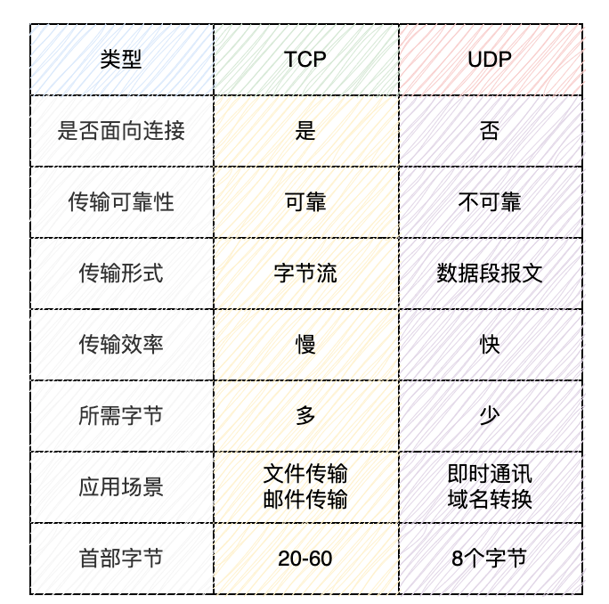

## 网络编程基础

### IP地址

在互联网中，一个 IP 地址用于唯一标识一个网络设备。一台联入互联网的计算机肯定有一个 IP 地址，但也可能有多个 IP 地址。

IP 地址又分为公网 IP 地址和内网 IP 地址。公网 IP 地址可以直接被访问，内网 IP 地址只能在内网访问。

假设一台计算机只有一个网卡，并且接入了网络，那么，它有一个本机地址`127.0.0.1`，还有一个 IP 地址，例如`101.202.99.12`，可以通过这个 IP 地址接入网络。

假设路由器或者交换机有两个网卡，它有两个 IP 地址，分别接入不同的网络，让网络之间连接起来。

如果两台计算机位于同一个网络，那么他们之间可以直接通信，因为他们的 IP 地址前段（网络号）是相同的。

网络号是 IP 地址与子网掩码过滤后得到的。（子网掩码转换成二进制和IP地址转换成二进制后按位进行与操作）

```
IP = 101.202.99.2
Mask = 255.255.255.0
Network = IP & Mask = 101.202.99.0
```

如果两台计算机计算出的网络号相同，说明两台计算机在同一个网络，可以直接通信。

如果两台计算机计算出的网络号不同，那么两台计算机不在同一个网络，不能直接通信，它们之间必须通过路由器或者交换机这样的网络设备（网关）间接通信。

网卡的关键配置

- IP 地址，例如：`10.0.2.15`
- 子网掩码，例如：`255.255.255.0`
- 网关的 IP 地址，例如：`10.0.2.2`

### 域名

直接记忆 IP 地址非常困难，所以通常使用域名访问某个特定的服务。

域名解析服务器 DNS 负责把域名翻译成对应的 IP，客户端再根据 IP 地址访问服务器。

### 端口号

用于标识计算机上的具体应用程序或进程。端口号与 IP 地址结合，共同用于标识一个主机上的具体服务或应用。

### 协议

网络通信的规则



### 网络套接字Socket

Socket（套接字）：网络通信的基本单位，通过 IP 地址和端口号标识。

套接字（Socket）是一个抽象层，应用程序可以通过它发送或接收数据；就像操作文件那样可以打开、读写和关闭。套接字允许应用程序将 I/O 应用于网络中，并与其他应用程序进行通信。网络套接字是 IP 地址与端口的组合。

## `InetAddress`IP地址类

`InetAddress` 是 Java 中用于表示一个 IP 地址的类，它提供了多种方法用于获取和处理与主机名或 IP 地址相关的信息。`InetAddress` 类位于 `java.net` 包中，常用于网络编程中。

### 常用方法

- `public static InetAddress getByName(String host) throws UnknownHostException`：该方法通过主机名或 IP 地址字符串返回一个 `InetAddress` 对象
- `public static InetAddress getByAddress(String host, byte[] addr) throws UnknownHostException`：通过给定的 IP 地址（字节数组）和主机名，返回一个 `InetAddress` 对象。
- `public static InetAddress getLocalHost() throws UnknownHostException`：该方法返回当前计算机的 `InetAddress` 对象。
- `public String getHostName()`：获取与 `InetAddress` 对象相关联的主机名。
- `public String getHostAddress()`：获取与 `InetAddress` 对象相关联的 IP 地址（以字符串形式返回）

## UDP协议传输

UDP 协议通过 `DatagramSocket` 和 `DatagramPacket` 类来实现。

### 服务端

- 创建一个 `DatagramSocket` 来监听端口。
- 等待并创建 `DatagramPacket` 用于接收客户端发送的数据包。
- 处理数据并可能向客户端发送响应。

```java
import java.net.*;

public class UDPServer {
    public static void main(String[] args) {
        DatagramSocket socket = null;
        try {
            // 创建一个 DatagramSocket 并绑定到端口 9876
            socket = new DatagramSocket(9876);
            System.out.println("UDP Server is running...");

            // 创建一个数据包来接收客户端的数据
            byte[] receiveData = new byte[1024];

            while (true) {
                // 创建 DatagramPacket 用于接收数据
                DatagramPacket receivePacket = new DatagramPacket(receiveData, receiveData.length);

                // 接收客户端发送的数据
                socket.receive(receivePacket);

                // 获取客户端的消息
                String clientMessage = new String(receivePacket.getData(), 0, receivePacket.getLength());
                System.out.println("Received from client: " + clientMessage);

                // 创建并发送响应消息
                String serverResponse = "Hello from UDP Server!";
                byte[] sendData = serverResponse.getBytes();

                // 获取客户端的地址和端口
                InetAddress clientAddress = receivePacket.getAddress();
                int clientPort = receivePacket.getPort();

                // 创建一个数据包并发送给客户端
                DatagramPacket sendPacket = new DatagramPacket(sendData, sendData.length, clientAddress, clientPort);
                socket.send(sendPacket);
            }
        } catch (Exception e) {
            e.printStackTrace();
        } finally {
            if (socket != null && !socket.isClosed()) {
                socket.close();
            }
        }
    }
}
```

### 客户端

- 创建一个 `DatagramSocket` 用于发送数据。
- 创建一个 `DatagramPacket`，通过该包发送数据到服务器。
- 等待接收服务器的响应。

```java
import java.net.*;

public class UDPClient {
    public static void main(String[] args) {
        DatagramSocket socket = null;
        try {
            // 创建一个 DatagramSocket 用于发送数据
            socket = new DatagramSocket();

            // 服务器的地址和端口
            InetAddress serverAddress = InetAddress.getByName("localhost");
            int serverPort = 9876;

            // 发送到服务器的消息
            String message = "Hello, UDP Server!";
            byte[] sendData = message.getBytes();

            // 创建一个 DatagramPacket 发送消息到服务器
            DatagramPacket sendPacket = new DatagramPacket(sendData, sendData.length, serverAddress, serverPort);
            socket.send(sendPacket);
            System.out.println("Sent to server: " + message);

            // 接收服务器的响应
            byte[] receiveData = new byte[1024];
            DatagramPacket receivePacket = new DatagramPacket(receiveData, receiveData.length);

            socket.receive(receivePacket);

            // 获取服务器响应并打印
            String serverResponse = new String(receivePacket.getData(), 0, receivePacket.getLength());
            System.out.println("Received from server: " + serverResponse);

        } catch (Exception e) {
            e.printStackTrace();
        } finally {
            if (socket != null && !socket.isClosed()) {
                socket.close();
            }
        }
    }
}
```

### 核心类

#### `DatagramSocket`网络套接字

`DatagramSocket` 提供了发送和接收数据包的功能。

**构造方法**

- `public DatagramSocket() throws SocketException`
- `public DatagramSocket(int port) throws SocketException`
- `public DatagramSocket(int port, InetAddress bindAddress) throws SocketException`

**收发数据**

- `public void send(DatagramPacket packet) throws IOException`：发送一个数据包到目标地址。
- `public void receive(DatagramPacket packet) throws IOException`：接收来自远程主机的数据包

**设置超时**

- `public void setSoTimeout(int timeout) throws SocketException`：设置超时时间，如果在指定的时间内没有数据到达，则会抛出 `SocketTimeoutException`。

**关闭套接字**

- `public void close()`：关闭套接字

#### `DatagramPacket`数据包类

`DatagramPacket` 类提供了封装数据包的功能，常用于 UDP 协议的通信中。它可以用于存储接收到的数据或准备发送的数据。

**构造方法**

- `public DatagramPacket(byte[] buf, int length)`
  - `buf`：用于存储数据的字节数组。
  - `length`：数据包的有效数据长度（在字节数组中的有效数据部分）。
- `public DatagramPacket(byte[] buf, int length, InetAddress address, int port)`
  - `buf`：用于存储数据的字节数组。
  - `length`：数据包的有效数据长度。
  - `address`：目标主机的 IP 地址。
  - `port`：目标主机的端口号。

**获取数据**

- `public byte[] getData()` ：返回 `DatagramPacket` 中存储的数据字节数组。
- `public int getLength()` ：返回 `DatagramPacket` 中有效数据的长度（字节数）。
- `public InetAddress getAddress()` ：返回 `DatagramPacket` 中目标主机的 IP 地址。
- `public int getPort()`：返回 `DatagramPacket` 中目标主机的端口号。

**设置属性**

- `public void setData(byte[] buf)` 
- `public void setLength(int length)` 
- `public void setAddress(InetAddress address)` 
- `public void setPort(int port)`

## TCP协议传输

### 服务端

- 创建一个 `ServerSocket` 来监听端口。
- 调用`ServerSocket`的`accept()`返回一个`Socket`对象监听客户端的套接字请求
- 获取连接通道的输入流读取来自客户端的数据
- 释放资源

```java
import java.io.*;
import java.net.*;

public class TCPServer {

    public static void main(String[] args) {
        try {
            // 创建 ServerSocket 监听端口 12345
            ServerSocket serverSocket = new ServerSocket(12345);
            System.out.println("Server is waiting for a client connection...");

            // 接受客户端连接
            Socket clientSocket = serverSocket.accept();
            System.out.println("Client connected!");

            // 获取输入流读取客户端发送的数据
            BufferedReader in = new BufferedReader(new InputStreamReader(clientSocket.getInputStream()));
            PrintWriter out = new PrintWriter(clientSocket.getOutputStream(), true);

            // 读取客户端数据并响应
            String clientMessage;
            while ((clientMessage = in.readLine()) != null) {
                System.out.println("Received from client: " + clientMessage);
                if (clientMessage.equalsIgnoreCase("bye")) {
                    out.println("Goodbye!");
                    break;
                }
                // 向客户端返回消息
                out.println("Server received: " + clientMessage);
            }

            // 关闭连接
            in.close();
            out.close();
            clientSocket.close();
            serverSocket.close();
            System.out.println("Server closed.");
        } catch (IOException e) {
            e.printStackTrace();
        }
    }
}
```


### 客户端

- 创建客户端的`Socket`对象
  - 创建`Socket`对象时同时连接服务端
  - 若服务端不可访问会发生阻塞直到抛出异常
- 获取连接通道的输出流，写入数据
- 释放资源

```java
import java.io.*;
import java.net.*;

public class TCPClient {

    public static void main(String[] args) {
        try {
            // 连接到服务器 (IP 地址和端口号)
            Socket socket = new Socket("localhost", 12345);
            System.out.println("Connected to server.");

            // 获取输出流，发送数据
            PrintWriter out = new PrintWriter(socket.getOutputStream(), true);
            // 获取输入流，接收服务器的数据
            BufferedReader in = new BufferedReader(new InputStreamReader(socket.getInputStream()));
            BufferedReader userInput = new BufferedReader(new InputStreamReader(System.in));

            String message;
            System.out.println("Enter message to send to server (type 'bye' to exit):");
            while (true) {
                message = userInput.readLine();  // 读取用户输入
                out.println(message);  // 发送消息到服务器
                String response = in.readLine();  // 从服务器接收响应
                System.out.println("Server response: " + response);

                if (message.equalsIgnoreCase("bye")) {
                    break;
                }
            }

            // 关闭连接
            userInput.close();
            in.close();
            out.close();
            socket.close();
            System.out.println("Client closed.");
        } catch (IOException e) {
            e.printStackTrace();
        }
    }
}
```

### 核心类

#### `ServerSocket`服务端套接字

`ServerSocket` 类是 Java 中用于实现 TCP 服务器端的类。它主要用于监听客户端的连接请求并接受连接。

**构造方法**

- `public ServerSocket(int port) throws IOException`
- `public ServerSocket(int port, int backlog) throws IOException`
- `public ServerSocket(int port, int backlog, InetAddress bindAddr) throws IOException`

**接受连接**

- `public Socket accept() throws IOException`：接受客户端的连接请求。
  - 此方法会阻塞，直到有客户端发起连接请求。
  - 返回一个已连接的 `Socket` 实例，客户端可以通过该 `Socket` 与服务器通信。

**状态检测**

- `public boolean isBound()` ：检查 `ServerSocket` 是否已经绑定到一个本地地址和端口。
- `public boolean isClosed()`：检查 `ServerSocket` 是否已关闭

#### `Socket`客户端套接字

`Socket` 类是 Java 中用于实现 TCP 客户端通信的类，它提供了与服务器建立连接、发送和接收数据的功能。

**构造方法**

- `public Socket(String host, int port) throws UnknownHostException, IOException`：创建一个指定主机和端口的 `Socket`，并与目标主机建立连接。
  - `host`：目标主机的 IP 地址或域名。
  - `port`：目标主机的端口号。
- `public Socket(InetAddress address, int port) throws IOException`：创建一个指定 IP 地址和端口号的 `Socket`，并与目标主机建立连接
  - `address`：目标主机的 IP 地址（`InetAddress` 类型）。
  - `port`：目标主机的端口号。

**获取IO流**

- `public InputStream getInputStream() throws IOException`：返回与此 `Socket` 关联的输入流，客户端可以通过该流接收从服务器发送的数据
- `public OutputStream getOutputStream() throws IOException`：返回与此 `Socket` 关联的输出流，客户端可以通过该流向服务器发送数据。

**设置超时时间**

- `public void setSoTimeout(int timeout) throws SocketException`：设置读取数据的超时时间。如果在指定的时间内没有数据可读取，则会抛出 `SocketTimeoutException`。