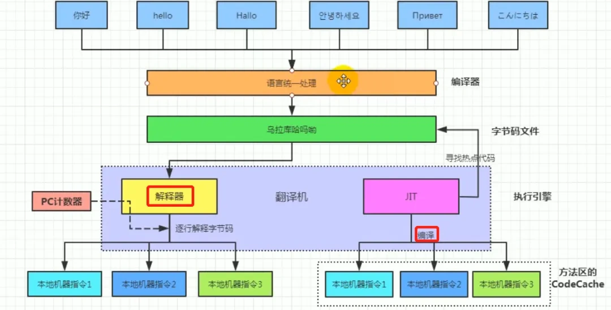

## 执行过程

1. 开发者编写Java源代码（ **.java** 文件）
2. 编译源代码（**.java**文件）使用`javac`命令编译器将源代码转化成**字节码**（**.class**文件）
3. 在虚拟机（**JVM**）上运行字节码（**.class** 文件），将字节码解释成机器码
   1. 在程序运行时，JVM 会监控哪些字节码被频繁调用（热点代码）。一旦识别出热点代码，JVM 会将这些代码交给 JIT 编译器进行编译，并缓存编译后的机器码。
   2. 字节码中不经常调用的部分（非热点代码）用解释器进行解释执行，然后字节码也是经过解释器进行解释运行的



解释执行比编译执行效率差

解释执行：在程序执行时，逐行解释执行源代码，不生成独立的可执行文件。通常由解释器动态解释并执行代码，跨平台性好，但执行速度相对较慢。（类比每次给你英语让你翻译阅读）

编译执行：在程序执行之前，整个源代码会被编译成机器码或者字节码，生成可执行文件。执行时直接运行编译后的代码，速度快，但跨平台性较差。（类比直接给你看中文）

Java同时具有解释性和编译性

- 编译性
  - Java源代码首先被编译成字节码，JIT 会把编译过的机器码保存起来,以备下次使用。
  - JVM 加载并执行 Java 字节码文件，在执行过程中，JVM 会发现一些高频次执行的代码（热点代码），然后将这些字节码交给 JIT 编译器进行编译，生成平台相关的机器码。这样，Java 程序的性能就能得到优化，因为热点代码被 JIT 编译成了机器码，可以直接运行，而不需要每次都解释执行。
- 解释性：字节码中非热点部分（不经常调用的部分）用解释器进行解释执行，然后字节码也是经过解释器进行解释运行的



## 跨平台性

Java程序具有在任意操作系统平台上运行

### 实现原理

在运行Java程序程序的操作系统上安装一个与操作系统对应的Java虚拟机。源代码会被编译成相同的字节码，然后虚拟机根据操作系统将字节码解释成不同的机器码

## Java的运行环境

### JVM（Java虚拟机）

Java虚拟机用于解释Java源代码，加载Java程序。针对不同的操作系统设计有不同的Java虚拟机

### JRE（Java运行时环境）

**JRE**全称 **（Java Runtime Environment）** 是Java运行时环境，包含了 **JVM** , Java核心类库和其他支持Java程序的文件，但是**不包含任何开发工具**

#### 组成部分

- **JVM**（Java Virtual Machine）：执行由源代码编译后得到的Java字节码，提供了Java程序的运行环境
- 核心类库：标准的类库（java.lang,java.utils）供Java程序使用
- 其他文件：配置文件，库文件，支持JVM的运行

### JDK（Java开发包）

**JDK**全称 **（Java Development Kit）** 是一组独立程序构成的集合，是用于开发Java 程序的完整开发环境，**它包含了JRE** ，以及用于开发、调试和监控 Java 应用程序的工具。

#### 组成部分

- **JRE**：**JDK**包含了完整的JRE，可以运行java程序
- 开发工具：包含编译器（**javac**），打包工具（**jar**）
- 附加库和文件：支持开发，文档生成

#### 常见开发工具

- **javac** ：Java 编译器，用于将 Java 源代码（.java 文件）编译成字节码（.class 文件）。
- **java** ：Java 应用程序启动器，用于运行 Java 应用程序。
- javadoc：文档生成器，用于从 Java 源代码中提取注释并生成 HTML 格式的 API 文档。
- **jar** ：归档工具，用于创建和管理 JAR（**Java Archive**）文件。
- **jdb**：Java 调试器，用于调试 Java 程序。
- jps：Java 进程状态工具，用于列出当前所有的 Java 进程。
- jstat：JVM 统计监视工具，用于监视 JVM 统计信息。
- jstatd：JVM 统计监视守护进程，用于在远程监视 JVM 统计信息。
- **jmap**：内存映射工具，用于生成堆转储（**heap dump**）、查看内存使用情况。
- **jhat**：堆分析工具，用于分析堆转储文件。
- **jstack**：线程栈追踪工具，用于打印 Java 线程的栈追踪信息。
- javap：类文件反汇编器，用于反汇编和查看 Java 类文件。
- jdeps：Java 类依赖分析工具，用于分析类文件或 JAR 文件的依赖关系

### 相互关系

- JDK
  - JRE
    - JVM
    - 核心类库
  - 开发工具