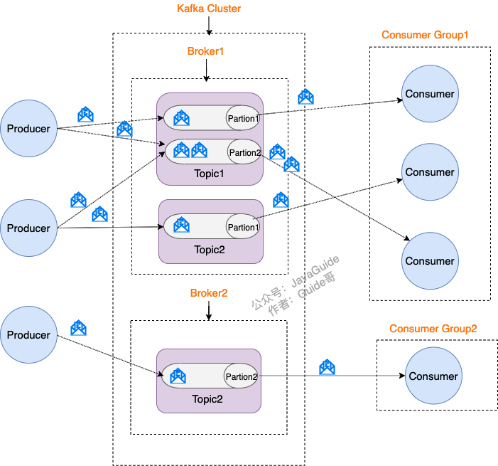

## Kafka是什么

Kafka是一种分布式流事件处理平台，严格意义上不是一个纯消息队列，但是可以胜任消息队列的所有任务。

主要的应用场景

- 消息队列：用作高吞吐量的消息系统，将消息从一个系统传递到另一个系统。 
- 日志收集：集中收集日志数据，然后通过Kafka传递到实时监控系统或存储系统。 
- 流计算：处理实时数据流，将数据传递给实时计算系统 
- 事件溯源：记录事件发生的历史，以便稍后进行数据回溯或重新处理。

## Kafka的基本组件

### 生产者（Producer)

Producer 是生产者，负责创建消息并将其发送到 Kafka 主题（Topic）。 同时Producer 可以配置消息的分区策略，从而控制消息发送到在哪个分区中。 Producer 可以配置不同的持久化与可靠性策略。

### 消费者（Consumer)

Consumer 是消费者，负责从 Kafka 主题中读取消息，通过订阅一个或多个 Topic，动态地拉取消息进行处理。Consumer 通常属于一个 Consumer Group，同一个 Group 中的各 Consumer 可以分配处理特定分区的数据，实现并行处理。

### 消息代理（Broker)

Broker是 Kafka 的核心，用于消息存储和管理。每个 Kafka 集群可以包含一个或多个 Broker，负责接收、存储、以及发送数据。

### 协调器（ZooKeeper)

Zookeeper用于 Kafka 的分布式协调和管理任务， 确保 Kafka 集群的高可用性和一致性。

- **Broker 注册** ：在 Zookeeper 上会有一个专门 **用来进行 Broker 服务器列表记录** 的节点。每个 Broker 在启动时，都会到 Zookeeper 上进行注册，即到 `/brokers/ids` 下创建属于自己的节点。每个 Broker 就会将自己的 IP 地址和端口等信息记录到该节点中去
- **Topic 注册** ：在 Kafka 中，同一个 **Topic 的消息会被分成多个分区** 并将其分布在多个 Broker 上， **这些分区信息及与 Broker 的对应关系** 也都是由 Zookeeper 在维护。比如我创建了一个名字为 my-topic 的主题并且它有两个分区，对应到 zookeeper 中会创建这些文件夹：
- **负载均衡**：Kafka 通过给特定 Topic 指定多个 Partition, 而各个 Partition 可以分布在不同的 Broker 上, 这样便能提供比较好的并发能力。 对于同一个 Topic 的不同 Partition，Kafka 会尽力将这些 Partition 分布到不同的 Broker 服务器上。当生产者产生消息后也会尽量投递到不同 Broker 的 Partition 里面。当 Consumer 消费的时候，Zookeeper 可以根据当前的 Partition 数量以及 Consumer 数量来实现动态负载均衡。

## Kafka的基本概念

### Topic（主题）

Topic是用来区分和隔离不同类型消息的单位。每一个 Topic 都有一个名称，生产者将消息发送到某个特定的 Topic 上，而消费者从某个特定的 Topic 接收消息。

主要作用

- 消息分类：Kafka 通过 Topic 来对消息进行分类管理，生产者和消费者通过 Topic 来组织和订阅消息。 
- 隔离数据：不同业务或模块的数据可以通过不同的 Topic 隔离开，保证数据之间的独立性和安全性。 
- 分区并行：每个 Topic 可以有多个分区，消息会被分布到不同分区上，实现并行处理，提升系统的吞吐量和伸缩性。

### Partition（分区）

Partition 是指一个Topic中的一个分区。Kafka 主题可以划分为多个分区，每个分区是一个有序的、不可变的消息序列。不同分区中的消息是并行地存储和处理的，这使得 Kafka 能够实现高吞吐量。

主要作用

- **并行处理** ：更多的分区可以让多个消费者实例并行处理消息，从而提升系统的吞吐量。 
- **负载均衡** ：通过增加分区数量，可以更好地分配负载，避免某个节点成为瓶颈。 
- **数据局部性** ：分区可以分布在不同的代理节点上，提高数据的可用性和可靠性。

### Consumer Group（消费者组）

Consumer Group 是一组消费者（Consumer），它们共同协作来消费一个或多个主题（Topic）中的消息。每个Consumer Group都有一个唯一的标识符。所有属于同一组的消费者会协同工作，以保证一个组内的每条消息仅会被消费一次。

- 每个Consumer Group内的每个消费者独立消费不同的分区（Partition）中的数据，一个分区只能被一个Consumer消费。 
- 即使有多个消费者在同一个组内消费同一个Topic，Kafka也会确保每条消息只会被组内的其中一个消费者处理。这样极大地提高了消费的并发能力和处理速度，保证了消息的高效处理。 
- Consumer Group可以实现负载均衡。当有新的消费者加入或离开组时，Kafka会自动均衡分区的消费，将需要消费的分区重新分配给现存的消费者。

## 分区的分配规则

### 生产者分配规则

- 开发者手动指定partition
- 指定 key（Kafka 自动 hash 取模）
  - 相同 key 会落到同一个 partition（实现“局部有序”）
  - key 不同的消息可能落到不同 partition，接近均匀分布
- 既不指定 key，也没 partition（默认轮询 Round-Robin）

### 消费者分配规则

发生在 **Consumer Group 内部** 的事情。每个 Topic 下有多个 Partition，Kafka 会把这些分区 **均匀地分配给组内的消费者**。

Kafka 默认的消费者分区分配策略是

- **Range** ：按 partition 序号分组（容易不均）
- **RoundRobin** ：分区轮着分
- **Sticky**（默认）：尽可能稳定地分区（减少重平衡影响），和 RoundRobin 类似，但**尽量保持和上一次分配一致**
