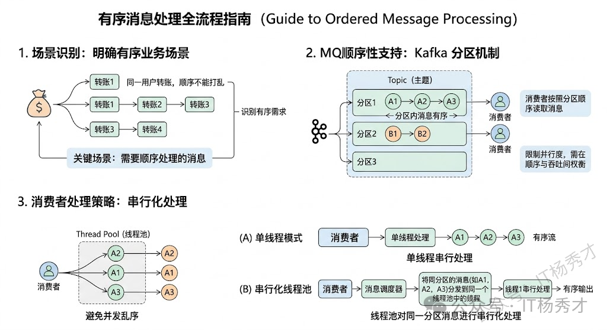
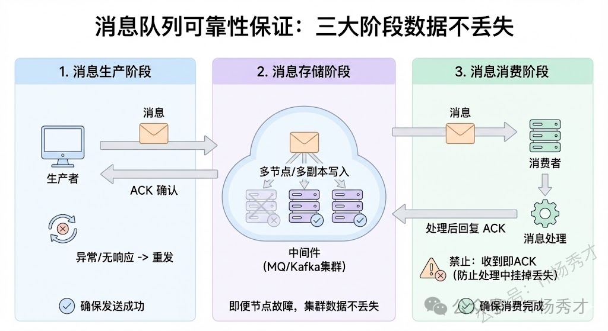
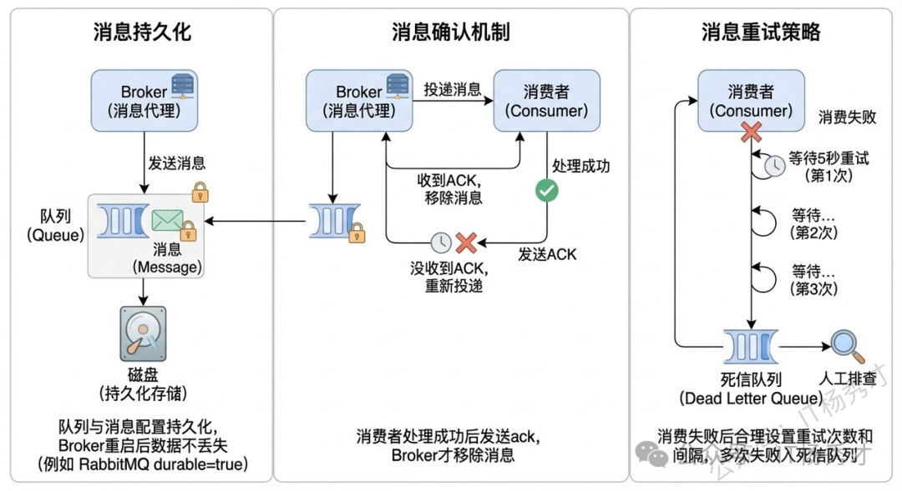
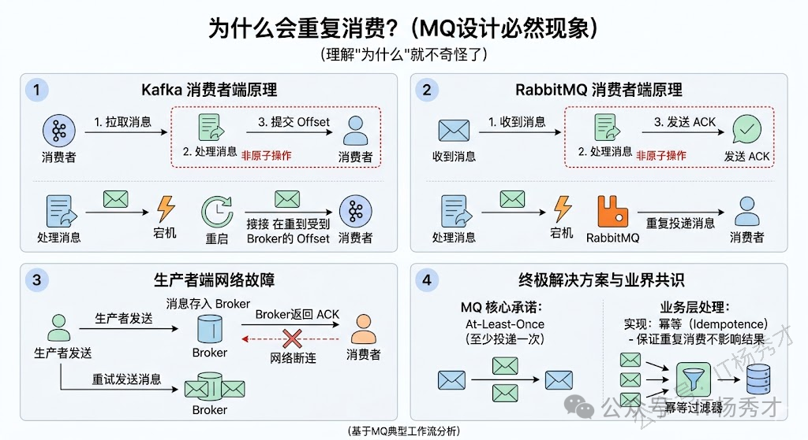
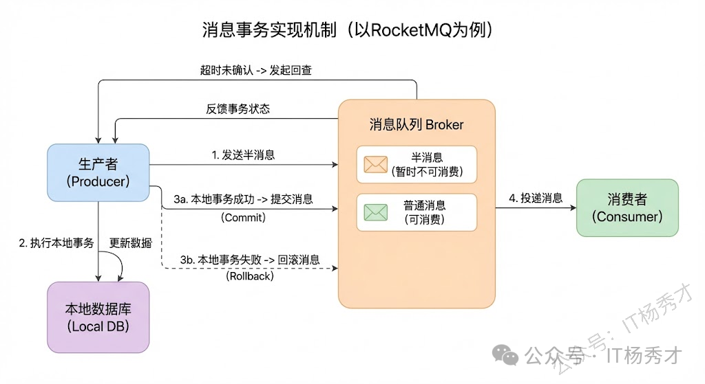

## 🧠 消息顺序性

### 🔍 为什么需要消息顺序性

假设一个订单经历了三个状态变化：创建→支付→完成，对应发了三条消息。如果这三条消息分散到了三个不同的分区/队列，三个消费者同时消费，可能出现消费者 C3 先处理"完成"，C1 才开始处理"创建"——顺序完全乱了。即使在同一个队列里，如果消费者开了多线程并发处理，也会乱序：线程 1 拿到"创建"但处理慢，线程 2 拿到"支付"先处理完了。

### 🛠️ 如何保证消息顺序性？

保证顺序的核心思路就是把并行变成串行——但不是全局串行（那性能就废了），而是局部串行。只对需要保序的一组消息（比如同一个订单的所有消息）走同一条串行通道，不同组之间仍然可以并行。

Kafka 通过分区机制和消息键来保证消息的顺序性。在 Kafka 中，每个 Topic 可以分为多个分区，每个分区内的消息都是有序的。消息在被追加到 Partition(分区)的时候都会分配一个特定的偏移量（offset）。Kafka 通过偏移量（offset）来保证消息在分区内的顺序性。

对于生产者端，因为在同一个分区内，消息是有序的。 因此可以使用消息键和指定分区将相关消息分配到同一分区，可以保证这些消息在同一分区内依然有序。

对于消费者端：消费者在消费消息时，同一个消费者线程只能同时消费一个分区的消息，这样可以保证消费端在处理某个分区内的消息时是按顺序的。不同分区的消息并行处理，兼顾了顺序性和吞吐量。如果 Kafka 集群中没有足够的消费者线程，某个消费者线程可能需要同时消费多个分区的消息，但这些分区之间的顺序是无法保证的。

  

---

## 🛡️ 消息可靠性

消息从生产到消费要经历三个环节：生产者→Broker→消费者。消息在任何一个环节都可能丢失，所以必须每个环节都做保障。可以把它想象成一个接力赛：

- 第一棒（发送）要确认交接成功——生产者发出消息后必须收到 Broker 的 ack 才算发送成功
- 第二棒（存储）要把接力棒拿稳、备份——Broker 要做持久化防宕机，做多副本防单点故障
- 第三棒（消费）要跑完全程才算完成——消费者必须处理完业务逻辑后才回复 ack，不能提前确认

  

  

---

### 📤 生产者端的保证

生产者在发送消息时，需要通过消息确认机制来确保消息成功到达。生产者发送消息至 Broker ，需要处理 Broker 的响应，如果 Broker 返回写入失败等错误消息，重试发送。

- 设置合适的重试次数 **`retries`** 和重试间隔：决定生产者端的重试次数
- 配置合适的 **`acks`** 参数：决定生产者在收到多少个副本的确认后认为消息发送成功

| acks 值 | 说明 |
|---|---|
| `0` | 生产者不会等待任何服务器的确认。消息可能会丢失，但性能最高。 |
| `1` | 生产者会在领导者副本（leader）成功接收到数据后收到确认。数据可靠性得到了基本保障，但如果领导者副本崩溃，仍有可能丢失消息。 |
| `all`（或 `-1`） | 生产者会等待所有同步副本（ISR）接收到数据后收到确认。数据可靠性最高，但性能会有所下降，因为需要等多个副本都确认接收。 |

---

### 📥 消费者端的保证

消息在被追加到 Partition(分区)的时候都会分配一个特定的偏移量（offset）。偏移量（offset）表示 Consumer 当前消费到的 Partition(分区)的所在的位置。Kafka 通过偏移量（offset）可以保证消息在分区内的顺序性。

自动提交 offset 会导致以下问题：当消费者拉取到了分区的某个消息之后，消费者会自动提交了 offset。当消费者刚拿到这个消息准备进行真正消费的时候，突然挂掉了，消息实际上并没有被消费，但是 offset 却被自动提交了。

通常的解决方法：**手动关闭自动提交 offset，每次在真正消费完消息之后再自己手动提交 offset 。** 但是这样会带来消息被重新消费的问题。比如你刚刚消费完消息之后，还没提交 offset，结果自己挂掉了，那么这个消息理论上就会被消费两次。

---

### 🏗️ Broker 的保证

#### 📚 多副本机制

Broker 通过 **多副本机制** 来保证消息不丢失。Kafka 中的每个分区都有多个副本（Replicas），这些副本分布在不同的 Broker 上。当一个 Broker 宕机时，其他持有该分区副本的 Broker 能够接管工作。

Kafka 的副本分为 leader 副本和 follower 副本。每个主题（topic）中的分区（partition）会有一个 leader 副本和多个 follower 副本。

- **leader 副本**：每个 Kafka 分区都有一个 Leader，负责处理所有的读写请求
- **follower 副本**：定期从领导者副本中拉取数据，保持数据的一致性

当 leader 副本宕机时，会在 follower 副本中选出一个新的领导者，确保数据的连续性和可用性。



在 Kafka 中，ISR (In-Sync Replica) 是一组与 Leader 副本保持同步的所有副本。具体来说，ISR 包含那些能够及时复制 Leader 副本中最新消息的副本。ISR 中的副本保证了它们的数据与 Leader 的数据一致或者仅仅落后很少量的数据，这些副本在副本集合中被认为是"同步"的。

一个副本如果长时间无法与 Leader 同步（可能因为网络延迟、故障等原因），它就会被移出 ISR 集合。只有在其再次追上 Leader 后，才会被重新加入 ISR 集合。



---

#### ⚙️ 选举机制

Kafka 的选举有以下几种：

- Kafka Controller 的选举
- Partition Leader 的选举
- Consumer Group Coordinator（消费组协调者）的选举

##### ⚡ Kafka Controller 的选举过程

- **启动竞争** ：集群启动时，各个 Broker 节点会尝试在 ZooKeeper 中创建一个临时节点 `/controller`。ZooKeeper 是一个分布式协调服务，可保障只有一个节点能成功创建该节点。
- **确定控制器** ：成功创建 `/controller` 节点的 Broker 会成为控制器，并在该节点中记录自身的 Broker ID 等信息。
- **故障处理** ：若控制器所在节点发生故障，其创建的临时节点会自动消失。其他 Broker 监听到这一变化后，会重新竞争创建 `/controller` 节点，从而选出新的控制器。

##### 🎯 Partition Leader 的选举过程

- **控制器主导** ：分区首领选举由控制器负责。控制器会维护分区的状态信息，当检测到首领副本不可用时，会触发选举流程。
- **优先副本选择** ：Kafka 优先选择分区的优先副本作为首领。优先副本是在分区创建时指定的第一个副本。
- **存活副本选举** ：若优先副本不可用，控制器会从同步副本集合（ISR）中选择一个副本作为新的首领。同步副本是指与首领副本保持同步的副本。
- **元数据更新** ：选举出新首领后，控制器会更新集群元数据，通知其他 Broker 新的首领信息。

##### 🔗 Consumer Group Coordinator 的选举

- **协调器确定**：消费者组中的消费者在启动时，会向 Kafka 集群发送请求，Kafka 根据消费者组 ID 的哈希值选择一个 Broker 作为协调器。
- **注册与通知** ：消费者向选定的协调器注册自己，协调器会维护消费者组的成员信息，并将分区分配方案通知给各个消费者。
- **故障处理** ：若协调器所在 Broker 故障，消费者会收到通知，重新发起协调器选举。

---

## ⚠️ 消息重复消费

### 🔍 重复消费的原因

Kafka 中会出现消息重复的情况，根本原因：**服务端侧已经消费的数据没有成功提交 offset**

- 消费者的工作流程是：拉取消息 → 处理消息 → 提交 offset（告诉 Broker"我已经消费到第 N 条了"）。关键问题在于处理消息和提交 offset 是两个独立的步骤，不是原子操作。假设消费者拉了第 100 条消息，处理完了，正准备提交 offset=100，这一瞬间消费者宕机了。重启后 Broker 发现上次提交的 offset 还是 99，于是消费者拉取消息时——重复消费就这么发生了。
- 生产者端也会造成重复：消息发到 Broker 了，Broker 也存下来了，但返回 ack 的时候网络断了，生产者以为没发成功又发了一次——同一条消息就被存了两次。

  

### 🛠️ 解决重复消费的策略

严格意义上是无法从根本上解决重复的消息，因为为了保证消息的可靠性会产生重复的消息。既然重复消费无法 100% 避免（除非做分布式事务，代价太高），业界的共识是：MQ 保证 at-least-once（至少投递一次），业务层自己做幂等保证重复消费不影响结果。只有让消费者的处理逻辑具有 **幂等性** ，幂等性就是同一个操作执行多次和执行一次的效果一样，保证无论同一条消息被消费多少次，结果都是一样的，从而避免因重复消费带来的副作用。

具体来说就是每条消息带一个唯一的业务标识，消费者处理之前先去数据库或 Redis 里查这个标识有没有被处理过，如果已处理就直接跳过，保证同一条消息不管消费几次，业务结果都只生效一次。

实现幂等性的常用方案：

- **唯一标识（幂等键）**：每个请求生成一个全局唯一 ID 比如 UUID 或业务主键，服务端处理前先校验这个 ID 是否已处理过，处理过就不再处理，直接跳过或者直接返回
- **数据库乐观锁**：通过版本号或状态字段控制并发更新，确保多次更新等同于单次
- **数据库唯一约束**：利用唯一索引防止重复插入
- **分布式锁**：保证同一时刻只有一个请求执行关键操作
- **消息去重**：消息队列场景下，生产者给每条消息生成唯一消息 ID，消费者处理前先检查该 ID 是否已处理过

---:

## 🔄 消息事务保证数据一致性

### 📖 消息事务的核心问题

消息事务解决的核心问题是：**"写数据库"和"发消息到 MQ"这两个操作要么都成功，要么都失败**。

这个问题看似简单，实际很难，因为数据库和 MQ 是两个独立的系统，没法放在同一个本地事务里。先看两种"直觉方案"为什么有问题：

- **先发消息再写库**：消息发成功了，下游开始处理了，结果本地数据库写失败了回滚了，下游收到了一条不该收到的消息，数据不一致
- **先写库再发消息**：数据库写成功了，但发消息时网络断了或 MQ 挂了，消息没发出去，下游永远收不到，数据也不一致

### 🛠️ 解决消息事务的策略

半事务消息方案巧妙地解决了这个问题。

  

具体流程如下：

1. **发送半事务消息**：生产者先发一条半事务消息（Half Message）给 Broker（相当于先"占个位"），Broker 存储但标记为暂不投递状态，然后返回 ack 给生产者
2. **执行本地事务**：生产者收到 ack 后执行本地事务
   - 如果本地事务成功，就发 commit 给 Broker，Broker 把消息状态改为可发送，推给消费者
   - 如果本地事务失败，就发 rollback，Broker 删除这条半消息
3. **兜底回查机制**：如果 Broker 长时间没收到 commit 或 rollback（比如生产者宕机了），Broker 有兜底机制：定时主动回查生产者的本地事务状态，根据结果决定提交还是回滚

这样就保证了只有本地事务成功，消息才会被消费。
