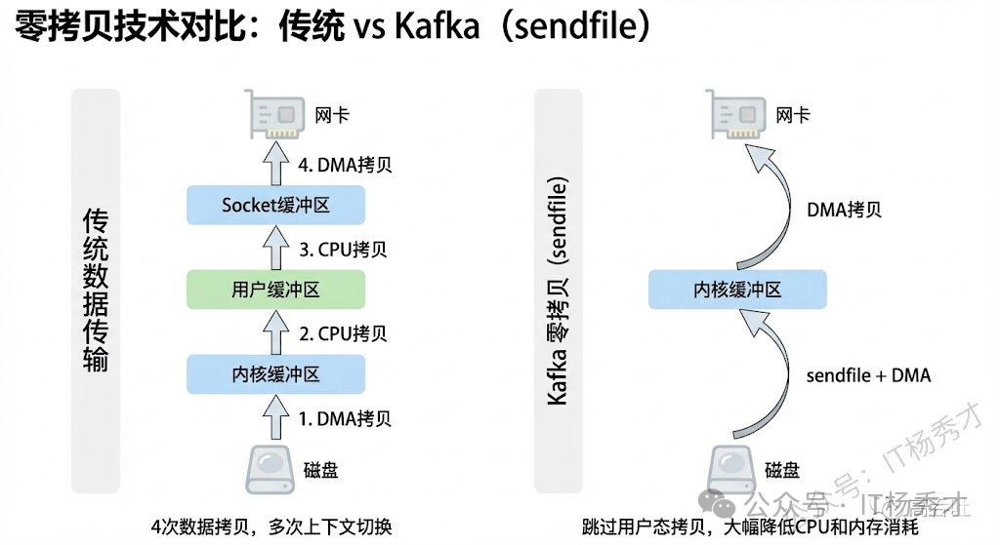

## 🚀 Kafka 高性能的原因

Kafka 高性能的秘密主要体现在三个方面：

- **生产者端**：批量收发 + 压缩消息
- **Broker 写入**：磁盘顺序读写 + 页缓存
- **Broker 发送给消费者**：零拷贝

---

## 📤 生产者端：批量收发 + 压缩消息

Kafka 收发消息都是批量进行处理的。生产者不是来一条发一条，而是把多条消息攒成一个 batch，压缩后一次性发出去。比如 100 条小消息单独发要 100 次网络往返，攒成一批只要 1 次。压缩后数据量从 100KB 变成 20KB，网络传输更快。

- 生产者发送消息时，不会直接把消息发送出去，而是把消息缓存起来，缓存消息量达到配置的批量大小后，才会发送出去。
- Broker 收到消息后，并不会把批量消息解析成单条消息后落盘，而是作为批量消息进行落盘，同时也会把批量消息直接同步给其他副本。
- 消费者拉取消息，也不会按照单条进行拉取，而是按照批量进行拉取，拉取到一批消息后，再解析成单条消息进行消费。

---

## 💾 Broker 写入：磁盘顺序读写 + 页缓存

Kafka 采用不断追加写文件的方式来实现顺序写，从而提高磁盘的性能。顺序读写省去了寻址的时间，只要一次寻址，就可以连续读写。Kafka 的 Broker 在写消息数据时，首先为每个 Partition 创建一个文件，然后把数据顺序地追加到该文件对应的磁盘空间中，如果这个文件写满了，就再创建一个新文件继续追加写。这样大大减少了寻址时间，提高了读写性能。

而且操作系统会把频繁读写的磁盘数据缓存在 Page Cache 里，很多时候读的是内存而非磁盘。

在 Linux 系统中，Page Cache 是磁盘文件在内存中建立的缓存。当应用程序读写文件时，并不会直接读写磁盘上的文件，而是操作 Page Cache。应用程序写文件时，都先会把数据写入 Page Cache，然后操作系统定期地将 Page Cache 的数据写到磁盘上。而应用程序在读取文件数据时，首先会判断数据是否在 Page Cache 中，如果在则直接读取，如果不在，则读取磁盘，并且将数据缓存到 Page Cache。

---

## 🔄 Broker 发送给消费者：零拷贝

传统方式将消息发送给消费端时，即使命中了 Page Cache，也需要将 Page Cache 中的数据先复制到内核缓冲区，拷贝到应用程序的内存空间，然后从应用程序的内存空间复制到 Socket 缓存区，将数据发送出去，4 次拷贝。

Kafka 采用了零拷贝技术（sendfile）把数据直接从 Page Cache 复制到 Socket 缓冲区中，这样数据不用复制到用户态的内存空间，同时 DMA 控制器直接完成数据复制，不需要 CPU 参与。

  

零拷贝的技术原理参见 [往期博客](https://tyritic.github.io/p/%E6%93%8D%E4%BD%9C%E7%B3%BB%E7%BB%9F%E7%9A%84io%E6%A8%A1%E5%9E%8B/#%E9%9B%B6%E6%8B%B7%E8%B4%9D%E6%8A%80%E6%9C%AF-1)
