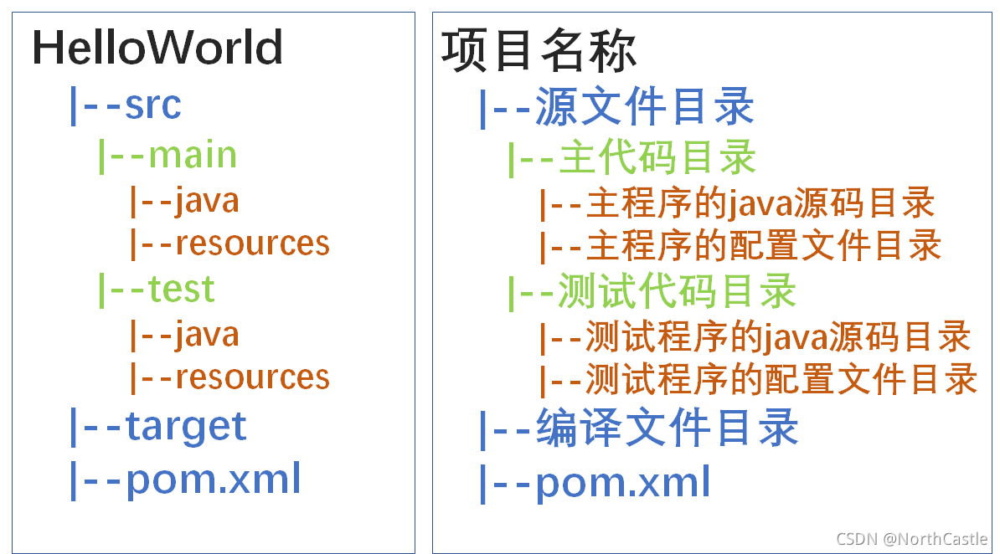

## The role of Maven

- **Dependency management**:Manage dependencies quickly and easily

- **Unified project structure**:Provide a standard project structure

- **Project building**:Provides a standard way to build cross-platform projects

## The structure of the Maven project

```
Maven-name/
|--src（source code）
|	|--main（project resource）
|		|--java（java code）
|		|--resource（resource）
|	|--test（test）
|		|--java
|		|--resource
|--pom.xml（dependency management）
|--target（target file(.jar)）
```



## The build process of the Maven project
