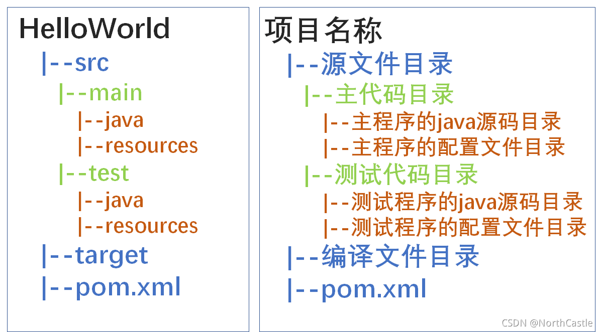

## 🧠 The role of Maven

- **Dependency management**:Manage dependencies quickly and easily

- **Unified project structure**:Provide a standard project structure

- **Project building**:Provides a standard way to build cross-platform projects

---

## 🏗️ The structure of the Maven project

```bash
Maven-name/
|--src（source code）
|	|--main（project resource）
|		|--java（java code）
|		|--resource（resource）
|	|--test（test）
|		|--java
|		|--resource
|--pom.xml（dependency management）
|--target（target file(.jar)）
```

<div align="center">
  
</div>

---

## 🔄 The build process of the Maven project

Maven follows a standard build lifecycle with predefined phases. The main build phases are:

- **validate**: Validate the project structure and required information
- **compile**: Compile the source code
- **test**: Run unit tests
- **package**: Package compiled code into distributable format (.jar, .war)
- **install**: Install the package into local repository
- **deploy**: Deploy the package to remote repository

Common Maven commands:

```bash
# Compile the project
mvn clean compile

# Run tests
mvn test

# Package the project
mvn clean package

# Install to local repository
mvn install

# Deploy to remote repository
mvn deploy
```

---

## 💡 POM File Configuration

The `pom.xml` file is the core configuration file for Maven projects. Key elements include:

- **groupId**: Unique identifier for the organization
- **artifactId**: Name of the project
- **version**: Version of the project
- **dependencies**: External libraries required
- **plugins**: Build plugins and configurations

Example POM structure:

```xml
<project>
  <modelVersion>4.0.0</modelVersion>
  <groupId>com.example</groupId>
  <artifactId>my-app</artifactId>
  <version>1.0-SNAPSHOT</version>
  
  <dependencies>
    <dependency>
      <groupId>junit</groupId>
      <artifactId>junit</artifactId>
      <version>4.13.2</version>
      <scope>test</scope>
    </dependency>
  </dependencies>
</project>
```

---

## ⚖️ Dependency Management

Maven automatically resolves dependencies and their transitive dependencies. Dependencies are declared in the POM file with:

- **groupId**: Organization identifier
- **artifactId**: Library name
- **version**: Library version
- **scope**: Visibility scope (compile, runtime, test, provided)

This eliminates manual JAR file management and ensures consistent versions across the project.