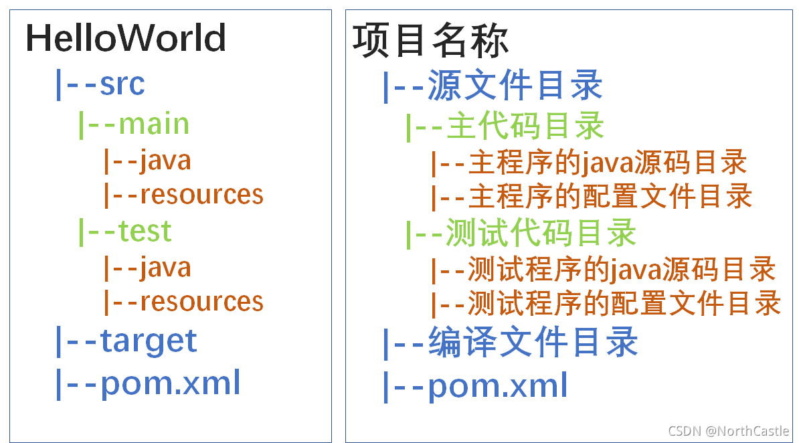

+++
date = '2024-10-31T22:53:02+08:00'
draft = false
title = 'Maven基础'
image =""
categories= ["SpringBoot"]
tags= ["后端开发"]
description="对Maven基本概念的认识"
lastmod= '2024-10-31T22:53:02+08:00'

+++

# Maven的作用

- 依赖管理：方便快捷地管理依赖

- 统一项目结构：提供标准的项目结构

- 项目构建：提供了标准的跨平台项目构建方式

# Maven项目的结构

