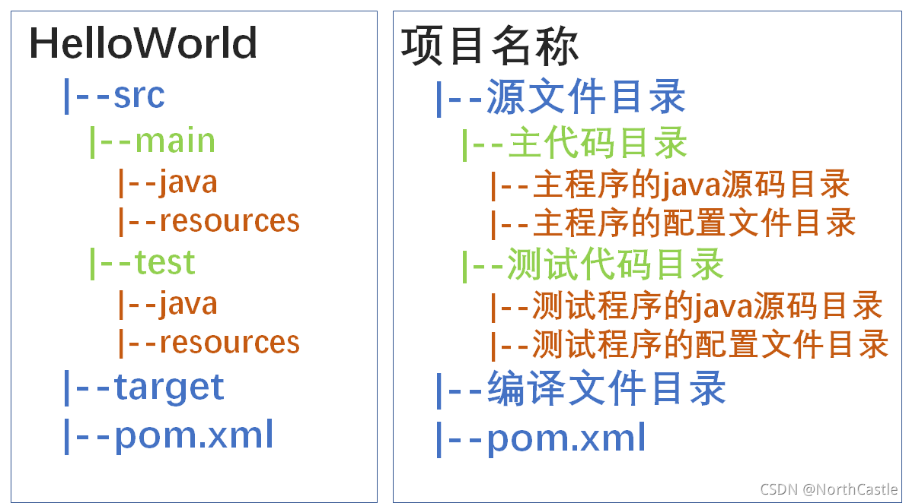

## Maven的作用

- 依赖管理：方便快捷地管理依赖

- 统一项目结构：提供标准的项目结构

- 项目构建：提供了标准的跨平台项目构建方式

## Maven项目的结构

```
Maven-name/
|--src（源代码）
|	|--main（项目实际资源）
|		|--java（java代码）
|		|--resource（资源文件）
|	|--test（测试代码资源）
|		|--java
|		|--resource
|--pom.xml（依赖配置文件）
|--target（打包后的jar包存放地）
```



## Maven项目模型


**仓库**：用于存储资源以及各种JAR包

- 本地仓库：计算机上的目录
- 中央仓库：由Maven团队维护的仓库
- 私服：公司团队搭建的私有仓库

## 依赖管理

### 什么是依赖

依赖就是项目所需要的jar包

### Maven坐标

​	Maven坐标是依赖资源的唯一标识，可以唯一定位资源的位置，使用Maven坐标可以引入项目依赖

#### 	组成结构

- **groupId**：项目所属的组织名
- **artifactId**：项目名称/模块名称
- **version**：版本号


### 依赖配置

#### 	配置方法

1. 在pom.xml文件中使用标签&lt; dependencies &gt;
2. 单个依赖在&lt; dependencies &gt;中被&lt; dependency &gt; 包围
3. 定义依赖的坐标
4. 刷新Maven文件



若本地仓库不存在依赖则会连接私服或者中央仓库进行下载



### 依赖传递

​	依赖具有传递性

​	**直接依赖**：在当前项目中通过依赖配置建立的依赖关系

​	**间接依赖**:被依赖的资源如果依赖其他资源，当前项目间接依赖其他资源

​	依赖的传递关系可能出现冲突

- **路径优先**：当依赖中出现相同的资源时：层级越深优先级越低
- **声明优先**：当资源在相同的层级被依赖，配置靠前的覆盖配置靠后的
- **特殊优先**：当同级配置了相同资源的不同版本，后配置的覆盖先配置的

### 依赖排除

​	依赖可以被开发者手动排除

​	实现形式

1. 在pom.xml文件中使用标签&lt; exclusions &gt;包围

2. 对于要排除的单个依赖使用标签&lt; exclusion &gt;包围

   

   排除依赖的时候无须指定版本号

   

   

 ### 依赖范围

​		依赖的jar包，默认情况下，可以在任何地方使用。但是可以通过&lt; scope &gt; 手动指定其使用范围

#### 		作用范围

- 主程序范围有效。(main文件夹范围内)
- 测试程序范围有效。(test文件夹范围内)
- 是否参与打包运行。(package指令范围内)

#### 			&lt;scope&gt;标签的取值

| scope的取值   | 主程序 | 测试程序 | 打包运行 | 举例                   |
| ------------- | ------ | -------- | -------- | ---------------------- |
| compile(默认) | Y      | Y        | Y        | log4j（日志框架）      |
| test          | X      | Y        | X        | junit（单元测试）      |
| provided      | Y      | Y        | X        | servlet（三大组件）    |
| runtime       | X      | Y        | Y        | jdbc（数据库连接依赖） |

### 生命周期

​	Maven中有三套独立的生命周期

- **clean**：清理工作
- **default**：核心工作包括（编译，测试，打包，变更，部署）
- **site**：生成报告，发布站点

#### 	生命周期的阶段


​	

​	

​	同一套生命周期，后面的阶段要依托前面的阶段来执行

​	

##### 重要阶段

- **clean**:移除上一次构建生成的文件
- **compile**:编译项目源代码
- **test**:使用合适的单元测试框架运行测试(junit)
- **package**:将编译后的文件打包，如:jar、war等
- **install**:安装项目到本地仓库
