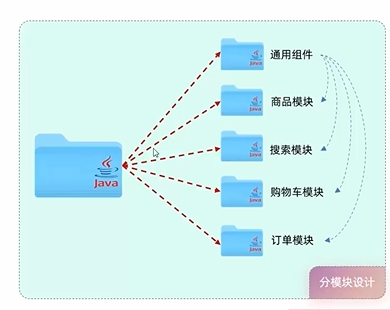

## 分模块设计与开发



将项目的不同业务功能划分为不同的Maven模块

优点

- 方便项目的维护拓展
- 方便模块的相互调用

## 继承

概念：继承描述的是两个工程间的关系，与java中的继承相似，子工程可以继承父工程中的配置信息，常见于依赖关系的继承。
作用：简化依赖配置、统一管理依赖（所有子工程共有的依赖配置在父工程中）

所有的SpringBoot项目都继承一个统一的父工程spring-boot-starter-parent

### 具体实现：

1. 创建maven模块，该工程为父工程，设置打包方式pom(默认jar)

   ```xml
   <parent>
   	<groupId>org.springframework.boot</groupId>
   	<artifactId>spring-boot-starter-parent</artifactId>
   	<version>2.7.5</version>
   	<relativePath/>
   </parent>
   
   <groupId>com.itheima</groupId>
   <artifactId>tlias-parent</artifactId>
   <version>1.8-SNAPSHOT</version>
   <packaging>pom</packaging>
   ```

2. 在子工程的pom.xml文件中，配置继承关系。

   ```xml
   <parents
   	<groupId>com.itheima</groupId>
   	<artifactId>tlias-parent</artifactId>
   	<version>1.0-SNAPSHOT</version>
   	<relativePath>../ tlias-parent/pom,xml</relativePath>
   </parent>
   ```

   

   - 在子工程中，配置了继承关系之后，坐标中的groupId是可以省略的，因为会自动继承父工程的
   - relativePath指定父工程的pom文件的相对位置(如果不指定，将从本地仓库/远程仓库查找该工程)。

   

3. 在父工程中配置各个工程共有的依赖(子工程会自动继承父工程的依赖)。
    
    若子工程和父工程的依赖版本不同，以子工程的为准
    

### 打包方式

- pom：父工程，该模块无代码只进行依赖管理
- jar：内嵌Tomcat服务器
- war：普通web程序，部署在在外部Tomcat服务器

### 版本锁定

在maven中，可以在父工程的pom文件中通过\<dependencyManagement \>来统一管理依赖版本。

在父工程的pom文件中指定依赖版本后，子工程引入依赖时不需要指定依赖版本，变更依赖版本时在父工程的pom文件中统一更改

示例

```xml
#父工程
<dependencyManagement>
    <dependencies>
        <!--JWT令牌-->
		<dependency>
            <groupId>io.jsonwebtoken</groupId>
            <artifactId>jjwt</artifactId>
            <version>0.9.1</version>
		</dependency>
    </dependencies>
</dependencyManagement>
```

```xml
#子工程
<dependencies>
	<dependency>
		<groupId>io.jsonwebtoken</groupId>
		<artifactId>jjwt</artifactId>
	</dependency>
</dependencies>
```



< dependencies >和< dependencyManage >的区别

- < dependencies >是直接依赖，子工程的pom无须引入
- < dependencyManage >是版本管理，子工程的pom依然需要引入



### 自定义属性/引用属性

可以在pom文件中使用标签\<properties\>标签来自定义属性

```xml
<properties>
	<lombok.versiqn>1.18.24</lombok.version>
	<jjwt.version>8.9.0</jjwt.version>
</properties>
```

然后使用${}来引用自定义属性

```xml
<dependencies>
	<dependency>
		<groupId>org.projectlombok</groupId>
		<artifactId>lombok</artifactId>
		<version>${lombok.version}</version>
	</dependency>
</dependencies>
```

## 聚合

概述：将多个模块组织成一个整体，同时进行项目的构建。
聚合工程：一个不具有业务功能的“空”工程(有且仅有一个pom文件)通常是继承中的父工程
具体实现：在父工程中使用标签\<module\>指定子模块

```xml
<modules>
	<module>../tlias-pojo</module>
	<module>,./tlias-utils</module>
	<module>../tlias-web-management</module>
</modules>
```



聚合工程中所包含的模块，在构建时，会自动根据模块间的依赖关系设置构建顺序，与聚合工程中模块的配置书写位置无关。



## 继承和聚合的区别

作用

- 聚合用于快速构建项目
- 继承用于简化依赖配置、统一管理依赖

相同点

- 聚合与继承的pom.xml文件打包方式均为pom，可以将两种关系制作到同一个pom文件中
- 聚合与继承均属于设计型模块，并无实际的模块内容

不同点

- 聚合是在聚合工程中配置关系，聚合可以感知到参与聚合的模块有哪些
- 继承是在子模块中配置关系，父模块无法感知哪些子模块继承了自己