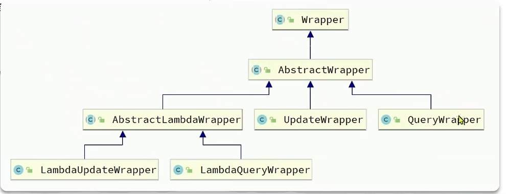
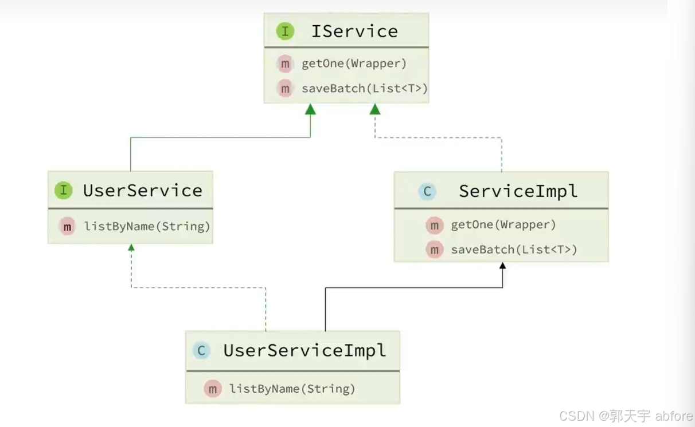

## MyBatis-Plus对MyBatis的改进

- **无侵入**：只做增强不做改变，引入它不会对现有工程产生影响，如丝般顺滑
- **损耗小**：启动即会自动注入基本 CURD，性能基本无损耗，直接面向对象操作
- **强大的 CRUD 操作**：内置通用 Mapper、通用 Service，仅仅通过少量配置即可实现单表大部分 CRUD 操作，更有强大的条件构造器，满足各类使用需求
- **支持 Lambda 形式调用**：通过 Lambda 表达式，方便的编写各类查询条件，无需再担心字段写错
- **支持主键自动生成**：支持多达 4 种主键策略（内含分布式唯一 ID 生成器 - Sequence），可自由配置，完美解决主键问题
- **支持 ActiveRecord 模式**：支持 ActiveRecord 形式调用，实体类只需继承 Model 类即可进行强大的 CRUD 操作
- **支持自定义全局通用操作**：支持全局通用方法注入（ Write once, use anywhere ）
- **内置代码生成器**：采用代码或者 Maven 插件可快速生成 Mapper 、 Model 、 Service 、 Controller 层代码，支持模板引擎，更有超多自定义配置等您来使用
- **内置分页插件**：基于 MyBatis 物理分页，开发者无需关心具体操作，配置好插件之后，写分页等同于普通 List 查询
- **分页插件支持多种数据库**：支持 MySQL、MariaDB、Oracle、DB2、H2、HSQL、SQLite、Postgre、SQLServer 等多种数据库
- **内置性能分析插件**：可输出 SQL 语句以及其执行时间，建议开发测试时启用该功能，能快速揪出慢查询
- **内置全局拦截插件**：提供全表 delete 、 update 操作智能分析阻断，也可自定义拦截规则，预防误操作

## 具体使用

1. **引入依赖**（参见[官方文档](https://baomidou.com/introduce/) ），MyBatisPlus官方提供了starter，其中集成了Mybatis和MybatisPlus的所有功能，并且实现了自动装配效果。因此我们可以用MybatisPlus的starter代替Mybatis的starter:

   ```xml
   <dependency>
       <groupId>com.baomidou</groupId>
       <artifactId>mybatis-plus-spring-boot3-starter</artifactId>
       <version>3.5.9</version>
   </dependency>
   ```

2. **定义Mapper**：自定义Mapper继承MyBatis-P;us提供的接口**BaseMapper**

   ```java
   public interface UserMapper extends BaseMapper<User>{
       
   }
   ```

   

## 默认配置

MyBatis-Plus通过扫描实体类，利用反射机制获取实体类的信息作为数据库表的信息

- 类名驼峰转下划线作为表名
- 名为id的字段作为主键
- 变量名驼峰转下划线作为表的字段名

```java
public interface UserMapper extends BaseMapper<User>{
    
}
```

```java
public class User{
	private Long id;
	private String username;
    private string password;
    private String phone;
    private string info;
    private Integer status;
    private Integer balance;
	private LocalDateTime createTime; //对应表的字段 create_time
    private LocalDateTime updateTime; //对应表的字段 update_time
}
```


## 自定义配置

如果不符合Mybatis-Plus的约定就要使用自定义配置。

### 基于注解的配置

- **@TableName**：用来指定表名（该注解用于指定实体类对应的数据库表名。当实体类名与数据库表名不一致，或者实体类名不是数据库表名的驼峰写法时，您需要使用这个注解来明确指定表名。）
- **@TableId**：用来指定表中的主键字段信息
  - value：对应数据库表中的主键字段名
  - type：主键策略
    - AUTO：数据库自增长
    - INPUT：通过set方法自行输入
    - ASSIGN_ID：分配id
- **@TableField** ：用来指定表中的普通字段信息
  - 使用场景
    - 成员变量名与数据库字段名不一致
    - 成员变量名以is开头，且是布尔值(经过反射处理，它会将is去掉作为数据库字段名)
    - 成员变量名与数据库关键字冲突
    - 成员变量名不是数据库字段(数据库中不存在该字段)

具体注解参考[官方文档](https://baomidou.com/reference/annotation/)

### 基于yml的注解

在SpringBoot项目中可以通过修改application.yml来配置

```yml
mybatis-plus:
  type-aliases-package: com.gty.mp.domain.po #注册后，在 Mapper 对应的 XML 文件中可以直接使用类名，无需使用全限定类名。
  mapper-locations: "classpath*:/mapper/**/*.xml" #mapper.xml文件地址, 默认值
  configuration:
    map-underscore-to-camel-case: true #是否开启下划线和驼峰的映射
    cache-enabled: true #是否开启二级映射
    log-impl: org.apache.ibatis.logging.stdout.StdOutImpl #开启mybatis打印日志
  global-config:
    db-config:
      id-type: assign_id #id为雪花算法生成,注解配置大于全局配置
      update-strategy: not_null # 更新策略:只更新非空字段
```

具体详细配置参考[官方文档](https://baomidou.com/reference/)

## 条件构造器（Wrapper）

MyBatis-Plus 提供了一套强大的条件构造器（Wrapper），用于构建复杂的数据库查询条件。（BaseMapper实现简单的单表查询）

Wrapper 类允许开发者以链式调用的方式构造查询条件，无需编写繁琐的 SQL 语句，从而提高开发效率并减少 SQL 注入的风险。

通常作为mapper方法（自定义在mapper接口或者MyBatis-Plus已经实现的）的参数在service层使用

### 类的继承结构



- AbstractWrapper ： 用于查询条件封装，生成 sql 的 where 条件
  - QueryWrapper ： Query条件封装
  - UpdateWrapper ： Update条件封装
  - AbstractLambdaWrapper ： 使用Lambda语法
    - LambdaQueryWrapper ：基于Lambda语法使用的查询Wrapper
    - LambdaUpdateWrapper ： 基于Lambda语法使用的更新Wrapper

- **QueryWrapper**和**LambdaQueryWrapper**通常用来构建select、delete、update的where条件部分
- **UpdateWrapper**和**LambdaUpdateWrapper**通常只有在set语句比较特殊才使用

### 具体使用

1. 创建Wrapper对象
   1. Wrappers静态方法：
      - `public static <T> QueryWrapper<T> query()`
   2. 通过QueryWrapper对象的构造方法：
      - `public QueryWrapper()`
   3. 通过`lambda`方法可以将普通Wrapper转换成lambdaWrapper
2. 基于复杂条件构建wrapper，使用链式编程

示例方法

```java
package com.dfbz;

import com.baomidou.mybatisplus.core.conditions.query.LambdaQueryWrapper;
import com.baomidou.mybatisplus.core.conditions.query.QueryWrapper;
import com.baomidou.mybatisplus.core.toolkit.Wrappers;
import com.dfbz.entity.User;
import com.dfbz.mapper.UserMapper;
import org.junit.Test;
import org.junit.runner.RunWith;
import org.springframework.beans.factory.annotation.Autowired;
import org.springframework.boot.test.context.SpringBootTest;
import org.springframework.test.context.junit4.SpringRunner;

import java.util.List;

/**
 * @author lscl
 * @version 1.0
 * @intro:
 */
@SpringBootTest(classes = MyBatisPlusApplication.class)
@RunWith(SpringRunner.class)
public class Demo06_LambdaQueryMapper {

    @Autowired
    private UserMapper userMapper;

    /**
     * 使用QueryWrapper
     * @throws Exception
     */
    @Test
    public void test1() throws Exception {
        QueryWrapper<User> wrapper = Wrappers.query();
        wrapper.eq("id","1");

        List<User> userList = userMapper.selectList(wrapper);
        for (User user : userList) {
            System.out.println(user);
        }
    }

    /**
     * 使用LambdaQueryWrapper
     * @throws Exception
     */
    @Test
    public void test2() throws Exception {

        LambdaQueryWrapper<User> wrapper = Wrappers.lambdaQuery();
        
        // id=1
//        wrapper.eq(User::getId,1);

        // select id,name,age from user where id in (1,2,3) and name like "%a%" 
        wrapper.in(User::getId,"1","2","3")
                .like(User::getName,"a")
                .select(User::getId,User::getName,User::getAge);

        List<User> userList = userMapper.selectList(wrapper);
        for (User user : userList) {
            System.out.println(user);
        }
    }
}

```

### 条件方法

| 方法名          | 解释                                  | 示例                                                         |
| --------------- | ------------------------------------- | ------------------------------------------------------------ |
| **eq**          | **等于 =**                            | **eq(“name”, “老王”)**`**--->**` **name = ‘老王’**           |
| **ne**          | **不等于 <>**                         | **ne(“name”, “老王”)**`**--->**` **name <> ‘老王’**          |
| **gt**          | **大于 >**                            | **gt(“age”, 18)**`**--->**` **age > 18**                     |
| **ge**          | **大于等于 >=**                       | **ge(“age”, 18)**`**--->**` **age >= 18**                    |
| **lt**          | **小于 <**                            | **lt(“age”, 18)**`**--->**` **age < 18**                     |
| **le**          | **小于等于 <=**                       | **le(“age”, 18)**`**--->**` **age <= 18**                    |
| **between**     | **between 值1 and 值2**               | **between(“age”, 18, 30)**`**--->**` **age between 18 and 30** |
| **notBetween**  | **not between 值1 and 值2**           | **notBetween(“age”, 18, 30)**`**--->**` **age not between 18 and 30** |
| **like**        | **LIKE ‘%值%’**                       | **like(“name”, “王”)**`**--->**` **name like ‘%王%’**        |
| **notLike**     | **NOT LIKE ‘%值%’**                   | **notLike(“name”, “王”)**`**--->**` **name not like ‘%王%’** |
| **likeLeft**    | **LIKE ‘%值’**                        | **likeLeft(“name”, “王”)**`**--->**` **name like ‘%王’**     |
| **likeRight**   | **LIKE ‘值%’**                        | **likeRight(“name”, “王”)**`**--->**` **name like ‘王%’**    |
| **isNull**      | **字段 IS NULL**                      | **isNull(“name”)**`**--->**` **name is null**                |
| **isNotNull**   | **字段 IS NOT NULL**                  | **isNotNull(“name”)**`**--->**` **name is not null**         |
| **in**          | **字段 IN (v0, v1, …)**               | **in(“age”, 1, 2, 3)**`**--->**` **age in (1,2,3)**          |
| **notIn**       | **字段 NOT IN (v0, v1, …)**           | **notIn(“age”, 1, 2, 3)**`**--->**` **age not in (1,2,3)**   |
| **inSql**       | **字段 IN ( sql语句 )**               | **inSql(“id”, “select id from table where id < 3”)**`**--->**` **id in (select id from table where id < 3)** |
| **notInSql**    | **字段 NOT IN ( sql语句 )**           | **notInSql(“id”, “select id from table where id < 3”)**`**--->**` **id not in (select id from table where id < 3)** |
| **groupBy**     | **分组：GROUP BY 字段, …**            | **groupBy(“id”, “name”)**`**--->**` **group by id,name**     |
| **orderByAsc**  | **排序：ORDER BY 字段, … ASC**        | **orderByAsc(“id”, “name”)**`**--->**` **order by id ASC,name ASC** |
| **orderByDesc** | **排序：ORDER BY 字段, … DESC**       | **orderByDesc(“id”, “name”)**`**--->**` **order by id DESC,name DESC** |
| **orderBy**     | **排序：ORDER BY 字段, …**            | **orderBy(true, true, “id”, “name”)**`**--->**` **order by id ASC,name ASC** |
| **having**      | **HAVING ( sql语句 )**                | **例1：having(“sum(age) > 10”)**`**--->**` **having sum(age) > 10 例2：having(“sum(age) > {0}”, 11)**`**--->**` **having sum(age) > 11** |
| **func**        | **主要解决条件拼接**                  | **func(i -> if(true) {i.eq(“id”, 1)} else {i.ne(“id”, 1)})** |
| **or**          | **拼接 OR**                           | **eq(“id”,1).or().eq(“name”,“老王”)**`**--->**` **id = 1 or name = ‘老王’** |
| **and**         | **AND 嵌套**                          | **and(i -> i.eq(“name”, “李白”).ne(“status”, “活着”))**`**--->**` **and (name = ‘李白’ and status <> ‘活着’)** |
| **nested**      | **用于多条件拼接时**                  | **nested(i -> i.eq(“name”, “李白”).ne(“status”, “活着”))**`**--->**` **(name = ‘李白’ and status <> ‘活着’)** |
| **apply**       | **用于拼接SQL语句**                   | **例1：apply(“id = 1”)**`**--->**` **id = 1 例2：apply(“id = {0}”,1)**`**--->**` **id = 1 例3：apply(“name like {0} and age > {1}”,“%J%”,18) \**`\*\*--->\*\*` \**name like ‘%J%’ and age > 18** |
| **last**        | **无视优化规则直接拼接到 sql 的最后** | **last(“limit 1”) \**`\*\*--->\*\*` \**在SQL语句最后面拼接：limit 1** |
| **exists**      | **拼接 EXISTS ( sql语句 )**           | **exists(“select id from table where age = 1”)**`**--->**` **exists (select id from table where age = 1)** |
| **notExists**   | **拼接 NOT EXISTS ( sql语句 )**       | **notExists(“select id from table where age = 1”)**`**--->**` **not exists (select id from table where age = 1)** |

具体参见[官方文档](https://baomidou.com/guides/wrapper/#%E5%8A%9F%E8%83%BD%E8%AF%A6%E8%A7%A3)

## 自定义SQL

可以利用MyBatis-Plus的Wrapper来构建复杂的where条件，然后自己定义SQL语句中剩下的部分。

1. 基于Wrapper定义复杂的Where条件

2. 在mapper方法参数中用`@Param`注解声明wrapper变量名称，名称必须为ew或者使用注解 `@Param(Constants.WRAPPER)` 明确指定参数为 Wrapper 对象。

   ```java
   import com.baomidou.mybatisplus.core.conditions.Wrapper;
   import com.baomidou.mybatisplus.core.toolkit.Constants;
   import org.apache.ibatis.annotations.Param;
   
   public interface UserMapper extends BaseMapper<User> {
       @Select("SELECT * FROM user ${ew.customSqlSegment}")
       List<User> selectByCustomSql(@Param(Constants.WRAPPER) Wrapper<User> wrapper);
   }
   ```

3. 自定义SQL语句，使用`${ew.customSqlSegment}`来引用 Wrapper 对象生成的 SQL 片段。

   ```java
   QueryWrapper<User> queryWrapper = new QueryWrapper<>();
   queryWrapper.eq("name", "张三");
   List<User> userList = userMapper.selectByCustomSql(queryWrapper);
   ```

## Service层接口（IService）

MyBatis提供了Service层接口IService和默认实现类ServiceImpl



### 使用流程

1. 自定义Service接口继承**IService**接口（其中IService接口中的泛型为操纵的实体类）

   ```java
   public interface IUserService extends IService<User>{
       
   }
   ```

2. 自定义Service实现类，实现自定义接口并继承Servicelmpl类（其中ServiceImpl中的泛型为对应的Mapper类和实体类）

   ```java
   @Service
   public class UserServiceImpl extends ServiceImpl<UserMapper,User> implements IUserService{
   
   }
   ```

### LambdaQuery和LambdaUpdate

 IService中还提供了Lambda功能来简化我们的复杂查询及更新功能。

在Service层中可以代替Wrapper实现更加复杂的查询/更新

`lambdaQuery()`和`lambdaUpdate()`方法直接获得一个Wrapper的子类通过链式编程简化

在service层中

```java
@Override
public List<User> queryUsers(UserQuery userQuery) {
    return lambdaQuery()
        .like(userQuery.getName() != null, User::getUsername, userQuery.getName())
        .eq(userQuery.getStatus() != null, User::getStatus, userQuery.getStatus())
        .ge(userQuery.getMinBalance() != null, User::getBalance, userQuery.getMinBalance())
        .le(userQuery.getMaxBalance() != null, User::getBalance, userQuery.getMaxBalance())
        .list();
}

@Override
public void deductionBalance(Long id, Integer money) {
    // 1.查询用户
    User user = getById(id);
    // 2.校验用户状态
    if (user == null || user.getStatus() == UserStatus.FREEZE) {
        throw new RuntimeException("用户状态异常!");
    }
    // 3.校验余额是否充足
    if (user.getBalance() < money) {
        throw new RuntimeException("用户余额不足");
    }
    // 4.扣减余额
    int remainBalance = user.getBalance() - money;
    lambdaUpdate()
        .set(User::getBalance, remainBalance)
        .set(remainBalance == 0, User::getStatus, UserStatus.FREEZE)
        .eq(User::getId, id)
        .eq(User::getBalance, user.getBalance()) //乐观锁
        .update();
}
```

还需要在链式编程的最后添加一个`list()`，这是在告诉MP我们的调用结果需要是一个list集合。这里不仅可以用`list()`，可选的方法有：

- `.one()`：最多1个结果
- `.list()`：返回集合结果
- `.count()`：返回计数结果

### 批量插入

```java
// 插入（批量）
boolean saveBatch(Collection<T> entityList);
// 插入（批量）
boolean saveBatch(Collection<T> entityList, int batchSize);
```

效率一般：`MybatisPlus`的批处理是基于`PrepareStatement`的预编译模式，然后批量提交，最终在数据库执行时还是会有多条insert语句，逐条插入数据。而想得到最佳性能，最好是将多条SQL合并为一条。

提升效率的方式

 MySQL的客户端连接参数中有这样的一个参数：`rewriteBatchedStatements`。顾名思义，就是重写批处理的`statement`语句。这个参数的默认值是false，我们需要修改连接参数，将其配置为true。

在配置文件中，在数据库连接配置中在url后面加上 rewriteBatchedStatements=true 的一个参数：

## 分页插件

具体参见[官方文档](https://baomidou.com/plugins/pagination/)

1. 在配置类中注册MyBatis-Plus的核心插件。同时添加分页插件

   ```java
   @Configuration
   @MapperScan("scan.your.mapper.package")
   public class MybatisPlusConfig {
   
       /**
        * 添加分页插件
        */
       @Bean
       public MybatisPlusInterceptor mybatisPlusInterceptor() {
           //创建MyBatis-Plus拦截器
           MybatisPlusInterceptor interceptor = new MybatisPlusInterceptor();
           //添加内部拦截器（插件）
           // 添加分页插件
           PaginationInnerInterceptor paginationInnerInterceptor = new PaginationInnerInterceptor(DbType.MYSQL);
           //可以给分页插件添加属性
           //overflow	boolean	false	溢出总页数后是否进行处理
   		//maxLimit	Long		单页分页条数限制
   		//dbType	DbType		数据库类型
   		//dialect	IDialect		方言实现类
           interceptor.addInnerInterceptor(paginationInnerInterceptor); // 如果配置多个插件, 切记分页最后添加
           // 如果有多数据源可以不配具体类型, 否则都建议配上具体的 DbType
           return interceptor;
       }
   }
   ```

2. 在Mapper方法使用分页相关API

   1. 设置分页参数

      ```java
      //方法一
      int pageNo = 1; //页码
      int pageSize = 2; //每页大小
      Page<User> pageInfo = Page.of(pageNo, pageSize);
      Page<User>p=userMapper.page(pageInfo);
      //方法二
      Page<User> pageInfo = new Page<>(page,pageSize);
      Page<User>p = userService.page(pageInfo);
      ```

   2. 进行分页查询

      ```java
      Page<T> page_name=userMapper.selectPage(page, wrapper); //条件分页查询
      Page<T> page_name=userMapper.page(page);//普通分页查询
      ```

   3. 使用相关API

      ```java
      当前页数：page.getCurrent()
      总页数： page.getPages()
      记录数： page.getTotal()
      是否有上一页： page.hasPrevious()
      是否有下一页： page.hasNext()
      分页数据：page.getRecords()
      排序条件：page.addOrder(new OrderItem("数据库字段名",true)); //升序为true,降序为false
      ```

      

   

   
