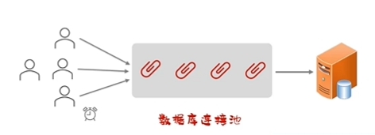

## 什么是MyBatis

- MyBatis是一款优秀的 持久层框架，用于简化JDBC的开发。
- MyBatis本是 Apache的一个开源项目iBatis,2010年这个项目由apache迁移到了google code，并且改名为MyBatis。2013年11月迁移到Github。
- 官网:https://mybatis.org/mybatis-3/zh/index.html

## MyBatis的配置

1. 在**pom.xml**中配置相关依赖

2. 在**application.yml**中的spring.database属性下配置相关数据库连接信息

   1. 指定驱动类名称：driver-class-name
   2. 数据库连接的url：url
   3. 连接数据库的用户名
   4. 连接数据库的密码

3. 编写sql语句

   1. 在mapper文件夹下编写接口，用@Mapper修饰

   2. 在每一个函数上根据操作名使用对应的注解修饰sql语句

      ```java
      @Mapper
      public interface UserMapper{
          @Select("select * from user")
          public List<User>list();
      }
      ```

   3. 或者在resource文件夹下创建和接口全名（包名.接口名）一致的xml，在xml文件中根据具体的接口函数编写对应的sql语句
   
      ```xml
      <?xml version="1.0" encoding="UTF-8" ?>
      <!DOCTYPE mapper PUBLIC "-//mybatis.org//DTD Mapper 3.0//EN"
              "http://mybatis.org/dtd/mybatis-3-mapper.dtd" >
      <mapper namespace="org.example.operator.mapper.userMapper">
          <select id="list">
              select * from user
          </select>
      </mapper>
      ```
   
      

## 数据库连接池

### 什么是数据连接池

- 数据库连接池是个容器，负责分配、管理数据库连接(Connection)
- 它允许应用程序重复使用一个现有的数据库连接，而不是再重新建立一个
- 释放空闲时间超过最大空闲时间的连接，来避免因为没有释放连接而引起的数据库连接遗漏



### 优势

- 资源重用
- 提升系统响应速度
- 避免数据库连接遗漏

### 常见产品

- C3PO
- DBCP
- Druid
- Hikari(springboat默认)