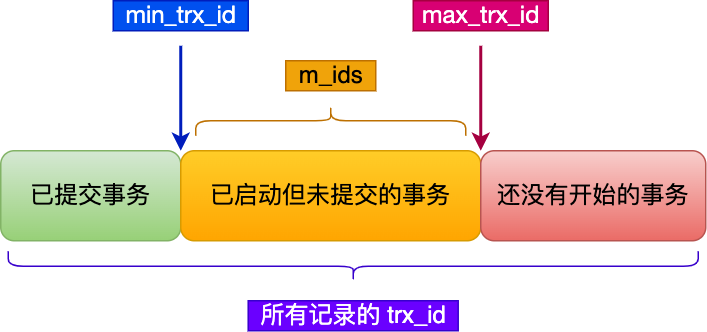
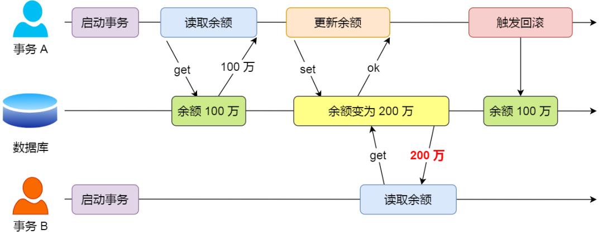
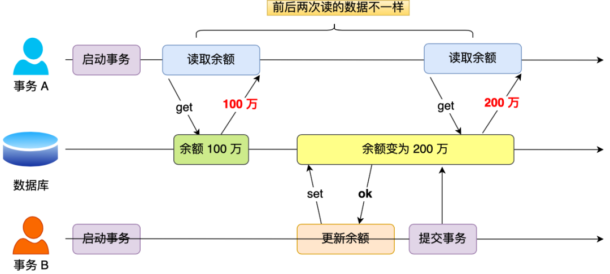
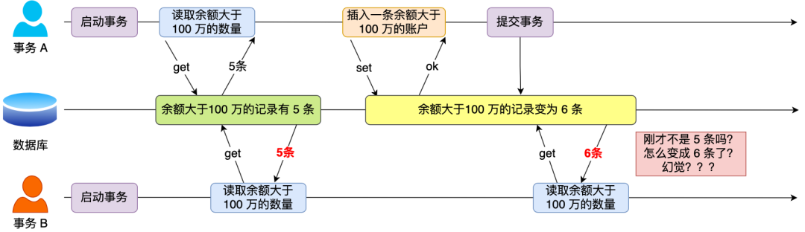

## 概念

事务是一组操作的集合，它是一个不可分割的工作单位。事务会把所有的操作作为一个整体一起向系统提交或撤销操作请求，即这些操作 要么同时成功，要么同时失败。



MySQL会立即隐式的提交事务。默认MySQL的事务是自动提交的，



## 事务控制语句

开启事务

```mysql
start transaction；
```

提交事务

```mysql
commit;
```

回滚事务

```mysql
rollback;
```

## 四大特性

- 原子性（Atomicity）：事务是不可分割的最小单元，要么全部成功，要么全部失败
- 一致性（Consistency）：事务完成时，必须使所有的数据都保持一致状态
- 隔离性（lsolation）：数据库系统提供的隔离机制，保证事务在不受外部并发操作影响的独立环境下运行
- 持久性（Durability）：事务一旦提交或回滚，它对数据库中的数据的改变就是永久的

## MVCC

MVCC（Multi-Version Concurrency Control，多版本并发控制）是一种并发控制机制，允许多个事务同时读取和写入数据库，而无需互相等待，从而提高数据库的并发性能。

在 MVCC 中，数据库为每个事务创建一个数据快照。每当数据被修改时，MySQL 不会立即覆盖原有数据，而是生成新版本的记录。每个记录都保留了对应的版本号或时间戳。

### 版本链

在 InnoDB 中，每一行数据都有两个隐藏的列：一个是 DB_TRX_ID，另一个是 DB_ROLL_PTR。

- `DB_TRX_ID`，保存创建这个版本的事务 ID。
- `DB_ROLL_PTR`，指向 undo 日志记录的指针，这个记录包含了该行的前一个版本的信息。通过这个指针，可以访问到该行数据的历史版本。

当事务更新一行数据时，InnoDB 不会直接覆盖原有数据，而是创建一个新的数据版本，并更新 DB_TRX_ID 和 DB_ROLL_PTR，使得它们指向前一个版本和相关的 undo 日志。这样，老版本的数据不会丢失，可以通过版本链找到。

### ReadView

ReadView（读视图）是 InnoDB 为了实现一致性读而创建的数据结构，它用于确定在特定事务中哪些版本的行记录是可见的。可以理解为数据快照

Read View 有四个重要的字段：

- **`m_ids`** ：指的是在创建 Read View 时，当前数据库中「活跃事务」的 **事务 id 列表**，注意是一个列表，**“活跃事务”指的就是，启动了但还没提交的事务**。
- **`min_trx_id`** ：指的是在创建 Read View 时，当前数据库中「活跃事务」中事务 **id 最小的事务** ，也就是 m_ids 的最小值。
- **`max_trx_id`** ：这个并不是 m_ids 的最大值，而是 **创建 Read View 时当前数据库中应该给下一个事务的 id 值** ，也就是全局事务中最大的事务 id 值 + 1；
- **`creator_trx_id`** ：指的是 **创建该 Read View 的事务的事务 id** 。



### 可见性实现

- 如果记录的 `trx_id` 值小于 Read View 中的 `min_trx_id` 值，表示这个版本的记录是在创建 Read View **前** 已经提交的事务生成的，所以该版本的记录对当前事务 **可见** 。
- 如果记录的 `trx_id` 值大于等于 Read View 中的 `max_trx_id` 值，表示这个版本的记录是在创建 Read View **后**才启动的事务生成的，所以该版本的记录对当前事务 **不可见** 。
- 如果记录的 `trx_id` 值在 Read View 的 `min_trx_id` 和 `max_trx_id`之间，需要判断 `trx_id` 是否在 m_ids 列表中：
  - 如果记录的 trx_id  **在**  `m_ids` 列表中，表示生成该版本记录的活跃事务依然活跃着（还没提交事务），所以该版本的记录对当前事务**不可见**。
  - 如果记录的 trx_id  **不在**  `m_ids`列表中，表示生成该版本记录的活跃事务已经被提交，所以该版本的记录对当前事务 **可见** 。

### 快照读和当前读

#### 快照读

快照读是指事务在执行查询时，不直接读取当前最新的数据，而是读取数据的历史版本（快照）。MySQL InnoDB 通过多版本并发控制（MVCC）来实现快照读。快照读只会返回在事务开始时可见的数据，即使其他事务在之后修改了这些数据，快照读也不会受影响。

#### 当前读

MySQL 里除了普通查询是快照读，其他都是 **当前读**，比如 update、insert、delete，这些语句执行前都会查询最新版本的数据，然后再做进一步的操作。

当前读是指读取数据的最新版本，并且会加锁以确保数据的一致性。即使其他事务对这个数据的修改在当前读的事务之后，这个修改也会反映在当前读的结果中。（如果事务 2 开始时间发生在事务 1 之后，那么正常情况下事务 2 的修改对事务 1 不可见，但是事务 1 的当前读可见这个修改）。

## 并发问题

### 脏读

定义：**一个事务读取数据并且对数据进行了修改，这个修改对其他事务来说是可见的，即使当前事务没有提交。这时另外一个事务读取了这个还未提交的数据，但第一个事务突然回滚，导致数据并没有被提交到数据库，那第二个事务读取到的就是脏数据**

示例：假设有 A 和 B 这两个事务同时在处理，事务 A 先开始从数据库中读取余额数据，然后再执行更新操作，如果此时事务 A 还没有提交事务，而此时正好事务 B 也从数据库中读取余额数据，那么事务 B 读取到的余额数据是刚才事务 A 更新后的数据，即使没有提交事务。



### 不可重复读

定义：**在同一事务中，读取同一数据两次，但由于其他事务的提交，读取的结果不同。**

示例：假设有 A 和 B 这两个事务同时在处理，事务 A 先开始从数据库中读取余额数据，然后继续执行代码逻辑处理，**在这过程中如果事务 B 更新了这条数据，并提交了事务，那么当事务 A 再次读取该数据时，就会发现前后两次读到的数据是不一致的，这种现象就被称为不可重复读。**



### 幻读

定义：**在一个事务内多次查询某个符合查询条件的「记录数量」，如果出现前后两次查询到的记录数量不一样的情况，就意味着发生了「幻读」现象。**





幻读和不可重复读的区别

- **幻读** ：在事务期间，对于数据总量的突然增加或减少，将别的事务提交的读取到了（针对于数据的数量）
- **不可重复读** ：对于同一条数据，在事务执行期间，里面的字段内容发生了变化，读取到了别的事务提交修改的数据。（针对于数据的内容）。



## 事务隔离级别

### 四大隔离级别

|                隔离级别                | 脏读 | 不可重复读 | 幻读 |
| :------------------------------------: | :--: | :--------: | :--: |
|  **Read uncommitted** （读取未提交）   |  √   |     √      |  √   |
|   **Read committed** （读取已提交）    |  ×   |     √      |  √   |
| **Repeatable Read(默认)** （可重复读） |  ×   |     ×      |  √   |
|     **Serializable **  （串行化）      |  ×   |     ×      |  ×   |

其中 **Serializable** 数据安全性更好但是性能最差，**Read uncommitted**反之

- **读未提交（READ UNCOMMITTED）**：
  - 这是最低的隔离级别，在该级别下，一个事务可以看到另一个事务尚未提交的数据修改。这可能会导致 **脏读** 问题，即读取到其他事务未提交的数据。
- **读已提交（READ COMMITTED）**：
  - 在这个级别下，一个事务只能看到已经提交的其他事务所做的修改。这可以避免脏读问题，但是可能会引发 **不可重复读** 问题，即在同一个事务中，相同的查询可能返回不同的结果。
- **可重复读（REPEATABLE READ）**：
  - 指一个事务执行过程中看到的数据，一直跟这个事务启动时看到的数据是一致的。在这个级别下，确保在一个事务中的多个查询返回的结果是一致的。这可以避免不可重复读问题，但是可能会引发 **幻读** 问题，即在同一个事务中，多次查询可能返回不同数量的行（MySQL 默认的隔离级别）。
- **串行化（SERIALIZABLE）**：
  - 可串行化执行被定义为：并发执行的 SQL 事务的操作，其效果与这些 SQL 事务按某种顺序串行执行的效果相同。串行执行是指每个 SQL 事务在下一个 SQL 事务开始之前完成其全部操作
  - 这是最高的隔离级别，在这个级别下，保证事务间的操作结果相当于一个按顺序执行的单线程操作。这可以避免所有的并发问题，但是会大大降低并发性能。该级别会对记录加上读写锁，在多个事务对这条记录进行读写操作时，如果发生了读写冲突的时候，后访问的事务必须等前一个事务执行完成，才能继续执行

### 隔离级别的实现

#### 读已提交

每**次读取数据前都生成一个 ReadView，保证每次读操作都是最新的数据。** 正是因为在读提交隔离级别下，事务每次读数据时都重新创建 Read View，那么在事务期间的多次读取同一条数据，前后两次读的数据可能会出现不一致，因为可能这期间另外一个事务修改了该记录，并提交了事务。

#### 可重复读

**可重复读隔离级别是启动事务时生成一个 Read View，然后整个事务期间都在用这个 Read View**。

可重复读隔离级别下在事务期间读到的记录都是事务启动前的记录

### 相关SQL语句

#### 查看事务隔离级别

```mysql
select @@transaction isolation;
```

#### 设置事务隔离级别

```mysql
set [ session | global] transaction isolation level { read uncommitted | read committed | repeatable read | serializable }
```

## MySQL的日志级别

- binlog ：是 MySQL 中的二进制日志文件，用于记录 MySQL 服务器上的所有更新和修改操作。它可以记录所有的 DDL和 DML操作，包括对表结构的更改、数据的插入、修改、删除等等。binlog是在事务提交后生成的，因此可以用于恢复数据库。是位于 **Server** 层的日志
  - STATEMENT：每一条修改数据的 SQL 都会被记录到 binlog 中（相当于记录了逻辑操作，所以针对这种格式， binlog 可以称为逻辑日志），主从复制中 slave 端再根据 SQL 语句重现。但 STATEMENT 有动态函数的问题，比如你用了 uuid 或者 now 这些函数，你在主库上执行的结果并不是你在从库执行的结果，这种随时在变的函数会导致复制的数据不一致；
  - ROW：记录行数据最终被修改成什么样了（这种格式的日志，就不能称为逻辑日志了），不会出现 STATEMENT 下动态函数的问题。但 ROW 的缺点是每行数据的变化结果都会被记录，比如执行批量 update 语句，更新多少行数据就会产生多少条记录，使 binlog 文件过大，而在 STATEMENT 格式下只会记录一个 update 语句而已；
  - MIXED：包含了 STATEMENT 和 ROW 模式，它会根据不同的情况自动使用 ROW 模式和 STATEMENT 模式；

- redolog ：用于恢复数据，保证数据的一致性和持久性。当 MySQL 发生修改时，redolog 会将这些操作记录下来，并写入磁盘。这样，当 MySQL 发生宕机或崩溃时，通过重放 redolog 就可以恢复数据。实现了事务中的 **持久性** ，主要**用于故障恢复**；
- undolog：用于回滚操作。当 MySQL 发生事务回滚时，undolog 会记录这些操作并将其写入磁盘。这样，当 MySQL 需要回滚时，通过重放 undolog 就可以回滚事务。实现了事务中的 **原子性** ，主要 **用于事务回滚和 MVCC** 。



WAL技术

WAL（Write-Ahead Logging）技术是一种数据库事务日志管理技术，它确保在修改真正的数据之前，先将修改记录写入日志。这使得即使系统崩溃，通过日志也能恢复数据。保证了数据的持久性和一致性。

其中redolog就是WAL技术的体现

- 当一个事务开始时，所有对数据库的修改首先记录到重做日志缓冲区中。

- 重做日志缓冲区的数据会周期性地刷新到磁盘上的重做日志文件。

- 当事务提交时，InnoDB 确保重做日志已写入磁盘，然后将数据页的修改写入数据文件。

- 如果系统崩溃，InnoDB 会在启动时通过重做日志重新应用所有未完成的事务，以恢复数据库到一致状态。





不能只用binlog不用redolog

binlog是 server 层的日志，没办法记录哪些脏页还没有刷盘，redolog 是存储引擎层的日志，可以记录哪些脏页还没有刷盘，这样崩溃恢复的时候，就能恢复那些还没有被刷盘的脏页数据。



### 二阶段提交

事务提交后，redo log 和 binlog 都要持久化到磁盘，但是这两个是独立的逻辑，可能出现半成功的状态，这样就造成两份日志之间的逻辑不一致。

#### 过程

- **准备阶段（Prepare Phase）**：在事务提交时，MySQL 的 InnoDB 引擎会先写入 **redo log**，并将其状态标记为**prepare**，表示事务已经准备提交但还未真正完成。此时的 redo log 是预提交状态，还未标记为完成提交。
- **提交阶段（Commit Phase）**：当 redo log 的状态变为 prepare 后，MySQL Server 会写入 **binlog**（记录用户的 DML 操作）。binlog 写入成功后，MySQL 会通知 InnoDB，将 redo log 状态改为**commit**，完成整个事务的提交过程。



二阶段提交的必要性

- **先写完 redo log，再写 binlog**
  - 写完 redo log 后，MySQL 异常宕机，binlog 还未写入数据。重启后 redo log 记录了，因此可以从 redo log 恢复事务的修改，但是 binlog 并没有本次事务提交的数据。后续通过 binlog 恢复的时候，本次事务的修改就丢了。
- **先写完 binlog，再写 redo log**
  - 写完 binlog 后，MySQL 异常宕机，redo log 还未写入数据。重启后因为 redo log 中没有记录，所以无法恢复本次事务的修改，但是 binlog 记录了本次事务提交的数据。后续通过 binlog 恢复的时候，本次事务的修改可以复原，但是这和原库的数据又不一致了。



#### 异常宕机过程

- **redo log 处于 prepare 阶段，binlog 还未写入** ，此时 MySQL 异常宕机：由于 redo log 还未 commit ，所以异常恢复后，redo log 中记录的数据也不作数，binlog 内也没有记录数据，此时数据是一致的。
- **redo log 处于 prepare 阶段，binlog 已写入，但 redo log 还未 commit** ，此时 MySQL 异常宕机：此时对比 redo log 中 prepare 的数据和 binlog 中的数据是都一致即可。如果一致，则提交事务。不一致，则回滚事务。
