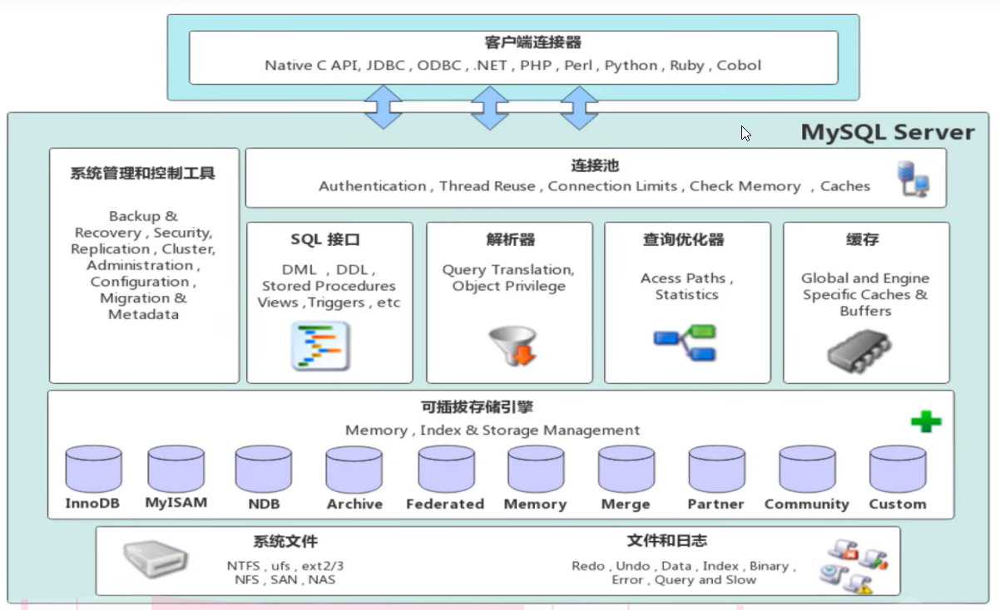
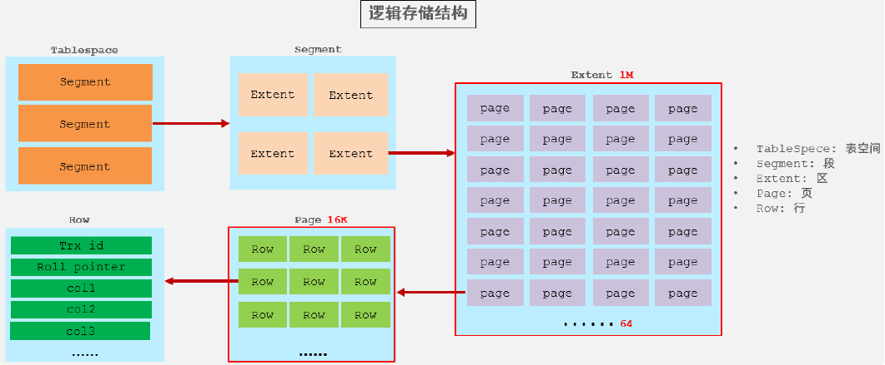

## 体系结构



- 连接层：最上层是一些客户端和链接服务，主要完成一些类似于连接处理、授权认证、及相关的安全方案。服务器也会为安全接入的每个客户端验证它所具有的操作权限。
- 服务层：第二层架构主要完成大多数的核心服务功能。 **负责建立连接、分析和执行 SQL** ，如SQL接口，并完成缓存的查询，SQL的分析和优化，部分内置函数的执行。所有跨存储引擎的功能也在这一层实现，如 过程、函数等。
- 引擎层：存储引擎真正的负责了MySQL中数据的存储和提取，服务器通过API和存储引擎进行通信。不同的存储引擎具有不同的功能，这样我们可以根据自己的需要，来选取合适的存储引擎。
- 存储层：主要是将数据存储在文件系统之上，并完成与存储引擎的交互

## 语句执行过程

### 连接器

#### 连接过程

- 先连接 MySQL 服务，然后才能执行 SQL 语句
- 连接的过程需要先经过 TCP 三次握手，因为 MySQL 是基于 TCP 协议进行传输的
- 如果 MySQL 服务正常运行，完成 TCP 连接的建立后，连接器就要开始验证你的用户名和密码
- 如果用户密码都没有问题，连接器就会获取该用户的权限，然后保存起来，后续该用户在此连接里的任何操作，都会基于连接开始时读到的权限进行权限逻辑的判断。
- 所以，如果一个用户已经建立了连接，即使管理员中途修改了该用户的权限，也不会影响已经存在连接的权限。修改完成后，只有再新建的连接才会使用新的权限设置。

#### 连接类型

MySQL 的连接也跟 HTTP 一样，有短连接和长连接的概念

使用长连接的好处就是可以减少建立连接和断开连接的过程，所以一般使用长连接。

但是，使用长连接后可能会占用内存增多，因为 MySQL 在执行查询过程中临时使用内存管理连接对象，这些连接对象资源只有在连接断开时才会释放。如果长连接累计很多，将导致 MySQL 服务占用内存太大，有可能会被系统强制杀掉，这样会发生 MySQL 服务异常重启的现象。

### 查询缓存

连接器得工作完成后，客户端就可以向 MySQL 服务发送 SQL 语句了，MySQL 服务收到 SQL 语句后，就会解析出 SQL 语句的第一个字段获得语句类型。

如果 SQL 是查询语句（select 语句），MySQL 就会先去查询缓存（ Query Cache ）里查找缓存数据，看看之前有没有执行过这一条命令，查询缓存是以 key-value 形式保存在内存中的，key 为 SQL 查询语句，value 为 SQL 语句查询的结果。

如果查询的语句命中查询缓存，那么就会直接返回 value 给客户端。如果查询的语句没有命中查询缓存中，那么就要往下继续执行，等执行完后，查询的结果就会被存入查询缓存中。

**注意** ：MYSQL8.0后不使用查询缓存

### 解析SQL语句

在正式执行 SQL 查询语句之前， MySQL 会先对 SQL 语句做解析。解析器只负责检查语法和构建语法树，但是不会去查表或者字段存不存在。

### 执行SQL语句

#### 预处理

- 检查 SQL 查询语句中的表或者字段是否存在；
- 将 `select *` 中的 `*` 符号，扩展为表上的所有列

#### 优化器

**优化器主要负责将 SQL 查询语句的执行方案确定下来**，比如在表里面有多个索引的时候，优化器会基于查询成本的考虑，来决定选择使用哪个索引。

#### 执行器

在执行的过程中，执行器就会和存储引擎交互了

- 主键索引查询
  - 执行器第一次查询，会调用 read_first_record 函数指针指向的函数，因为优化器选择的访问类型为 const，这个函数指针被指向为 InnoDB 引擎索引查询的接口，把条件 `id = 1` 交给存储引擎，**让存储引擎定位符合条件的第一条记录**。
  - 存储引擎通过主键索引的 B+ 树结构定位到 id = 1的第一条记录，如果记录是不存在的，就会向执行器上报记录找不到的错误，然后查询结束。如果记录是存在的，就会将记录返回给执行器；
  - 执行器从存储引擎读到记录后，接着判断记录是否符合查询条件，如果符合则发送给客户端，如果不符合则跳过该记录。
  - 执行器查询的过程是一个 while 循环，所以还会再查一次，但是这次因为不是第一次查询了，所以会调用 read_record 函数指针指向的函数，因为优化器选择的访问类型为 const，这个函数指针被指向为一个永远返回 - 1 的函数，所以当调用该函数的时候，执行器就退出循环，也就是结束查询了。
- 全表扫描
  - 执行器第一次查询，会调用 read_first_record 函数指针指向的函数，因为优化器选择的访问类型为 all，这个函数指针被指向为 InnoDB 引擎全扫描的接口，**让存储引擎读取表中的第一条记录**
  - 执行器会判断读到的这条记录的 name 是不是 iphone，如果不是则跳过；如果是则将记录发给客户的（Server 层每从存储引擎读到一条记录就会发送给客户端，）。
  - 执行器查询的过程是一个 while 循环，所以还会再查一次，会调用 read_record 函数指针指向的函数，因为优化器选择的访问类型为 all，read_record 函数指针指向的还是 InnoDB 引擎全扫描的接口，所以接着向存储引擎层要求继续读刚才那条记录的下一条记录，存储引擎把下一条记录取出后就将其返回给执行器（Server层），执行器继续判断条件，不符合查询条件即跳过该记录，否则发送到客户端；
  - 一直重复上述过程，直到存储引擎把表中的所有记录读完，然后向执行器（Server层） 返回了读取完毕的信息；
  - 执行器收到存储引擎报告的查询完毕的信息，退出循环，停止查询。
- 索引下推（对联合索引的you'hua
  - Server 层首先调用存储引擎的接口定位到满足查询条件的第一条二级索引记录，也就是定位到 age > 20 的第一条记录；
  - 存储引擎定位到二级索引后，**先不执行回表** 操作，而是先判断一下该索引中包含的列（reward列）的条件（reward 是否等于 100000）是否成立。如果 **条件不成立** ，则直接 **跳过该二级索引** 。如果 **成立** ，则 **执行回表** 操作，将完成记录返回给 Server 层。
  - Server 层在判断其他的查询条件（本次查询没有其他条件）是否成立，如果成立则将其发送给客户端；否则跳过该记录，然后向存储引擎索要下一条记录。
  - 如此往复，直到存储引擎把表中的所有记录读完。

#### 总结

- 通过连接器校验权限
- 利用分析器进行 SQL 语句的词法分析和语法分析，构建解析树
- 使用优化器选择合适的索引和表连接顺序，最终选择一个最佳的执行计划
- 利用执行器，调用引擎层查询数据，返回结果集给客户端

## 存储引擎简介

存储引擎就是存储数据、建立索引、更新/查询数据等技术的实现方式。存储引擎是基于表的，而不是基于库的，所以不同表可以使用不同的存储引擎

默认的存储引擎为 **innoDB**、

查询当前数据库支持的存储引擎

```mysql
show engines
```

指定存储引擎

```
create table table_name(
)engine = 引擎名
```

## 存储引擎的特点

### innoDB

InnoDB是一种兼顾高可靠性和高性能的通用存储引擎，在 MySQL5.5之后，InnoDB是默认的 MySOL存储引擎。

#### 特点

- DML操作遵循ACID模型，支持 **事务**
- **行级锁** ，提高并发访问性能
- **支持外键**  约束，保证数据的完整性和正确性
- 数据以 **聚集索引** 的方式存储，提高检索效率。

#### 对应的磁盘文件

innoDB引擎的每张表都会对应这样一个表空间文件：xxx.ibd（xxx代表的是表名）

存储该表的表结构（frm、sdi）、数据和索引

参数：innodb_file_per_table



- 表空间 : InnoDB存储引擎逻辑结构的最高层，ibd文件其实就是表空间文件，在表空间中可以包含多个Segment段。
- 段 : 表空间是由各个段组成的， 常见的段有数据段、索引段、回滚段等。InnoDB中对于段的管理，都是引擎自身完成，不需要人为对其控制，一个段中包含多个区。
- 区 : 区是表空间的单元结构，每个区的大小为1M。 默认情况下， InnoDB存储引擎页大小为16K， 即一个区中一共有64个连续的页。
- 页 : 页是组成区的最小单元，页也是InnoDB 存储引擎磁盘管理的最小单元，每个页的大小默认为 16KB。为了保证页的连续性，InnoDB 存储引擎每次从磁盘申请 4-5 个区。
- 行 : InnoDB 存储引擎是面向行的，也就是说数据是按行进行存放的，在每一行中除了定义表时所指定的字段以外，还包含两个隐藏字段

### MyISAM

MyISAM是MySQL早期的默认存储引擎。

#### 特点

- 不支持事务，不支持外键
- 支持表锁，不支持行锁
- 访问速度快
- MyISAM 写入性能差。因为不支持行锁，只有表锁，所以写入的时候会对整张表加锁
- MyISAM 为非聚簇索引，索引和数据分开存储，索引保存的是数据文件的指针。

#### 对应的磁盘文件

- xxx.sdi：存储表结构信息
- xxx.MYD: 存储数据
- xxx.MYI: 存储索引

### Memory

#### 特点

- 数据存储在内存中，速度快，但数据在服务器重启后丢失。
- 适用于临时数据存储或快速缓存。

## 存储引擎的选择

- 大多数情况下，使用默认的 InnoDB ，InnoDB 可以提供事务、行级锁、外键、B+ 树索引等能力。
- MyISAM 适合读更多的场景。
- MEMORY 适合临时表，数据量不大的情况。由于数据都存放在内存，所以速度非常快。