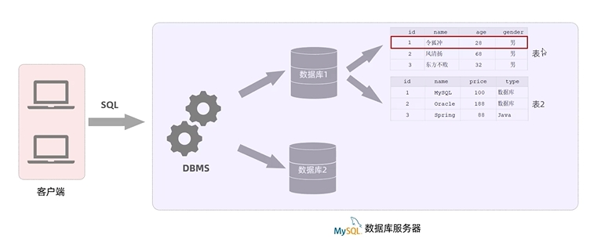

## MySQL配置使用

启动服务：

```mysql
net start mysql
```

停止服务：

```mysql
net stop mysql
```

登录MySQL

```mysql
mysql -u[用户名] -p[密码] [-h 数据库服务器IP -p 端口号]
```

退出MySQL

```mysql
exit
```


## MySQL数据模型

**关系型数据库(RDBMS)**：建立在关系模型基础上，由多张相互连接的二维表组成的数据库

**特点**

- 使用表存储数据，格式统一，便于维护
- 使用SQL语言操作，标准统一，使用方便，可用于复杂查询



## SQL简介

**SQL**：一门操作关系型数据库的编程语言，定义操作所有关系型数据库的统一标准。

### 通用语法

- SOL语句可以单行或多行书写，以分号结尾。
- SOL语句可以使用空格/缩进来增强语句的可读性。
- MySQL数据库的SQL语句不区分大小写。
- 注释
  - 单行注释：--注释内容或者#注释内容 **（MySQL特有）**
  - 多行注释：/* 注释内容 */

### 分类

| 分类 | 全称                       | 说明                                                   |
| ---- | -------------------------- | ------------------------------------------------------ |
| DDL  | Data Definition Language   | 数据定义语言，用来定义数据库对象(数据库，表，字段)     |
| DML  | Data Manipulation Language | 数据操作语言，用来对数据库表中的数据进行增删改         |
| DQL  | Data Query Lanquage        | 数据查询语言，用来查询数据库中表的记录                 |
| DCL  | Data Control Language      | 数据控制语言，用来创建数据库用户、控制数据库的访问权限 |

