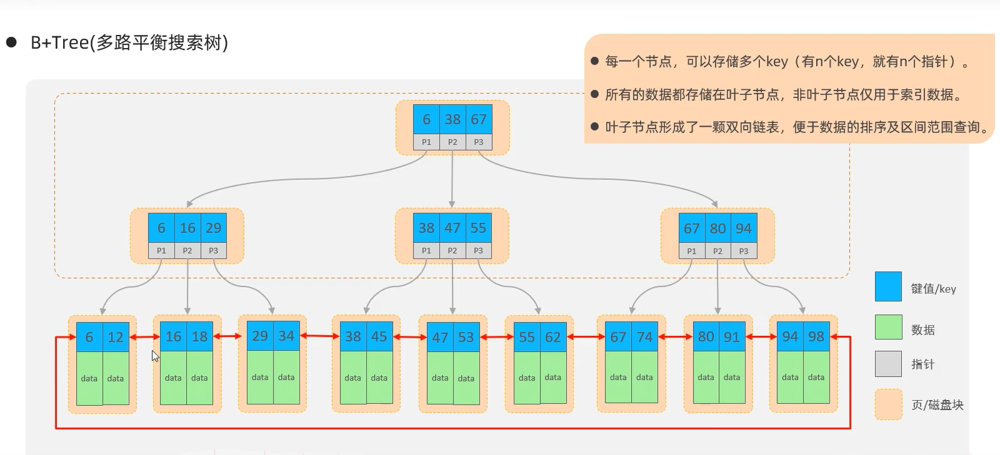

## 基本概念

索引(index)：帮助数据库 高效获取数据的数据结构

优点

- 提高数据查询的效率，降低数据库的I0成本，
- 通过索引列对数据进行排序，降低数据排序的成本，降低CPU消耗。

缺点

- 索引会占用存储空间。
- 索引大大提高了查询效率，同时却也降低了insert、
  update、delete的效率。

## 索引结构

MySQL数据库支持的索引结构有很多，如:Hash索引、B+Tree索引、Full-Text索引等。我们平常所说的索引，如果没有特别指明，都是指默认的 B+Tree 结构组织的索引。



## 索引操作

创建索引

```mysql
create [unique] index index_name on table_name(字段名,...)
```

查看索引

```mysql
show index from table_name
```

删除索引

```mysql
drop index index_name on table_name
```




- 主键字段，在建表时，会自动创建主键索引。
- 添加唯一约束时，数据库实际上会添加唯一索引。

