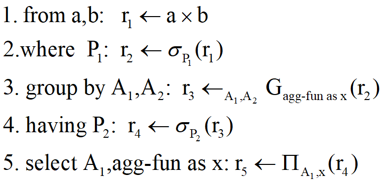
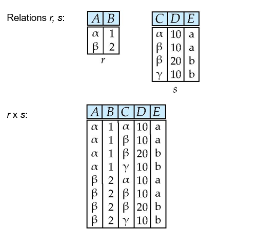
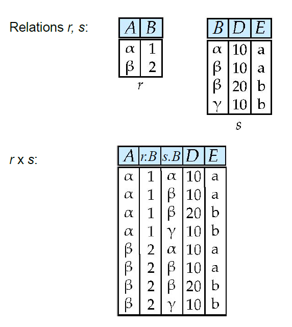
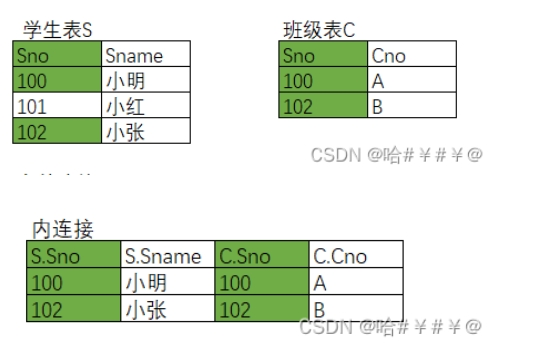
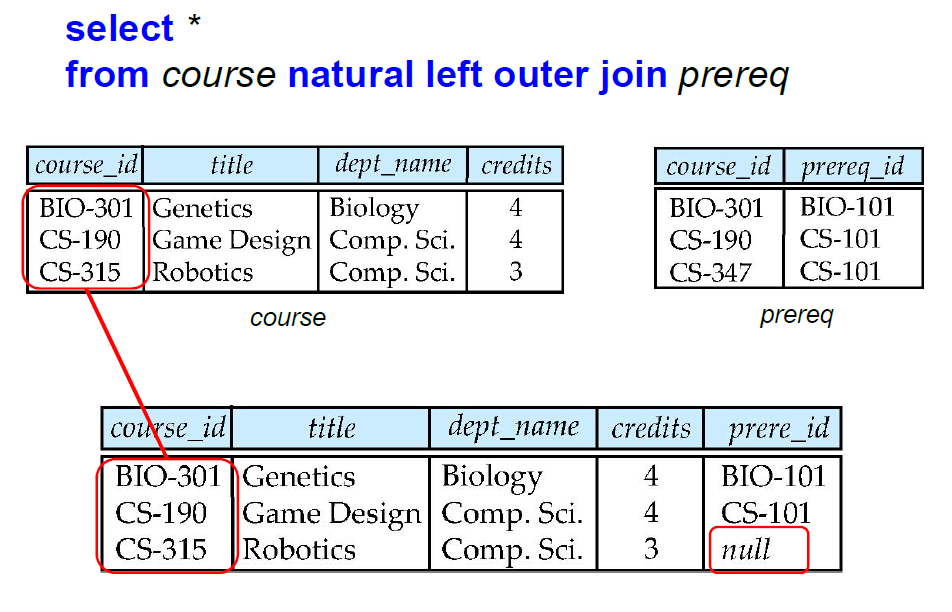
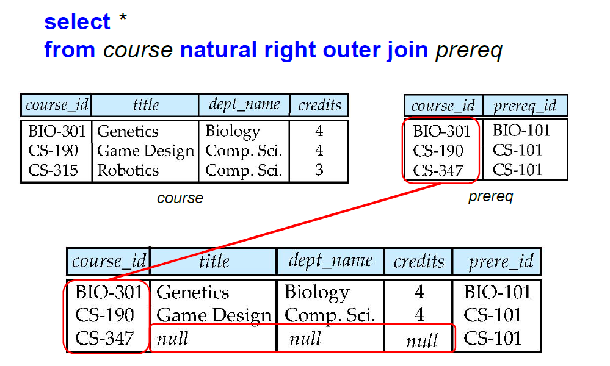
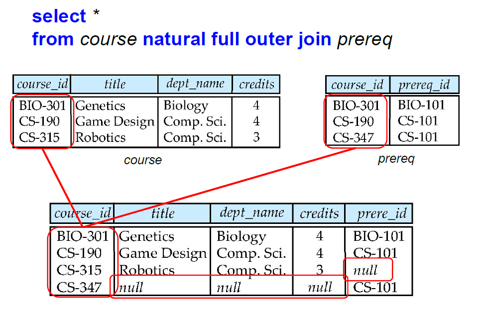
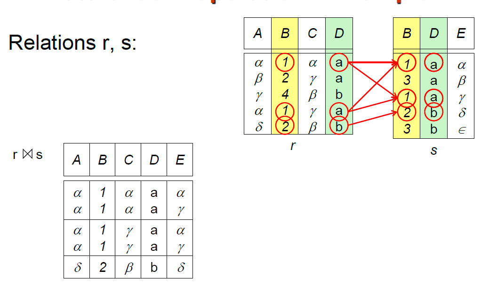
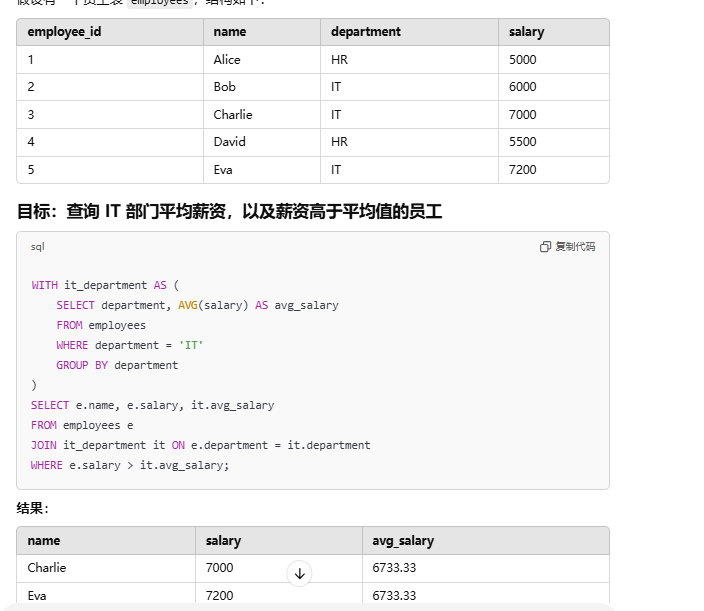

## 基本查询

基本语法

```mysql
select #可以添加distinct来去除重复项
	字段列表 #(查询所有字段可以简写为*)
from table_name
where condition  #条件列表
#以下均为可选选项
group by 聚合函数（字段列表）
having 对分组条件的过滤操作
order by 对字段列表的排序 #（ASC升序，DESC降序）
limit 分页参数 (起始索引，查询记录数) #索引从0开始，起始索引=（查询页码-1)*每页记录数
```

## 条件查询

### 常见条件运算符

| 比较运算符 |   功能   |
| :--------: | :------: |
|     >      |   大于   |
|     >=     | 大于等于 |
|     <      |   小于   |
|     <=     | 小于等于 |
|   <>或!=   |  不等于  |

### 常见逻辑运算符

| 逻辑运算符 | 功能 |
| :--------: | :--: |
| and 或 &&  |  与  |
| or 或 \|\| |  或  |
| not 或 \|  |  非  |

## 单表查询

```mysql
select #可以添加distinct来去除重复项
	字段列表 #(查询所有字段可以简写为*)
from table_name
where condition  #条件列表
#以下均为可选选项
group by 聚合函数（字段列表）
having 对分组条件的过滤操作
order by 对字段列表的排序 #（ASC升序，DESC降序）
limit 分页参数 (起始索引，查询记录数) #索引从0开始，起始索引=（查询页码-1)*每页记录数
```

- select子句：指定所需的属性，对应关系代数中的投影操作

  - 默认允许重复的元组

    - 显式指示使用all关键字

    - 强制去除重复使用distinct关键字

  - 查询所有属性可以简写为*

- from子句：确定查询中需要访问的表

- where子句：指定结果满足的特定条件

## 附加的基本操作

### 更名运算

- 作用
  - 长命名改为短命名
  - 比较同一个关系的元组
- 放置位置：位置灵活，无限制

```mysql
select #可以添加distinct来去除重复项
	字段列表 #(查询所有字段可以简写为*)
from old_name as new_name
where condition  #条件列表
#以下均为可选选项
group by 聚合函数（字段列表）
having 对分组条件的过滤操作
order by 对字段列表的排序 #（ASC升序，DESC降序）
limit 分页参数 (起始索引，查询记录数) #索引从0开始，起始索引=（查询页码-1)*每页记录数
```


### 显示顺序

在查询语句的结尾使用order by子句来决定显示按顺序还是倒序，默认为顺序

- des：降序
- asc：升序（默认）

```mysql
select columns
from table
order by column_name [asc | desc];
```


### 字符串相关操作

放置位置

- where子句中充当条件
- select子句中充当元素

常见操作

- 标识一个字符串

  ```mysql
  '字符串'
  ```

- 模式匹配

  - like关键字

    ```mysql
    select #可以添加distinct来去除重复项
    	字段列表 #(查询所有字段可以简写为*)
    from table_name as s
    where s.name like %|_% escape '|'  #匹配任何包含_的字符串
    ```

    - 百分号%：匹配任意子串

      - 例如以substring开头：substring%

      - 匹配任何包含substring的字符串：%substring%

    - 下划线_：匹配任意字符

    - 定义转义字符：escape'转义字符'

  - regexp：正则表达式匹配

    ```mysql
    select * 
    from users 
    where name regexp '^张.$';
    ```

    

- 字符串串联

  - concat(str1, str2, ...)

    ```mysql
    select concat(first_name, ' ', last_name) as full_name
    from users;
    ```

  - str1|| str2

    ```mysql
    select first_name || ' ' || last_name as full_name
    from users;
    ```

  - concat_ws(separator, str1, str2, ...)：允许指定分隔符

    ```mysql
    select concat_ws(', ', first_name, last_name) as full_name
    from users;
    ```

  - 大小写以及首尾去除空格

    ```mysql
    #转小写
    select #可以添加distinct来去除重复项
    	字段列表 #(查询所有字段可以简写为*)
    from table_name as s
    where s.name =lower('hEllO world')  #与hello world匹配的字符串
    
    #转大写
    select #可以添加distinct来去除重复项
    	字段列表 #(查询所有字段可以简写为*)
    from table_name as s
    where s.name =upper('hEllO world')  #与HELLO WORLD匹配的字符串
    
    #去除首尾空格
    select #可以添加distinct来去除重复项
    	字段列表 #(查询所有字段可以简写为*)
    from table_name as s
    where s.name =upper(' hEllO world ')  #与hEllO world匹配的字符串
    ```

    - 大写：upper(str)
    - 小写：lower(str)
    - 去除空格：trim(str)

### where子句谓词

- between min_value and max_value：说明一个值位于某个范围,大于等于min_value，小于等于max_value

  ```mysql
  select columns
  from table as t
  where t.age between 10 and 100 #年龄在10岁到100岁
  ```

- 元组比较：元组之间使用字典序进行比较

  ```mysql
  select name, course_id
  from instructor, teaches
  where (instructor.ID, dept_name) = (teaches.ID, ’Biology’);
  ```


## 集合运算

所有的集合运算默认去除重复，若保留重复则在集合运算符后面加上关键字all

- 查找在 2009 年秋季或 2010 年春季开设的课程（使用并运算）

  ```mysql
  (select course_id from section where sem = ‘Fall’ and year = 2009)
  union
  (select course_id from section where sem = ‘Spring’ and year = 2010)
  ```

- 查找在 2009 年秋季和2010 年春季开设的课程（使用交运算）

  ```mysql
  (select course_id from section where sem = ‘Fall’ and year = 2009)
  intersect
  (select course_id from section where sem = ‘Spring’ and year = 2010)
  ```

- 查找在 2009 年秋季开课但未在 2010 年春季开课的课程（使用差运算）

  ```mysql
  (select course_id from section where sem = ‘Fall’ and year = 2009)
  except
  (select course_id from section where sem = ‘Spring’ and year = 2010)
  ```

  

## 分组查询

### 基本聚合函数

| 函数  |  功能  |
| :---: | :----: |
|  sum  |  求和  |
|  avg  | 平均值 |
| count |  计数  |
|  max  | 最大值 |
|  min  | 最小值 |



null不参与聚合函数的运算

使用关键字*指代所有

可以在聚集表达式中使用关键字distinct修饰被聚合的属性来删除重复的元组如count (distinct id)



### group by子句

将聚集函数用于一组元组集上而利用属性进行的分组操作

```mysql
#正确示范
select dept_name, avg(salary)as avg_salary)
from instructor
group by dept_name;
```



- select子句中的字段为用于分组的字段（group by中的属性，当只有一个聚合函数时可以不存在）和聚合函数（保证select子句中非聚集的属性只能是出现在group by子句）

  ```mysql
  #错误查询，select子句中的非聚合属性ID
  #没出现在group by子句中
  select dept_name, ID, avg(salary)
  from instructor
  group by dept_name ;
  ```
  
-   在默认情况下，系统按照**group by**子句中指定的列升序排列，但是可以使用**order by**子句指定新的排列顺序。



### having子句

对group by后的分组进行过滤操作

可以使用聚集函数

```mysql
select course_id,semester,year,sec_id,avg(tot_cred)
from takes natural join student
where year = 2009
group by course_id,semester,year,sec_id
having count(ID)>=2;
```



- having和where的区别

  - 执行时机不同:where是分组之前进行过滤，不满足where条件，不参与分组;而having是分组之后对结果进行过滤。

  - 判断条件不同:where不能对聚合函数进行判断，而having可以。

- 保证出现在having子句中的非聚集的属性只能出现在group by子句中

  ```mysql
  # 错误示范 having子句中非聚集的属性salary
  # 没有出现在group by中
  select department,AVG(salary)AS avg_salary
  from employees
  group by department
  having salary >5000;
  ```



### 查询的执行顺序

1. 根据from子句计算出关系
2. 若出现了where子句则将where子句中的谓词应用到from子句的结果关系上
3. 若出现了group by子句，满足where子句的元组通过group by子句形成分组，若没有group  by子句则满足where子句谓词的整个元组集被当成一个分组
4. 若出现了having子句，将被应用到每一个分组，不满足子句谓词的分组将被抛弃
5. select子句利用剩下的分组产生出查询结果中的元组，在每个分组上应用聚集函数来得到单个结果元组



## 多表查询

### 连接查询

**笛卡尔积**

描述：输出两个关系中输出所有的元组对（无论在共同属性上的取值是否相同）

若关系r中属性和关系s中的属性相同则区分命名

- 属性名不相同



- 属性名相同



示例代码：

```mysql
#隐式笛卡尔积
table a,table b
#显式笛卡尔积
table a join table b
```

**内连接**

描述：查询A表和B表相交的部分（有条件的笛卡尔积）

性质：不保留未匹配元组的连接运算（合并具有同一列的两个以上的表的行, 结果集中不包含一个表与另一个表不匹配的行）



语法：

```mysql
#隐式内连接
select 字段列表
from table a,table b
where condition

#显式内连接
select 字段列表
from table a join table b
on 连接条件
```

**外连接**：

描述：通过在表中创建包含空值元组的方式保留未匹配元组的连接运算

- 左外连接：只保留出现在左外连接运算之前（左边）的关系中的元组。
- 右外连接：只保留出现在右外连接运算之后（右边）的关系中的元组。
- 全外连接：保留出现在两个关系中的元组。

语法：

```mysql
#左外连接
select 字段列表
from table a left join table b
on 连接条件

#右外连接
select 字段列表
from table a right join table b
on 连接条件

#mysql不直接支持全外连接,可以通过左外连接和右外连接union操作后实现
select 字段列表
from table a left join table b
on 连接条件
union
select 字段列表
from table a right join table b
on 连接条件
```
**自然连接**

描述：从A表和B表中输出在具有相同名字的所有属性上取值相同的元组对，基于两个表中共同属性的值相等的元组进行合并。



```mysql
#自然连接
select 字段列表
from table a natural join table b
on 连接条件
```



自然连接和内连接的区别

若两张表具有同名的属性，自然连接会删除重复的属性而内连接不会删除而是保留重复的属性




### 嵌套子查询

子查询：SQL语句中嵌套select语句

类别

- 标量子查询：子查询返回的结果为单个值
- 列子查询：子查询返回的结果为一列
- 行子查询：子查询返回的结果为一行
- 表子查询：子查询返回的结果为多行多列

子查询的位置

- select后面：标量子查询（作为所需要的一个字段）
- from后面：表子查询
- where/having（作为条件的一部分）：标量子查询/列子查询/行子查询

#### with子句

- with定义了临时关系，只对with子句所在的查询有效
- 其中as子句内定义临时关系，后面紧跟查询语句
- 可以使用多个as对应多个临时关系



```mysql
with it department as(
    select department,AVG(salary) as avg_salary
	from employees
	where department =IT
	group by department
)
select e.name,e.salary,it.avg_salary
from employees e
join it department it on e.department = it.department
where e.salary >it.avg_salary;
```

#### where子句中的子查询

子查询类型

- 行子查询：子查询返回的结果为一行
- 列子查询：子查询返回的结果为一列


检测集合的成员资格（列子查询）

- in连接字检测元组是否是集合中的成员

  ```mysql
  #查找 2009 年秋季和 2010 年春季提供的课程
  select distinct course_id
  from section
  where semester = ’Fall’ and year= 2009 and            
  course_id in (select course_id
                from section
                where semester = ’Spring’ and year= 2010);
  ```

- not in连接检测元组是否不是集合中的成员

  ```mysql
  #查找 2009 年秋季提供的课程，但不在2010 年春季提供的课程
  select distinct course_id
  from section
  where semester = ’Fall’ and year= 2009 and 
  course_id  not in (select course_id
                     from section
                     where semester = ’Spring’ and year= 2010);
  
  ```


空关系测试（行子查询）

- exist结构在作为参数的子查询非空时返回true，not exist在作为参数的子查询为空时返回true

- 关系A包含关系B可以写为not exists (B except A)

  ```mysql
  # 查找所有参加过生物系提供的所有课程的学生。
  select distinct S.ID, S.name
  from student as S
  where not exists ( (select course_id
                      from course
                      where dept_name = ’Biology’)
                      except
                      (select T.course_id
                       from takes as T
                       where S.ID = T.ID));
  
  ```


测试重复元组（行子查询）

unique结构：如果作为参数的子查询结果中没有重复的元组，则返回true

```mysql
select T.course_id
from course as T
where not unique (select R.course_id
				  from section as R
				  where T.course_id= R.course_id 
				  and R.year = 2009);
```


集合的比较（列子查询）

- all:指代集合中的每一个元素

  ```mysql
  # 查找薪水大于 Biology 系中所有教员薪水的所有教员的姓名。
  select name
  from instructor
  where salary > all (select salary
                      from instructor
                      where dept_name = ’Biology’);
  ```

- some：指代集合中的其中一个元素

  ```mysql
  # 查找薪水高于 Biology 系中某些（至少一名）讲师的讲师的姓名。
  select name
  from instructor
  where salary > some (select salary
                       from instructor
                       where dept_name = ’Biology’);
  
  ```

## 视图

### 描述

​	一种虚拟表，它基于 SQL 查询结果创建。视图并不存储数据，而是动态地从基础表中提取数据。这使得视图像一个窗口，可以用来查看和操作表的数据。

### 特点

- **虚拟表**：
  - 视图本身不存储数据，它的内容来自于定义视图时的查询语句。
  - 每次访问视图时，都会动态执行查询以生成视图的数据。
- **逻辑隔离**：
  - 视图是基础表的一种逻辑表示，对视图的操作不会直接修改基础表。
- **安全性**：
  - 通过视图，可以限制用户访问表的部分数据，而不是直接授予表的访问权限。
- **可简化复杂查询**：
  - 视图可以封装复杂的 SQL 查询逻辑，从而简化对数据的访问。

### 创建过程

​	视图关系在概念上包含查询结果中的元组， 但并不进行预计算和存储（数据库系统存储视图的定义本身， 而不存储定义该视图的查询表达式的执行结果）。相反， 数据库系统存储与视图关系相关联的查询表达式。 当视图关系被访问时， 其中的元组是通过计算查询结果而被创建出来的。 从而，视图关系是在需要的时候才被创建的。

### 在查询中使用视图

​	在任何给定时刻， 视图关系中的元组集是该时刻视图定义中的查询表达式的计算结果。当我们定义一个视图时， 数据库系统存储视图的定义本身， 而不存储定义该视图的查询表达式的执行结果。一旦视图关系出现在查询中，它就被已存储的查询表达式代替。因此， 无论我们何时执行这个查询， 视图关系都被重新计算。

### 物化视图

- 定义：创建一个物理表，其中包含定义视图的查询结果中的所有元组

- 如果查询中使用的关系已更新，则物化视图结果将过时，因此需要维护视图，通过在底层关系更新时更新视图

### 语法

```mysql
# 创建视图（可以通过其他视图进行创建）
create view view_name as
<查询表达式>
```

