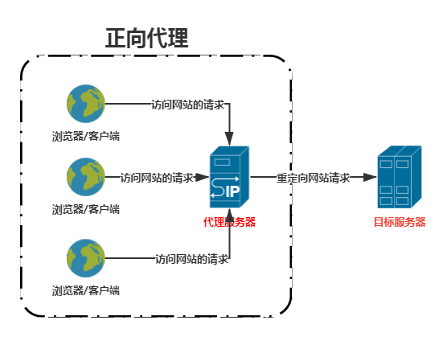

## Nginx是什么

**Nginx（Engine-X）** 是一个 **高性能的 Web 服务器**，同时也可以用作 **反向代理、负载均衡、缓存服务器** 等。

## 正向代理

**Nginx** 可以被用作正向代理服务器。



**Nginx** 位于 **客户端（用户）和目标服务器** 之间，代表客户端向外部服务器请求资源。简而言之，正向代理就是代理客户端，代理客户端向服务端发送请求

- **隐藏客户端 IP**（目标服务器看不到用户的真实 IP）。
- **突破网络限制**。
- **缓存资源**（加快访问速度）。
- **过滤内容**（企业可限制员工访问某些网站）。

## 反向代理

反向代理是一种 **代理服务器** 的配置模式，它代表服务器向客户端提供服务。客户端发送请求到反向代理服务器，然后反向代理服务器将请求转发到后端的真实服务器上，并将响应返回给客户端。简单理解为用户直接访问反向代理服务器就可以获得目标服务器的资源。这一过程叫反向代理

- **隐藏后端服务器 IP**（用户只知道代理服务器，不知道具体服务器）。
- **负载均衡**（将请求分发到多台服务器，防止单点故障）。
- **安全防护**（过滤恶意流量，保护后端服务器）。
- **缓存加速**（缓存静态资源，提高访问速度）。

## Nginx配置文件

主文件格式

```java
//主配置文件格式

main block：主配置段，即全局配置段，对http,mail都有效

//配置Nginx服务器的事件模块相关参数
events {
 ...
}   
//http/https 协议相关配置段
http {
 ...
} 

//默认配置文件不包括下面两个模块
//mail 协议相关配置段
mail {
 ...
}    
//stream 服务器相关配置段
stream {负载均衡
 ...
}

```

子配置文件（一般在主配置文件的http部分）

- server块：用于配置HTTP服务器的具体行为，包括监听的端口、虚拟主机的配置、请求处理逻辑等。
- location块：用于指定不同URL请求的处理方式，例如静态文件的服务、反向代理等。
- upstream块：用于配置反向代理的目标服务器列表。
- include指令：用于引入其他的子配置文件，可以将一些通用的配置项单独放在一个文件中，然后通过include指令引入。

通常修改server块中的内容

server块定义虚拟主机的配置，每个虚拟主机可以独立配置不同的域名、端口和目录。

```yaml
server {
		# 指定监听的端口和IP地址。
        listen       80;
        # 指定虚拟主机的主机名。
        server_name  localhost;

        #charset koi8-r;

        #access_log  logs/host.access.log  main;

        location / {
        	# 根目录
            root   html;
            # 起始页
            index  index.html index.htm;
        }

        #error_page  404              /404.html;

        # redirect server error pages to the static page /50x.html
        #
        error_page   500 502 503 504  /50x.html;
        location = /50x.html {
            root   html;
        }

        # proxy the PHP scripts to Apache listening on 127.0.0.1:80
        #
        # 转发到后端服务器
        location ~ \.php$ {
            proxy_pass   http://127.0.0.1;
        }

        # pass the PHP scripts to FastCGI server listening on 127.0.0.1:9000
        #
        #location ~ \.php$ {
        #    root           html;
        #    fastcgi_pass   127.0.0.1:9000;
        #    fastcgi_index  index.php;
        #    fastcgi_param  SCRIPT_FILENAME  /scripts$fastcgi_script_name;
        #    include        fastcgi_params;
        #}

        # deny access to .htaccess files, if Apache's document root
        # concurs with nginx's one
        #
        #location ~ /\.ht {
        #    deny  all;
        #}
    }
```


## Nginx部署项目

Nginx既可以部署前端项目也可以部署后端项目

### Nginx部署前端项目

#### 作用

Nginx 作为**静态文件服务器**，直接向浏览器返回 `HTML、CSS、JS、图片` 等文件，前端不依赖后端服务器。

#### 配置过程

- 将前端项目打包
- 将打包好的前端项目放入配置文件中对应目录root目录
- 修改配置文件


