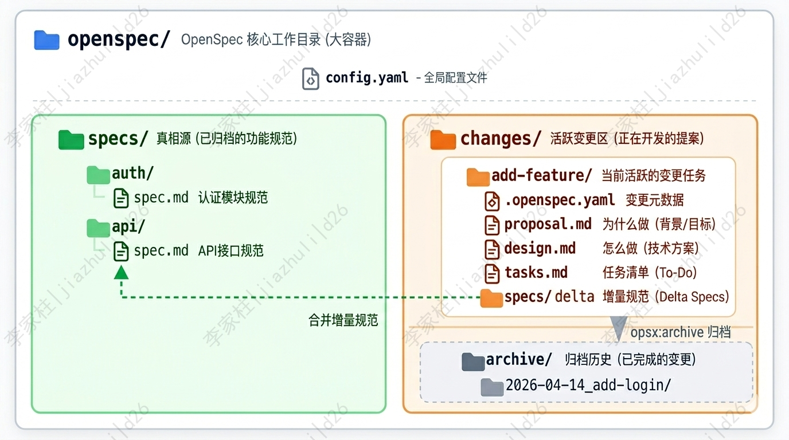

## 🧠 Vibe Coding 的痛点和 Spec-Driven Development 的优势

现在用 Cursor、Claude Code 这类 AI 编码助手已经是日常了。大家应该都有一个共同感受：AI 确实能写代码，但要让它持续、稳定地写出你想要的东西，没那么容易。
理想状态下，我们希望自己的角色能逐步转变——从纯粹的“代码执行者”，更多地转向“指挥者”和“把关人”：AI 负责具体的代码产出，人负责架构决策、逻辑审批和质量把关。
听起来很美好，对吧？但现实往往很骨感。如果在实际操作中缺乏规范，这种协作很容易退化成一种非常随意的状态，也就是现在常说的 "Vibe coding"（凭感觉编程）——脚踩西瓜皮，想到哪写到哪。人边想边写，AI 边猜边生成。这种缺乏约束的开发方式，很快就会暴露出几个致命痛点：

| 痛点      | 具体表现                | 后果             |
| ------- | ------------------- | -------------- |
| 上下文丢失   | 聊天记录太长，AI 开始"失忆"    | 反复解释同一件事，心智负担重 |
| AI 自由发挥 | 没有明确约束，AI 按自己的喜好补全  | 代码风格混乱，逻辑容易跑偏  |
| 需求偏移    | 边聊边做，缺乏锚点，做着做着就变形了  | 频繁返工、疯狂 debug  |
| 无法追溯    | 只有最终代码，不知道当初为什么这么设计 | 维护和交接都很困难      |

（Spec-Driven Development，规范驱动开发）的核心思想很简单：先写规范，再写代码，用规范约束 AI 的行为边界。

更具体地说，两者的差异可以总结为下面这张表：

| 维度    | 传统 AI 编程 (Vibe Coding) | OpenSpec (SDD)                 |
| ----- | ---------------------- | ------------------------------ |
| 核心驱动  | 基于对话和感觉                | 基于结构化规范文档                      |
| 上下文管理 | 依赖聊天记录，易丢失             | 单一真相源 (Single Source of Truth) |
| 可追溯性  | 难以审计变更原因               | 完整的提案与决策日志                     |
| 执行精度  | AI 自由发挥空间大             | 严格按任务清单 (Tasks) 执行             |

用一个比喻来说：传统的 AI 编程像是"口头协议"——你说一句，AI 做一句，做完就忘；而 SDD 像是"签合同"——先把需求、设计、任务清单白纸黑字写下来，AI 严格按合同执行，执行完还要归档备查 。

---

## 🏗️ OpenSpec 的核心定位与设计哲学

### 📖 OpenSpec是什么

[OpenSpec](https://github.com/Fission-AI/OpenSpec) 是由 [Fission-AI](https://openspec.dev/) 开源的一套 **Spec-Driven Development 框架 + CLI 工具**。它形态非常轻量，它通过一套结构化的文件组织方式和指令系统，让 AI 编程助手（如 Codex、CodeBuddy、Claude）能够在明确的"合同"约束下工作。

- 一组本地 Markdown 文档（`openspec/specs/` 与 `openspec/changes/`）。
- 一组斜杠命令（`/opsx:propose`、`/opsx:apply`、`/opsx:archive`）。
- 一个 npm 包：`@fission-ai/openspec`。

和 Spec Kit 相比，OpenSpec 没有"Constitution 强制条款"那一层；和 Kiro 相比，OpenSpec 不绑定特定 IDE。一句话——**它只做"把变更规格化"这一件事，并把这件事做到极致轻量**。

### 🎯 核心口号：Align before code

OpenSpec 的官方口号是 **"Align before code"（在写代码之前先对齐）**。它强调的是：

- 需求是合约，不是注释。
- 规范是 AI 的上下文，不是给人看的文档。
- 变更必须可追溯、可审计、可回放。

整个工具的设计都围绕这一句话展开——**所有功能都为了把"模糊意图"压缩成"AI 能直接消费的契约"**。

### ⚖️ 与其他 SDD 工具的对比

| 维度  | OpenSpec                          | GitHub Spec Kit                    | AWS Kiro                      |
| --- | --------------------------------- | ---------------------------------- | ----------------------------- |
| 形态  | 本地 CLI + Markdown                 | Python CLI + Markdown              | IDE 内置（基于 Code OSS）           |
| 工作流 | propose → apply → archive         | specify → plan → tasks → implement | requirements → design → tasks |
| 产物  | proposal / design / specs / tasks | spec / plan / tasks / constitution | requirements / design / tasks |
| 强项  | 增量变更、归档                           | 完整宪法、跨工具兼容                         | IDE 原生、EARS 格式、Agent Hooks    |
| 弱项  | 无项目级强制条款                          | 流程相对重                              | 绑死 IDE、生态封闭                   |
| 适合  | 增量功能、长期维护                         | 团队级、企业级                            | 多人协作、复杂项目                     |

一句话选型：**想轻、想快、想要变更可追溯，用 OpenSpec；想严肃、想统一、想给 AI 立宪法，用 Spec Kit；想 IDE 全家桶、用 Kiro**。

---

## 🛠️ OpenSpec 的安装和使用

环境要求:OpenSpec 基于 Node.js 开发，安装前请确保你的环境满足：Node.js：版本 >= 20.19

```bash
# 1. 全局安装最新版
npm install -g @fission-ai/openspec@latest

# 2. 验证安装
openspec --version

# 3. 进入你的项目目录，初始化 OpenSpec
cd /path/to/your/python/project
openspec init

# 4. 在交互式菜单中选择你使用的编辑器
```

## 🧩 OpenSpec 工作目录

### 🗂️ 整体结构

这是理解 OpenSpec 的关键部分。用下面这张图来展示整体架构：

<div align="center">
  
</div>
执行 openspec init 后，会在项目根目录创建 openspec/ 文件夹，这是整个框架的"大本营"：

```text
openspec/
├── config.yaml          ← 🌐 全局配置（影响所有新变更，归档不动它）
├── specs/               ← 📚 主规范库（真相源，已归档的功能规范）
└── changes/             ← 🔥 活跃变更区
    ├── my-feature/      ← 当前正在开发的变更
    │   ├── .openspec.yaml   ← 变更元数据（schema + 创建日期）
    │   ├── proposal.md      ← 为什么做（背景/目标）
    │   ├── design.md        ← 怎么做（技术方案）
    │   ├── tasks.md         ← 任务清单（To-Do）
    │   └── specs/           ← 增量规范（Delta Specs）
    └── archive/         ← 📦 归档区
        └── 2026-04-07-my-feature/  ← 归档后的变更（整个目录原封不动搬过来）
```

用一张表把这三个区域的分工与状态总结一下：

| 区域    | 路径                 | 作用            | 状态    |
| ----- | ------------------ | ------------- | ----- |
| 真相源   | `specs/`           | 存放已归档、稳定的功能规范 | 🟢 稳定 |
| 活跃变更区 | `changes/xxx/`     | 正在开发的功能提案     | 🟠 活跃 |
| 归档区   | `changes/archive/` | 已完成变更的历史记录    | ⚪ 历史  |

这一设计借鉴了传统软件工程里的"**主干 + 变更集**"思想：

- `specs/` 是已经定稿的规范库，是 AI 读"系统当前是什么"的入口。
- `changes/` 是正在进行的"草稿区"，每一个子目录代表一个待合并的变更。

新功能先在 `changes/` 里起草，完工后通过 `/opsx:archive` 合并到 `specs/`，**整个生命周期都有完整的文件留痕**。

### 🧾 核心工件

在 OpenSpec 工作流的语境中，Artifact（工件）是指在一个变更（Change）推进过程中，按步骤依次创建的结构化文档或文件。

每个变更包含 四个核心工件，我把它们比作"合同的四个章节"：四个文件各司其职：

| 工件 | 文件            | 回答的问题            | 谁来读        |
| :- | ------------- | ---------------- | ---------- |
| 提案 | `proposal.md` | 为什么要做？影响哪些模块？    | 人 + AI     |
| 设计 | `design.md`   | 用什么技术方案？关键决策是什么？ | 人 + AI     |
| 规范 | `specs/*.md`  | 具体怎么做            | AI 实现时对齐   |
| 任务 | `tasks.md`    | 具体要做哪些事？         | AI 实施时逐项打勾 |

> 一个常见的反模式是把 `proposal.md` 写得很长、`spec.md` 写得很短。事实上 **`spec.md`** **才是 AI 实现时的"事实来源"**——它写得越具体，AI 跑偏的概率越低。


### ➕ 变更的"delta"思想

`specs/` 下的子目录是按"能力（capability）"组织的，例如 `auth/spec.md`、`billing/spec.md`。一次新变更只会产生"差异（delta）"——只描述\*\*新增（ADDED）、修改（MODIFIED）、删除（REMOVED）\*\*的能力，不重写整个文件。

```text
openspec/changes/add-oauth-login/
└── specs/
    └── auth/
        └── spec.md   # 只描述 ADDED Requirements: OAuth 登录相关
```

归档时 OpenSpec 会自动把这些 delta 合并到 `openspec/specs/auth/spec.md`，**形成活文档**。这样既保留了变更历史，又让 `specs/` 始终是当前系统的真实写照。


## 🔄 核心工作流：Propose → Apply → Archive

### ⌨️ 三个核心命令

OpenSpec 默认是 **Core 模式**，只有三个核心命令：

```text
/opsx:propose  →  /opsx:apply  →  /opsx:archive
```

- **`/opsx:propose <name>`**：根据自然语言需求，一键生成 `proposal.md` + `design.md` + `specs/` + `tasks.md`。
- **`/opsx:apply`**：按 `tasks.md` 逐项实现，每完成一项打勾。
- **`/opsx:archive <name>`**：把变更归档，delta 合并到 `specs/`，整个目录从 `changes/` 移除。

三个命令的边界极其清楚：

- `propose` 阶段只动 Markdown，不动代码。
- `apply` 阶段才真正写代码。
- `archive` 阶段关闭变更，留下审计痕迹。

### 🔍 探索模式 /opsx:explore

需求不清时还有 `/opsx:explore` 兜底。它和 `propose` 的区别是：

- `propose` 会**生成正式文档**。
- `explore` **不产生产物**，只和 AI 一起梳理思路，把模糊意图问清楚。

> 实操经验：拿到一个不清晰的需求时，先 `/opsx:explore` 把问题问透；等需求清晰、边界明确后，再 `/opsx:propose` 生成正式规范。**避免边探索边写规范，导致 spec 反复返工**。

### 🪞 完整生命周期

一个 OpenSpec 变更的完整生命周期是这样的：

```text
需求提出
   ↓
/opsx:explore（可选，需求不清时）
   ↓
/opsx:propose <name>     → 生成 proposal / design / specs / tasks
   ↓
人工 review + 修订规范
   ↓
/opsx:apply              → 按 tasks 逐项实现
   ↓
测试与验证
   ↓
/opsx:archive <name>     → 合并 delta 到 specs/，删除 changes/<name>/
```

这个流程里有两个\*\*人在环路（Human-in-the-Loop）\*\*的检查点：

1. `propose` 之后必须 review 规范。
2. `archive` 之前必须验证实现。

跳过任何一个检查点，OpenSpec 就退化为"自动写代码的脚手架"，失去意义。

---

## 💻 安装与初始化

### 📦 前置要求

OpenSpec 的安装门槛非常低：

- Node.js 18+
- 任意一个支持的 AI 工具（Claude Code、Cursor、Codex、Copilot、Windsurf、Gemini CLI、Cline、Trae 等 25+ 工具）

### ⚙️ 项目初始化

在项目根目录运行：

```bash
# 全局安装
npm install -g @fission-ai/openspec

# 初始化（按提示选择 AI 工具）
cd your-project
openspec init
```

`openspec init` 会做三件事：

1. 创建 `openspec/` 目录。
2. 在所选 AI 工具的配置目录（如 `.claude/commands/opsx/`）写入斜杠命令定义。
3. 生成一份默认的 `AGENTS.md` 提示词（告诉 AI 如何使用 OpenSpec）。

> 提示：如果想用非交互式初始化，可以直接指定工具：`openspec init --tools claude`。

### 🎛️ 切换工作模式

OpenSpec 提供两种工作模式：

- **Core 模式**（默认）：3 个核心命令够用，适合大多数项目。
- **Expanded 模式**：解锁更多细粒度命令（`/opsx:new`、`/opsx:continue`、`/opsx:ff`、`/opsx:verify`、`/opsx:bulk-archive`、`/opsx:onboard`）。

切换方法：

```bash
# 查看当前配置
openspec config profile

# 勾选需要的命令（例如 new、continue、ff、verify、bulk-archive、onboard）
# 然后让 AI 重新识别
openspec update
```

**经验之谈**：除非项目特别复杂，否则 **Core 模式完全够用**。命令越多，记忆负担越大，反而拖慢节奏。

---

## 🧪 基本使用：一个最小例子

下面用一个最小例子把整套流程跑通。需求是"做一个 CLI 工具，能把文本按行编号输出"。

### 💡 需求描述

在 Claude Code 对话框里输入：

> 帮我用 OpenSpec 写一个 CLI 工具，名字叫 `linenumber`，支持读取文件路径参数，把每一行加上行号后输出到标准输出。要求：空行也要编号；如果不传文件参数，从 stdin 读取。

### 📋 Step 1：发起提案

```text
/opsx:propose linenumber
```

OpenSpec 会在 `openspec/changes/linenumber/` 下生成四个文件。其中 `tasks.md` 大致长这样：

```markdown
## 1. 工程初始化
- [ ] 1.1 初始化 Node.js 项目（package.json、bin 入口）
- [ ] 1.2 解析命令行参数（支持文件路径或 stdin）

## 2. 核心逻辑
- [ ] 2.1 实现 `numberLines(input: string): string`
- [ ] 2.2 处理 stdin / 文件两种输入源
- [ ] 2.3 空行也要带行号

## 3. 测试
- [ ] 3.1 单元测试：numberLines 在空字符串、普通文本、含空行文本下的输出
- [ ] 3.2 集成测试：从文件读入、从 stdin 读入

## 4. 文档
- [ ] 4.1 写 README，给出 `linenumber file.txt` 和 `cat file.txt | linenumber` 两个示例
```

`specs/cli/linenumber/spec.md` 会长这样（节选）：

```markdown
# Capability: linenumber

## ADDED Requirements

### Requirement: 给文本按行编号
系统 SHALL 读取输入文本（来自文件参数或 stdin），对每一行加上"行号 + 跳格 + 内容"格式的前缀，并把结果输出到 stdout。

#### Scenario: 来自文件的普通文本
- WHEN 用户执行 `linenumber sample.txt`，且 `sample.txt` 包含 3 行文本
- THEN stdout 输出形如 `1\t第一行\n2\t第二行\n3\t第三行`

#### Scenario: 空行也要带行号
- WHEN 输入包含空行
- THEN 空行也以行号占位（不跳过）
```

> 关键动作：在这个阶段，**仔细 review 每一个 Scenario**。如果验收条件不严密，AI 在 apply 阶段就会跑偏。

### 🔧 Step 2：执行实现

```text
/opsx:apply
```

AI 会按 `tasks.md` 逐项推进，每完成一项就勾掉一项。期间你也可以随时打断，要求它重写或调整。

如果你有 TDD 习惯，可以叠加 Superpowers 的 `test-driven-development` 技能：

```text
/superpowers:test-driven-development
```

它会强制 AI 走"红-绿-重构"循环，**先写失败测试，再写最小实现**。

### 🗃️ Step 3：归档变更

实现完成、测试通过后：

```text
/opsx:archive linenumber
```

OpenSpec 会自动：

1. 把 `changes/linenumber/specs/cli/linenumber/spec.md` 中的 ADDED Requirements 合并到 `openspec/specs/cli/linenumber/spec.md`。
2. 删除 `openspec/changes/linenumber/` 目录。
3. 留下一条归档记录，方便日后回溯。

此时 `openspec/specs/` 就成了**这个 CLI 工具的活文档**——任何人 onboarding 都可以直接读 `spec.md` 了解这个工具的全部行为。

---

## 📚 命令速查表

| 命令                        | 阶段  | 作用                                   | 是否动代码 |
| ------------------------- | --- | ------------------------------------ | ----- |
| `openspec init`           | 初始化 | 初始化 OpenSpec，写入 AI 工具命令              | ✗     |
| `openspec config profile` | 配置  | 查看/切换工作模式                            | ✗     |
| `openspec update`         | 配置  | 让 AI 重新识别命令                          | ✗     |
| `/opsx:explore`           | 设计前 | 与 AI 梳理思路，不产生产物                      | ✗     |
| `/opsx:propose <name>`    | 设计  | 生成 proposal / design / specs / tasks | ✗     |
| `/opsx:apply`             | 实施  | 按 tasks.md 逐项实现                      | ✓     |
| `/opsx:archive <name>`    | 归档  | 合并 delta 到 specs/，删除变更目录             | ✗     |
| `/opsx:bulk-archive`      | 归档  | 一次性归档多个已完成变更                         | ✗     |
| `/opsx:onboard`           | 学习  | 把现有代码反向生成 specs/ 草稿                  | ✗     |
| `/opsx:ff`                | 实施  | Fast Forward，跳过部分审批                  | ✓     |
| `/opsx:verify`            | 验证  | 让 AI 自检当前实现是否符合 spec                 | ✗     |

> 表中 `openspec` 前缀的是 CLI 命令（在终端跑），`/opsx:` 前缀的是 Skill 命令（在 AI 对话框里跑）。**别把它们搞混**。

---

## ⚠️ 适用场景与局限

### ✅ 适合用 OpenSpec 的场景

- **长期维护的项目**：规范合并到 `specs/` 后就是活文档，新成员 onboarding 直接读 spec 即可。
- **需要审计的变更**：每次新功能都有完整的 `proposal.md` + `specs/` + `tasks.md` 留痕。
- **多 Agent 协作**：把 OpenSpec 仓库和任务交给多个 AI 工具，它们读同一份 `specs/`，行为是一致的。
- **跨会话延续**：规范是文件系统级的，**新开会话也能立刻接上**——不依赖对话历史。

### ❌ 不适合用 OpenSpec 的场景

- **小修小补**：改文案、修样式、hot fix 走完整流程反而拖慢节奏（参考 [Spec Coding 的踩坑实录](../Spec Coding的踩坑实录/index.zh-cn.md)）。
- **探索性 PoC**：需求还没定型，频繁改 spec 成本太高。
- **只有一两人的小项目**：维护 spec 的边际收益可能不够抵消写作成本。
- **强实时性的项目**：spec 写完到代码合入有延迟，不适合需要快速响应的场景。

### 💎 几条经验

1. **propose 的输入质量决定产物质量**：需求描述越具体，生成的 spec 越准；模糊的输入会产生模糊的 spec。
2. **apply 之前一定要 review spec**：设计阶段返工成本低，实现阶段返工成本高 10 倍。
3. **archive 之前一定要 verify**：跑测试、对照 spec 逐条勾选验收条件，别让"看起来对"变成"实际对"。
4. **保持 spec 文件的精简**：每个 Scenario 描述一个具体行为，**不要把 spec 写成"伪代码"**。
5. **配合 TDD 纪律使用**：OpenSpec 管"做什么"，TDD 管"做得对不对"，两者缺一不可。

---

### 📖 参考资料

- OpenSpec 官方仓库：<https://github.com/Fission-AI/OpenSpec>
- OpenSpec 官网：<https://openspec.dev/>
- GitHub Spec Kit：<https://github.com/github/spec-kit>
- AWS Kiro：<https://kiro.dev/>
- Fission-AI 组织：<https://github.com/Fission-AI>

