## ⚠️ RAG 的常见瓶颈

很多人一开始会把"检索优化"理解成"换一个向量库"或"把 Top-K 从 3 调到 5"。但真正影响效果的，往往是整条检索链路：**查询怎么改写、索引怎么组织、召回怎么融合、候选怎么精排**。

### 🔍 基础向量检索的瓶颈

在进入各种优化手段之前，先要看清楚 **基础向量检索本身的瓶颈**。很多问题不是"参数没调好"，而是方案本身就有边界：

- **查询和文档之间存在语义鸿沟**：用户提问常常是口语化、问题体，但知识库里的文档往往是陈述句、术语化表达。
- **向量检索不擅长精确匹配**：涉及时间、数字、型号、版本号等条件时，单纯做语义相似度很容易把"接近但不正确"的内容一起召回。
- **固定切片容易割裂上下文**：如果一个完整结论恰好被切开，返回的 **chunk** 往往只有半段，模型即使看到了也很难稳定作答。

  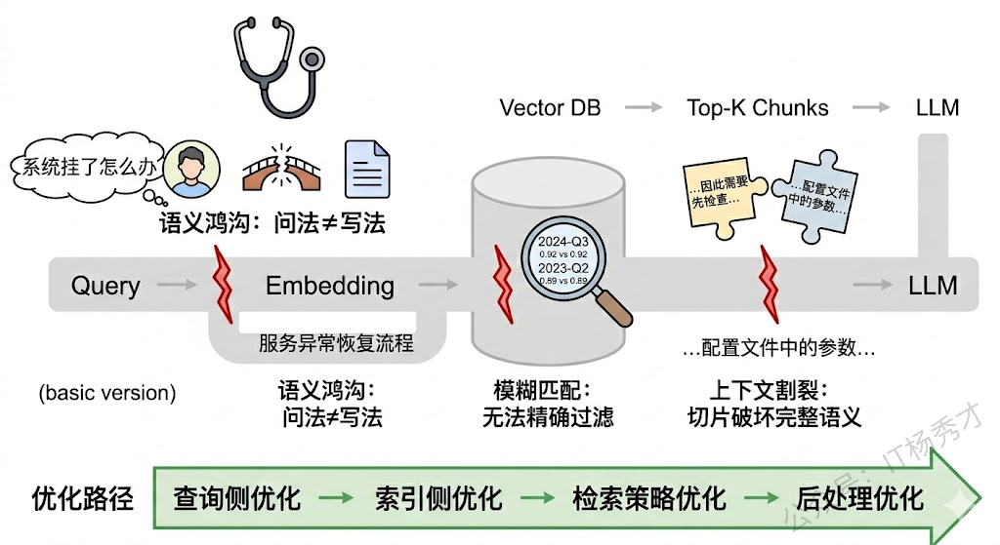



如果底层问题出在"查询表达不清、切块不合理、候选噪声太多"，那么单纯调大 `Top-K` 往往只会把更多噪声送进模型，而不是稳定提升效果。



### 📌 RAG 本身的局限性

一个成熟的系统不应该只讲优势而忽略局限。RAG 也有它的短板：

1. **检索质量是天花板**：RAG 的效果高度依赖检索的准确率——如果检索到的文本块和问题不相关甚至矛盾，**LLM** 会基于错误的上下文生成错误的答案，这有时会比没有 RAG 更危险（因为模型"有理有据地说错话"，用户更容易相信）。

2. **上下文窗口的瓶颈**：检索出来的文本块要塞进 **Prompt**，受限于 **LLM** 的上下文长度。虽然长上下文模型（128K 甚至更长）在一定程度上缓解了这个问题，但"长上下文 ≠ 好利用"—— **LLM** 对超长上下文中间部分的注意力会下降（**Lost in the Middle** 现象）。

3. **不擅长改变模型行为**：RAG 解决的是"知识获取"问题，而不是"行为模式"问题。如果想让模型学会一种新的推理风格或适应特定的输出格式，这些需要微调来解决。



实际上，**RAG 和微调最好的关系是互补而非互斥**。很多生产级系统中，两者是一起用的：先微调让模型具备领域专业能力和特定行为模式，再用 RAG 为它提供实时的、可更新的事实性知识。



---

## 🧩 索引阶段的优化

索引侧优化解决的核心问题是：**知识该如何被切分、编码、组织，才能在查询发生时被更准确地找出来。**

  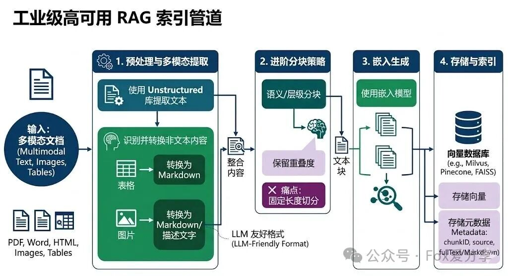

### ✂️ 选择合适的分块策略

#### 🎯 文本切块在 RAG 中的角色

RAG 的基本流程是：用户提问 → 检索相关文档片段 → 将片段拼入 **Prompt** → **LLM** 基于这些片段生成回答。而"切块"发生在更早的离线阶段——把原始文档切分成小片段，每个片段生成一个 **Embedding** 向量存入向量数据库。用户查询时，查询向量和这些片段向量做相似度匹配，找出最相关的 **Top-K** 片段。

这意味着切块质量直接决定了两件事：检索能不能找到对的片段，以及找到的片段能不能让 **LLM** 生成好的回答。切得不好，要么检索阶段就漏掉了关键信息，要么检索到了但片段内容残缺不全导致 **LLM** 无法正确理解。可以说，切块是 RAG 系统中"最不起眼但影响最深远"的环节——很多人花大量精力调 **Prompt**、换 **Embedding 模型**、调 **Top-K**，最后发现问题根源其实出在切块策略上。

分块的本质，是把原始长文本拆成若干个较小但语义相对完整的片段。每个片段通常控制在几百字到上千字之间，比如一个段落、若干段落，或者一个小节。

之所以要分块，主要有几个原因：

- **模型上下文长度有限**：长文本无法一次性完整送入模型，拆分后更容易被处理。
- **便于精准定位信息**：用户问题通常只关心文档中的某一小部分内容，分块后能更快检索到相关片段。
- **兼顾上下文与检索效率**：块太大，检索不精准；块太小，上下文可能断裂。合理分块能在效果和效率之间取得平衡。

所以，分块本质上就是把输入文档切成多个粒度可控的语义单元，方便后续的向量检索与生成模块高效协作。

  

#### ⚖️ Chunk Size 的权衡

从实战调优角度看，分块通常要同时考虑两个参数：**`chunk size`** 和 **`overlap`**。

- **块太小**：每个 **chunk** 的内容非常聚焦，大概率只包含一个知识点。这带来的好处是 **Embedding** 向量更精准地代表那个知识点，检索时更容易被"命中"——也就是检索精度（**Precision**）高。但问题也很明显：一个太小的 **chunk** 很可能缺少必要的上下文。比如原文是"该方法在实验中将准确率提升了 15%，但仅在数据量超过 10 万条时才有效"，如果从"但"字处切开，前半段 **chunk** 只说了"提升 15%"而丢失了限制条件，**LLM** 读到这个片段就可能给出一个过于乐观的回答。此外，小 **chunk** 意味着数量多，检索到的 **Top-K** 片段可能来自文档的不同角落，**LLM** 需要整合多个碎片化的信息，增加了理解难度和幻觉风险。

- **块太大**：每个 **chunk** 包含更丰富的上下文，语义完整性好，**LLM** 拿到后更容易理解和推理。但大 **chunk** 的 **Embedding** 向量不可避免地变成了多个知识点的"混合体"，一个向量要同时代表好几层含义，检索时就容易"模糊匹配"——用户问的是 A，但因为某个 **chunk** 里 A 和 B 混在一起，B 的部分也被捎带检索出来了，稀释了相关性。更实际的问题是，大 **chunk** 意味着每个片段占用更多的 **Prompt** 空间（即 **Context Window**），能放进去的片段数量就更少，可能导致召回率（**Recall**）不够。

  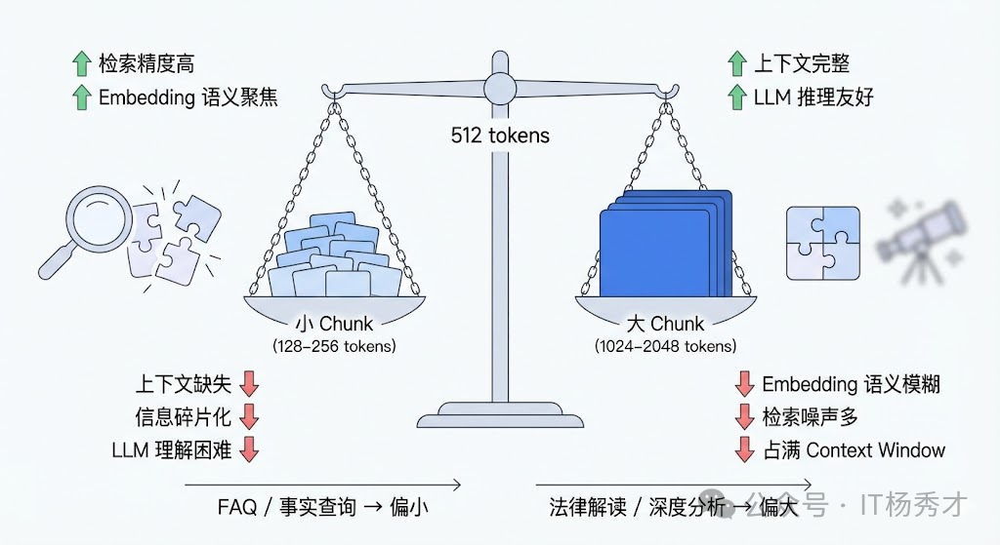

所以 chunk size 的选择不是一个固定的"最优值"，而是根据具体场景在这两极之间找平衡点。工程实践中的经验是：

- **FAQ、事实问答** 适合偏小的块，例如 `256 ~ 512 token`。因为答案往往在某一段话里，精准检索更重要
- **技术文档、法律条款、分析型内容** 更适合偏大的块，例如 `512 ~ 1024 token`。因为上下文完整性更关键。

#### 🔗 Overlap 的作用

`overlap` 的作用，则是缓解块边界处的信息断裂。想象一下，一段连贯的论述横跨了两个 **chunk** 的边界：前一个 **chunk** 的结尾讲了原因，后一个 **chunk** 的开头讲了结论。如果没有重叠，这两个 **chunk** 各自都是"半截话"——前一个有原因没结论，后一个有结论没原因。**Embedding** 分别编码后，两个向量都无法完整代表这段论述的含义，检索时就可能漏掉这条关键信息。此时两个向量都不够完整，召回质量会明显下降。

  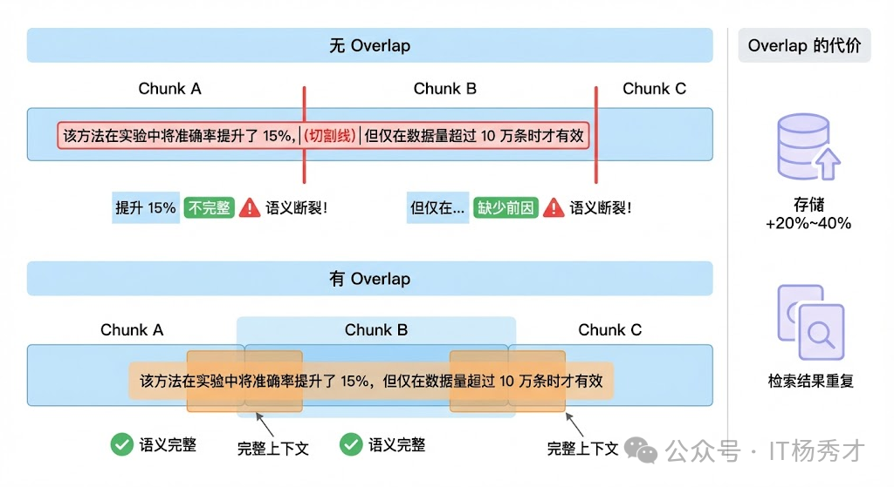

常见的经验值是 `overlap` 设为 `chunk size` 的 `10% ~ 25%`。比如 chunk size 是 512 token，overlap 可以设 50-128 token。过小起不到衔接作用，过大又会带来两个副作用：

- **存储膨胀**：同一段内容被重复编码多次。向量数据库的体积和索引成本显著增加
- **检索重复**：多个 **chunk** 包含大量相同内容，检索时可能返回一堆"长得差不多"的片段，浪费了宝贵的 **Top-K** 配额，等于你明明可以看到 5 条不同信息，结果其中 3 条都在重复同一段话。

#### 📋 常见的切块策略

##### 固定大小切块（**Fixed-size Chunking**）

最简单的方式——按 Chunk Size(假设为512 token) 一刀切，加 100 token 的 overlap。问题立刻暴露了：保险条款"第 3 条 保险责任：本保险承保……但以下情况除外：（1）战争……（2）核辐射……"被从"但以下情况除外"的地方截断，承保范围和免责条款分到了两个 Chunk 里。用户问免责相关的问题时，系统只召回了前半段（承保范围），给出了完全错误的答案。

在智能OnCall Agent项目中测试下来，固定长度切分的检索召回率只有 67%。

##### 语义切块（Semantic Chunking）

改用句号、问号等标点作为切分点，确保不在句子中间截断。不按固定 token 数切，而是按语义边界切。先把文本按句子分割，然后计算相邻句子之间的 **Embedding** 相似度，当相似度出现明显下降时（说明话题发生了转换），就在那里切一刀。这样每个 **chunk** 自然地对应一个完整的语义单元，不需要 **overlap** 来"缝合"了。

每个 Chunk 累积句子直到接近 512 token 上限。比 固定大小切块 好了一些，但还是有问题：列表项"（1）战争（2）核辐射（3）核爆炸"会被拆到不同 Chunk——每个列表项都是一个"句子"，但脱离了前面的"以下情况除外"就失去了语义。而且章节标题"第 3 条 保险责任"可能跟下面的正文被分开。

在智能OnCall Agent项目中测试下来，召回率提升到 74%。

##### 📑 基于文档结构的递归语义切分

利用文档自身的结构信息。Markdown 文档有标题层级，HTML 有标签结构，PDF 有段落和章节。按这些天然边界来切块，既简单又有效。这种方法特别适合结构化程度高的文档，例如技术文档、产品手册、法律合同等。

先识别文档结构（章节标题、子标题、段落、表格、图片），然后按语义单元切分——一个章节就是一个 Chunk（如果不超长的话），表格整块保留，列表项跟前导句合并。超长的章节再递归按子标题或段落切分。

- **识别文档层级结构**：先理解文档结构，再决定在哪切
  - 按结构化文档标题划分，例如Markdown 的二级标题（`##`）切，每个 **chunk** 就是一个完整的章节，语义自然完整。
  - 正则匹配常见编号模式

- **按语义单元切分**：识别出层级结构后，切分逻辑变成了递归
  - 如果一个章节的 token 数 ≤ Chunk Size ，整个章节作为一个 Chunk，不切。
  - 如果超过 Chunk Size，看有没有子标题。有的话按子标题切分，每个子章节再递归判断。
  - 如果没有子标题，按段落累积——段落逐个加入，直到接近 Chunk Size token 就封一个 Chunk。
  - 如果单个段落就超过 Chunk Size（极端情况），最后才按句子边界切分。
  - 表格和代码块作为不可拆分单元——无论多长，不在中间截断。如果单个表格超过 Chunk Size token，单独作为一个 Chunk。

- **语义完整性检查**：切完之后不是直接用，还要做一轮检查——相邻的两个 Chunk 之间是不是被错误地断开了。
  - chunk 以冒号结尾 → 后面大概率是列表
  - chunk 是列表项编号开头
  - chunk 以转折词开头

- **动态 Overlap**：基于句子边界的 overlap，找到前一个 Chunk 末尾最近的句号位置，从那之后开始 overlap。这样每个 Chunk 的 overlap 部分都是完整的句子。

- **特殊元素处理**
  - 表格：不能直接整块保留，小表格直接整块作为一个 Chunk。对于远超 Chunk 上限的大表格，如果表格有分组（比如"基本责任""可选责任"两组），按分组切分，每组带上完整表头。如果没有分组，按固定行数切分，但每个 Chunk 都复制表头。
  - 图片：不能直接丢掉，利用多模态模型，流程图和示意图生成文本描述，描述作为 Chunk 入库，数据图表提取结构化数据

- **Chunk 的元数据设计**：Chunk 不只是一段文本。每个 Chunk 都应该带上丰富的元数据，这些元数据在检索和展示时都有用

#### 💡 实战调优的步骤

1. **先看数据**：在动手切之前，先抽样看看原始文档长什么样——平均段落长度、内容结构化程度、信息密度。技术文档和闲聊记录显然需要完全不同的策略。

2. **建立评估闭环**：准备一组有标准答案的测试问题，跑一轮 RAG 看效果，调整参数后再跑一轮对比。核心指标有两个：检索召回率（相关片段有没有被检索到）和生成准确率（最终回答对不对）。很多时候你会发现检索层面已经召回了正确片段，但因为 **chunk** 太碎导致 **LLM** 无法正确理解，这就是切块的锅。

3. **考虑多级索引**：不只存一种粒度的 **chunk**，而是同时维护多个层级：比如用小 **chunk**（256 token）做精准检索，命中后把对应的大 **chunk**（1024 token）或原始段落送给 **LLM**。**LlamaIndex** 中的 `SentenceWindowNodeParser` 和 `HierarchicalNodeParser` 就是这个思路的实现。

4. **匹配 Embedding 模型能力**：不同 **Embedding 模型** 的最佳输入长度不同——有些模型在短文本上表现更好，有些模型专门针对长文本优化（如 **jina-embeddings-v2** 支持 8192 token）。如果你用的是一个短文本模型却切了很大的 **chunk**，**Embedding** 质量会明显下降。

如果文档结构比较稳定，更进一步的做法是结合 **语义切块、按标题分块、递归分块**，甚至引入 **多级索引**。例如用小块做精确召回，命中后再回溯父块或原始段落给模型，这样检索和生成两端都能拿到更合适的粒度。

### 🗃️ 设计合理的索引架构

  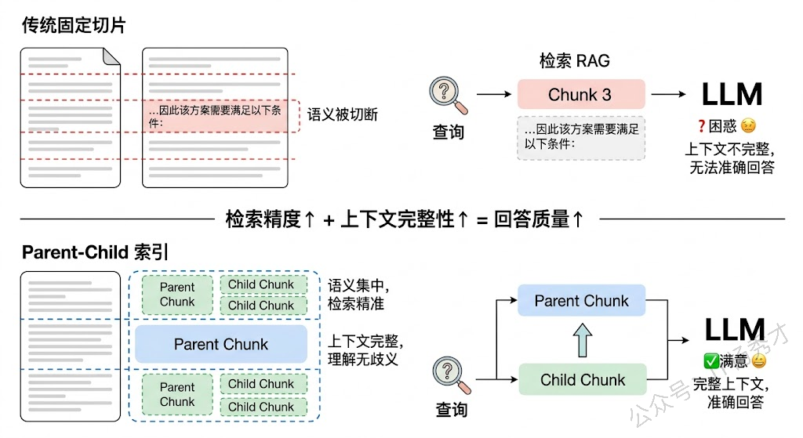

#### 🕸️ Parent-Child 索引

**Parent-Child 索引**是一种非常实用的索引架构。核心思想是：用小 `chunk` 做检索，但返回大 `chunk` 给 **LLM**。具体来说，先把文档切成较大的 `chunk`（比如 `2000 token`），再把每个大 `chunk` 进一步切成小的子 `chunk`（比如 `200 token`）。检索时用小 `chunk` 的向量做匹配，小 `chunk` 语义集中，匹配更精准；命中后，返回它所属的父级大 `chunk` 给 **LLM**，大 `chunk` 上下文完整，**LLM** 能更好地理解和利用。这种设计同时兼顾了检索精度和上下文完整性，在实际项目中效果很好。

#### 📄 文档摘要索引

对于每篇文档，先用 **LLM** 生成一段摘要，把摘要也做向量化存入索引。检索时，除了匹配原文 `chunk`，还会匹配摘要。摘要天然是对全文内容的高度凝练，很多时候用户的查询和摘要的匹配度反而比和原文碎片的匹配度更高。命中摘要后，再定位到对应的原文段落，返回详细内容。这种"先粗后细"的两级检索在处理长文档时特别有效。

#### 🏗️ 多层级索引

**多层级索引** 不只是文档-chunk 两层，而是构建多层级的索引结构——比如**"领域 → 主题 → 文档 → 段落"**。查询时先在高层级（如领域、主题）做粗筛，快速定位相关范围，再在低层级（如段落）做精确匹配。这种分层策略在文档量很大（数十万篇以上）时优势明显，因为它避免了在全量向量中做暴力搜索，大幅减少检索范围的同时提高了匹配准确率。

### 🧠 选取合适的嵌入模型

如果说分块决定了"知识被切成什么样"，那么 **Embedding 模型** 决定的就是"这些知识被表示成什么样"。两者共同决定了检索上限。

#### 🔬 Embedding 模型的角色

在 **RAG**、语义搜索、推荐系统、文档聚类等场景中，**Embedding 模型**是连接"自然语言"和"数学空间"的桥梁。它把一段文字转化为一个高维向量，使得语义相近的文本在向量空间中彼此靠近，语义不同的文本彼此远离。桥梁质量越高，后续检索、重排、生成的上限就越高。

这个"桥梁"的质量直接决定了下游任务的天花板。以 **RAG** 为例，如果 **Embedding 模型**不能准确捕捉查询和文档之间的语义关系，那么即使你的 **LLM** 再强大、**Prompt** 写得再好，也无法弥补检索阶段的信息缺失，这就是业界常说的 **Garbage In, Garbage Out**。所以选好 **Embedding 模型**是整个系统的地基，地基不稳，上层建筑再精美也没用。

  

#### 📊 选型时的核心因素

选择嵌入模型时，通常需要重点考虑以下因素：

- **语义准确性**：模型能否准确捕捉长句、上下文关系和同义表达，直接影响检索质量。
- **模型效率**：推理速度、显存占用和部署成本是否满足业务要求。
- **领域适配性**：是否对医疗、金融、法律等垂直领域做过优化，能否理解专业术语。
- **多语言支持**：是否覆盖业务需要的语言，以及跨语言语义对齐能力是否足够。
- **数据规模匹配**：模型大小与训练数据规模是否匹配当前业务复杂度。

除了上面这些通用因素，真正做选型时还要额外注意 4 个问题：

- **任务类型匹配度**：**Embedding 模型**的训练目标不同，擅长的任务也不同。有些模型是为语义相似度（**Semantic Textual Similarity**）优化的，擅长判断两段文本说的是不是同一件事；有些是为检索（**Retrieval**）优化的，擅长从一堆候选文档中找出和查询最相关的那几篇；还有些是为聚类或分类任务优化的。在 **RAG** 场景中，你需要的核心能力是检索，那就应该优先选在检索任务上表现好的模型，而不是在句子相似度任务上跑分最高的任务。**MTEB 排行榜（Massive Text Embedding Benchmark）**之所以有价值，就是因为它把不同任务类型拆开评估，你可以针对自己的任务类型去看对应的分数。

- **语言和领域匹配度**：这一点在国内场景尤为关键。很多在英文上表现优秀的模型，在中文上的效果可能大打折扣。如果你的业务场景是中文为主，就必须选在中文数据上训练过或专门针对中文优化过的模型，比如 **BGE（BAAI General Embedding）** 系列、**M3E**、**Cohere** 的多语言模型等。更进一步，如果是垂直领域（如医疗、法律、金融），通用模型的效果往往不够好，因为这些领域有大量专业术语和特定的语义关系，通用训练数据中覆盖不足。这时候要么选在该领域数据上微调过的模型，要么自己基于开源模型做领域微调。

- **是否支持非对称检索**：对称检索指的是查询和文档在形式上是相似的（比如两个句子比较相似度），非对称检索指的是查询和文档形式不同（比如一个短问题去检索一篇长文档）。RAG 场景几乎都是非对称检索——用户的查询通常是一句简短的问题，而候选文档是完整的段落甚至文章。有些模型专门为非对称检索做了优化（比如在训练时使用了 query-document 对，并且对 query 和 document 分别使用不同的前缀指令），在这种场景下效果会明显好于对称模型。**E5** 系列和 **BGE** 系列都支持通过 instruction prefix 来区分 query 和 passage，实际测试中这个小技巧对检索效果的提升不可忽视。

- **向量维度与成本的平衡**：维度越高，表达能力通常更强，但索引体积、检索延迟和内存占用也会同步增加。选型不能只看效果，还要考虑实际部署时的约束。API 调用模型（如 **OpenAI**、**Cohere**）使用方便但有持续成本，且数据要发送到第三方；开源模型（如 **BGE**、**E5**、**GTE**）可以自部署，数据不出域，但需要 GPU 资源和运维能力。在实际项目中，还需要考虑模型的推理速度（高并发下能不能扛住）、最大输入长度（你的文档分块策略和模型的 max_tokens 是否匹配）、以及是否支持批量推理等工程细节。

  

一些典型取舍如下：

- **轻量模型**：如 **MiniLM**、**DistilBERT**，速度快，更适合在线问答。
- **重型模型**：如 **BERT-large** 或更大的 Embedding 模型，表达能力强，更适合离线批处理。
- **领域模型或微调方案**：适合对专业术语理解要求较高的场景，也可以通过 **LoRA** 等方式做轻量适配。

#### 📐 评估 Embedding 模型的核心指标

选好了候选模型之后，还需要做评估。

检索类指标是 RAG 场景下最重要的一组。常用的包括：

- **Recall@K（召回率）**：在 Top-K 个检索结果中，有多少个是真正相关的文档。比如 Recall@10 = 0.8 意味着前 10 条检索结果覆盖了 80% 的相关文档。这个指标直接衡量"该找到的有没有找到"，是检索系统最基础的生命线。

- **MRR（Mean Reciprocal Rank，平均倒数排名）**：第一个相关文档出现在第几位的倒数的均值。如果第一个相关结果排在第 1 位，MRR 贡献 1；排在第 2 位，贡献 0.5；排在第 3 位，贡献 0.33。MRR 反映的是"用户不想翻页，最相关的结果能不能排在最前面"。

- **NDCG@K（Normalized Discounted Cumulative Gain，归一化折损累积增益）**：这是最全面的排序指标，它不仅考虑相关文档有没有被检索到，还考虑相关程度更高的文档是否排在更前面。NDCG 的"折损"机制给排在前面的结果更高的权重，越往后权重衰减越快，这和用户的实际行为是吻合的——没人会翻到第 50 页去找答案。

- **MAP（Mean Average Precision，平均精度均值）**：对每个查询计算 Precision 在不同召回点的平均值，再对所有查询求均值。它综合衡量了检索结果的精确度和排序质量。

  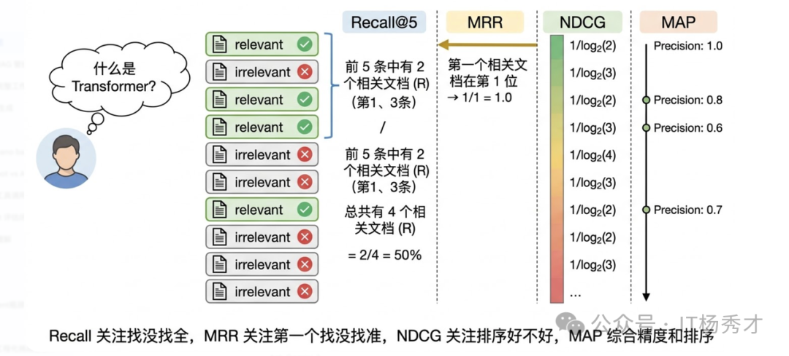

公开基准里最常见的是 **MTEB（Massive Text Embedding Benchmark）**。它很适合拿来做候选筛选。第一，总分不能直接拿来做选型依据，因为总分是各任务的平均，一个在检索上表现一般但在聚类上特别好的模型，总分可能和一个检索很强但聚类一般的模型差不多。你需要看和你业务场景对应的那个任务类型的子分数。第二，排行榜上的数据集和你的真实数据分布可能差异很大。一个在 MTEB 英文检索任务上排名第一的模型，在你的中文法律文档检索场景下可能排不进前五。所以 MTEB 是选候选模型的起点，不是终点——最终必须在你自己的数据上做评估。

更稳妥的做法通常是：先在 MTEB 或同类榜单里筛出 3 到 5 个候选模型，再在自己的标注数据上跑一轮 Recall、NDCG 和线上 A/B 验证。

  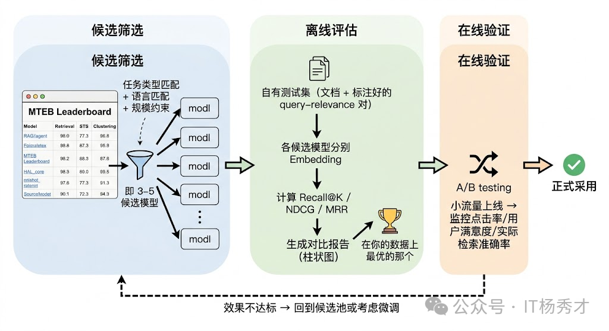

#### 🔧 工程实践考量

在实际项目中，除了模型效果本身，还有一些工程因素对选型影响很大。

- **推理性能和吞吐量**：**推理性能和吞吐量**直接影响系统的可用性。如果你的场景是实时检索（用户提交查询后毫秒级返回结果），那 Embedding 模型的推理延迟就是硬约束。一般来说，参数量越小、向量维度越低的模型推理越快。在高并发场景下，还需要考虑模型是否支持高效的批量推理和 GPU 加速。ONNX Runtime 和 TensorRT 等推理优化工具可以显著提升吞吐。

- **最大输入长度**：**最大输入长度**是另一个经常被忽视的因素。不同模型支持的最大 token 数差异很大——有些模型只支持 512 tokens，有些支持 8192 甚至更长。这直接影响你的文档分块策略：如果模型只支持 512 tokens 但你的文档块平均 1000 tokens，超出部分就会被截断，等于你精心设计的分块策略白费了一半。反过来，如果模型支持很长的输入，你就有机会使用更大的块来保留更完整的上下文语义，这对于检索质量的提升有时是决定性的。

- **Matryoshka**：**Matryoshka**是近期一个很值得关注的技术。传统模型生成固定维度的向量，而 Matryoshka Embedding 允许你在推理后截取前 N 维作为压缩向量使用，不同维度下的效果会渐进衰减但不会断崖式下降。OpenAI 的 text-embedding-3 系列和 Nomic 的 nomic-embed-text 就支持这个特性。它的工程价值在于你可以在同一个模型上灵活调节"效果-成本"的平衡——存储紧张时用低维向量，追求效果时用全维向量。

#### 🔍 综合考量

选择 Embedding 模型需要从多个维度综合考量，不能简单看排行榜选分数最高的。首先要匹配任务类型，RAG 场景下应该重点看模型在检索任务上的表现而不是看综合总分，MTEB 排行榜把任务拆得很细，可以针对性地看。其次是语言和领域匹配，中文场景下 BGE、M3E 这类专门做过中文优化的模型通常比纯英文模型效果好很多，垂直领域如果通用模型效果不够还需要做领域微调。第三要关注对称和非对称检索的区别，RAG 是典型的短查询检索长文档的非对称场景，BGE 和 E5 都支持通过 query/passage 前缀来优化这种场景，这个细节在实际中对效果影响很大。工程层面还要考虑向量维度带来的存储和计算成本、模型支持的最大输入长度是否和分块策略匹配、以及推理吞吐能否满足在线服务的延迟要求。

评估指标方面，检索场景最核心的是 Recall@K、MRR、NDCG@K 和 MAP 这几个。Recall 衡量能不能找全，MRR 衡量第一个相关结果排得准不准，NDCG 综合衡量排序质量，MAP 则综合了精确度和排序。语义相似度任务主要看 Spearman 相关系数。但最关键的一点是，公开基准上的分数只能用来初筛候选，最终一定要在自己的真实数据上做评估，因为 MTEB 的数据分布和你的业务数据可能差异很大。在实际项目中，我的做法是先从 MTEB 筛出 3-5 个候选，然后在自有标注数据上跑 Recall 和 NDCG 做离线对比，最优的模型再通过 A/B 测试在线验证，确认效果后才正式采用。

## 🔬 检索阶段的优化

检索侧优化解决的核心问题是：**如何在海量候选内容里，把最值得送进模型的那一小部分上下文尽可能稳定地找出来。**

### 🔦 查询阶段优化

很多时候检索质量差，根源并不在检索引擎，而在用户查询本身。用户的提问可能太模糊、太口语化，或者把多个子问题混在一起。如果能在检索之前先把查询"加工"一下，效果往往会明显提升。

查询侧最常见的做法包括：

- **Query Rewriting**：把口语化、模糊化的问题改写成更适合检索的表达。
- **HyDE**：先让模型生成一段"假想答案"，再用这段答案的向量去检索，缩小查询和文档之间的表达鸿沟。
- **Multi-Query**：从多个角度生成查询变体，合并结果以提高召回率。
- **Sub-Question Decomposition**：把复杂问题拆成多个子问题分别检索，再汇总回答。

  

### 📌 粗排阶段优化

#### 🔽 元数据过滤

元数据过滤是一个经常被忽视、但非常实用的在粗排阶段的检索增强手段。它的做法是在向量检索之前或之后，利用文档的元数据（如时间、来源、类别、作者、权限范围）做预过滤。

例如用户问"最新的产品定价策略"，可以先用元数据过滤出最近 3 个月的文档，再在这个子集内做向量检索。这样有两个直接好处：

- **准确率更高**：先把明显不可能相关的数据排除掉。
- **检索成本更低**：缩小候选集合后，召回与精排压力都会下降。

元数据过滤对"**精确条件 + 语义理解**"的混合型查询尤其有效，而现实业务中的问题，大多都属于这一类。

#### 🔀 混合检索与多路召回

单纯的 **向量检索** 再怎么优化，也有它的能力天花板，因为 **Embedding 模型**本身就有局限。真正在生产环境中效果好的方案，几乎都不是只用向量检索，而是混合多种检索方式。

**Hybrid Search（混合检索）** 是目前工业界最常见的方案。它会同时使用**稀疏检索**（如 **BM25**）和**稠密检索**（向量检索），再通过融合策略合并结果。之所以有效，是因为两种检索方式的能力边界刚好互补：

- **稠密检索** 擅长理解语义，例如"汽车"和"轿车"字面不同，但向量距离可能很近。
- **稀疏检索** 擅长精确关键词匹配，例如查询 `GPT-4o` 时，不容易把 `GPT-3.5` 的结果混进来。

**Rank Fusion** 指的是对初步召回的候选文档做融合排序，将候选池合并，以提高召回率和准确性。

其中最常见的方法是 **Reciprocal Rank Fusion（RRF）**。它的逻辑很直接：分别根据候选文档在多路结果中的排名计算得分，再把这些得分加总为最终分数。

$$\text{RRF\_score}(d) = \sum_{i=1}^{N} \frac{1}{k + \text{rank}_i(d)}$$

对于文档 $d$，遍历所有检索列表，找到它在每个列表中的排名 $\text{rank}_i$，然后把 $\frac{1}{k + \text{rank}_i}$ 加起来。

$k$ 值控制的是高排名文档的优势大小。
假设 k=0，排名第一的文档得 1/1=1.0，排名第二的得 1/2=0.5，排名第十的得 1/10=0.1。排名第一和排名第二的分数差距是 0.5。
假设 k=60，排名第一的文档得 1/61≈0.0164，排名第二的得 1/62≈0.0161，排名第十的得 1/70≈0.0143。排名第一和排名第二的分数差距只有 0.0003。
k 越大，各个排名之间的分数差距越小，排名靠前的文档优势越弱，融合结果越"平均主义"。k 越小，高排名文档的优势越大。

k=60 来自 Cormack 等人 2009 年发表的论文《Reciprocal Rank Fusion outperforms Condorcet and individual Rank Learning Methods》。他们在 TREC 评测数据集上做了系统的实验，扫描了 k 从 1 到 100 的不同取值，发现 k=60 在多数场景下能达到最优或接近最优的融合效果。

**RRF** 的优势在于：

- **不依赖分数归一化**：BM25 与余弦相似度分数不在同一量纲，直接混合容易失真。
- **工程实现简单**：按排名融合更稳健，落地成本低。
- **兼容多路召回**：不仅能融合两路，也能扩展到多路检索结果。

另外，还有 **Reciprocal Rank Fusion（RRF）** 的变体，如 **Weighted Rank Fusion**（加权 RRF），它会根据不同路检索结果的权重，动态调整最终分数。如果语料较小或领域固定，我们会偏重稀疏检索；如果语料量大、问法多样，就增加密集权重。一般向量权重 0.3、文本权重 0.7 是一个不错的起点。

- **Reciprocal Rank Fusion（RRF）**：按排名融合，不依赖分数归一化。
- **Weighted Rank Fusion（加权 RRF）**：根据不同路检索结果的权重，动态调整最终分数。

**Elasticsearch 8.x** 以及很多向量数据库（如 **Weaviate**、**Qdrant**）都已经对混合检索提供了原生支持。

  

### 🎯 精排阶段优化

#### 🔄 Rerank 重排序

前面检索阶段的 **Rank Fusion**，其目标通常是**在海量文档中快速筛出一批大致相关的候选结果**，所以它更偏向效率，准确性不是最高。**Rerank** 则会在这批候选结果上继续精排，挑出最匹配的问题上下文，再交给大模型使用。

典型流程是：先用**向量检索**做粗召回（比如返回 **top-20**），再用专门的 **`Cross-Encoder`** 重排序模型对这 20 个结果逐一精排，重新排序后取 **top-5** 送给 **LLM**。

它的典型流程如下：

- **生成候选文档**：先通过前面的检索得到一批候选结果。
- **执行重排序**：使用 **Rerank** 模型对候选结果重新计算匹配得分，进行精排。
- **选取 Top-K**：保留最相关的若干条结果，作为最终生成阶段的输入。

它之所以有效，是因为向量检索和重排序本质上是两种不同架构：

- **向量检索**使用的是 **Bi-Encoder**：也就是双编码器，Query和Document分别独立地编码成向量，再做相似度计算。
  - 优点是快，文档向量可以提前算好存进向量数据库，线上只需要算一次 Query 向量，然后做一次近似最近邻（ANN）搜索，毫秒级就能从百万级文档中捞出 Top-K，适合大规模召回。
  - 缺点是Query 和 Document 在编码时完全看不到对方，模型看不到它们的细粒度关联。模型把查询和文档「分别」处理的。模型在编码一篇文档的时候，根本不知道用户会问什么问题。所以它只能生成一个「泛化的、平均化的」语义向量，无法针对具体的查询做优化。
    - 信息压缩损失。就好比你用一句话来总结一篇论文，再精彩的总结也不可能把每个细节都留住。Embedding 也是一样，一段几百字的文本被压缩成一串数字，那些细微但关键的信息可能就丢了。
    - 缺乏查询意图感知。文档的向量是在索引阶段就预先计算好的，那时候根本不知道用户会问什么。所以同一篇文档的向量，不管用户是在问事实、做对比分析还是查步骤说明，都是完全一样的，没法根据不同的问题做出针对性的判断。

- **Reranker** 使用的是 **Cross-Encoder**：也就是交叉编码器，把查询和文档拼接后一起送进模型，模型能逐 `token` 地分析查询和文档之间的交叉关系，自然能更准确地判断相关性。优点是准，适合小规模精排。代价是慢（每对 **`query-doc`** 都要过一遍模型），所以只能用在候选量较小的重排阶段。

  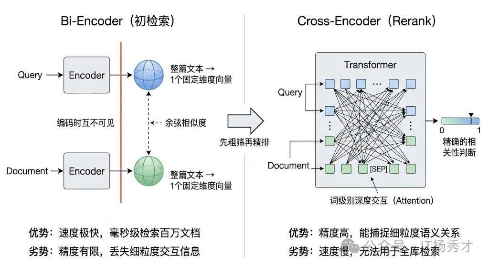

这就是 **RAG** 里常见的"**粗召回 + 精重排**"两阶段架构。第一阶段用速度快但精度一般的 **Bi-Encoder** 做大范围召回，第二阶段用精度高但速度慢的 **Cross-Encoder** 做小范围精排。这个架构在搜索引擎和推荐系统中已经用了很多年，移植到 **RAG** 中同样非常有效。常用的 **Reranker** 模型包括 **Cohere Rerank**、**bge-reranker**，以及基于 **cross-encoder** 架构的各类模型。

  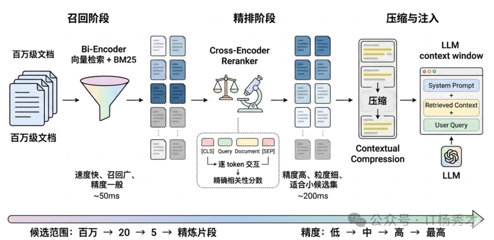

  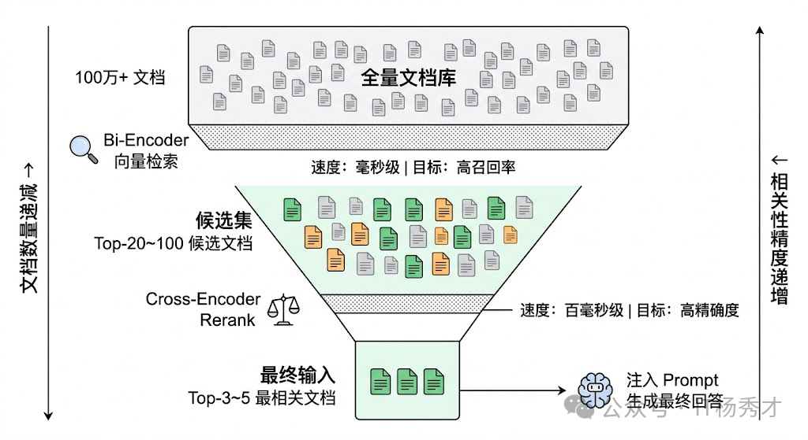

## 🔧 增强阶段的优化

检索完成后，还有一个重要的优化环节，就是**后处理**。它的核心价值在于：将召回到的候选内容整理成大模型可以直接利用的上下文，最终构造成适合输入给模型的 Prompt，使模型能够在更充分、更准确的上下文中完成回答。

### 💾 Contextual Compression 上下文压缩

**Contextual Compression（上下文压缩）** 是一种常见的增强阶段的优化策略。检索回来的 `chunk` 里，往往会有大量和查询无关的"水分"。例如一个 **`500 token`** 的 `chunk` 中，真正与问题强相关的内容可能只有两三句话。

上下文压缩的思路，就是用 **LLM** 或专门的提取模型，把每个 `chunk` 中与查询相关的核心信息提取出来，压缩成更精炼的片段。这样做的价值很明确：

- **减少输入 `token` 数量**，从而降低生成成本。
- **减少无关信息干扰**，提高回答稳定性。
- **让上下文利用率更高**，把宝贵的上下文窗口留给真正重要的信息。

**LangChain** 的 `ContextualCompressionRetriever` 就提供了开箱即用的实现。

### 📝 提示词优化

**提示词（Prompt）** 是 RAG 系统的最后一道防线，检索把对的文档找回来，**提示词（Prompt）** 决定模型用不用这些文档。把RAG Prompt 当成普通 Prompt 来写，这是根本性的认知错误。

- **普通 LLM Prompt** 的逻辑：你问一个问题，模型用自己训练时积累的参数知识来回答。模型的知识边界就是答案边界，这是完全合理的设计。
- **RAG Prompt** 的逻辑完全不同：你传进去问题 + 检索到的文档片段，要求模型只用这些文档片段来回答，不能用参数知识。

这里有一个根本性的矛盾：LLM 在预训练阶段见过海量文本，脑子里已经存了大量知识。当你给它一段检索文档，问它问题，它的默认行为是：把检索文档的信息和自己的参数知识混合使用。这个混合，就是幻觉的来源。

  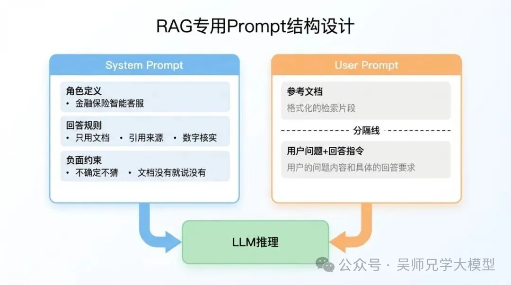

RAG Prompt 的核心任务是切断模型对参数知识的依赖，强制它只从检索文档里找答案。高质量的 **提示词（Prompt）** 设计，可以显著提升 **RAG** 的最终效果。

#### System Prompt

System Prompt 是整个 RAG Prompt 架构的基础层，它做三件事：定义角色、设置规则、写明负面约束。

- **明确角色与任务**：清晰说明模型身份、能力边界与回答目标，例如要求模型只能基于提供资料作答。
- **结构化组织输入**：将提示拆成"背景 + 问题 + 输出格式"之类的清晰结构。
- **加入上下文约束**：明确禁止模型脱离检索内容自由发挥，减少幻觉。这把推理空间大幅压缩，强迫模型找原文，而不是推断。
- **设置兜底机制**：如果没有检索到相关资料，就要求模型明确返回"未找到相关内容"。很多初级写法里没有这条，导致模型在文档信息不足时，会悄悄调用参数知识来"补全"答案，这正是幻觉的高发场景。鼓励承认不确定
- **引用要求**：强制引用来源，格式是 `[来源：文档名称第X页]`，这条规则的效果在后面的数据对比里你会看到。它的原理是：模型要写出引用，必须真的在文档里找到对应内容。如果文档里没有，它无法凭空捏造一个引用（当然极少数情况也会捏造，但概率大幅下降）。引用要求本质上是给模型增加了一个"验证步骤"，它必须先找到原文，再写回答。

#### User Prompt

System Prompt 设好了基础规则，User Prompt 负责把每次请求的具体内容传进去：检索到的文档片段 + 用户问题。

- **每段文档标了编号和来源**：参考文档1（来自：XX产品条款第3页）这样的格式，让模型在引用时有依据，不用自己猜来源名称。
- **文档之间用双换行分隔**：这比单换行更清晰，减少文档边界模糊带来的混淆。
- **问题放在文档后面，不放在前面**：这个顺序是有讲究的。大量实验表明，先文档后问题的顺序，比先问题后文档的顺序，幻觉率更低。原因可能是：先文档让模型先把上下文"读进去"，再看问题时有了基础，而先问题可能激活模型的参数知识，导致后续处理文档时仍受参数知识干扰。
- **Few-shot 示例引导**：在 Prompt 中加入 1-2 个示例问答对，示范"如何根据给定资料回答并引用来源"。模型看到示例中有根据资料回答且标注了 [1]、[2] 这样的引用，就更可能模仿这个模式，而不是自由发挥。
- **结尾的指令再次重申了"基于文档"和"没有就说没有"**：System Prompt 的规则有时候在长上下文中会被稀释，User Prompt 末尾再提一次，起到强化作用。

---

## ⚙️ 工程实现上的优化

### 首字响应速度(Time to First Token, TTFT)

首字响应速度的定义是：从提问到看到第一个字的时间。

  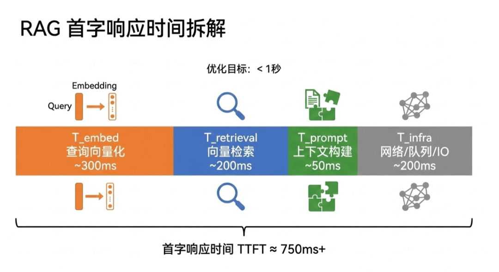

T_total = T_embed(query) + T_retrieval + T_prompt_build + T_infra_overhead

总延迟 = 查询向量化时间 + 向量检索时间 + 上下文构建时间 + 基础设施开销（网络/队列/IO）。

##### ⚙️ Embedding 阶段

- **批量请求**：通常 Embedding 接口支持一次传入多个文本。如果你的系统需要同时给 query 和多个子查询（比如 query 扩写生成的变体）算 Embedding，别逐条发请求，把它们打包成一个数组一次性调用。这样几条文本的 Embedding 只需要一次网络往返，而不是 N 次。需要注意单次请求的 token 上限（约 8192 tokens），超出就拆批次。

- **异步并发**：使用异步调用，在等一个 Embedding 返回的时候可以并行发起其他请求。但并发数不能太高——OpenAI 有限流策略，经验上控制在 5-10 个并发比较稳妥，配合指数退避重试来应对 429 错误。

- **缓存 Embedding**：这是效果最立竿见影的。用 Redis 做一层缓存，key 是 query 字符串的哈希，value 是对应的向量。用户问过"车险理赔流程"，下次再问同样的问题直接从缓存拿向量，完全跳过 API 调用，延迟从 300ms 降到 1ms 级别。

- **对于文档语料的 Embedding**：一定要在离线阶段预先算好存入向量库，绝不能在查询时现算。

##### 🔍 向量检索阶段

**HNSW 索引**是目前的最优选择。在百万级向量数据上，HNSW 能把查询延迟压到毫秒级，同时保持很高的召回率。Milvus 官方也推荐在需要高性能检索时优先使用 HNSW。关键参数有两个：

- **efConstruction**：建索引时的参数，越大索引质量越高但建索引越慢。一般设 128 就够了，这是一次性开销。
- **efSearch**：查询时的参数，越大召回越全但查询越慢。根据场景调，64 是一个不错的起点，如果对召回率要求特别高可以往上加。

此外还有以下策略：

- **分区检索**：如果你的知识库有明确的分类（比如按部门、按文档类型），把向量集合按属性切分成分区（Partition），查询时指定相应分区检索，避免全库扫描。比如用户问报销制度，直接在"财务制度"分区里检索，速度和准确率都能提升。

- **多副本负载均衡**：Milvus 支持在 Collection.load() 时设置 replica_number。比如设成 4，查询负载就能分摊到 4 个 Query Node 上，QPS 上限显著提高。当然前提是你有足够的机器资源。

- **内存加载**：这是一个容易忽略的点——确保在查询前调用了 collection.load()，把数据加载到内存。如果数据还在磁盘上，每次查询都要走磁盘 IO，延迟会高一个数量级。

##### 🏗️ 系统架构

**全链路异步流水线**是最核心的思路。一次 RAG 请求的流程是：Embedding → 检索 → 构建 Prompt → LLM 流式生成。这四步对于单个请求来说是顺序依赖的，但系统层面可以做很多文章。

- **把整个链路变成异步的**：Embedding 调 API 是 IO 密集型操作，等待返回的时候 CPU 是空闲的，可以同时处理其他用户的请求。检索同理。这样虽然单个请求的延迟没变，但系统的吞吐量（QPS）大幅提升。

- **对于高并发场景**：可以引入任务队列（RabbitMQ、Kafka）。把请求积攒一小批，统一做 Embedding 或检索，摊薄单次开销。同时部署多实例 LLM 服务做负载均衡，避免单点瓶颈。

  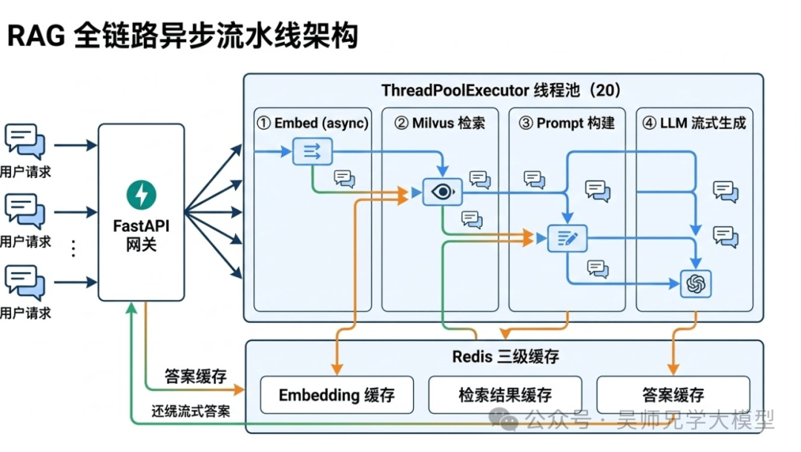

同时也可以设计三级缓存架构：

- **Embedding 缓存**：缓存 query 到向量的映射。TTL 可以设长一些（比如 30 天），因为同一段文本的 Embedding 结果是固定的。对于文档语料的 Embedding 更是如此，离线算好永久存储即可。

- **检索结果缓存**：缓存 query 到召回文档列表的映射。如果知识库内容相对稳定（比如公司制度文档不会天天改），TTL 设 1 天没问题。知识库更新时主动清除相关缓存。这层缓存命中后可以跳过整个 Embedding + Milvus 检索流程，省下 500ms 左右。

- **答案缓存**：缓存 query 到最终回答文本的映射。这层只适合 FAQ 型的高频问题——同一个问题的答案是固定的，直接返回缓存答案，实现近乎零延迟。TTL 根据内容时效性来定，FAQ 类可以设 7 天，涉及实时数据的（新闻、股价）就不适合缓存。

三级缓存的命中逻辑是：先查答案缓存（命中直接返回）→ 再查检索缓存（命中跳过 Embedding 和检索）→ 最后查 Embedding 缓存（命中跳过 Embedding 计算）→ 全部未命中才走完整链路。

## ✅ 小结

**RAG** 的核心价值，不是简单地"给大模型加个数据库"，而是通过 **检索能力 + 上下文增强 + 生成能力** 的协同，解决大模型在知识实时性、准确性和可控性上的不足。

如果从工程视角来看，RAG 的效果往往取决于三个关键点：

- **索引是否合理**：文档切分与向量化质量决定了知识底座的可用性。
- **检索是否精准**：召回策略与重排序决定了模型能看到什么信息。
- **生成是否可控**：提示词设计与上下文约束决定了最终答案的稳定性。

  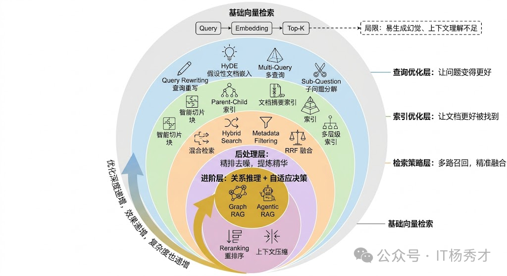

如果继续往进阶方向走，还会逐步接触到 **Graph RAG** 和 **Agentic RAG**。前者强调把实体关系也纳入检索，补足跨文档关系推理；后者强调让 Agent 根据问题复杂度动态决定是否检索、检索几轮、用哪种召回策略。它们本质上都在做同一件事：让 RAG 从"能检索"进化到"会检索、会取舍、会组织上下文"。 



如果要把这篇文章压缩成一条工程建议，可以记住这个顺序：**先把索引质量打牢，再优化召回策略，最后做重排和上下文组织。**



  

