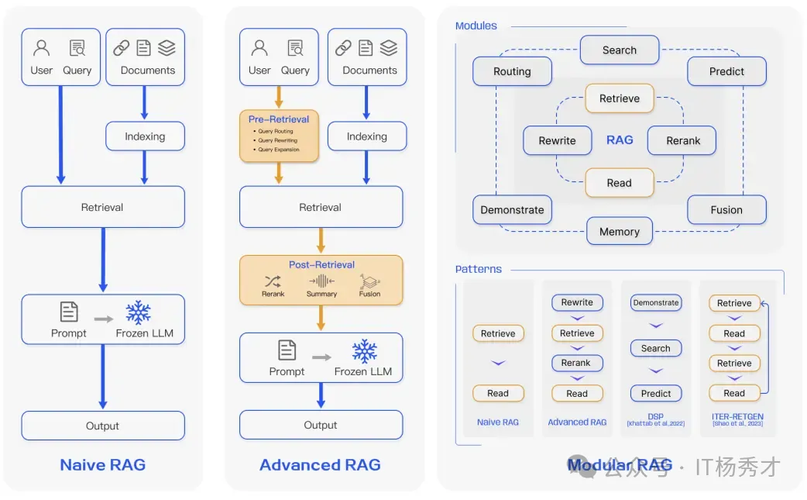
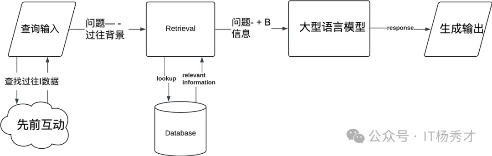
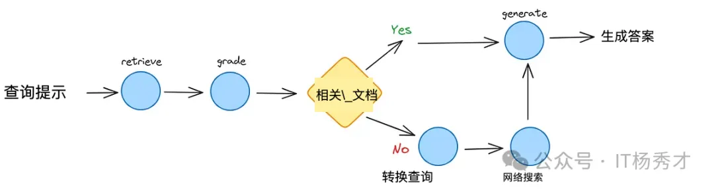
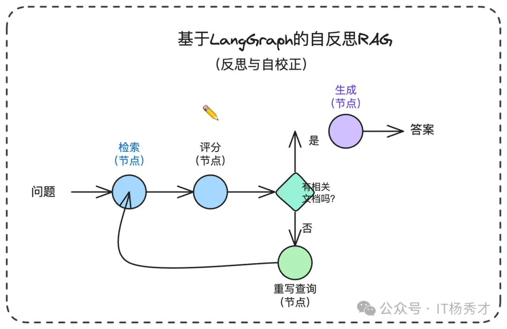
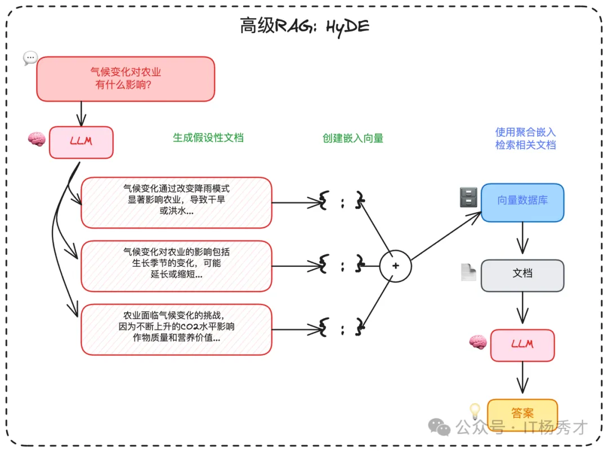
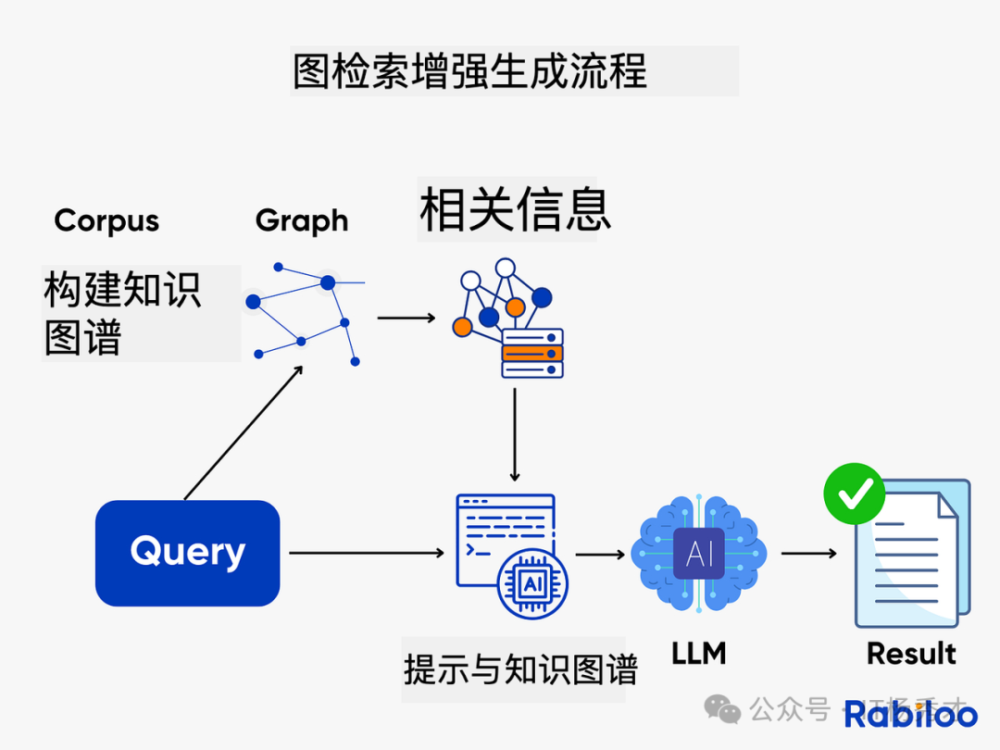

## 🏗️ RAG 的常见范式

在过去几年里，RAG 系统从朴素的 RAG 发展到了高级 RAG 和模块化 RAG。这种发展是为了应对性能、成本和效率方面的某些限制。

  

---

## 🌱 原生 RAG（Naive RAG）

原生RAG，即 **Naive RAG**，遵循传统的索引、检索和生成过程。**Native RAG** 是整个RAG系统的"入门示例"。它将检索视为简单的一次性查找。其存在是为了让模型基于特定数据运行，而无需微调的开销，但它假设你的检索引擎是完美的。它最适合于低风险环境，其中速度比绝对的事实密度更重要。简而言之，用户输入用于查询相关文档，然后将这些文档与提示结合并传递给模型以生成最终响应。如果应用程序涉及多轮对话交互，可以将对话历史集成到提示中。

**工作流程如下：**
- **分块处理**：将文档分割成易于处理的小型文本片段。
- **向量化**：每个片段被转换为向量并存储于数据库（如 **Pinecone** 或 **Weaviate**）。
- **检索阶段**：将用户查询向量化后，通过 **余弦相似度** 算法召回"**Top-K**"最相似的文本片段。
- **生成阶段**：将这些片段作为"上下文"输入 **LLM**，从而生成基于事实依据的回应。

  

**Naive RAG** 有一些局限性，例如较低的精度（检索到的片段对齐不准确）和较低的召回率（未能检索到所有相关片段）。此外，**LLM** 可能会接收到过时的信息，这也是 RAG 系统最初需要解决的主要问题之一。这会导致幻觉问题和不准确的响应。当应用增强时，还可能出现冗余和重复的问题。使用多个检索段落时，排名和协调风格/语气也是关键。另一个挑战是确保生成任务不要过度依赖增强信息，这可能导致模型只是重复检索的内容。

**优点：**
- 响应速度快
- 极低的计算成本
- 易于调试和监控

**缺点：**
- 极易受到"噪声"影响（检索到无关的文本块）
- 无法处理复杂的多部分问题
- 如果检索到的数据有误，系统缺乏自我修正能力

---

## 🚀 高级 RAG

**高级 RAG** 有助于解决朴素 RAG 存在的问题，如通过优化预检索、检索和后检索过程来提高检索质量。

- **预检索过程**：涉及优化数据索引，旨在通过五个阶段提升被索引数据的质量：细化数据粒度、优化索引结构、增加元数据、对齐优化以及混合检索。

- **检索阶段**：可以通过优化 **嵌入模型** 本身来进一步改进，这直接影响了构成上下文的片段的质量。这可以通过微调嵌入以优化检索相关性或采用能够更好地捕捉上下文理解的动态嵌入（例如，OpenAI 的 **embeddings-ada-02** 模型）来实现。

- **检索后优化**：侧重于避免上下文窗口限制并处理嘈杂或可能分散注意力的信息。解决这些问题的常见方法是重新排名，这可能包括将相关上下文重新定位到提示的边缘或重新计算查询与相关文本片段之间的语义相似性。提示压缩也可能有助于解决这些问题。

---

## 🧩 模块化 RAG

顾名思义，**模块化 RAG** 增强了功能模块，例如引入了相似检索的搜索模块，并在检索器中进行了微调。朴素RAG和高级RAG都是模块化RAG的特例，由固定模块组成。扩展RAG模块包括搜索、记忆、融合、路由、预测和任务适配器，它们解决了不同的问题。这些模块可以根据特定问题的上下文重新排列。因此，模块化RAG得益于更大的多样性和灵活性，你可以根据任务需求添加或替换模块或调整模块之间的流程。

---

### 💬 对话式 RAG

**对话式 RAG** 解决了"上下文盲区"问题。在标准设置中，如果用户提出后续问题如"它要多少钱?"，系统无法理解"它"指代什么。该架构通过添加有状态记忆层，为对话的每一轮重新构建上下文。

**工作流程如下：**
- **上下文加载**：系统存储最近 5-10 轮对话记录。
- **查询重写**：**LLM** 基于历史对话记录生成独立查询（例如："企业版方案的价格是多少?"）。
- **检索**：使用扩展后的查询进行向量搜索。
- **生成**：答案基于新上下文生成。

  

**优点：**
- 提供自然、拟人化的聊天体验
- 防止用户不得不重复自己的话

**缺点：**
- 记忆漂移：10 分钟前的不相关上下文可能会污染当前的搜索
- 由于"查询重写"步骤，导致更高的 token 成本

---

### 🔧 纠正式 RAG（CRAG）

**纠正式 RAG（CRAG）** 是一种为高风险环境设计的架构。它引入了"决策门"机制，在检索到的文档到达生成器之前评估其质量。若内部检索结果不佳，系统将自动切换至实时网络搜索作为备选方案。根据部署 CRAG 式评估器的团队报告的内部基准测试，相比基础基线模型，该架构已显著降低幻觉现象的发生率。

**工作流程如下：**
- **检索**：从内部向量存储中获取文档。
- **评估**：轻量级"评分器"模型为每个文档片段分配评分（正确、模糊、不正确）。
- **触发门**：如果正确，继续执行生成器；否则丢弃数据并触发外部 API（如谷歌搜索或 **Tavily**）。
- **合成**：使用已验证的内部数据或新鲜的外部数据生成答案。

  

**优点：**
- 显著减少幻觉现象
- 弥合内部数据与实时现实信息之间的差距

**缺点：**
- 显著增加延迟（增加 2-4 秒）
- 管理外部 API 成本和速率限制

---

### 🎯 自适应 RAG

**自适应 RAG** 是"效率冠军"。它认识到并非每个查询都需要动用重火力武器。它通过路由器分析用户意图的复杂度，并选择最经济、最快捷的解答路径。

**工作原理如下：**
- **复杂度分析**：由小型分类器模型对查询进行路径分配。
- **路径 A（无需检索）**：适用于问候语或 **LLM** 已掌握的常识性问题。
- **路径 B（标准 RAG）**：适用于简单的事实查询。
- **路径 C（多步智能体）**：适用于需要搜索多个来源的复杂分析性问题。

  

**优点：**
- 通过跳过不必要的检索实现大幅成本节约
- 针对简单查询实现最佳延迟

**缺点：**
- 分类错误风险：若系统误判难题为简单问题，将导致搜索失败
- 需要高度可靠的路由模型

---

### 🪞 自我反思 RAG

**自我反思 RAG** 是精密架构，其模型经过训练能够批判自身的推理过程。它不仅进行检索，还会生成"反思标记"，作为对自身输出的实时审查。

**工作原理如下：**
- **检索**：由模型自身触发的标准搜索。
- **带标记生成**：模型在生成文本的同时，会伴随特殊标记，如 `[IsRel]`（是否相关？）、`[IsSup]`（此主张是否有支持？）和 `[IsUse]`（是否有帮助？）。
- **自我修正**：如果模型输出 `[NoSup]` 标记，它会暂停、重新检索并重写句子。

  

  

**优点：**
- 最高级别的事实"依据性"
- 推理过程具有内置透明度

**缺点：**
- 需要专门的、经过微调的模型（例如 Self-RAG Llama）
- 计算开销极高

---

### 🔀 融合式 RAG

**融合式 RAG** 旨在解决"模糊性问题"。大多数用户并不擅长搜索。融合式 RAG 会接收单一查询，并从多个角度审视它，以确保高召回率。

**工作原理如下：**
- **查询扩展**：生成用户问题的 3 到 5 个变体。
- **并行检索**：在向量数据库中搜索所有变体。
- **互逆排序融合（RRF）**：使用数学公式对结果进行重新排序。
- **最终排序**：在多次搜索中排名靠前的文档会被提升至顶部。

  

**优点：**
- 卓越的召回能力（能发现单一查询会遗漏的文档）
- 对用户表述不佳的情况具有鲁棒性

**缺点：**
- 搜索成本增加（3-5 倍）
- 由于重新排序计算导致延迟更高

---

### 🎭 HyDE

**HyDE** 是一种反直觉却精妙的模式，它先生成答案，再查找相似文档。它认识到"问题"和"答案"在语义上存在差异。通过首先生成一个"虚假"答案，它在两者之间搭建了桥梁。

**工作原理如下：**
- **假设生成**：**LLM** 针对查询撰写一个虚假的（假设性）答案。
- **向量化**：将虚假答案转换为向量表示。
- **检索**：利用该向量查找与虚构答案相似的现实文档。
- **生成**：基于真实文档撰写最终答复。

  

**优点：**
- 显著提升对概念性或模糊查询的检索效果
- 无需复杂的"代理"逻辑

**缺点：**
- 偏见风险：若"虚假答案"从根本上就是错误的，搜索将被误导
- 对于简单的事实查询效率低下（例如，"2+2等于多少?"）

---

### 🕸️ 图 RAG（Graph RAG）

**知识图谱增强检索（Graph RAG）** 解决的是 **向量检索** 天然不擅长的"关系推理"问题。向量检索更擅长回答"**是什么**"，但不擅长回答"**A 和 B 之间是什么关系**""**从 A 到 C 需要经过哪些步骤**"这类需要跨文档关联推理的问题。**GraphRAG** 检索的是 **实体及其之间的明确关系**。它不再追问"哪些文本看起来相似"，而是探究"事物之间如何关联，以及关联的方式是什么？"

**Graph RAG** 的做法，是在传统 **向量索引** 之外，再额外构建一个 **知识图谱**，把文档中的实体与关系抽取出来形成图结构。检索时，先从向量库中找到相关内容片段，再沿着知识图谱中的关系边扩展关联实体和上下文，最后把两路信息合并后送给 **LLM**。

微软开源的 **GraphRAG** 项目就是这个方向的代表：它会先用 **LLM** 从文档中抽取实体关系图，再利用社区检测算法做聚类摘要，查询时结合图结构和摘要完成检索。

**工作原理如下：**
- **图结构构建**：知识被建模为图结构，其中节点代表实体（如人物、组织、概念、事件），边则代表关系（如影响、依赖、资助、监管）。
- **查询解析**：系统会分析用户查询，以识别关键实体和关系类型，而不仅仅是关键词。
- **图遍历**：系统遍历图结构，寻找能够跨越多跳连接实体的有意义路径。
- **可选混合检索**：向量搜索常与图检索结合使用，以在非结构化文本中定位实体。
- **生成**：**LLM** 将发现的关系路径转化为结构清晰、可解释的答案。

  

---

### 🤖 自适应检索（Agentic RAG）

**自适应检索（Agentic RAG）** 是更进一步的演进。传统 **RAG** 的检索策略通常是固定的，不管什么问题都走同一套流程；但现实里，不同类型的查询其实需要不同策略：

- **简单事实型问题**：一次检索往往就够了。
- **复杂分析型问题**：可能需要多轮检索，每轮根据上一轮结果继续改写查询。
- **探索型问题**：可能需要先找背景，再找细节，再补充证据。

**自适应检索（Agentic RAG）** 并非盲目地获取文档，而是引入了一个自主代理，该代理在生成答案前会规划、推理并决定如何以及从何处检索信息。它将信息检索视为研究，而非简单的查找。**自适应检索（Agentic RAG）** 会把这部分检索过程交给 **Agent** 自主决策，它可以判断：

- 是否真的需要检索
- 该使用哪种检索策略
- 当前结果是否足够好
- 是否要继续追加一轮检索

**工作流程如下：**
- **分析**：智能体首先解析用户查询，判断其属于简单问题、多步骤任务、模糊需求，还是需要实时数据支持。
- **计划**：它将查询分解为子任务并决定策略。例如，应该先进行向量搜索吗？还是网络搜索？调用 API？或者提出后续问题？
- **执行**：代理通过调用向量数据库、网络搜索、内部 API 或计算器等工具来执行这些步骤。
- **迭代**：基于中间结果，代理可能会优化查询、获取更多数据或验证来源。
- **生成**：一旦收集到足够的证据，**LLM** 就会生成一个基于事实、具有上下文感知能力的最终回答。

  

这种方式更灵活，但工程复杂度也更高，落地时通常要在效果、延迟和系统可控性之间做权衡。