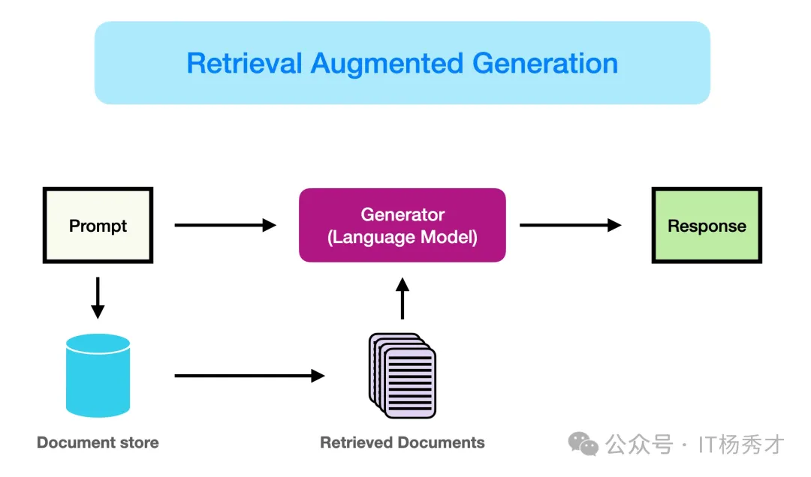
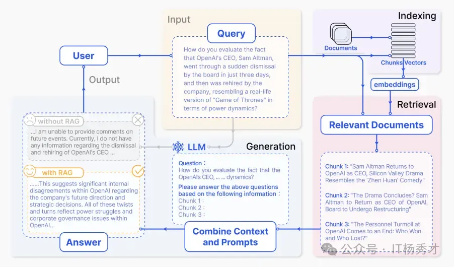
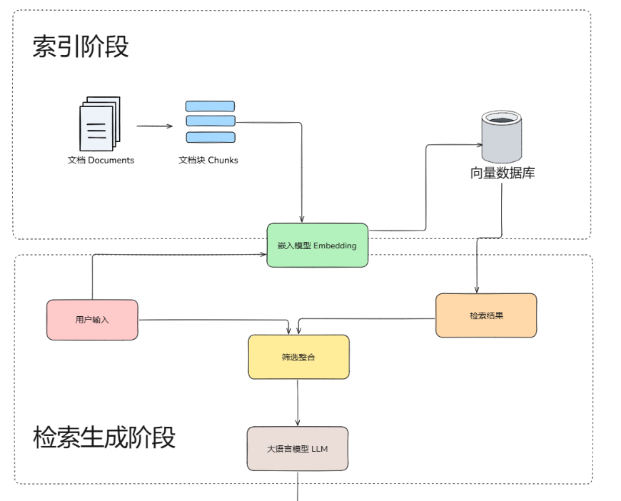
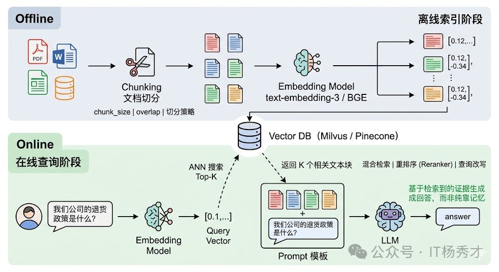

## 🤖 业务背景
随着自然语言处理技术的发展，纯生成式模型虽然已经能够生成较为流畅的文本，但在实际业务中仍然存在两个典型问题：

- **知识局限性**：大模型的知识主要来源于训练数据，通常建立在互联网上的公开语料之上。对于实时性、私有化或离线场景中的知识，模型本身往往无法直接掌握。
- **幻觉问题**：大模型的生成本质上仍然是概率计算。当模型缺少某个领域知识，或者面对自己并不擅长的问题时，就可能一本正经地输出错误结论。

再往工程里看，这两个问题通常会进一步拆成三类约束：**知识有截止日期、无法理解私域数据、缺少依据时容易产生幻觉**。这也是为什么很多企业在做问答机器人、知识助手、客服 Copilot 时，最终都会从"只靠模型记忆"转向"模型 + 外部知识库"的组合方案。



可以先用一句话理解本文：**RAG 的本质，是让大模型在回答前先检索资料，再基于资料作答，从"靠记忆回答"切换到"带依据回答"。**



---

## 📖 什么是 RAG

**RAG（Retrieval-Augmented Generation，检索增强生成）** 是一种将 **信息检索（Retrieval）** 与 **文本生成（Generation）** 结合起来的 AI 方法，主要目标是提升 **大语言模型（LLM）** 的知识覆盖范围与回答准确性。

可以把它理解成这样：**模型在回答问题之前，先从知识库实时召回与用户query强相关的权威外部知识外部，再将检索结果精准注入大模型的生成上下文，让模型基于真实、权威的知识生成回答，而非仅依赖底座模型训练时学到的知识。从而“增强”其生成能力，而不是完全依赖自身参数里的旧知识。** 

RAG 接受输入并根据来源（例如，维基百科）检索一组相关/支持的文档。这些文档作为上下文与原始输入提示连接，并馈送到文本生成器，生成最终输出。这使得 RAG 能够适应事实随时间变化的情况。这对于绕过 **LLM** 的参数化知识静态性，通过基于检索的生成访问最新信息以生成可靠输出非常有用。

RAG 的核心价值主要体现在两个方面：

- **检索**：根据用户输入，从外部知识库中检索与问题相关的文本片段，通常依赖 **文本向量化** 和 **向量数据库** 完成语义匹配。
- **增强生成**：将检索到的知识作为上下文输入给大模型，让模型基于更准确、更贴近问题的信息生成答案，从而减少误导性输出。

如果换一个角度理解，RAG 更像是让模型在推理时"开卷考试"：模型本身不需要把所有知识都背下来，而是在回答前先把相关资料找出来，再基于资料作答。

  

简而言之，RAG 检索到的证据可以作为提高 **LLM** 响应准确度、可控性和相关性的手段。这就是为什么 RAG 可以帮助减少在高度演变环境中解决问题时出现的幻觉或表现问题

  

### 🎯 为什么需要 RAG

要理解 RAG，首先得理解它要解决的痛点。**大语言模型** 的知识来源于预训练阶段吃过的语料，这套"参数化知识"有三个致命的缺陷。

- **知识有截止日期**。GPT-4 的训练数据截止到某个时间点，之后发生的事情它一无所知。你问它"2024 年诺贝尔物理学奖给了谁"，它只能坦白说不知道。
- **缺乏私域知识**。**LLM** 训练用的是公开互联网数据，你公司内部的技术文档、客户档案、会议纪要、产品规格书——这些私有数据 LLM 从未见过，所以它也无法回答这类私有问题。
- **幻觉问题**。当 **LLM** 对某个问题没有足够的知识储备时，它有时不会老实说"我不知道"，而是会"一本正经地胡说八道"——用流畅自信的语言生成看起来合理但事实上错误的内容。这是因为 **LLM** 的本质是一个概率语言模型，它优化的目标是"下一个 token 的概率"，而不是"事实的准确性"。这种幻觉在需要高准确性的场景（法律、医疗、金融）中是不可接受的。

面对这三个缺陷，直觉上你可能会想：那把最新的数据、私域文档全部喂给模型重新训练不就好了？这就是 **微调** 的思路。但微调有很高的门槛——需要 GPU 算力、需要整理训练数据、需要处理灾难性遗忘、训练完还要重新部署。而且每次数据更新都要重新微调，成本和周期都不现实。RAG 的诞生，本质上就是在说：能不能不动模型本身，而是在推理阶段给它"开卷考试"的机会？ 不要求模型记住所有知识，而是在需要的时候从外部知识库中检索相关信息，把检索结果作为上下文塞给模型，让它"带着资料回答问题"。

  

### 🧠 RAG 与微调的区别

要理解RAG 和微调的对比，我们可以用一个形象的比喻。**微调** 就像是给一个人"补课"——你改变的是他脑子里的知识结构和思维方式。微调后的模型，它的参数被永久性地更新了，它"记住"了新的知识或"学会"了新的行为模式。**RAG** 则像是给一个人"发参考资料"——你没有改变他的能力，而是在他答题的时候递给他一叠相关材料，让他照着材料来回答。

- **RAG** 更擅长解决"知识获取"问题，例如最新信息、企业私有文档、产品参数、库存状态、内部制度等。即模型需要用到的事实性信息——最新的数据、私域文档、具体的产品参数等。这些信息的特点是"需要查的，而不是需要学的"。你不需要让模型把你公司所有产品的参数都背下来，你只需要在用户问到某个产品时，帮它从数据库里检索出相关参数就好了。
- **微调** 改变模型的行为模式和专业能力，更擅长解决"行为模式"问题，例如输出风格、领域术语习惯、复杂格式约束、某类推理偏好等。比如你想让一个通用模型学会用医学术语对话、学会用特定的语气风格回答、学会遵循某种复杂的输出格式、或者让它在某个专业领域（如法律条文解读）的推理能力更强——这些是微调的强项。因为这些本质上是在改变模型的"思维方式"，需要调整模型参数才能实现。

所以在生产环境里，两者通常不是二选一，而是互补关系：**微调负责改变模型能力边界，RAG 负责补充实时且可更新的事实知识。**

| 方案 | 更擅长解决什么问题 | 典型场景 |
| --- | --- | --- |
| RAG | 外部知识获取、实时信息补充、私域知识接入 | 企业知识库问答、客服机器人、内部文档检索 |
| 微调 | 输出风格、格式约束、领域表达习惯、行为模式塑造 | 法律文书风格、客服回复模板、结构化输出 |

  

### 💡 RAG 的核心优势

RAG 相比微调在"知识获取"层面有五大显著优势：

- **知识实时更新，无需重新训练**：微调一次可能需要数天甚至数周，而 RAG 的知识更新只需要往 **向量数据库** 里写入新数据，几分钟甚至几秒钟就完成了。

- **大幅降低幻觉，生成内容可溯源**：RAG 通过在 **Prompt** 中提供明确的参考信息，把 **LLM** 的生成从"凭记忆编"变成了"照资料写"。更重要的是，RAG 天然支持引用溯源，用户可以验证信息的准确性。

- **成本低、门槛低、落地快**：RAG 只需要一个 **Embedding API**、一个 **向量数据库**、一个 **LLM API**，加上几百行代码，就能搭起一个可用的原型。针对垂直领域场景，不需要大量的微调数据，只需要构建对应的领域知识库，就能让模型适配垂直场景的问答需求，落地成本远低于全量微调。

- **数据安全和权限控制**：RAG 天然支持在检索阶段根据用户身份过滤可访问的文档范围，确保模型只能"看到"该用户有权看到的资料。

- **避免灾难性遗忘**：因为 RAG 根本不动模型参数，模型的通用能力完好无损，不会在新知识上训练后出现能力退化。

  

---

## 🔄 核心流程

RAG 的完整流程通常可以拆成 5 个核心阶段：

- **数据准备**：清洗原始文档，并进行分块处理，例如把 PDF、Word 或网页文本切成可检索的片段。
- **文本向量化**：使用 **嵌入模型**（如 BERT、BGE）将文本转换为向量表示。
- **索引存储**：将生成的向量写入 **向量数据库**，例如 Milvus、Faiss、Elasticsearch。
- **检索增强**：用户提问后，先把问题向量化，再检索相关文档片段。
- **生成答案**：把检索结果与用户问题一起送给大模型，生成最终回答。

如果从系统设计视角再抽象一层，RAG 往往会被拆成 **离线** 的 **索引阶段** 和 **在线** 的 **检索阶段**、**增强阶段**、**生成阶段**：

- **索引阶段**：离线阶段把原始文档解析、切块、向量化后写入向量数据库，提前构建好可检索的知识底座。
- **检索阶段**：在线阶段用户提问后，再用同一个嵌入模型把问题向量化，从大规模知识库里先召回一批候选内容。
- **增强阶段**：增强涉及将检索段落中的上下文有效整合到当前生成任务中的过程，把检索结果变成模型真正能用的上下文。
- **生成阶段**：让 **LLM** 基于问题 + 增强后的上下文输出答案，形成模型的最终输出。



如果从工程实现看，RAG 可以简化理解为两句话：

- **离线阶段负责把知识"准备好"**
- **在线阶段负责把知识"找出来并组织好"**



  

进一步抽象后，RAG 也可以理解成三个阶段：**索引阶段、查询阶段、增强生成阶段**。

  

## 🗂️ 离线阶段
在离线阶段，在RAG系统中只有索引阶段。提前构建好可检索的知识底座。
### 🏗️ 索引阶段

离线索引阶段是"备考"的过程，目的是把原始文档变成可以被高效检索的形式。
在索引阶段，系统会先对原始文档进行解析，然后拆分为多个较小的文本块。接着，这些文本块会经过嵌入模型处理，转换成向量并存入向量数据库，为后续语义检索提供基础。

#### 📂 文档加载与切分（Chunking）
文档加载前通常会对进行去噪处理，移除无用内容（如 HTML 标签、特殊字符）
原始文档可能是 PDF、Word、网页、数据库记录等各种格式，首先要把它们统一解析成纯文本。然后，由于文档通常很长，而后续的 **Embedding 模型** 和 **LLM** 的上下文窗口都有长度限制，需要把长文档切分成较小的文本块（**Chunk**）。切分策略是 RAG 工程中第一个需要仔细调优的点——切太大，检索精度下降（一个大 chunk 里可能只有一小段是相关的，其他全是噪声）；切太小，语义完整性被破坏（一句话被从中间截断，失去了上下文）。常见的策略包括按固定长度切分并设置重叠（**Overlap**）、按自然段落或章节切分、以及基于语义相似度的动态切分。

#### 🧮 文本向量化（Embedding）
一个 **Embedding 模型**（如 OpenAI 的 text-embedding-3、BGE、E5 等）把每个文本块转换成一个高维向量。这个向量是文本块语义信息的数学表示——语义相近的文本块在向量空间中的距离也相近。这一步的关键是 Embedding 模型的质量，它直接决定了后续检索的准确率。

  

#### 🗄️ 存入向量数据库（Vector Database）
把所有文本块的向量及其对应的原文存入 **向量数据库**（如 Milvus、Pinecone、Weaviate、Chroma 等）。向量数据库的核心能力是 **ANN（Approximate Nearest Neighbor，近似最近邻搜索）** ——给定一个查询向量，能在毫秒级别从百万甚至亿级的向量中找到最相似的 **Top-K** 个。

这里有两个工程细节非常关键：

- **切块策略本身就是索引质量的一部分**。切得太粗会把多个知识点揉成一个向量，切得太碎又会让语义断裂。
- **索引和查询必须使用同一个 Embedding 模型**。否则向量空间不一致，即使文本本身相关，也可能检索不到。

  



嵌入模型、文本向量化与向量数据库可以这样理解：

- **嵌入模型**：把词、短语或句子转换成数值向量的工具，这些向量会尽可能保留文本的语义信息。例如在识物探趣项目中，使用的嵌入模型是 **bge-small-zh-v1.5**，向量维度为 **512**。
- **文本向量化**：把文本映射到高维空间中。语义相近的内容在空间中距离更近，语义差异较大的内容距离更远。
- **向量数据库**：专门用于存储和管理高维向量的数据库，适合对文本、图片、音频等非结构化数据进行相似性搜索。



## 🌐 在线阶段
在在线阶段，在RAG系统中有检索阶段、增强阶段、生成阶段。其中检索阶段负责从向量数据库中检索相关知识，增强阶段负责把检索到的知识组织整理成模型输入，生成阶段负责把增强后的知识输入让模型输出符合用户需求的回答。

### 🔍 检索阶段

在线查询阶段是"开卷考试"中翻书查看资料的过程，负责根据用户的问题从外部知识库中找出相关的信息片段。这个阶段通常会结合关键词检索、向量检索或混合检索等方式，从大量文档中召回一批候选内容，其核心目标是尽可能快速且准确地找到与当前问题最相关的知识，为后续回答提供可靠依据。

#### 📊 查询向量化（Embedding）
用同一个 **Embedding 模型** 把用户的问题转换成向量。注意这里必须用和索引阶段相同的模型，否则向量空间不一致，检索就会失效。

#### 📍 相似度检索
用问题向量在向量数据库中进行 **ANN** 搜索，找到 **Top-K** 个最相似的文本块。这些文本块就是系统认为和用户问题最相关的"参考资料"。实际工程中，这一步往往还会叠加一些增强策略，比如 **混合检索**（同时用向量检索和关键词检索，取并集）、**重排序**（用一个 Cross-encoder 模型对 Top-K 结果做精排）、**查询改写**（用 LLM 对用户原始问题做扩展或改写以提高召回率）等。

检索阶段会先把用户问题通过 **嵌入模型** 转换为向量，再与 **向量数据库** 中的知识向量进行相似度比对。系统会从中找出最匹配的前 `K` 条结果，作为后续生成阶段的参考上下文。

### ⚙️ 增强阶段

增强阶段系统将检索段落中的上下文有效整合到当前生成任务中的过程。增强的目的是将召回到的候选内容整理成大模型可以直接利用的上下文，最终构造成适合输入给模型的 **Prompt**，使模型能够在更充分、更准确的上下文中完成回答。

RAG 的增强可以在预训练、微调和推理等不同阶段应用
- augmentation Stages: RETRO 是一个利用检索增强进行大规模从头预训练的系统示例；它使用了基于外部知识的附加编码器。RAG 还可以与微调结合使用，以帮助开发和提高 RAG 系统的有效性。在推理阶段，应用了许多技术来有效地结合检索内容，以满足特定任务需求，并进一步细化 RAG 过程

- 增强数据源：RAG 模型的效果受增强数据源的选择影响很大。数据可以分为无结构、结构化和 LLM 生成的数据

- 增强过程：对于许多问题（例如多步推理），一次检索是不够的，因此已经提出了几种方法
  - 迭代检索使模型能够进行多次检索循环，以增强信息的深度和相关性。利用这种方法的知名方法包括 RETRO 和 GAR-meets-RA
  - 递归检索递归地将上一步检索的输出作为下一步检索的输入；这使得对于复杂和多步查询（例如学术研究和法律案例分析）能够更深入地挖掘相关信息。利用这种方法的知名方法包括 IRCoT 和澄清树
  - 适应性检索根据特定需求调整检索过程，确定检索的最佳时机和内容。利用这种方法的知名方法包括 FLARE 和 Self-RAG

### ✨ 生成阶段

生成阶段是 RAG 流程的最后一步，在这个阶段 **大语言模型** 将基于用户问题和增强后的上下文内容生成最终答案。在这一阶段，模型不再单纯依赖自身参数中的知识，而是结合外部检索到的信息进行组织、推理和表达，从而输出更准确、更具时效性且更贴合问题需求的回答。这个过程涉及多样化的输入数据，有时需要努力调整语言模型以适应来自查询和文档的输入数据。这可以通过后检索处理和微调来解决：

- **Post-retrieval with Frozen LLM**：Post-retrieval 处理不会影响 LLM，而是通过信息压缩和结果重排序等操作来提升检索结果的质量。信息压缩有助于减少噪声、解决 LLM 的上下文长度限制问题，并增强生成效果。重排序旨在重新排列文档，以使最相关的内容排在前面。

- **使用 LLM 进行 RAG 微调**：为了改进 RAG 系统，生成器可以进一步优化或微调，以确保生成的文本自然且有效地利用了检索到的文档。

  

