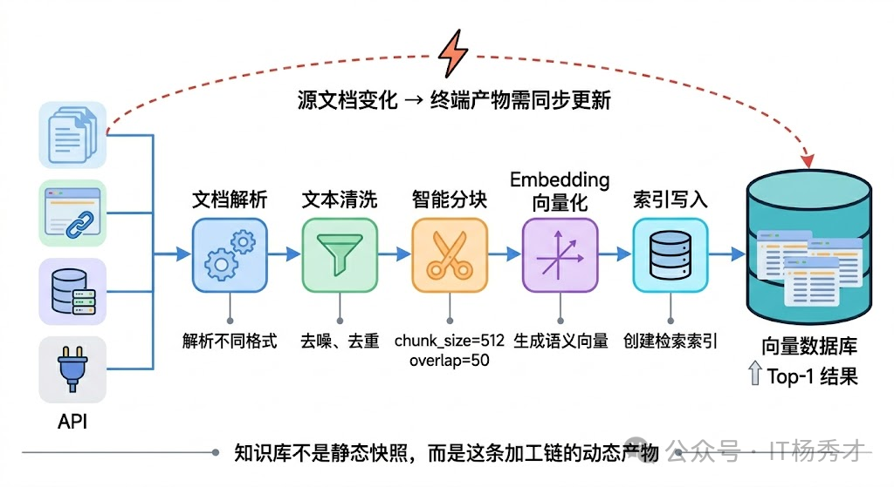
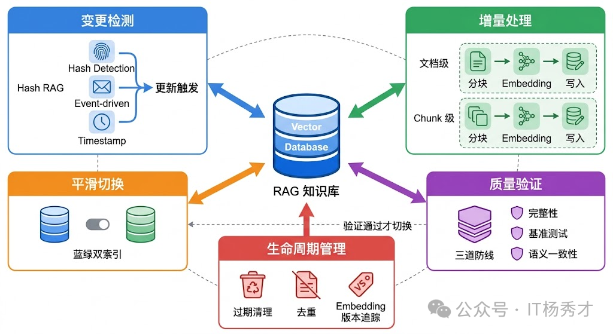
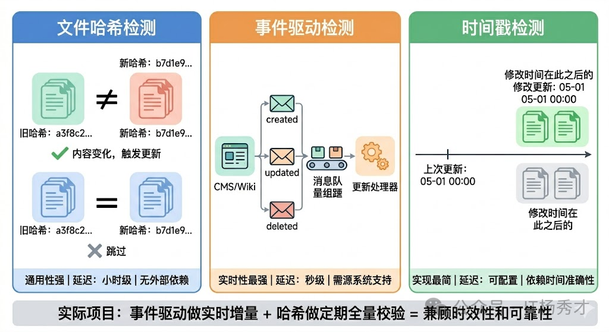
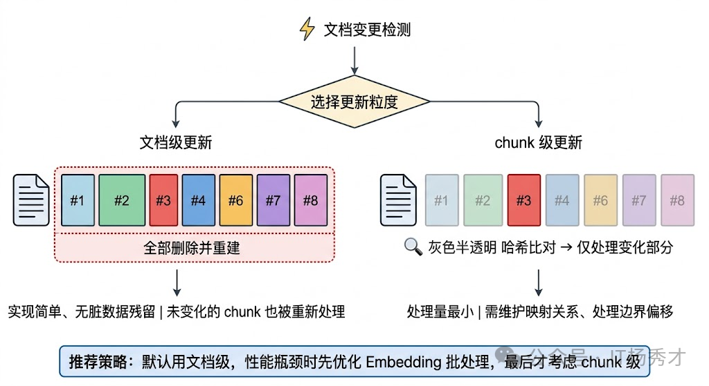
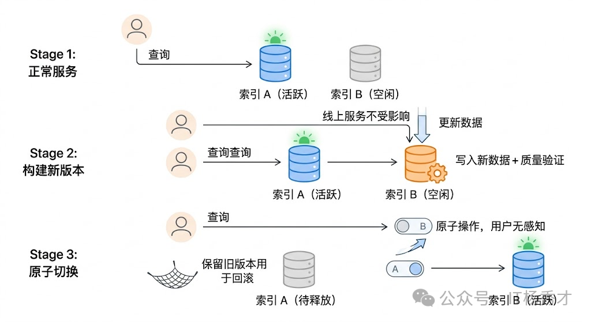
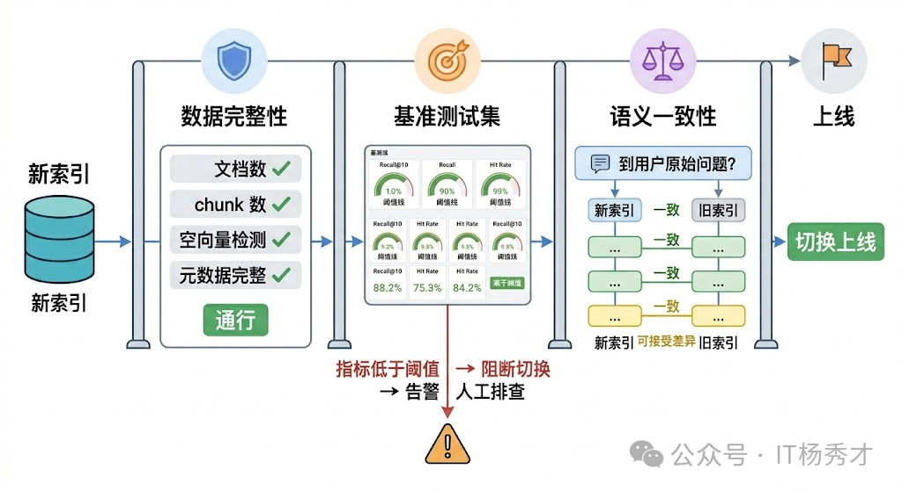

## 🔄 RAG 更新策略的本质问题

要理解知识库更新策略，得先搞清楚一个根本问题：RAG 的知识库到底是什么？它不是一个简单的文件夹，而是一条加工链的产物。原始文档经过文档解析、文本清洗、分块（Chunking）、Embedding 向量化，最终存入向量数据库——这中间每一个环节都有自己的逻辑和参数。所以当我们说更新知识库时，其实是在说：当源头的文档发生变化时，如何让这条加工链的终端产物也跟着正确地变化。**真正的生产环境中，知识库是一个动态活体**：产品规格会调整、公司政策会变化、技术文档会迭代。如果 RAG 系统里的向量索引和源文档不同步，检索回来的内容就是过时的、甚至错误的。

这比没有 RAG 更危险。想象一下，用户问的是"最新版本的政策"，系统返回的是三个月前的旧版本。用户以为得到了准确答案，实际上是被误导了。这就是 RAG 系统的 **时效性陷阱**——它看起来在"工作"，但输出的其实是错误信息。

  

RAG 更新策略要解决的核心问题有三个：**何时更新**（触发机制）、**更新什么**（粒度控制）、**如何保证一致**（质量和安全）。

  

---

## ⚙️ 更新机制

### ⏰ 定时全量扫描
最直接的思路是定时全量重建——比如每天凌晨把所有文档重新跑一遍加工链，生成新的向量索引，然后整体替换旧索引。这种方式实现最简单，不需要追踪哪些文档变了，每次都是全量覆盖。对于文档量不大（比如几千篇以内）、更新频率要求不高（天级别就够）的场景，全量重建完全够用，而且由于每次都是从零构建，不存在增量更新可能引入的脏数据问题。

但全量重建的问题也很明显：当文档量上去之后，成本和耗时都不可接受。假设你有 50 万篇文档，每篇文档分块后产生 10 个 chunk，就是 500 万个 chunk 需要重新 Embedding。即使用 batch 调用，Embedding 的 API 费用和计算时间也相当可观。更关键的是，其中可能 99% 的文档根本没有变化，重新处理它们纯粹是浪费。

### 🛠️ 增量更新

实际项目中更常见的方案是增量更新。核心思路是：只处理那些真正发生了变化的文档。

#### 🔍 变更检测机制
增量更新需要一套变更检测机制来回答哪些文档变了这个问题。常见的做法有几种：

- 基于文件哈希的检测:对每个源文档计算内容哈希（比如 MD5 或 SHA256），存到一张元数据表里。每次更新时重新计算哈希，和上一次比较——哈希变了就说明内容变了，需要重新处理；哈希没变就跳过。这种方式不依赖任何外部系统，适用面最广。
- 基于事件驱动的检测:如果你的文档源头是一个 CMS 系统或者 Wiki 平台，通常可以通过 Webhook 或者消息队列拿到文档创建/修改/删除的事件通知。收到通知后立即触发对应文档的更新处理，做到分钟级甚至秒级的准实时更新。这种方式延迟最低，但需要源头系统支持事件推送，而且要处理好事件的幂等性和顺序性问题。
- 基于时间戳的检测:记录每个文档的最后修改时间，每次更新时只处理上次更新之后有修改的文档。实现简单，但依赖源系统提供准确的修改时间，而且无法检测到内容没变但文件被重新保存了这种假变更（虽然这种情况下重新处理一次也没什么大问题）。

  

实际项目中，这三种方式经常混合使用。比如用事件驱动做准实时的增量更新，同时每周做一次基于哈希的全量校验，确保没有遗漏。

#### 🎯 更新粒度控制
检测到文档变化之后，下一个问题是：更新的粒度应该是文档级还是chunk 级？
- 文档级更新是最直觉的做法——某个文档变了，就把这个文档对应的所有旧 chunk 删掉，重新分块、重新 Embedding、重新写入。这种方式实现简单，不容易出现残留的脏数据，但如果一篇很长的文档只改了一个段落，其他所有 chunk 的重新处理都是浪费。
- chunk 级更新更精细。思路是对新版文档分块后，逐个和旧版的 chunk 做内容比对（同样可以用哈希），只对真正发生变化的 chunk 做重新 Embedding 和写入，未变化的 chunk 保持不动。这种方式在文档很长、修改范围很小的场景下能显著节省处理成本，但实现复杂度高很多——你需要维护文档和 chunk 之间的映射关系，还需要处理分块边界变化导致的"级联影响"问题（比如在文档中间插入了一段话，可能导致后续所有 chunk 的边界都发生偏移）。

  

工程上的经验是：除非你的文档量特别大或者单文档特别长，否则文档级更新就够用了。chunk 级更新带来的复杂度往往不值得。如果真的遇到性能瓶颈，优先考虑的应该是优化 Embedding 的批处理效率，而不是把更新粒度做到 chunk 级。
---

## 🚀 在线服务的平滑切换
知识库更新还有一个容易被忽略但在生产环境中至关重要的问题：更新过程中，线上服务怎么办？如果你在更新的时候直接操作线上的向量数据库——删旧 chunk、写新 chunk——那么在这个过程中，用户的查询可能会命中不完整的数据：旧的已经删了，新的还没写完。这在体验上是不可接受的。
常见的解决方案如下
- 双索引切换（也叫蓝绿部署思路）。维护两套向量索引，一套是线上正在服务的活跃索引，另一套是用于构建新版本的备用索引。更新时在备用索引上完成所有写入操作，经过质量验证后，通过一个原子操作将流量切换到新索引，旧索引随后释放。整个切换过程对用户完全无感知。
- 利用向量数据库自身的版本或别名机制。比如 Elasticsearch 的 alias 功能、Milvus 的 collection alias——你可以创建一个新的 collection 完成数据写入，然后把 alias 指向新 collection，一步完成切换。原理和双索引切换一样，只是利用了数据库的原生能力来实现。

对于增量更新场景，如果你用的向量数据库支持原子的 upsert 操作（删旧写新在同一个事务里），也可以直接在线上索引做增量更新，不需要双索引。但这要求你对更新过程的正确性有足够信心，因为没有了"旧版本兜底"的退路。

  

这里还有一个细节值得注意：更新过程的并发控制。如果多个数据源同时触发更新，或者定时任务和事件驱动的更新同时在跑，就可能出现竞态条件——两个更新进程同时在修改同一个文档的 chunk，导致最终数据状态不确定。常见的做法是引入一个分布式锁或者任务队列，确保同一个文档的更新操作是串行的。在 pipeline 层面，可以用 Celery 这类任务队列来调度更新任务，通过文档 ID 做分区路由，保证同一个文档的更新请求不会被并行执行。

## ✅ 更新后的质量验证
新索引构建完了，不能直接切换上线。验证是整个更新流程中最容易被跳过、但最不应该跳过的环节。质量验证的核心是确认两件事：数据完整性和检索效果。
数据完整性检查比较直接：新索引中的文档数量和 chunk 数量是否和预期一致？有没有丢失文档？有没有出现空向量或者异常向量？元数据字段是否完整？这些可以通过简单的统计对比来自动化验证。
检索效果验证更复杂，也更关键。做法是维护一套基准测试集（Benchmark）——一批预设的查询和对应的"期望命中文档"，每次更新完成后跑一遍这套测试集，检查 Top-K 的召回率、命中率有没有出现明显的下降。如果指标波动超出阈值，就阻断切换流程，人工介入排查。

更进一步的做法是加入语义一致性检测。抽取一批核心查询，分别在新旧索引上做检索，对比两边返回结果的相似度。如果差异过大（比如某些本该排前面的文档突然消失了），就需要检查是不是分块策略变化或者 Embedding 模型更新导致了检索漂移。

  

## 🤖 Embedding 模型升级的特殊处理
日常的知识库更新，只要 Embedding 模型没变，新旧 chunk 的向量处于同一个语义空间，可以自由混合检索。但如果你要把 Embedding 模型从 v1 换成 v2（比如从 text-embedding-ada-002 升级到 text-embedding-3-large），那所有旧向量和新向量就不在同一个语义空间了——用新模型生成的 query 向量去检索旧模型生成的文档向量，结果基本是垃圾。
这意味着 Embedding 模型升级必须做全量重建，把所有文档用新模型重新 Embedding 一遍。这个过程的成本和时间不可避免，但可以通过前面说的双索引切换来做到无缝过渡——在备用索引上用新模型全量构建，验证完毕后切换，旧索引保留一段时间以备回滚。
工程上一个好的实践是：在元数据中记录每个 chunk 使用的 Embedding 模型版本和参数。这样当模型升级时，你能清楚地知道哪些数据需要重新处理，也方便出问题时做版本溯源。

---

## 🗑️ 过期数据和生命周期管理
最后还有一个维度经常被忽视：数据的主动清理。知识库更新不只是"加新的"，还包括"删旧的"。过期的产品文档、撤回的政策、废弃的 API 文档——如果不主动清理，这些过时信息会持续干扰检索结果，导致 RAG 给出错误的回答。
在做法上，可以为每个文档或 chunk 设置有效期元数据，由源系统在文档发布时指定，也可以设置默认的存活时间（TTL）。更新流程中加一步过期检查，自动清理超过有效期的数据。对于无法自动判断是否过期的内容，可以定期生成"疑似过期文档"报告，交给业务团队人工确认
同样重要的是文档去重。随着知识库持续积累，同一份内容可能以不同格式、不同版本被多次导入。重复文档不仅浪费存储，还会在检索时占据多个 Top-K 位置，挤掉其他有价值的结果。可以在写入前做内容去重（基于文本哈希或语义相似度），也可以定期对库内数据做一次去重扫描。
