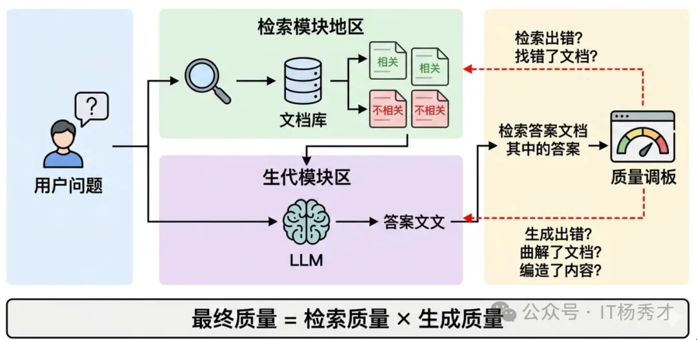
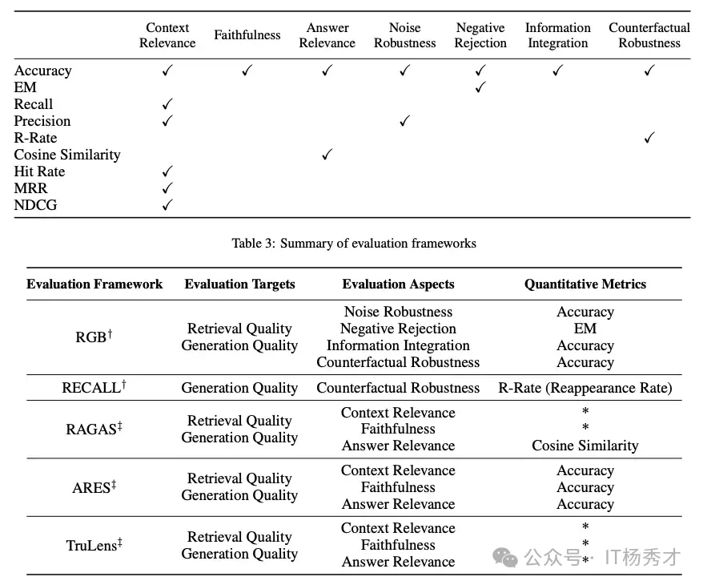
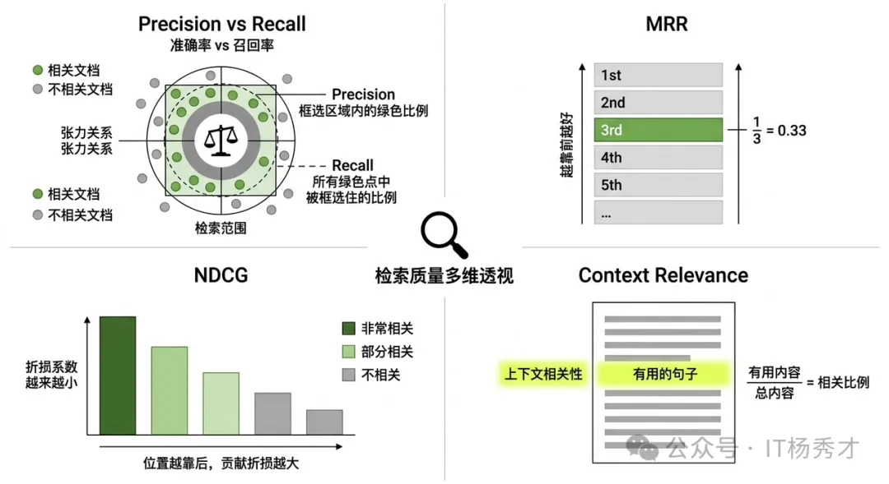
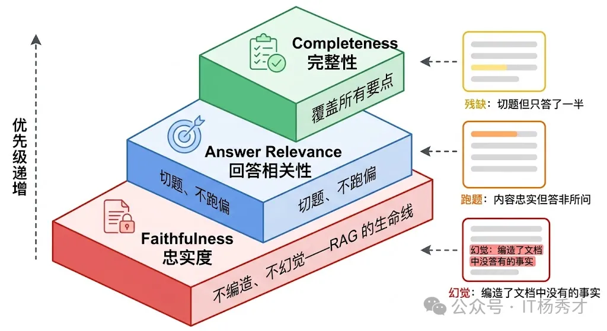
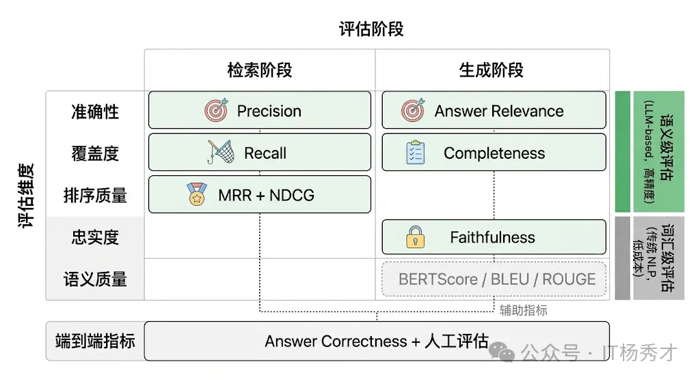
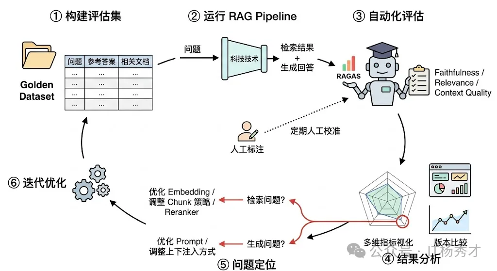
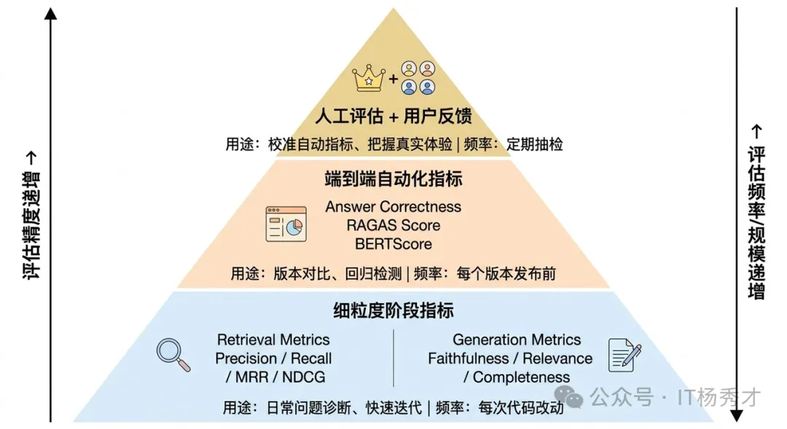
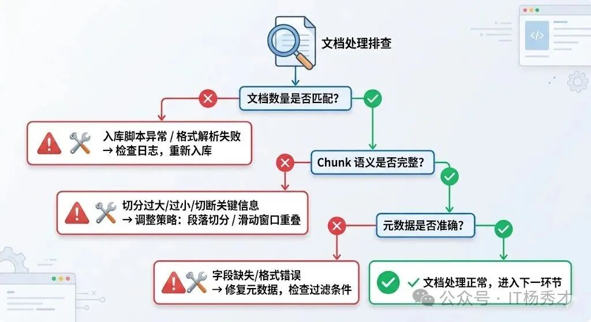

## 📊 分阶段评估

RAG 系统有一个根本特征：它是一个两阶段的 pipeline，每个阶段的失败模式完全不同，因此需要分而治之地评估。

要理解 RAG 评估为什么难，先得理解 RAG 系统的"责任链"结构。用户提了一个问题，先经过检索模块从知识库中找出若干相关文档片段（**Chunks**），再把这些 Chunks 连同问题一起交给 **LLM** 生成最终回答。这意味着最终回答的质量取决于两个环节的连乘：如果检索没找对文档，LLM 再强也是"巧妇难为无米之炊"；反过来，即使检索完美地找到了所有相关信息，如果 **LLM** 没有正确地理解和整合这些信息，甚至编造了检索结果中不存在的内容（即"幻觉"），最终结果同样不合格。更麻烦的是，当最终回答出了问题，你必须能定位到底是哪个环节出了错——是检索阶段的锅还是生成阶段的锅——否则优化就无从下手。这就是为什么 RAG 评估必须分阶段进行。

  

以下是用于评估 RAG 系统不同方面的指标总结：

  

---

## 🔍 检索阶段评估

检索阶段的核心任务是从知识库中找出与用户问题相关的文档片段。评估这个阶段的好坏，本质上就是在回答三个问题：找到的东西是不是真的相关？该找到的东西有没有漏掉？找到的东西排列顺序合不合理？

  

### 📏 基础指标

**Precision（精确率）** 和 **Recall（召回率）** 是最基础也最重要的两个指标。

- **Precision** 衡量的是"检索回来的文档中，有多少是真正相关的"——**Top-K召回的相关片段数/Top-K召回的总片段数**。如果你检索了 10 个 Chunk，其中只有 3 个和问题相关，那 Precision 就是 30%，说明有大量噪声文档被带了进来。

- **Recall** 衡量的是"所有相关的文档中，有多少被成功检索回来了"——**Top-K召回的相关片段数/总相关片段数**。如果知识库中有 5 个 Chunk 和问题相关，你只检索到了 2 个，那 Recall 就是 40%，说明关键信息被遗漏了。

在 RAG 场景中，这两个指标存在一个天然的张力。你想提高 Recall，最简单的办法就是多检索一些 Chunk（提高 **Top-K**），但这会导致 Precision 下降，大量无关的 Chunk 涌入上下文不仅浪费 token，还可能干扰 **LLM** 的理解。反之，如果 Top-K 设得太小，Precision 上去了，但可能漏掉了关键信息。实际工程中通常要在两者之间找到一个甜蜜点，这就是为什么 **F1 Score**（Precision 和 Recall 的调和平均）在检索评估中也很常用。

### 📈 排序指标

但光看 Precision 和 Recall 还不够，因为它们没有考虑排序质量。在 RAG 系统中，检索返回的 Chunk 是有顺序的，排在前面的 Chunk 通常会在 **LLM** 的上下文中占据更显眼的位置，对生成结果的影响更大。如果最相关的 Chunk 被排在了第 8 位而一个勉强沾边的 Chunk 排在了第 1 位，即使整体的 Precision 和 Recall 看起来还行，实际效果也会大打折扣。

- **MRR（Mean Reciprocal Rank，平均倒数排名）** 专门衡量"第一个相关文档排在什么位置"。如果第一个相关文档排在第 1 位，得分是 1；排在第 2 位，得分是 1/2；排在第 5 位，得分是 1/5。MRR 越高，说明系统越能把最相关的结果排到前面，用户（或 LLM）越快就能看到有用的信息。

- **NDCG（Normalized Discounted Cumulative Gain，归一化折损累积增益）** 则更进一步，它不仅关心第一个相关文档的位置，而是评估整个排序列表的质量。它的核心思想是：排在前面的文档对最终结果的贡献应该更大，排在后面的文档即使相关，其贡献也要被"折损"。NDCG 考虑了每个文档的相关性程度（不只是"相关/不相关"的二值判断，还可以有"非常相关/部分相关/不太相关"的多级标注），并且用理论最优排序作为归一化基准，所以它在评估分级相关性场景下特别有价值。

- **Context Relevance（上下文相关性）**，这是 **RAGAS** 框架提出的评估维度。它不是简单地看每个 Chunk 是否相关，而是评估检索回来的整体上下文中，有多大比例的内容对回答用户问题确实有用。一个常见的实现方式是用 **LLM** 从检索到的上下文中提取所有能用于回答问题的句子，然后计算这些有用句子占总上下文的比例。这个指标特别适合发现"检索了很多 Chunk 但大部分是废话"的情况。

---

## ✨ 生成阶段评估

检索阶段把相关文档找回来了，接下来就看 **LLM** 拿这些文档能产出什么质量的回答。生成阶段的评估比检索阶段更微妙，因为它要评判的是一段自然语言文本的质量，而自然语言的"好坏"远不像检索命中率那样容易量化。

- **Faithfulness（忠实度）** 是 RAG 生成评估中最核心的指标，没有之一。它衡量的是"LLM 生成的回答是否忠实于检索到的文档内容，有没有编造检索结果中不存在的信息"。为什么说它最核心？因为 RAG 系统存在的根本意义就是让 LLM 基于可靠的外部知识来回答，而不是靠自己的参数记忆胡编乱造。如果生成的回答中出现了检索文档完全没有提到的"事实"，那这个 RAG 系统就失去了存在的意义——用户还不如直接问 LLM。Faithfulness 的评估通常是这样做的：先让 **LLM** 把生成的回答拆分成若干独立的事实性陈述（**Claims**），然后逐一检验每个陈述是否能被检索到的上下文所支持。Faithfulness 得分 = 被上下文支持的陈述数 / 总陈述数。这个拆分-验证的思路在 **RAGAS** 和 **TruLens** 等评估框架中被广泛使用。

- **Answer Relevance（回答相关性）** 衡量的是生成的回答是否切题、是否真正回答了用户的问题。一个回答可能完全忠实于检索文档（Faithfulness 满分），但如果它答非所问，同样是一个低质量的回答。比如用户问"Python 的 GIL 是什么"，LLM 却大谈 Python 的安装方法——内容可能没有编造，但完全没有回答用户的问题。RAGAS 框架中评估 Answer Relevance 的一个巧妙方法是：用 **LLM** 根据生成的回答反向生成几个问题，然后计算这些反向生成的问题与原始问题之间的语义相似度，相似度越高说明回答越切题。

- **Answer Completeness / Correctness（回答完整性/正确性）** 关注的是回答是否覆盖了问题的所有要点。一个忠实且切题的回答，如果只回答了问题的一半，也不算好答案。这个指标通常需要一个参考答案（**Ground Truth**）来对比，评估生成的回答覆盖了参考答案中多少关键信息点。在有标注数据的场景下，这是一个很有说服力的指标。

  

---

## 📐 传统 NLP 指标

除了上面这些专门为 RAG 设计的语义级评估指标，还有一些经典的 NLP 文本评估指标也被用在 RAG 评估中，但它们各有局限，需要理解其适用边界。**BLEU** 和 **ROUGE** 是最常见的两个。

- **BLEU** 原本用于机器翻译评估，衡量生成文本与参考文本之间的 n-gram 重叠度
- **ROUGE** 原本用于摘要评估，侧重衡量参考文本中的关键 n-gram 是否被生成文本覆盖

它们的优势是计算简单、不需要调用 LLM，成本几乎为零，适合在大规模评估中快速筛选。但它们的根本问题是只看表面文字的重叠，不理解语义。两句意思完全相同但措辞不同的回答，在 BLEU/ROUGE 下可能得分很低；反过来，一句大量复用了原文词汇但意思完全扭曲的回答，可能得分反而高。所以在 RAG 场景中，这些指标只能作为辅助参考，不能作为核心评估手段。

**BERTScore** 是一个改进方向，它用预训练语言模型的 **Embedding** 来计算生成文本和参考文本之间的语义相似度，而不是简单的词汇重叠。这在一定程度上解决了"同义不同词"的问题，但仍然依赖参考答案的存在，而且对于 RAG 这种开放式生成任务，参考答案本身就很难穷举。

  

---

## 🤖 LLM-as-Judge

讲到这里，一个绕不开的实操问题浮出水面：上面说的 Faithfulness、Answer Relevance 这些语义级指标，到底靠什么来计算？靠人工标注当然最准，但成本高、速度慢，根本无法满足日常迭代的需求。RAG 评估领域目前最主流的解决方案就是 **LLM-as-Judge**——用一个 LLM（通常是 GPT-4 级别的强模型）来充当评估者，自动对 RAG 系统的输出进行评分。

**RAGAS** 框架是目前最成熟的 RAG 自动化评估工具，它的核心就是用 LLM 来评估前面提到的 Faithfulness、Answer Relevance、Context Relevance 等指标。**TruLens** 则提供了更灵活的反馈函数（**Feedback Functions**）机制，可以自定义各种评估逻辑。这些框架让 RAG 评估从"每次改动都要找人标注"变成了"改完代码跑一遍评估脚本就能看到效果"，极大地加速了迭代效率。

但 LLM-as-Judge 本身也有局限。首先是评估模型本身可能犯错——它可能误判一个幻觉陈述为"被上下文支持"，或者对一个完全正确的回答打了低分。其次是成本——每次评估都要调用大模型，如果评估集很大，成本也不容小觑。实践中的做法是：日常迭代用 LLM-as-Judge 做快速评估，定期用人工标注做校准和修正，两者互补。

  

---

## 🔄 完整的评估流程

虽然分阶段评估对于定位问题至关重要，但不能忘了最终关心的是端到端的效果。一个检索指标全优但用户满意度不高的 RAG 系统，和一个检索指标一般但最终回答恰好满足用户需求的系统，后者在业务上可能反而更有价值。

所以在实际项目中，一套完善的 RAG 评估体系通常是这样分层的：

- **最底层**是各阶段的细粒度指标（**Precision**、**Recall**、**MRR**、**Faithfulness** 等），用于日常开发中的问题诊断和快速迭代
- **中间层**是端到端的自动化指标（**Answer Correctness**、整体 RAGAS 分数），用于版本间的效果对比
- **最上层**是人工评估和用户反馈，用于校准自动化指标的准确性和把握真实的用户体验

三层互补，缺一不可。

  

---

## 🧑 排查策略
:
RAG 的检索链路是一条多环节串联的管道——文档处理、向量化、检索召回、结果过滤，任何一个环节出了问题，最终表现都是一样的：用户问了，系统答不上来。所以排查的核心思路是沿着数据流方向，从前往后逐层定位。像查水管漏水一样，从水源开始一段一段检查，哪段没水就是哪段出了问题。

### 📄 文档处理排查

很多时候根因出奇地简单——文档压根没有正确入库。比如入库脚本跑挂了、某些 PDF 解析失败静默跳过了、或者入库过程中途异常退出只进了一半，这些情况在生产环境中比想象的常见得多。

排查方法很直接：

- 向量数据库里查文档总数，和预期对比。如果数量不对，翻入库日志找报错。
- 再要看切分（Chunking）质量。切分策略直接决定了每个 Chunk 的语义完整性——切得太大，一个 Chunk 里混了好几个主题，语义不聚焦；切得太小，上下文丢失，单个 Chunk 读起来都不知道在说什么。最坏的是把关键信息切断了，比如一个完整的表格被劈成两半，用户问相关问题时两个 Chunk 单独看都不完整，自然匹配不上。实际操作中随机抽几个 Chunk 看看内容是否连贯，基本就能判断切分策略有没有问题。
- 元数据（Metadata）错误。如果系统在检索时加了元数据过滤（比如按时间、按部门筛选），而文档的元数据字段缺失或格式不对，本该被检索到的内容就会被静默过滤掉。用户问"2024年的销售数据"，但文档的时间戳字段是空的——这种 bug 不看元数据根本发现不了。

  

### 🧠 语义表示排查

这个环节的核心问题是：文档和查询是否被正确地映射到了同一个语义空间。

- **模型不一致**是最常见的错误。文档入库时用的 text-embedding-ada-002，后来升级换成了 bge-large-zh，但存量文档没有重新向量化——新查询和老文档在两个完全不同的向量空间里，相似度计算毫无意义。这种问题在系统迁移或模型升级时特别容易出现，排查时第一件事就是确认入库和查询用的是同一个模型、同一个版本。
- **模型能力是否匹配场景**。通用 Embedding 模型在专业领域（医疗、法律、金融）的表现往往不够好，因为这些领域有大量专业术语和特定的语义关系，通用模型没见过或者理解不准确。中文场景用英文为主的模型也会打折扣。解决方案是换更适合的模型（中文场景 bge、m3e 系列表现不错），或者用领域数据对 Embedding 模型做 fine-tune。
- 还有一种更隐蔽的问题：**查询和文档的表述方式差异太大**。用户问"怎么退货"，文档里写的是"退货流程：客户需在收到商品后7日内联系客服……"。语义是相关的，但一个是口语化的短问句，一个是正式的书面长段落，向量距离可能比预期大得多。

### 🔎 检索召回排查

向量化没问题，但结果还是不理想，问题往往出在检索参数配置上。这一层的排查思路是逐个放宽限制，看哪个参数卡住了召回。

- **相似度阈值**。很多系统会设一个阈值，只返回相似度高于阈值的结果。阈值设得太高（比如 0.85），一些相关但不是完全匹配的内容就被过滤掉了。排查时把阈值临时调低到 0.5 或 0.6，看是否能检索到——如果能，说明阈值过严。
- **TopK**。TopK 设为 3，但相关内容排在第 5 位，用户就看不到。把 TopK 调到 20，看相关内容是否出现在后面的位置。如果出现了，问题不是"检索不到"而是"排序不够靠前"，这时候需要优化的是排序策略而不是检索本身。
- **元数据过滤条件**。临时去掉所有过滤条件做一次纯向量检索，如果能找到内容，说明是过滤条件把它排除掉了。
- **索引参数**。向量数据库的近似最近邻索引（HNSW、IVF 等）为加速检索会牺牲一定的召回率。如果 HNSW 的 ef_search 或 IVF 的 nprobe 设置过小，可能漏掉相关内容。对比精确检索（暴力遍历）和索引检索的结果，就能判断是不是索引参数的问题。
