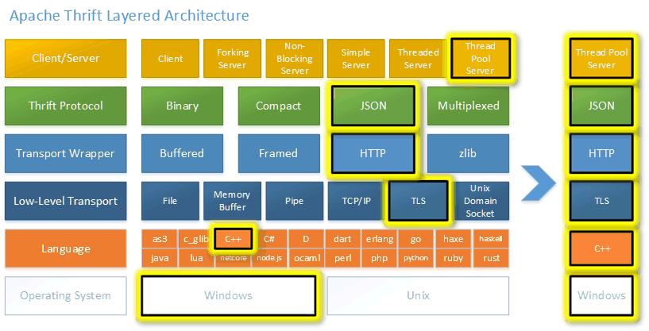

## RPC协议

**RPC** (Remote Procedure Call) ，即远程过程调用。通俗来讲，就是调用远端服务的某个方法，并获取到对应的响应。

### RPC提供的能力

- 服务发现：由于调用的是远端对象，因此需要可以定位到调用的服务器地址以及调用的具体方法的进程，一般可以通过注册中心或者哈希查找来实现，将被调的接口注册到某个地方，比如使用 **`CallerId`** 和函数名作为映射，调用者通过 **`CallerId`** 进行调用，服务端收到调用请求后，通过CallerId查找到对应函数，再执行后续处理流程。
- 序列化和反序列化：调用者和被调用者处于不同的机器上，因此函数参数及其他一些Context信息需要经过网络传输才能到达服务端，网络传输的是二进制数据，因此RPC需要支持将函数参数（如基本类型int、long、map以及自定义类型等）可以序列化为网络可以传输的二进制数据，同时，也需要支持将二进制数据反序列化为程序可以处理的数据类型，是序列化的逆过程。
- 网络传输：网络传输协议和RPC本身没有关系，一般使用TCP进行网络传输，通过HTTP或者UDP也是可以完成RPC所需要的功能的。

### 基本流程

1. （客户端）构造请求参数，发起调用
2. （客户端）通过服务发现、负载均衡等得到服务端实例地址，并建立连接（服务治理）
3. （客户端）请求参数序列化成二进制数据
4. （客户端）通过网络将数据发送给服务端

------

1. （服务端）服务端接收数据
2. （服务端）反序列化出请求参数
3. （服务端）handler 处理请求并返回响应结果
4. （服务端）将响应结果序列化成二进制数据
5. （服务端）通过网络将数据返回给客户端

------

1. （客户端）接收数据
2. （客户端）反序列化出结果
3. （客户端）得到调用的结果

## RPC开发框架

### Thrift协议/框架

Thrift是一套包含序列化功能和支持服务通信的RPC框架，主要包含三大部分：**代码生成**、**序列化框架**、**RPC框架**，大致相当于protoc + protobuffer + grpc，并且支持大量语言，保证常用功能在跨语言间功能一致，是一套全栈式的RPC解决方案





- **Protocol Buffers（Protobuf）** :由 Google 开发的**高性能跨语言序列化框架**，用于结构化数据的序列化（编码）和反序列化（解码），常用于通信协议、数据存储等场景。
- **gRPC** :由 **Google 开发的高性能、跨平台 RPC（远程过程调用）框架**，基于 **Protobuf（Protocol Buffers）** 作为序列化协议，并运行在 **HTTP/2** 之上。它旨在简化分布式系统中服务间的通信，提供高效、强类型化的接口定义和跨语言支持。



## Thrift IDL

IDL全称接口描述语言，被用于不同编程语言的通信和交互。利用IDL可以自动生成不同编程语言的代码

### 数据类型

#### **基本数据类型**

| **类型** |                          **定义**                          |
| :------: | :--------------------------------------------------------: |
|   bool   | 布尔类型。在 IDL 语法里有对应的常量值 `true` 和 `false`。  |
|    i8    |                  **有符号的** 8 位整型。                   |
|   i16    |                  **有符号的** 16 位整型。                  |
|   i32    |                  **有符号的** 32 位整型。                  |
|   i64    |                  **有符号的** 64 位整型。                  |
|  double  |                       64 位浮点数。                        |
|  string  |                **UTF-8** **编码**的字符串。                |
|  binary  |                  无编码要求的二进制数据。                  |
|   byte   | **有符号的** 8 位整型。完全等价于 i8，**已经不推荐使用**。 |

#### **容器类型**

|   容器   |                定义                 |
| :------: | :---------------------------------: |
| list<T>  |  元素类型为 T 的列表，允许元素重复  |
|  set<T>  | 元素类型为 T 的集合，不允许元素重复 |
| map<K,V> |     由类型 K 到类型 V 的映射。      |

#### **结构体类型**

|   类别    |      定义      |
| :-------: | :------------: |
|  struct   |  定义结构体。  |
|   union   |  定义联合体。  |
| exception | 定义异常类型。 |

```Thrift
struct MyStruct {
    1: string name
}

union MyUnion {
    1: string name
}

exception MyException {
    1: string name
}
```

#### 注释

- 块注释：**`/* ... */`** ，注释的内容可以包含换行符；
- 行注释：**`// ...`** ，注释的内容不包含换行符；
- Unix 风格的行注释：**`# ...`** ，注释的内容不包含换行符；

### 组成结构

Thrift IDL 的内容由两部分组成，头部Header和定义Definition

#### **Header**

- **`include`** ：**`include`** 可以用来引入别的 IDL。

```Thrift
Include Literal # Literal：一个单引号或者双引号扩起来的字符串字面量，指明被引入的 IDL 的路径。
```

- **`cpp_include`** ：**`cpp include`** 是专用于 C/C++ 的语法拓展，用于指明需要在生成代码里额外引入的头文件

```Thrift
cpp_include "unordered_map.h"
```

- **`namespace`** ：**`namespace`** 用于指定当前 IDL 生成的定义应该放在目标语言的哪个语法作用域。

```Thrift
namespace language scope
```

- **`language`** ：指定编程语言
- **`scope`** ：一个点（`.`）分割的标志符列表
  -  对于常见的语言，值 **`a.b.c`** 通常会有如下效果：

  - C++：生成 **`namespace a { namespace b { namespace c {`** 这样的嵌套 namespace；
  - Python、Golang：生成 **`a/b/c`** 的目录结构；
  - Java：生成 **`a/b/c`** 的目录结构，同时 package 为 **`a.b.c`**

```thrift
namespace go user
```


#### Definition

IDL 的定义分为七种。每个定义后面都可以有一个注解（Annotation），具体作用依据不同的目标语言和编译器的行为而定。

**Const**

**`Const`** 用于定义常量值，对于没有常量语义的语言（例如 Python），或者不支持非基础类型定义常量值的语言（例如 Golang），结果可能是一个普通的全局变量。

```Thrift
const FieldType Identifier = ConstValue
ConstList      ← '[' (ConstValue ListSeparator?)* ']'
ConstMap       ← '{' (ConstValue ':' ConstValue ListSeparator?)* '}'
const i8 INT_CONST=1234
const map<string,string>map={
    "hello":"world"
}
```

- 结构体类型（`struct`、`union`、`exception`）的字面量是 `ConstMap`，其键（key）必须是字符串字面量。语义上其键必须满足：
  - 与结构体的字段名相匹配（顺序可以不一致）；
  - 每个字段只能被指定一次默认值；
  - 不需要给所有字段设置值；
  - 对于 union 类型，有且只有一个字段可以被指定默认值

```thrift
namespace go example

// --------- 基本类型常量 ---------
const bool   FLAG        = true
const bool   DISABLED    = false

const i8     SMALL_NUM   = 12
const i16    MID_NUM     = 1234
const i32    MAX_COUNT   = 100000
const i64    BIG_COUNT   = 1234567890123

const double PI          = 3.1415926535
const float  GRAVITY     = 9.8

const string GREETING    = "Hello, Thrift!"
const binary RAW_BYTES   = "0xDEADBEEF"

// --------- 通过其它常量引用 ---------
// 注意：引用的常量必须在本文件中已定义
const i32    BASE_VALUE  = 100
const i32    DERIVED     = BASE_VALUE

// --------- 列表常量 ---------
// 支持逗号或分号作为分隔符，末尾可以有可选分隔符
const list<i32>  NUMS          = [1, 2, 3, 4, 5,]
const list<string>  NAMES      = ["Alice"; "Bob"; "Charlie"]

// --------- 映射常量 ---------
// 键和值都可以是任意 ConstValue
const map<string, i64>  USER_AGES = {
  "alice": 30,
  "bob"  : 25,
  "eve"  : 28,
}

// --------- 嵌套复合常量 ---------
const list<map<string, i32>> COMPLEX = [
  {"a": 1, "b": 2},
  {"x": 10; "y": 20},
]


```

**FieldType**

**`FieldType`** 用于定义常量、结构体字段、函数参数的类型，其定义可以分为三类：基础类型（`BaseType`）、容器类型（**`ContainerType`** ）和自定义类型（ **`Identifiers`** ）

**Typedef**

**`Typedef`** 用于定义某个类型的别名，在进行序列化和反序列化的时候，其操作逻辑与原类型相同。

```thrift
typedef i32 MyInteger 
typedef Tweet ReTweet
```

**Enum**

**`Enum`** 用于定义枚举常量。**`Enum`** 在类型系统中并不是作为原生类型存在的，在序列化和反序列化的时候，枚举类型实际上是按 `i32` 来处理的，因此从语义上来说，**`Enum`** 是用于定义类型为 **`i32`** 的常量的语法糖。

- 编译器默认从 0 开始赋值
- 可以对某个变量进行赋值（整数）

```Thrift
enum TweetType { 
    TWEET, // 
    RETWEET = 2, // 
    DM = 0xa,
    REPLY 
}
```

**Struct、Union、Exception**

```SQL
Struct         ← 'struct' Identifier '{' Field* '}'
Union          ← 'union' Identifier '{' Field* '}'
Exception      ← 'exception' Identifier '{' Field* '}'

Field          ← FieldId? Requiredness? FieldType Identifier ('=' DefaultValue)?
                  Annotations? ListSeparator?
FieldId        ← IntLiteral ':'
Requiredness   ← 'required' / 'optional'
DefaultValue   ← ConstValue
```

**`Field`** 由 5 个部分构成：

- **`Field ID`** ：字段的 ID，可选，一个正整数；同一个结构体内各个字段的 ID 都必须是唯一的
  - 如果省略了该字段，那么编译器会为其赋一个值，赋值逻辑类似定义枚举值而不指定数值的情况；但是要注意：**不明确写明字段 ID 会严重影响 IDL 的前后兼容性**：因为不同编译器对待这种情况的行为不一定一致；
  - 某些编译器可能会支持使用负值的 Field ID，并为其生成非导出（unexported）的字段；
- **`Requiredness`** ：字段是否必需的要求
  - **`required`** （建议填写）
    - 编码时：该字段总会被编码并写到输出流，并且该字段必须被赋值了，否则就是错误
    - 解码时：该字段必须包含在输入流里，否则就是错误；
    - 默认值：如果该字段有默认值，在编码阶段可以视为被赋值了，该值会被编码并写到输出流；
  - **`optional`** 
    - 编码时：只有当该字段被赋值的时候才会编码并写到输出流；
    - 解码时：输入流里可以不存在该字段；
    - 默认值：如果该字段有默认值，在编码阶段是否写出到输入流里，由编译器选择实现；
  - **`default`** ：当没有明确声明是 **`required`** 或 **`optional`** 时的类型；
    - 编码时：该字段总会被编码并写到输出流，并且该字段必须被赋值了，否则应该视为错误；
    - 解码时：输入流里可以不包含该字段；
    - 默认值：如果该字段有默认值，在编码阶段可以视为被赋值了，该值会被编码并写到输出流；
    - default 类型可以简单地理解为编码时视为 **`required`**，解码时视为 **`optional`**；
- **`Field Type`** ：字段的类型；
- **`Identifier`** ：字段的名字；同一个结构体内的各个字段的名字都必须是唯一的；
- **`DefaultValue`** ：字段的默认值，可选，默认值的字面量类型必须和字段声明的类型相匹配（参考 **`Const`** 一节），否则结果是未定义的。默认值通常是用于在类型的构造函数里给字段进行初始化

```thrift
struct Location {
    1: required double latitude; 
    2: required double longitude; 
}

struct Tweet { 
    1: required i32 userId;
    2: required string userName;
    3: required string text; 
    4: optional Location loc; // Struct的定义内可以包含其他 Struct
    5: optional string language = "english" // thrift 语法可设置默认值，但是强烈不推荐使用
}
```

**Service**

```Thrift
Service ← 'service' Identifier ( 'extends' Identifiers )? '{' Function* '}'
```

```Thrift
service Twitter { 
    // A method definition looks like C code. It has a return type, arguments, 
    // and optionally a list of exceptions that it may throw. Note that argument 
    // lists and exception list are specified using the exact same syntax as 
    // field lists in structs.

    void ping(); // 1 
    bool postTweet(1:Tweet tweet); // 2 
    TweetSearchResult searchTweets(1:string query); // 3
}
```

- **`Service`** 定义了一个 RPC 服务的接口，由若干 **`Function`** 构成；
- **`Service`** 内部的 **`Function`** 的名字必须都是唯一的，即不支持类似“函数重载”的能力；
- **`Service`** 可以继承另一个 **`Service`**（来自本 IDL 或者引入的其他 IDL），被继承的 `Service` 的 `Function` 集合（包括其继承的 `Service`，递归地）都会被包含在当前 **`Service`** 内；因此，这些 `Function` 不能有名字冲突；
- 一个 IDL 里可以定义零个或多个 **`Service`**，不同 **`Service`** 之间可以有同名的 `Function`

**Function**

**`Function`** 定义了一个 RPC 方法

```thrift
service UserService {
  // 创建用户
  CreateUserResponse CreateUser(1: CreateUserRequest req),

  // 获取用户
  GetUserResponse GetUser(1: GetUserRequest req)
}
```

组成部分

- 是否 `oneway`：如果指定了 `oneway`，那么返回类型必须是 `void`
  - `oneway` 方法意味着客户端发出请求后，不再期望从服务端接收到任何数据；
  - 非 `oneway` 的 `void` 类型的方法，服务端仍然会返回一个响应内容
- 返回类型：可以是 `void` 或者其他类型
- 参数列表：方法的参数列表，可以有零个或者多个
- 异常列表：方法可能抛出的异常类型，零个或多个；异常列表的类型必须都是 `exception`

### 请求和响应的统一打包机制

为了统一不同形式的方法的编解码实现，thrift 设计了一个请求和响应的打包机制：

- 调用方请求一个方法时，所有的参数会被打包在一个结构体里作为其字段存在；
  - 字段的 **`requiredness`** 均为 **`default`**
- 如果方法非 `oneway`，那么它的返回值和异常列表则会被打包在另一个结构体里；
  - 返回值通常是一个名为 **`success`** 且 ID 为 0 的字段（`void` 类型则没有 `success` 字段）；
    - 字段的 **`requiredness`** 均为 **`optional`**

## RPC服务开发流程

基于 Thrift 的 RPC 服务开发，通常包括如下过程：

1. 编写 IDL，定义服务 (Service) 接口。
2. 使用 thrift（或者等价的生成代码工具，如 kitex 等）生成客户端、服务端的支持代码。
3. 服务端开发者编写 handler ，即请求的处理逻辑。
4. 服务端开发者运行服务监听端口，处理请求。
5. 客户端开发者编写客户端程序，经过服务发现连接上服务端程序，发起请求并接收响应。
