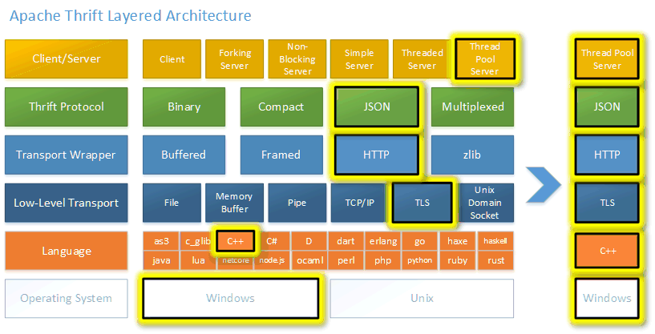

## 🌐 RPC协议

**RPC** (Remote Procedure Call，远程过程调用)，即远程过程调用。通俗来讲，就是调用远端服务的某个方法，并获取到对应的响应。

**RPC** 本质上定义了一种通信的流程，而具体的实现技术没有约束，核心需要解决的问题为**序列化**与**网络通信**。如可以通过 `gob/json/pb/thrift` 来序列化和反序列化消息内容，通过 `socket/http` 来进行网络通信。只要客户端与服务端在这两方面达成共识，能够做到消息正确的解析接口即可。

一般来说，**RPC 框架**包括了**代码生成**、**序列化**、**网络通讯**等，主流的微服务框架也会提供**服务治理**相关的能力，比如**服务发现**、**负载均衡**、**熔断**等等。

---

### 💪 RPC提供的能力

- **服务发现**：由于调用的是远端对象，因此需要可以定位到调用的服务器地址以及调用的具体方法的进程，一般可以通过**注册中心**或者**哈希查找**来实现，将被调的接口注册到某个地方，比如使用 **`CallerId`** 和函数名作为映射，调用者通过 **`CallerId`** 进行调用，服务端收到调用请求后，通过 **CallerId** 查找到对应函数，再执行后续处理流程。
- **序列化和反序列化**：调用者和被调用者处于不同的机器上，因此函数参数及其他一些 **Context** 信息需要经过网络传输才能到达服务端，网络传输的是二进制数据，因此 **RPC** 需要支持将函数参数（如基本类型 `int`、`long`、`map` 以及自定义类型等）可以序列化为网络可以传输的二进制数据，同时，也需要支持将二进制数据反序列化为程序可以处理的数据类型，是序列化的逆过程。
- **网络传输**：网络传输协议和 **RPC** 本身没有关系，一般使用 **TCP** 进行网络传输，通过 **HTTP** 或者 **UDP** 也是可以完成 **RPC** 所需要的功能的。

---

### 🔄 基本流程

1. **（客户端）**构造请求参数，发起调用
2. **（客户端）**通过**服务发现**、**负载均衡**等得到服务端实例地址，并建立连接（**服务治理**）
3. **（客户端）**请求参数**序列化**成二进制数据
4. **（客户端）**通过网络将数据发送给服务端

---

5. **（服务端）**服务端接收数据
6. **（服务端）**反序列化出请求参数
7. **（服务端）****handler** 处理请求并返回响应结果
8. **（服务端）**将响应结果**序列化**成二进制数据
9. **（服务端）**通过网络将数据返回给客户端

---

10. **（客户端）**接收数据
11. **（客户端）**反序列化出结果
12. **（客户端）**得到调用的结果

其中步骤 2 中包含的流程称为**「服务治理」**，通常包括并不限于**服务发现**、**负载均衡**、**ACL**、**熔断**、**限流**等等功能。这些功能是由其他组件提供的，并不是 **Thrift** 框架所具有的功能。

---

## 🛠️ RPC开发框架

### 📦 Thrift协议/框架

**Thrift** 是一套包含序列化功能和支持服务通信的 **RPC 框架**，主要包含三大部分：**代码生成**、**序列化框架**、**RPC 框架**，大致相当于 `protoc + protobuf + grpc`，并且支持大量语言，保证常用功能在跨语言间功能一致，是一套**全栈式的 RPC 解决方案**。

<div align="center">
  
</div>



- **Protocol Buffers（Protobuf）**：由 **Google** 开发的**高性能跨语言序列化框架**，用于结构化数据的序列化（编码）和反序列化（解码），常用于通信协议、数据存储等场景。
- **gRPC**：由 **Google** 开发的高性能、跨平台 **RPC**（远程过程调用）框架，基于 **Protobuf（Protocol Buffers）** 作为序列化协议，并运行在 **HTTP/2** 之上。它旨在简化分布式系统中服务间的通信，提供高效、强类型化的接口定义和跨语言支持。



---

## 📝 Thrift IDL

**IDL**（Interface Definition Language，接口定义语言）全称接口描述语言，被用于不同编程语言的通信和交互。如果我们要使用 **RPC** 进行调用，就需要知道对方的接口是什么，需要传什么参数，同时也需要知道返回值是什么样的。利用 **IDL** 可以**自动生成不同编程语言的代码**。

对于 **RPC 框架**，**IDL** 不仅作为接口描述语言，还会根据 **IDL** 文件生成指定语言的接口定义模块，这样极大简化了开发工作：
- **服务提供方（服务端）**：编写 **IDL** → 使用代码生成工具生成代码 → 实现接口
- **服务调用方（客户端）**：根据服务提供方提供的 **IDL** 生成代码后进行调用

---

### 📊 数据类型

#### 🔢 基本数据类型

**Thrift IDL** 的基本类型被选取得目标是**简单和清晰**，而不是丰富，聚焦于所有编程语言中都有的关键类型。

**注意**：**Thrift IDL 没有无符号整数类型**，因为许多编程语言中没有原生的无符号整数类型。

| **类型** |                          **定义**                          |
| :------: | :--------------------------------------------------------: |
|   bool   | 布尔类型。在 IDL 语法里有对应的常量值 `true` 和 `false`。  |
|    i8    |                  **有符号的** 8 位整型。                   |
|   i16    |                  **有符号的** 16 位整型。                  |
|   i32    |                  **有符号的** 32 位整型。                  |
|   i64    |                  **有符号的** 64 位整型。                  |
|  double  |                       64 位浮点数。                        |
|  string  |                **UTF-8** **编码**的字符串。                |
|  binary  |                  无编码要求的二进制数据。                  |
|   byte   | **有符号的** 8 位整型。完全等价于 i8，**已经不推荐使用**。 |

**关于 `binary` 类型的特别说明**：

`binary` 表示无编码要求的 **byte** 二进制数组。因此是字节数组情况下（比如 **JSON/PB** 序列化后数据在 **thrift RPC** 间传输）请使用 `binary` 类型，**不要使用 `string` 类型**。

**注意**：**Golang** 的实现 `string/binary` 都使用 `string` 类型进行存储，`string` 底层只是字节数组不保证是 **UTF-8** 编码的，可能与其他语言的行为不一致。

---

#### 📦 容器类型

**Thrift** 提供的容器是**强类型容器**，映射到大多数编程语言中常用的容器类型。

|   容器   |                定义                 |        映射到编程语言        |
| :------: | :---------------------------------: | :--------------------------: |
| list<T>  |  元素类型为 T 的列表，允许元素重复  | **STL vector**、**Java ArrayList**、脚本语言原生数组等 |
|  set<T>  | 元素类型为 T 的集合，不允许元素重复 | **STL set**、**Java HashSet**、**Python set** 等 |
| map<K,V> |     由类型 K 到类型 V 的映射。      | **STL map**、**Java HashMap**、**PHP** 关联数组、**Python/Ruby** 字典等 |

**注意事项**：
- 为了最大兼容性，`map` 的键类型应该是**基本类型**而不是结构体或容器类型。有些语言在其原生 `map` 类型中不支持更复杂的键类型。
- **JSON** 协议只支持基本类型作为键类型。

---

#### 🏗️ 结构体类型

**Thrift** 结构体定义了一个通用对象——它们本质上等同于 **OOP** 语言中的类，但**没有继承**。一个结构体有一组强类型字段，每个字段都有唯一的名称标识符。

|   类别    |      定义      |                             说明                             |
| :-------: | :------------: | :----------------------------------------------------------: |
|  struct   |  定义结构体。  |                     包含一组强类型字段                       |
|   union   |  定义联合体。  |           只能包含其中一个字段，有且只有一个字段被设置         |
| exception | 定义异常类型。 | 功能上等价于结构体，但继承自目标语言的原生异常基类，以便与原生异常处理无缝集成 |

```Thrift
struct MyStruct {
    1: string name
}

union MyUnion {
    1: string name
}

exception MyException {
    1: string name
}
```

#### 💬 注释

**Thrift** 支持 **C** 风格的多行注释和 **C++/Java** 风格的单行注释：

- **块注释**：`/* ... */`，注释的内容可以包含换行符；
- **行注释**：`// ...`，注释的内容不包含换行符；
- **Unix 风格的行注释**：`# ...`，注释的内容不包含换行符。

---

### 🏗️ 组成结构

**Thrift IDL** 的内容由两部分组成，**头部 Header** 和**定义 Definition**。

---

#### 📋 Header

- **`include`**：可以用来引入别的 **IDL**。

```Thrift
include "other.thrift"  # Literal：一个单引号或者双引号扩起来的字符串字面量，指明被引入的 IDL 的路径。
```

- **`cpp_include`**：是专用于 **C/C++** 的语法拓展，用于指明需要在生成代码里额外引入的头文件。

```Thrift
cpp_include "unordered_map.h"
```

- **`namespace`**：用于指定当前 **IDL** 生成的定义应该放在目标语言的哪个语法作用域。

```Thrift
namespace language scope
```

  - **`language`**：指定编程语言
  - **`scope`**：一个点（`.`）分割的标志符列表

  对于常见的语言，值 `a.b.c` 通常会有如下效果：
  - **C++**：生成 `namespace a { namespace b { namespace c {` 这样的嵌套 namespace；
  - **Python、Golang**：生成 `a/b/c` 的目录结构；
  - **Java**：生成 `a/b/c` 的目录结构，同时 package 为 `a.b.c`。

```thrift
namespace go user
namespace java com.example.user
```


---

#### 📖 Definition

**IDL** 的定义分为七种。每个定义后面都可以有一个**注解（Annotation）**，具体作用依据不同的目标语言和编译器的行为而定。

---

##### 🔢 Const

**`Const`** 用于定义常量值，对于没有常量语义的语言（例如 **Python**），或者不支持非基础类型定义常量值的语言（例如 **Golang**），结果可能是一个普通的全局变量。

```Thrift
const FieldType Identifier = ConstValue
```

**`ConstList`** 和 **`ConstMap`** 的定义：

```Thrift
ConstList ← '[' (ConstValue ListSeparator?)* ']'
ConstMap  ← '{' (ConstValue ':' ConstValue ListSeparator?)* '}'
```

**示例**：

```Thrift
const i8 INT_CONST = 1234
const map<string, string> map = {
    "hello": "world"
}
```

**结构体类型**（`struct`、`union`、`exception`）的字面量是 `ConstMap`，其键（key）必须是字符串字面量。语义上其键必须满足：
- 与结构体的字段名相匹配（顺序可以不一致）；
- 每个字段只能被指定一次默认值；
- 不需要给所有字段设置值；
- 对于 `union` 类型，**有且只有一个字段**可以被指定默认值。

```thrift
namespace go example

// --------- 基本类型常量 ---------
const bool   FLAG        = true
const bool   DISABLED    = false

const i8     SMALL_NUM   = 12
const i16    MID_NUM     = 1234
const i32    MAX_COUNT   = 100000
const i64    BIG_COUNT   = 1234567890123

const double PI          = 3.1415926535
const float  GRAVITY     = 9.8

const string GREETING    = "Hello, Thrift!"
const binary RAW_BYTES   = "0xDEADBEEF"

// --------- 通过其它常量引用 ---------
// 注意：引用的常量必须在本文件中已定义
const i32    BASE_VALUE  = 100
const i32    DERIVED     = BASE_VALUE

// --------- 列表常量 ---------
// 支持逗号或分号作为分隔符，末尾可以有可选分隔符
const list<i32>  NUMS          = [1, 2, 3, 4, 5,]
const list<string>  NAMES      = ["Alice"; "Bob"; "Charlie"]

// --------- 映射常量 ---------
// 键和值都可以是任意 ConstValue
const map<string, i64>  USER_AGES = {
  "alice": 30,
  "bob"  : 25,
  "eve"  : 28,
}

// --------- 嵌套复合常量 ---------
const list<map<string, i32>> COMPLEX = [
  {"a": 1, "b": 2},
  {"x": 10; "y": 20},
]


```

---

##### 🏷️ FieldType

**`FieldType`** 用于定义常量、结构体字段、函数参数的类型，其定义可以分为三类：**基础类型**（`BaseType`）、**容器类型**（`ContainerType`）和**自定义类型**（`Identifiers`）。

---

##### 🔀 Typedef

**`Typedef`** 用于定义某个类型的别名，在进行序列化和反序列化的时候，其操作逻辑与原类型相同。

```thrift
typedef i32 MyInteger 
typedef Tweet ReTweet
```

**注意**：`typedef` 定义的末尾**没有分号**。

---

##### 📇 Enum

**`Enum`** 用于定义枚举常量。**`Enum`** 在类型系统中并不是作为原生类型存在的，在序列化和反序列化的时候，枚举类型实际上是按 `i32` 来处理的，因此从语义上来说，**`Enum`** 是用于定义类型为 `i32` 的常量的**语法糖**。

**枚举特性**：
- 编译器**默认从 0 开始赋值**
- 可以对某个变量进行赋值（整数）
- **不支持嵌套的 enum**

```Thrift
enum TweetType { 
    TWEET,       // 默认值为 0
    RETWEET = 2, // 显式赋值为 2
    DM = 0xa,    // 十六进制赋值，值为 10
    REPLY        // 上一个值 +1，值为 11
}
```

---

##### 🧱 Struct、Union、Exception

**语法定义**：

```Thrift
Struct         ← 'struct' Identifier '{' Field* '}'
Union          ← 'union' Identifier '{' Field* '}'
Exception      ← 'exception' Identifier '{' Field* '}'

Field          ← FieldId? Requiredness? FieldType Identifier ('=' DefaultValue)?
                  Annotations? ListSeparator?
FieldId        ← IntLiteral ':'
Requiredness   ← 'required' / 'optional'
DefaultValue   ← ConstValue
```

**`Field`** 由 5 个部分构成：

1. **`Field ID`**：字段的 ID，可选，一个正整数；同一个结构体内各个字段的 ID 都必须是唯一的
   - 如果省略了该字段，那么编译器会为其赋一个值，赋值逻辑类似定义枚举值而不指定数值的情况；但是要注意：**不明确写明字段 ID 会严重影响 IDL 的前后兼容性**：因为不同编译器对待这种情况的行为不一定一致；
   - 某些编译器可能会支持使用负值的 Field ID，并为其生成非导出（unexported）的字段；

2. **`Requiredness`**：字段是否必需的要求
   - **`required`**（**建议填写**）
     - **编码时**：该字段总会被编码并写到输出流，并且该字段必须被赋值了，否则就是错误
     - **解码时**：该字段必须包含在输入流里，否则就是错误
     - **默认值**：如果该字段有默认值，在编码阶段可以视为被赋值了，该值会被编码并写到输出流
   - **`optional`**
     - **编码时**：只有当该字段被赋值的时候才会编码并写到输出流
     - **解码时**：输入流里可以不存在该字段
     - **默认值**：如果该字段有默认值，在编码阶段是否写出到输入流里，由编译器选择实现
   - **`default`**：当没有明确声明是 `required` 或 `optional` 时的类型
     - **编码时**：该字段总会被编码并写到输出流，并且该字段必须被赋值了，否则应该视为错误
     - **解码时**：输入流里可以不包含该字段
     - **默认值**：如果该字段有默认值，在编码阶段可以视为被赋值了，该值会被编码并写到输出流
     - `default` 类型可以简单地理解为**编码时视为 `required`，解码时视为 `optional`**

3. **`Field Type`**：字段的类型

4. **`Identifier`**：字段的名字；同一个结构体内的各个字段的名字都必须是唯一的

5. **`DefaultValue`**：字段的默认值，可选，默认值的字面量类型必须和字段声明的类型相匹配（参考 **`Const`** 一节），否则结果是未定义的。默认值通常是用于在类型的构造函数里给字段进行初始化

```thrift
struct Location {
    1: required double latitude; 
    2: required double longitude; 
}

struct Tweet { 
    1: required i32 userId;
    2: required string userName;
    3: required string text; 
    4: optional Location loc; // Struct的定义内可以包含其他 Struct
    5: optional string language = "english" // thrift 语法可设置默认值，但是强烈不推荐使用
}
```

---

##### 🔌 Service

**语法定义**：

```Thrift
Service ← 'service' Identifier ( 'extends' Identifiers )? '{' Function* '}'
```

**示例**：

```Thrift
service Twitter { 
    // A method definition looks like C code. It has a return type, arguments, 
    // and optionally a list of exceptions that it may throw. Note that argument 
    // lists and exception list are specified using the exact same syntax as 
    // field lists in structs.

    void ping(); // 1 
    bool postTweet(1:Tweet tweet); // 2 
    TweetSearchResult searchTweets(1:string query); // 3
}
```

**Service 特性**：
- **`Service`** 定义了一个 **RPC** 服务的接口，由若干 **`Function`** 构成
- **`Service`** 内部的 **`Function`** 的名字必须都是唯一的，即**不支持类似"函数重载"**的能力
- **`Service`** 可以**继承**另一个 **`Service`**（来自本 **IDL** 或者引入的其他 **IDL**），被继承的 `Service` 的 `Function` 集合（包括其继承的 `Service`，递归地）都会被包含在当前 **`Service`** 内；因此，这些 `Function` 不能有名字冲突
- 一个 **IDL** 里可以定义零个或多个 **`Service`**，不同 **`Service`** 之间可以有同名的 `Function`

---

##### ⚙️ Function

**`Function`** 定义了一个 **RPC** 方法。

```thrift
service UserService {
  // 创建用户
  CreateUserResponse CreateUser(1: CreateUserRequest req),

  // 获取用户
  GetUserResponse GetUser(1: GetUserRequest req)
}
```

**Function 组成部分**：

1. **是否 `oneway`**：如果指定了 `oneway`，那么返回类型必须是 `void`
   - **`oneway`** 方法意味着客户端发出请求后，**不再期望从服务端接收到任何数据**
   - 非 `oneway` 的 `void` 类型的方法，服务端仍然会返回一个响应内容，保证操作已在服务端完成
   - **注意**：`oneway` 方法调用同一客户端可能会并行/乱序执行

2. **返回类型**：可以是 `void` 或者其他类型

3. **参数列表**：方法的参数列表，可以有零个或者多个

4. **异常列表**：方法可能抛出的异常类型，零个或多个；异常列表的类型必须都是 `exception`

---

### 📦 请求和响应的统一打包机制

为了统一不同形式的方法的编解码实现，**Thrift** 设计了一个请求和响应的打包机制：

**请求打包**：
- 调用方请求一个方法时，所有的参数会被打包在一个结构体里作为其字段存在
- 字段的 **`requiredness`** 均为 **`default`**

**响应打包**（仅非 `oneway` 方法）：
- 返回值和异常列表会被打包在另一个结构体里
- 返回值通常是一个名为 **`success`** 且 ID 为 0 的字段（`void` 类型则没有 `success` 字段）
- 字段的 **`requiredness`** 均为 **`optional`**

---

## 🚀 RPC 服务开发流程

基于 **Thrift** 的 **RPC** 服务开发，通常包括如下过程：

1. **编写 IDL**，定义服务（**Service**）接口
2. 使用 **thrift**（或者等价的生成代码工具，如 **Kitex** 等）生成客户端、服务端的支持代码
3. 服务端开发者编写 **handler**，即请求的处理逻辑
4. 服务端开发者运行服务监听端口，处理请求
5. 客户端开发者编写客户端程序，经过**服务发现**连接上服务端程序，发起请求并接收响应

---

## 💡 最佳实践

### 🔑 Field ID 的重要性

- **务必显式指定 Field ID**，不要依赖编译器自动分配
- 不明确写明字段 ID 会**严重影响 IDL 的前后兼容性**，因为不同编译器对待这种情况的行为不一定一致
- 建议使用**正整数**作为 Field ID

### 📏 Requiredness 使用建议

- **优先使用 `optional`**，而不是 `required`
- `required` 字段在解码时必须存在，这会导致**兼容性问题**（如新增字段时旧代码无法解析）
- `optional` 提供了更好的**向前和向后兼容性**

### 🎯 默认值使用建议

- **谨慎使用默认值**，特别是在 `optional` 字段上
- 默认值行为在不同编译器实现中可能有差异
- 考虑在应用层处理默认值逻辑，而不是依赖 IDL 默认值

### 🎨 类型选择建议

- 传输字节数组时，**使用 `binary` 而不是 `string`**
- `map` 的键类型使用**基本类型**，避免使用结构体或容器类型
- 枚举值建议**显式赋值**，避免依赖自动递增
