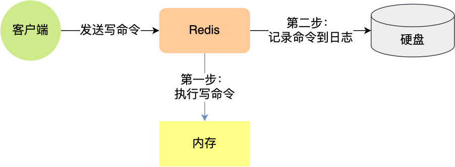

## 📝 AOF（Append Only File）日志

AOF 持久化机制是指 **将 Redis 写命令以追加的形式写入到磁盘中的 AOF 日志文件** ，AOF 文件记录了 Redis 在内存中的操作过程，只要在 Redis 重启后重新执行 AOF 文件中的写命令即可将数据恢复到内存中。数据恢复更为精确，但文件体积较大，重写时可能会消耗更多资源。

### 🔄 执行流程

  

- Redis先执行写操作命令后，才将该命令记录到 AOF 日志里
- 当 AOF 持久化机制被启用时，Redis 服务器会将接收到的所有写命令追加到 AOF 缓冲区的末尾。这个缓冲区本质上是一个sds（简单动态字符串）结构，它就像一个临时的记事本，先把所有修改操作记录下来，等待后续处理。
- 根据写回策略将缓冲区中的命令刷新到磁盘的 AOF 文件中，此时数据并没有写入到硬盘，而是拷贝到了内核缓冲区 page cache，等待内核将数据写入硬盘；
- 随着 AOF 文件的不断增长，Redis 会启用重写机制来生成一个更小的 AOF 文件
- 当 Redis 服务器重启时，会读取 AOF 文件中的所有命令并重新执行它们，以恢复重启前的内存状态。

### 📊 优缺点

- **优点**
  - **避免额外的检查开销。**:因为如果先将写操作命令记录到 AOF 日志里，再执行该命令的话，如果当前的命令语法有问题，那么如果不进行命令语法检查，该错误的命令记录到 AOF 日志里后，Redis 在使用日志恢复数据时，就可能会出错。而如果先执行写操作命令再记录日志的话，只有在该命令执行成功后，才将命令记录到 AOF 日志里，这样就不用额外的检查开销，保证记录在 AOF 日志里的命令都是可执行并且正确的。
  - **不会阻塞当前写操作命令的执行** ：因为当写操作命令执行成功后，才会将命令记录到 AOF 日志。
- **缺点**
  - **丢失的风险** ：执行写操作命令和记录日志是两个过程，那当 Redis 在还没来得及将命令写入到硬盘时，服务器发生宕机了，这个数据就会有丢失风险。由于写操作命令执行成功后才记录到 AOF 日志，所以不会阻塞当前写操作命令的执行，但是 **可能会给下一个命令带来阻塞风险** 。
  - **恢复速度慢** ：因为记录了每一个写操作，所以 AOF 文件通常比 RDB 文件更大，消耗更多的磁盘空间。并且，频繁的磁盘 IO 操作可能会对 Redis 的写入性能造成一定影响。而且，当 AOF 文件体积过大时，AOF 会进行重写操作，如果 AOF 没有开启重写或者重写频率较低，恢复过程可能较慢，因为它需要重放所有的操作命令。

### 💾 写回策略
- **Always** ：每次写操作命令执行完后，同步将 AOF 日志数据写回硬盘；
- **Everysec** ：每次写操作命令执行完后，先将命令写入到 AOF 文件的内核缓冲区，然后每隔一秒将缓冲区里的内容写回到硬盘；
- **No** ：不由 Redis 控制写回硬盘的时机，转交给操作系统控制写回的时机，也就是每次写操作命令执行完后，先将命令写入到 AOF 文件的内核缓冲区，再由操作系统决定何时将缓冲区内容写回硬盘。

三种写回策略的缺点如下

- Always 策略：可以最大程度保证数据不丢失，但是由于它每执行一条写操作命令就同步将 AOF 内容写回硬盘，所以是不可避免会影响主进程的性能；
- No 策略：是交由操作系统来决定何时将 AOF 日志内容写回硬盘，相比于 Always 策略性能较好，但是操作系统写回硬盘的时机是不可预知的，如果 AOF 日志内容没有写回硬盘，一旦服务器宕机，就会丢失不定数量的数据。
- Everysec 策略：是折中的一种方式，避免了 Always 策略的性能开销，也比 No 策略更能避免数据丢失，当然如果上一秒的写操作命令日志没有写回到硬盘，发生了宕机，这一秒内的数据自然也会丢失。

### 🔄 重写机制

Redis 为了避免 AOF 文件越写越大，提供了 **AOF 重写机制**，当 AOF 文件的大小超过所设定的阈值后，Redis 就会启用 AOF 重写机制，来压缩 AOF 文件。AOF 重写机制是在重写时，读取当前数据库中的所有键值对，然后将每一个键值对用一条命令记录到新的 AOF 文件，等到全部记录完后，就将新的 AOF 文件替换掉现有的 AOF 文件。

#### 🔧 重写过程
Redis 的 AOF 重写（AOF Rewrite）是异步的，确切来说由后台子进程 BGREWRITEAOF 负责执行，不会阻塞主线程处理命令。主线程一边执行命令，一边将这些命令写入“重写缓冲区”（rewrite buffer）中。在重写过程中，Redis不但将新的操作记录在原有的AOF缓冲区，而且还会记录在AOF重写缓冲区。一旦新AOF文件创建完毕，Redis 就会将重写缓冲区内容，追加到新的AOF文件，再用新AOF文件替换原来的AOF文件。

- Redis 主进程通过 **`fork`** 系统调用生成出一个后台子进程（**`bgrewriteaof`** 子进程）。采用写时复制（Copy-On-Write） 技术：操作系统会把主进程的**页表**复制一份给子进程，这个页表记录着虚拟地址和物理地址映射关系，而不会复制物理内存，也就是说，两者的虚拟空间不同，但其对应的物理空间是同一个。
- 当父进程或者子进程在向这个内存发起写操作时，CPU 就会触发**写保护中断**，这个写保护中断是由于违反权限导致的，然后操作系统会在**写保护中断处理函数**里进行**物理内存的复制**，并重新设置其内存映射关系，将父子进程的内存读写权限设置为**可读写**，最后才会对内存进行写操作。
- 主进程继续接收命令（临时日志）在重写期间。主进程仍在接收客户端请求，正常写入 Redis。新的写命令会被追加到AOF缓存区，同时写入一个 AOF 重写缓冲区（rewrite buffer）。
- 子进程写完新 AOF 文件后（不含 rewrite buffer 的命令）：它会给主线程发信号说：“我重写完成了”。
- 主线程会把 rewrite buffer 中积累的新写命令追加写入新的 AOF 文件尾部：这样，新 AOF 文件 = “重写快照” + “重写期间产生的增量命令”。
- Redis 原子地替换旧 AOF 文件：使用 rename() 系统调用是原子操作，保证不会出现中间状态。

#### 🔧 优化策略
重写期间主进程需要fork子进程，在数据量大的场景下fork操作可能造成短暂阻塞。重写过程中新写入的命令需要同时写入旧AOF文件和新AOF缓冲区，导致双倍写入开销。最重要的是，如果重写中途发生崩溃，可能面临数据丢失风险。

Redis 7.0通过MP-AOF机制巧妙解决了这些问题：将AOF拆分为BASE和INCR文件，重写时子进程专心生成BASE文件，主进程则实时记录增量命令到INCR文件，通过manifest文件实现原子切换。这种设计不仅避免了阻塞，还确保了任何时刻都有一组完整的AOF文件可用，大幅提升了可靠性和性能。

MP-AOF 的核心思想是将数据持久化工作分解到两个相互配合的文件中：
- BASE AOF 文件相当于数据快照，包含了某个时间点前所有操作的最终状态
- INCR AOF 文件则负责记录 BASE 文件生成期间新增的操作命令

这种双文件架构带来了革命性的改进：当需要执行 AOF 重写时，Redis 不再需要暂停服务。主进程可以继续处理请求并将新命令写入 INCR AOF 文件，而子进程则基于 fork 时的数据快照生成新的 BASE 文件。这两个文件通过一个智能的 manifest 清单文件进行管理，这个清单文件就像一位称职的图书管理员，始终记录着当前有效的 BASE 和 INCR 文件版本。

整个工作流程堪称精妙：当新的 BASE 文件生成完成后，Redis 只需简单地更新 manifest 文件中的指针，就能实现无缝切换。之前的旧文件会被标记为 HISTORY 状态，由后台线程负责清理。这种设计不仅确保了数据安全，还大幅提升了系统可用性 - 即使在重写过程中发生崩溃，系统也能通过检查 manifest 文件快速恢复到最近的一致状态

---

## 🗃️ RDB（Redis Database）快照

RDB 持久化通过创建某一时刻的数据快照来获取内存某个时间点上的副本，利用快照可以进行方便地进行主从复制。适合灾难恢复和备份，能生成紧凑的二进制文件，但可能会在崩溃时丢失最后一次快照之后的数据。

redis.conf 文件可以配置在 x 秒内如果至少有 y 个 key 发生变化就会触发命令进行持久化操作。

- **优点**
  - **恢复速度快** ：RDB 通过快照的形式保存某一时刻的数据状态，文件体积小，备份和恢复的速度非常快。
  - **服务性能影响小** ：RDB 是在主线程之外通过 fork 子进程来进行的，不会阻塞服务器处理命令请求，对 Redis 服务的性能影响较小。
  - **文件小** ：由于是定期快照，RDB 文件通常比 AOF 文件小得多。
- **缺点**
  - **数据丢失** ：RDB 方式在两次快照之间，如果 Redis 服务器发生故障，这段时间的数据将会丢失。
  - **数据不一致** ：如果在 RDB 创建快照到恢复期间有写操作，恢复后的数据可能与故障前的数据不完全一致。

### 📸 生成RDB快照的过程

- 执行了 **`save`** 命令，就会在主线程生成 RDB 文件，由于和执行操作命令在同一个线程，所以如果写入 RDB 文件的时间太长，**会阻塞主线程**；
- 执行了 **`bgsave`** 命令，会创建一个子进程来生成 RDB 文件，这样可以**避免主线程的阻塞**

#### 🛠️ 使用 `bgsave` 命令的流程

- 检查子进程（检查是否存在 AOF/RDB 的子进程正在进行），如果有返回错误
- 触发持久化，调用 **`rdbSaveBackground`**
- 开始 **`fork`** ，子进程执行 rdb 操作，同时主进程响应其他操作。
- RDB 完成后，替换原来的旧 RDB 文件，子进程退出。

### ⚙️ 生成RDB快照的请求处理

在 Redis 生成 RDB 文件时是异步的（使用 **`bgsave`** 命令），**采用了 fork 子进程的方式来进行快照操作**。生成 RDB 文件的过程由子进程执行，主进程继续处理客户端请求，所以可以保证 Redis 在生成快照的过程中依然对外提供服务，不会影响正常请求。

#### 💡 在生成过程中依然能正常进行数据修改

主要原理就是 **写时复制**

- 当主进程 **`fork`** 出一个子进程后，并不会把主进程的所有内存数据重新复制一份给子进程，而是让主进程和子进程共享相同的内存页面。底层的实现仅仅复制了**页表**，但映射的物理内存还是同一个。
- 当主进程接收到写的请求时，主进程会将对应数据所在的页复制一份，对复制的副本进行修改。此时子进程指向的还是老的页，因此数据没有变化。

---

## ⚖️ RDB和AOF的选择

- 如果需要尽可能减少数据丢失，AOF 是更好的选择。尤其是在频繁写入的环境下，设置 AOF 每秒同步可以最大限度减少数据丢失。
- 如果性能是首要考虑，RDB 可能更适合。RDB 的快照生成通常对性能影响较小，并且数据恢复速度快。
- 如果系统需要经常重启，并且希望系统重启后快速恢复，RDB 可能是更好的选择。虽然 AOF 也提供了良好的恢复能力，但重写 AOF 文件可能会比较慢。

#### 📊 两者的优劣势对比

- **RDB**
  - 优势
    - **低资源占用：**RDB **在后台以 fork** **进程****的方式生成快照**，不会影响主线程处理请求，适合高吞吐量的应用。
    - **文件占用空间小：**RDB 是 **二进制压缩存储**，相较于 AOF 体积更小，直接加载 RDB 文件比解析 AOF 日志要快很多，适合 **大规模数据恢复**。
  - 劣势
    - **数据丢失风险（非实时持久化）：**RDB 采用**定期快照（snapshot）**，如果 Redis 在两次快照之间宕机，会丢失最近的写入数据。
- **AOF**
  - 优势
    - **更高的数据安全性：AOF 记录每条写命令**，保证尽量少的数据丢失，适用于**高可靠性场景**。
    - **AOF 采用追加模式，防止文件损坏：**即使 Redis 发生异常，AOF 也能通过 `redis-check-aof` 工具修复文件。
    - **可读性强：**AOF 以**文本格式记录 Redis 命令**，可以直接编辑修复错误数据。
  - 劣势
    - **文件体积更大：**AOF 记录每次写操作，比 RDB 体积大很多，可能占用更多磁盘空间。
    - **恢复速度慢**：由于 AOF 需要**逐条执行历史命令**恢复数据，比直接加载 RDB 更慢。

## ⚠️ BigKey问题

Redis 中的 **Big Key** 是指一个内存空间占用比较大的键（Key）

- **工作线程阻塞** ：由于 Redis 单线程执行命令，操作大 Key 时耗时较长，从而导致 Redis 出现其它命令阻塞的问题。
- **网络阻塞** ：大 Key 对资源的占用巨大，在你进行网络 I/O 传输的时候，导致你获取过程中产生的网络流量较大，从而产生网络传输时间延长甚至网络传输发现阻塞的现象
- **客户端超时** ：因为操作大 Key 时耗时较长，可能导致客户端等待超时。
- **阻塞线程**
  - 当 AOF 写回策略配置了 Always 策略，如果写入是一个大 Key，主线程在执行 fsync() 函数的时候，阻塞的时间会比较久，因为当写入的数据量很大的时候，数据同步到硬盘这个过程是很耗时的。
  - 创建子进程的途中，由于要复制父进程的页表等数据结构，阻塞的时间跟页表的大小有关，页表越大，阻塞的时间也越长；
  - 创建完子进程后，如果父进程修改了共享数据中的大 Key，就会发生写时复制，这期间会拷贝物理内存，由于大 Key 占用的物理内存会很大，那么在复制物理内存这一过程，就会比较耗时，所以有可能会阻塞父进程。

### 📊 对持久化的影响

#### ⚠️ 对AOF的影响

- **对写回策略的影响**
  - 当使用 Always 策略的时候：如果写入是一个大 Key，主线程在执行 `fsync()` 函数的时候，阻塞的时间会比较久，因为当写入的数据量很大的时候，数据同步到硬盘这个过程是很耗时的。
  - 当使用 Everysec 策略的时候，由于是异步执行 `fsync()` 函数，所以大 Key 持久化的过程（数据同步磁盘）不会影响主线程。
  - 当使用 No 策略的时候，由于永不执行 `fsync()` 函数，所以大 Key 持久化的过程不会影响主线程。

##### 🔧 对AOF重写的影响

  - 当 AOF 日志写入了很多的大 Key，AOF 日志文件的大小会很大，那么很快就会触发 **AOF 重写机制**。
  - 创建子进程的途中，由于要复制父进程的页表等数据结构，阻塞的时间跟页表的大小有关，页表越大，阻塞的时间也越长；
  - 创建完子进程后，如果父进程修改了共享数据中的大 Key，就会发生写时复制，这期间会拷贝物理内存，由于大 Key 占用的物理内存会很大，那么在复制物理内存这一过程，就会比较耗时，所以有可能会阻塞父进程。

##### ⚠️ 对RDB的影响

- 创建子进程的途中，由于要复制父进程的页表等数据结构，阻塞的时间跟页表的大小有关，页表越大，阻塞的时间也越长；
- 创建完子进程后，如果父进程修改了共享数据中的大 Key，就会发生写时复制，这期间会拷贝物理内存，由于大 Key 占用的物理内存会很大，那么在复制物理内存这一过程，就会比较耗时，所以有可能会阻塞父进程。

### ✅ 解决方案

- 对要存储的数据进行压缩，压缩之后再进行存储

- 大化小，即把大对象拆分成小对象，即将一个大 Key 拆分成若干个小 Key，降低单个 Key 的内存大小

- 采用 Redis 集群方式进行 Redis 的部署，然后将大 Key 拆分散落到不同的服务器上面，加快响应速度

  