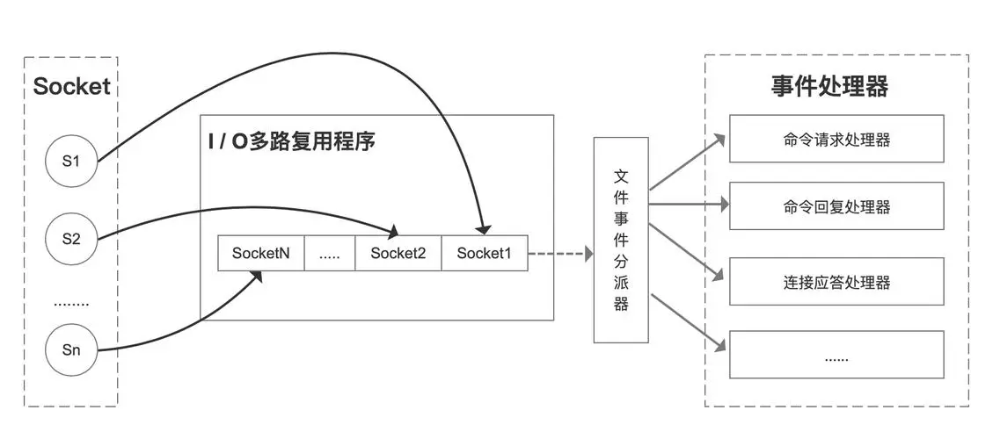

## 🚀 Redis性能强大的原因

- **基于内存的数据存储** ：Redis 将数据存储在内存中，提供快速的读写速度，使得数据的读写操作避开了磁盘 I/O。而内存的访问速度远超硬盘。相比于传统的磁盘数据库，内存访问速度快得多。
- **单线程模型** ：Redis 使用单线程事件驱动模型，避免了多线程上下文切换和竞争条件，提高了并发处理效率。
- **高效的数据结构** ：Redis 提供多种高效的数据结构（如字符串、哈希、列表、集合等），这些结构经过优化，能够快速完成各种操作
- **IO多路复用机制** ：基于 Linux 的 select/epoll 机制。该机制允许内核中同时存在多个监听套接字和已连接套接字，内核会一直监听这些套接字上的连接请求或者数据请求，一旦有请求到达，就会交给 Redis 处理，就实现了所谓的 Redis 单个线程处理多个 IO 读写的请求。

---

## ⚙️ 单线程模型

### 💡 使用原因

- Redis 的大部分操作**都在内存中完成**，并且采用了高效的数据结构，因此 Redis 瓶颈是机器的内存或者网络带宽，而并非 CPU，既然 CPU 不是瓶颈，那么自然就采用单线程的解决方案了。
- Redis 采用单线程模型可以**避免了多线程之间的竞争**，省去了多线程切换带来的时间和性能上的开销，而且也不会导致死锁问题。
- Redis 采用了 **I/O 多路复用机制**处理大量的客户端 Socket 请求，IO 多路复用机制是指一个线程处理多个 IO 流，就是我们经常听到的 select/epoll 机制。简单来说，在 Redis 只运行单线程的情况下，该机制允许内核中，同时存在多个监听 Socket 和已连接 Socket。内核会一直监听这些 Socket 上的连接请求或数据请求。一旦有请求到达，就会交给 Redis 线程处理，这就实现了一个 Redis 线程处理多个 IO 流的效果。

### 🔄 多线程的引入
Redis 单线程指的是「接收客户端请求->解析请求 ->进行数据读写等操作->发送数据给客户端」这个过程是由一个线程（主线程）来完成的。但是，Redis 程序并不是单线程的，Redis 在启动的时候，是会启动后台线程（BIO）的：

- Redis 在 2.6 版本，会启动 2 个后台线程，分别处理关闭文件、AOF 刷盘这两个任务；
- Redis 在 4.0 版本之后，新增了一个新的后台线程，用来异步释放 Redis 内存，也就是 lazyfree 线程。例如执行 unlink key / flushdb async / flushall async 等命令，会把这些删除操作交给后台线程来执行，好处是不会导致 Redis 主线程卡顿。因此，当我们要删除一个大 key 的时候，不要使用 del 命令删除，因为 del 是在主线程处理的，这样会导致 Redis 主线程卡顿，因此我们应该使用 unlink 命令来异步删除大key。

之所以 Redis 为「关闭文件、AOF 刷盘、释放内存」这些任务创建单独的线程来处理，是因为这些任务的操作都是很耗时的，如果把这些任务都放在主线程来处理，那么 Redis 主线程就很容易发生阻塞，这样就无法处理后续的请求了。
- 单线程执行命令 → 无锁、高可靠
- 多线程辅助 I/O → 充分利用多核 CPU

随着数据规模的增长、请求量的增多，Redis 的执行瓶颈主要在于⽹络 I/O。引入多线程处理可以提高网络 I/O处理速度。在 Redis 6.0 中，多线程主要用来处理网络 IO 操作，命令解析和执行仍然是单线程完成，这样既可以发挥多核 CPU 的优势，又能避免锁和上下文切换带来的性能损耗。所以为了提高网络 I/O 的并行度，Redis 6.0 对于网络 I/O 采用多线程来处理。

Redis 6.0 版本支持的 I/O 多线程特性，默认情况下 I/O 多线程只针对发送响应数据（write client socket），并不会以多线程的方式处理读请求（read client socket）。要想开启多线程处理客户端读请求，就需要把 Redis.conf 配置文件中的 io-threads-do-reads 配置项设为 yes。

### ⚡ Redis启动时的线程

Redis 6.0 版本之后，Redis 在启动的时候，默认情况下会额外创建 6 个线程（这里的线程数不包括主线程）：

- Redis-server ： Redis的主线程，主要负责执行命令；
- bio_close_file、bio_aof_fsync、bio_lazy_free：三个后台线程，分别异步处理关闭文件任务、AOF刷盘任务、释放内存任务；
- io_thd_1、io_thd_2、io_thd_3：三个 I/O 线程，io-threads 默认是 4 ，所以会启动 3（4-1）个 I/O 多线程，用来分担 Redis 网络 I/O 的压力。

---

## 🔌 IO多路复用机制

IO 多路复用机制是指一个线程处理多个 IO 流，就是 select/epoll 机制。简单来说，在 Redis 只运行单线程的情况下，该机制允许内核中，同时存在多个监听 Socket 和已连接 Socket。内核会一直监听这些 Socket 上的连接请求或数据请求。一旦有请求到达，就会交给 Redis 线程处理，这就实现了一个 Redis 线程处理多个 IO 流的效果。

这里“多路”指的是多个网络连接客户端，“复用”指的是复用同一个线程(单进程)。

  

- 一个 socket 客户端与服务端连接时，会生成对应一个套接字描述符(套接字描述符是文件描述符的一种)，每一个 socket 网络连接其实都对应一个文件描述符。
- 多个客户端与服务端连接时，Redis 使用 I/O 多路复用程序 将客户端 socket 对应的 FD 注册到监听列表(一个队列)中。当客户端执行 read、write 等操作命令时，I/O 多路复用程序会将命令封装成一个事件，并绑定到对应的 FD 上。
- 文件事件处理器使用 I/O 多路复用模块同时监控多个文件描述符（fd）的读写情况，当 accept、read、write 和 close 文件事件产生时，文件事件处理器就会回调 FD 绑定的事件处理器进行处理相关命令操作。



select/poll和epoll的实现原理

- select 使用位图管理 fd，每次调用都需要将 fd 集合从用户态复制到内核态。最大支持 1024 个文件描述符。
- poll 使用动态数组管理 fd，突破了 select 的数量限制。
- epoll 使用红黑树和链表管理 fd，每次调用只需要将 fd 集合从用户态复制到内核态一次，不需要重复复制。


