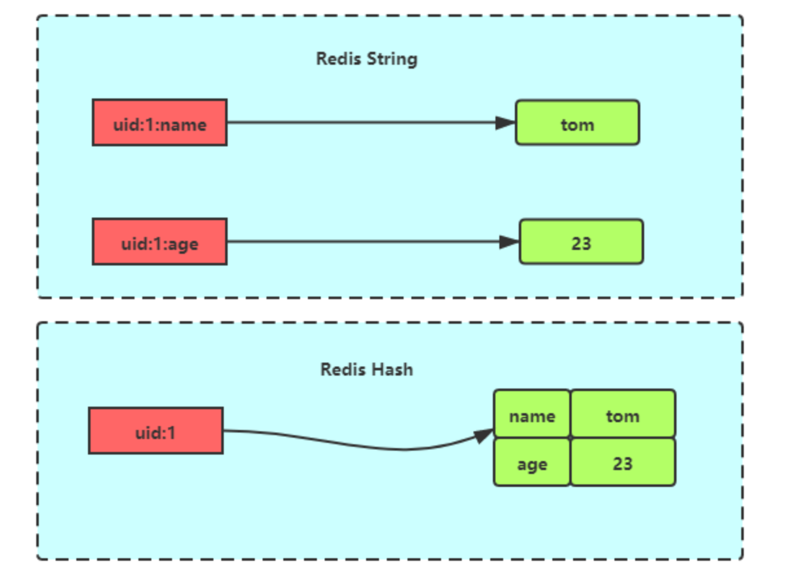
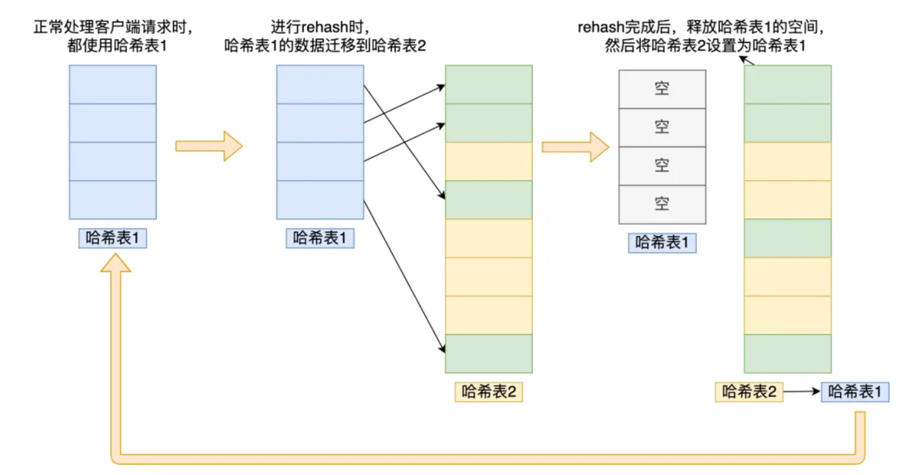

## 🧠 Hash的定义

Hash 是一个键值对（key-value）集合，其中 value 的形式如：**`value=[{field1，value1}...{fieldN，valueN}]`**。Hash 适合用于存储对象。

  

---

## ⚖️ 常用命令

### ➕ 设置键值对

- **`HSET KEY_NAME FIELD VALUE`**：为哈希表中的字段赋值。如果字段是哈希表中的一个新建字段，并且值设置成功，返回 1；如果哈希表中字段已经存在且旧值已被新值覆盖，返回 0
- **`HMSET KEY_NAME FIELD1 VALUE1 ...FIELDN VALUEN`**：同时将多个 field-value（字段-值）对设置到哈希表中。命令执行成功时返回 OK

### 🔍 查看

- **`HGET KEY_NAME FIELD_NAME`**：返回哈希表中指定字段的值。如果给定的字段或 key 不存在时，返回 nil
- **`HKEYS key`**：获取哈希表中的所有域（field）
- **`HMGET KEY_NAME FIELD1...FIELDN`**：返回哈希表中一个或多个给定字段的值
- **`HGETALL KEY_NAME`**：返回哈希表中所有的字段和值
- **`HEXISTS KEY_NAME FIELD_NAME`**：查看哈希表的指定字段是否存在

### 🗑️ 删除

- **`HDEL KEY_NAME FIELD1.. FIELDN`**：删除哈希表 key 中的一个或多个指定字段，不存在的字段将被忽略

---

## 📖 底层实现

Hash 类型的底层数据结构是由 **压缩列表或哈希表** 实现的：

- 如果哈希类型元素个数小于 **512** 个（默认值，可由 **`hash-max-ziplist-entries`** 配置），所有值小于 **64** 字节（默认值，可由 **`hash-max-ziplist-value`** 配置）的话，Redis 会使用 **Ziplist** 作为 Hash 类型的底层数据结构
- 如果哈希类型元素不满足上面条件，Redis 会使用 **哈希表** 作为 Hash 类型的底层数据结构

**后面版本使用 ListPack 实现。**



**ListPack**：ListPack 是 Redis 内部的一种数据结构，用于高效存储短小的字符串或整数集合。它是一种 **紧凑型的序列化数据结构**，旨在减少内存占用和提升性能，直接以字节序列的形式存储数据。
ZipList新增某个元素或修改某个元素时，如果空间不够，压缩列表占用的内存空间就需要重新分配。而当新插入的元素较大时，可能会导致后续元素的占用空间都发生变化，从而引起连锁更新问题，导致每个元素的空间都要重新分配，造成访问压缩列表性能的下降。

相较于 Ziplist，ListPack 移除了压缩列表中记录前一个节点长度的字段。ListPack 只记录当前节点的长度，当我们向 ListPack 加入一个新元素的时候，不会影响其他节点的长度字段变化，从而避免了压缩列表的连锁更新问题。



---

## 🔄 扩容机制

Redis 的哈希扩容是**渐进式**的。

在正常服务请求阶段，插入的数据都会写入到哈希表 1，此时的哈希表 2 并没有被分配空间。

随着数据逐步增多，触发了 rehash 操作，这个过程分为三步：

1. 给哈希表 2 分配空间，一般会比哈希表 1 大 2 倍
2. 将哈希表 1 的数据迁移到哈希表 2 中。**在 rehash 进行期间，每次哈希表元素进行新增、删除、查找或者更新操作时，Redis 除了会执行对应的操作之外，还会顺序将哈希表 1 中索引位置上的所有 key-value 迁移到哈希表 2 上**
3. 迁移完成后，哈希表 1 的空间会被释放，并把哈希表 2 设置为哈希表 1，然后在哈希表 2 新创建一个空白的哈希表，为下次 rehash 做准备

  

为了避免 rehash 在数据迁移过程中，因拷贝数据的耗时，影响 Redis 性能的情况，所以 Redis 采用了渐进式 rehash，也就是将数据的迁移的工作不再是一次性迁移完成，而是分多次迁移。在进行渐进式 rehash 的过程中，会有两个哈希表，所以在渐进式 rehash 进行期间，哈希表元素的删除、查找、更新等操作都会在这两个哈希表进行。

- 给「哈希表 2」 分配空间；
- 在 rehash 进行期间，每次哈希表元素进行新增、删除、查找或者更新操作时，Redis 除了会执行对应的操作之外，还会顺序将「哈希表 1 」中索引位置上的所有 key-value 迁移到「哈希表 2」 上；
- 随着处理客户端发起的哈希表操作请求数量越多，最终在某个时间点会把「哈希表 1 」的所有 key-value 迁移到「哈希表 2」，从而完成 rehash 操作。
- 查找一个 key 的值的话，先会在「哈希表 1」 里面进行查找，如果没找到，就会继续到哈希表 2 里面进行找到。
- 在渐进式 rehash 进行期间，新增一个 key-value 时，会被保存到「哈希表 2 」里面，而「哈希表 1」 则不再进行任何添加操作，这样保证了「哈希表 1 」的 key-value 数量只会减少，随着 rehash 操作的完成，最终「哈希表 1 」就会变成空表。
