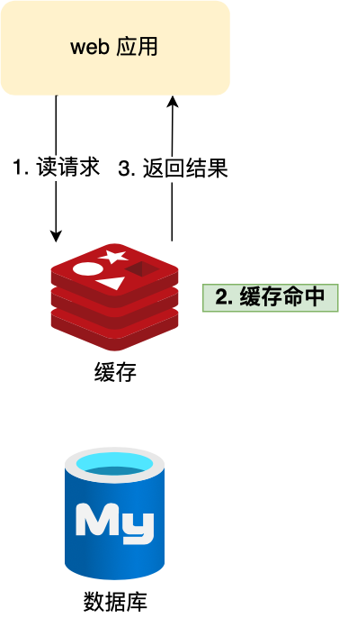
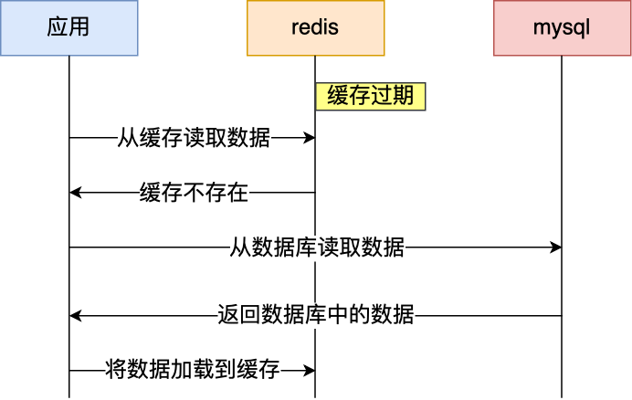
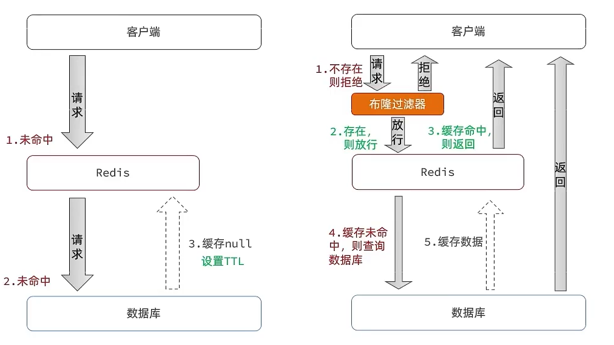
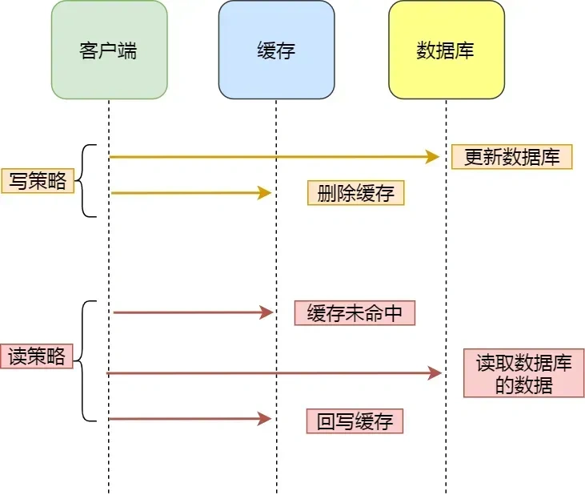
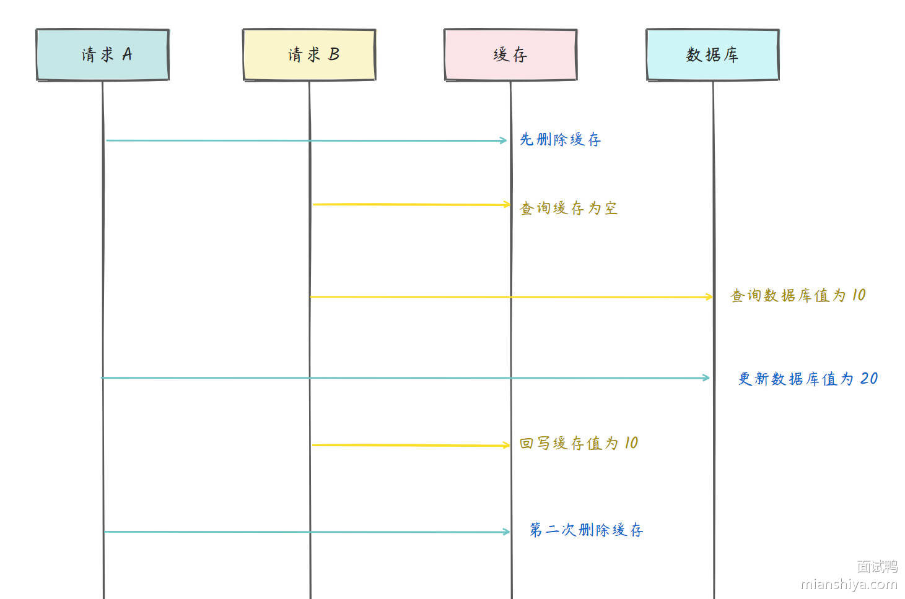

## 💾 Redis的缓存

Redis最常见的用途就是作为缓存系统。通过将热门数据存储在内存中，可以极大地提高访问速度，减轻数据库负载，这对于需要快速响应时间的应用程序非常重要。

用户的数据一般都是存储于数据库，数据库的数据是落在磁盘上的，磁盘的读写速度很慢了。当用户的请求，都访问数据库的话，请求数量一上来，数据库很容易就崩溃的了，所以为了避免用户直接访问数据库，会用 Redis 作为缓存层。

因为 Redis 是内存数据库，我们可以将数据库的数据缓存在 Redis 里，相当于数据缓存在内存，内存的读写速度比硬盘快好几个数量级，这样大大提高了系统性能。

  

## ❄️ 缓存雪崩

### 📖 定义

缓存雪崩指大量缓存数据在同一时间过期（失效）或者 Redis 故障宕机，如果此时有大量的用户请求，都无法在 Redis 中处理，导致全部请求同时访问数据库，从而造成数据库瞬间负载激增，严重的会造成数据库宕机，从而形成一系列连锁反应，造成整个系统崩溃。

通常为了保证缓存中的数据与数据库中的数据一致性，会给 Redis 里的数据设置过期时间，当缓存数据过期后，用户访问的数据如果不在缓存里，业务系统需要重新生成缓存，因此就会访问数据库，并将数据更新到 Redis 里，这样后续请求都可以直接命中缓存。

  

### 🛡️ 数据大量过期的应对方法

#### 🎲 均匀设置过期时间

如果要给缓存数据设置过期时间，应该避免将大量的数据设置成同一个过期时间。我们可以在对缓存数据设置过期时间时， **给这些数据的过期时间加上一个随机数** ，这样就保证数据不会在同一时间过期。

#### 🔐 互斥锁

当业务线程在处理用户请求时， **如果发现访问的数据不在 Redis 里，就加个互斥锁，保证同一时间内只有一个请求来构建缓存** （从数据库读取数据，再将数据更新到 Redis 里），当缓存构建完成后，再释放锁。未能获取互斥锁的请求，要么等待锁释放后重新读取缓存，要么就返回空值或者默认值。

实现互斥锁的时候，最好设置**超时时间**，不然第一个请求拿到了锁，然后这个请求发生了某种意外而一直阻塞，一直不释放锁，这时其他请求也一直拿不到锁，整个系统就会出现无响应的现象。

### ⚠️ Redis故障宕机的应对方法

#### ⚡ 服务熔断和请求限流机制

- **服务熔断机制** ：因为 Redis 故障宕机而导致缓存雪崩问题时， **暂停业务应用对缓存服务的访问，直接返回错误** ，不用再继续访问数据库，从而降低对数据库的访问压力，保证数据库系统的正常运行，然后等到 Redis 恢复正常后，再允许业务应用访问缓存服务。
- **请求限流** ：**只将少部分请求发送到数据库进行处理，再多的请求就在入口直接拒绝服务** ，等到 Redis 恢复正常并把缓存预热完后，再解除请求限流的机制。
  - 令牌桶算法
  - 漏斗算法



令牌桶算法的基本概念

- **令牌桶（Token Bucket）**：一个固定容量的桶，用于存放令牌。
- **令牌生成速率（Rate）**：令牌按固定速率 **`r`**（个/秒）加入桶中。
- **桶的最大容量（Capacity）**：最多可存放的令牌数量，超过部分被丢弃。

##### ⚙️ 算法流程如下

- **系统初始化**
  - 令牌桶被创建，初始令牌数 **`C`**
  - 每秒会 **自动生成 `r` 个新令牌**，但总令牌数不会超过 **`C`**。

- **请求到来**
  - **如果桶内 `T > 0`**，则允许请求通过，并消耗 1 个令牌。
  - **如果桶内 `T == 0`**，请求被 **拒绝（限流）**。

- **令牌自动填充**
  - 每过 1 秒，系统会向桶内添加 **`r`** 个 **新令牌**。
  - 新增的令牌 **不会超过桶的最大容量**。

- **突发流量处理**
  - 当桶内 **有足够令牌时**，可支持短时间 **高并发请求**（比如 10 个请求瞬间到来）。
  - 但当桶内令牌 **耗尽** 时，系统会 **严格按照 `r` 速率处理请求**。



#### 🗄️ 多级缓存

对于关键数据，除了在主缓存中存储，还可以在备用缓存中保存一份。当主缓存不可用时，可以快速切换到备用缓存，确保系统的稳定性和可用性。

#### 🏗️ 构建Redis集群

服务熔断或请求限流机制是缓存雪崩发生后的应对方案，可以通过 **主从节点的方式构建 Redis 缓存高可靠集群**。如果 Redis 缓存的主节点故障宕机，从节点可以切换成为主节点，继续提供缓存服务，避免了由于 Redis 故障宕机而导致的缓存雪崩问题。

---

## 💥 缓存击穿

### 📖 定义

**缓存击穿**：指某个热点数据在缓存中失效，导致大量请求直接访问数据库。此时，由于瞬间的高并发，可能导致数据库崩溃。

### 🛡️ 应对方案

#### 🔐 互斥锁方案

使用互斥锁保证同一时间只有一个业务线程更新缓存，未能获取互斥锁的请求，要么等待锁释放后重新读取缓存，要么就返回空值或者默认值。

假设现在线程1过来访问，他查询缓存没有命中，但是此时他获得到了锁的资源，那么线程1就会一个人去执行逻辑，假设现在线程2过来，线程2在执行过程中，并没有获得到锁，那么线程2就可以进行到休眠，直到线程1把锁释放后，线程2获得到锁，然后再来执行逻辑，此时就能够从缓存中拿到数据了。

  

核心思路利用 Redis 的 **`setnx`** 方法来表示获取锁：

- 若 Redis 中如果没有这个 key，则插入成功，返回 1，在 **`stringRedisTemplate`** 中返回 **`true`**
- 如果有这个 key 则插入失败，则返回 0，在 **`stringRedisTemplate`** 返回 **`false`**

#### 🔥 热点数据永不过期

由后台异步更新缓存，或者在热点数据准备要过期前，提前通知后台线程更新缓存以及重新设置过期时间。

## 🚫 缓存穿透

### 📖 定义

**缓存穿透**：指查询一个不存在（ **既不在缓存中，也不在数据库中** ）的数据，缓存中没有相应的记录，每次请求都会去数据库查询，造成数据库负担加重。

### 🛡️ 应对方案

#### ⚔️ 限制非法请求

当有大量请求访问不存在的数据的时候，也会发生缓存穿透，因此在 API 入口处我们要判断求请求参数是否合理，请求参数是否含有非法值、请求字段是否存在，如果判断出是恶意请求就直接返回错误，避免进一步访问缓存和数据库。

#### 💠 缓存空值

当发现缓存穿透的现象时，可以针对查询的数据，在缓存中设置一个空值或者默认值，这样后续请求就可以从缓存中读取到空值或者默认值，返回给应用，而不会继续查询数据库。客户端请求某个 ID 的数据，首先检查缓存是否命中。如果缓存未命中，查询数据库。如果数据库查询结果为空，将该空结果（如 null 或 {}）缓存起来，并设置一个合理的过期时间。当后续请求再访问相同 ID 时，缓存直接返回空结果，避免每次都打到数据库。

但是，这种方法存在一定的问题，比如：

- **排障/业务复杂度上升**：回存 null 以后，线上排查"为什么查不到"时，可能命中的是负缓存，而不是数据库真实结果，容易误判。
- **被攻击时变成雪崩/内存打满（负缓存污染）**：如果 key 是变量（尤其是用户可控的 id、手机号、订单号），攻击者可以构造大量不存在的 key，让 Redis 存一堆 null，把内存耗尽或挤掉热 key，甚至触发频繁淘汰/抖动。
- **不抗并发（击穿/回源风暴）**：在负缓存没建立之前（或过期瞬间），高并发对同一个不存在 key 的请求仍可能同时打到 DB。
- **误缓存**：短暂不存在 vs 永远不存在，很多业务是"最终会存在"的：比如下单后异步入库、延迟同步、分库分表迁移中。如果你把"暂时查不到"当成"永远不存在"缓存 null，会导致短时间内持续返回不存在（数据已写入但被负缓存挡住）。

#### 🌸 布隆过滤器

在写入数据库数据时，使用布隆过滤器做个标记，然后在用户请求到来时，业务线程确认缓存失效后，可以通过查询布隆过滤器快速判断数据是否存在，如果不存在，就不用通过查询数据库来判断数据是否存在。即使发生了缓存穿透，大量请求只会查询 Redis 和布隆过滤器，而不会查询数据库，保证了数据库能正常运行

##### ⚙️ 基本原理
布隆过滤器是一种空间效率极高的概率型数据结构，用于快速检查一个元素是否存在于一个集合中。
底层数据结构是一个位数组（Bit Array），大小为 m（位数组的大小），每个元素是一个 0 或 1（位数组的每个元素）。哈希函数的数量（k）和 k 个哈希函数（哈希函数）。

构造操作

- 开始时，布隆过滤器的每个位都被设置为 0。
- 当一个元素被添加到过滤器中时，它会被 k 个哈希函数分别计算得到 k 个位置，然后将位数组中对应的位设置为 1。
- 当检查一个元素是否存在于过滤器中时，同样使用 k 个哈希函数计算位置，如果任一位置的位为 0，则该元素肯定不在过滤器中；如果所有位置的位都为 1，则该元素可能在过滤器中。

##### ⚠️ 误判问题（False Positive）

由于哈希冲突的原因，布隆过滤器存在误判问题，**查询布隆过滤器说数据存在，并不一定证明数据库中存在这个数据，但是查询到数据不存在，数据库中一定就不存在这个数据**。

误判率有以下几个决定因素：

- **位数组的大小（m）**：位数组的大小决定了可以存储的标志位数量。哈希函数设置的 bit 分布越稀疏，冲突概率越低。如果位数组过小，那么哈希碰撞的几率就会增加，从而导致更高的误判率。
- **哈希函数的数量（k）**：哈希函数的数量决定了每个元素在位数组中标记的位数。哈希函数越多，碰撞的概率也会相应变化。如果哈希函数太少，则过滤器很快会变得不精确；如果太多，误判率也会升高，效率下降。
- **存入的元素数量（n）**：存入的元素越多，哈希碰撞的几率越大，从而导致更高的误判率。

布隆过滤器误判了(判断阳性)，依然需要二次查询数据库，去数据库/缓存中查一次真正数据；
若数据库返回不为空，说明确实是真阳性。

##### ⚖️ 优缺点

- **优点**
  - 高效性：插入和查询操作都非常高效，时间复杂度为 O(k)，k 为哈希函数的数量。
  - 节省空间：相比于直接存储所有元素，布隆过滤器大幅度减少了内存使用。
  - 可扩展性：可以根据需要调整位数组的大小和哈希函数的数量来平衡时间和空间效率。
- **缺点**
  - 误判率：可能会误认为不存在的元素在集合中，但不会漏报（不存在的元素不会被认为存在）。
  - 不可删除：一旦插入元素，不能删除，因为无法确定哪些哈希值是由哪个元素设置的。
  - 需要多个哈希函数：选择合适的哈希函数并保证它们独立性并不容易。

##### 🔄 与哈希表的比较

- 布隆过滤器是一种基于位数组和多个哈希函数的概率型数据结构，适合在内存资源有限、数据量大且能容忍一定误判的场景下使用。

- 相比哈希表，布隆过滤器的内存开销非常小，能快速判断一个元素是否存在。虽然它存在误判，但不会漏报，因此在防止缓存穿透、黑名单过滤和推荐系统去重等场景中广泛使用。

  

## 🔄 缓存和数据库的一致性问题

### 📚 CAP理论
CAP理论描述：描述了在分区（Partition）发生的情况下，系统无法同时保证一致性（Consistency）和可用性（Availability），只能在两者之间做权衡。

核心属性如下：

- **一致性（Consistency）**：所有节点对同一份数据的访问必须是最新的（或者说是同步的），任何一个读请求都应该返回最新的写入数据。
- **可用性（Availability）**：每个请求都能在合理的时间内获得响应（无论返回的数据是否是最新的），不能因为某些节点故障而影响整个系统的正常运行。
- **分区容忍性（Partition Tolerance）**：系统能在网络分区的情况下继续运行，即使部分节点之间的通信被中断。分布式系统中，网络分区是不可避免的，因此任何实际系统都必须具备分区容忍性。

### 📌 旁路缓存策略

旁路缓存：数据一致性高：如果先更新数据库，确保了数据在数据库中始终是最新的，缓存删除后，再从数据库中加载数据时，能保证数据的最终一致性（Eventual Consistency）。

#### 📝 具体实现
- 对于读操作：如果缓存不命中，则会从数据库读取数据，然后将数据库的数据回种到缓存中。
- 对于写操作：先更新数据库，再删除缓存，后续等查询把数据库的数据回种到缓存中

  

缓存是通过牺牲强一致性来提高性能的。这是由 **CAP理论** 决定的。缓存系统适用的场景就是非强一致性的场景，它属于CAP中的AP。所以，如果需要业务保持强一致，就不适合使用缓存。
使用缓存会带来数据更新的延迟，因此需要结合业务场景仔细评估。同时，缓存必须设置过期时间——时间太短会导致请求频繁落到数据库，失去缓存优势；时间太长则会使系统长时间存在脏数据，浪费内存资源。



为什么选择删除缓存而不是更新缓存

相对而言，删除缓存的速度比更新缓存的速度要快得多。假如是更新缓存，那么可能请求 A 更新完 MySQL 后在更新 Redis 中，请求 B 已经读取到 Redis 中的旧值返回了，又一次导致了缓存和数据库不一致。



#### ⚠️ 存在的问题
旁路缓存策略存在以下问题：

- **并发读导致"旧值回填"** ：当请求 A 更新完 MySQL 后在更新 Redis 中，请求 B 已经读取到 Redis 中的旧值返回了，再一次导致了缓存和数据库不一致。
- **删缓存失败导致长期不一致** ：MySQL 已更新，但 Redis 删除失败（网络抖动、超时、主从切换、客户端异常）。下次读请求直接命中Redis旧值， 永远无法自愈，只有人工干预或缓存主动过期才能恢复

以下面的业务场景为例：

| 时间点 | 线程A（写） | 线程B（读） | Redis | MySQL |
|--------|-------------|-------------|-------|-------|
| t0 | - | - | user:1 = "old" (TTL到期) | "old" |
| t1 | - | GET Redis → miss | - | - |
| t1 | - | 查MySQL（快照读/从库延迟） | - | 读到"old" |
| t2 | UPDATE MySQL = "new" | - | - | "new" |
| t2 | DEL Redis | - | 删除成功 | - |
| t3 | - | 回填旧值 → SET "old" | user:1 = "old" ❌ | "new" |

如上所示，线程B在t1时刻查到旧值"old"，而线程A在t2时刻已更新MySQL为"new"并删除缓存。最终线程B在t3将旧值回填到Redis，导致Redis和MySQL数据不一致。

### ⏰ 延时双删策略

#### 📝 具体实现

- 更新数据库之前，删除一次缓存
- 更新完数据库后
- 等读线程回填完成，再进行一次延迟删除

#### ✨ 优势

假如在 **第一步删除缓存** 后，仍然存在并发请求：
- 另一个线程可能 **读取旧数据并写回缓存** ，导致缓存回滚。
- **延迟一段时间** 后，第二次删除可以清理这类脏数据，保证缓存不包含旧数据。

  

由图可知需要保证第二次删除缓存要在回写缓存之后，常见策略是 **让请求 A 的最后一次删除，等待 500ms**

### 📨 消息队列异步删除

作为旁路删除策略的一种改进，将删除缓存的操作通过消息队列（如 RocketMQ、Kafka）异步处理。消息消费失败可重试，提高删除操作的可靠性。

#### 📝 具体实现

- 更新数据库后，向消息队列发送一条删除缓存的消息。
- 消费者消费该消息，执行删除 Redis 的操作。如果删除失败，消息会重试。如果重试超过一定次数仍未成功，则向业务层发送报错信息。

### 🏗️ Canal + 消息队列 + Binlog同步

作为旁路删除策略的最终改进方案，通过订阅 Binlog 事件来保证更新数据库成功，消息消费失败可重试，确保删除缓存操作的可靠性。

#### 📝 具体实现

- 由中间件（如 Canal）伪装成 MySQL 的从库，订阅 Binlog 日志。
- 业务系统正常写入 MySQL，数据更新后会产生变更日志，记录在 binlog 中。
- Canal 监听 Binlog 事件，解析数据的变更详情（增、删、改），发送到 Kafka。MQ 写入必须使用**强一致性写入策略**。
- 消费者从 Kafka 顺序消费消息，根据消息内容执行删除 Redis 的操作。如果消费失败，消息会重试。

#### ✨ 优势

- **消息队列重试机制**：引入消息队列后，删除缓存的操作由消费者执行。如果删除失败，消息会重新入队并重试。如果重试超过一定次数仍未成功，则向业务层发送报错信息。
- **订阅 Binlog 保证数据库更新成功**：通过订阅 MySQL binlog 日志，拿到具体要操作的数据，然后再执行缓存删除。Canal 中间件正是基于这个原理实现的，binlog 日志采集发送到 MQ 队列后，通过 ACK 机制确认处理，保证数据缓存一致性。