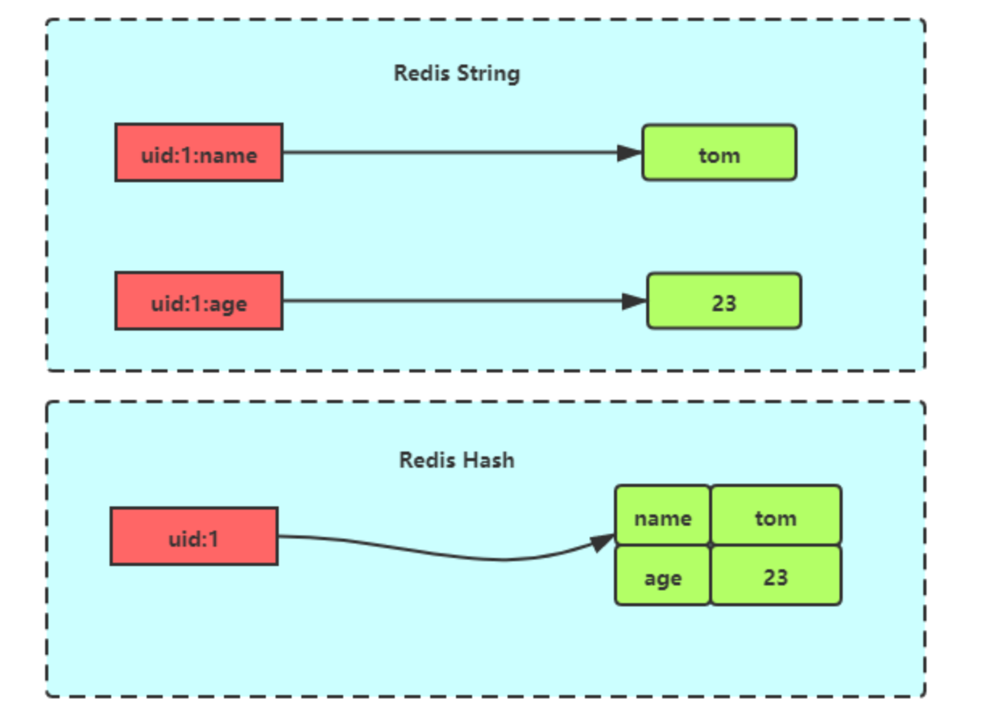

## Hash的定义

Hash 是一个键值对（key - value）集合，其中 value 的形式如： `value=[{field1，value1}，...{fieldN，valueN}]`。Hash 适合用于存储对象。

## 常用命令

- 设置键值对

  - **`HSET KEY_NAME FIELD VALUE`** ：为哈希表中的字段赋值
    - 如果字段是哈希表中的一个新建字段，并且值设置成功，返回 1 。 如果哈希表中域字段已经存在且旧值已被新值覆盖，返回 0 
  - **`HMSET KEY_NAME FIELD1 VALUE1 ...FIELDN VALUEN`** ：同时将多个 field-value (字段-值)对设置到哈希表中。
    - 如果命令执行成功，返回 OK 。

- 查看

  - **`HGET KEY_NAME FIELD_NAME`**  ：返回哈希表中指定字段的值
    - 返回给定字段的值。如果给定的字段或 key 不存在时，返回 nil 。
  - **`HKEYS key`** ：获取哈希表中的所有域（field）
  - **`HMGET KEY_NAME FIELD1...FIELDN`** ：返回哈希表中，一个或多个给定字段的值。
  - **`HGETALL KEY_NAME`** ：返回哈希表中，所有的字段和值。
  - **`HEXISTS KEY_NAME FIELD_NAME`**  ：查看哈希表的指定字段是否存在。

- 删除

  - **`HDEL KEY_NAME FIELD1.. FIELDN`**  ：删除哈希表 key 中的一个或多个指定字段，不存在的字段将被忽略。

## 底层实现

Hash 类型的底层数据结构是由 **压缩列表或哈希表** 实现的：

- 如果哈希类型元素个数小于 `512` 个（默认值，可由 `hash-max-ziplist-entries` 配置），所有值小于 `64` 字节（默认值，可由 `hash-max-ziplist-value` 配置）的话，Redis 会使用 **压缩列表** 作为 Hash 类型的底层数据结构；
- 如果哈希类型元素不满足上面条件，Redis 会使用 **哈希表** 作为 Hash 类型的 底层数据结构。

后面版本使用 **ListPack** 实现



ListPack 是 Redis 内部的一种数据结构，用于高效存储短小的字符串或整数集合。它是一种 **紧凑型的序列化数据结构** ，旨在减少内存占用和提升性能。直接以字节序列的形式存储数据。



## 扩容机制

Redis的哈希扩容是渐进式的

在正常服务请求阶段，插入的数据，都会写入到「哈希表 1」，此时的「哈希表 2 」 并没有被分配空间。

随着数据逐步增多，触发了 rehash 操作，这个过程分为三步：

- 给「哈希表 2」 分配空间，一般会比「哈希表 1」 大 2 倍；

- 将「哈希表 1 」的数据迁移到「哈希表 2」 中；

  - **在 rehash 进行期间，每次哈希表元素进行新增、删除、查找或者更新操作时，Redis 除了会执行对应的操作之外，还会顺序将「哈希表 1 」中索引位置上的所有 key-value 迁移到「哈希表 2」 上**；

- 迁移完成后，「哈希表 1 」的空间会被释放，并把「哈希表 2」 设置为「哈希表 1」，然后在「哈希表 2」 新创建一个空白的哈希表，为下次 rehash 做准备。

  

  

在进行渐进式 rehash 的过程中，会有两个哈希表，所以在渐进式 rehash 进行期间，哈希表元素的删除、查找、更新等操作都会在这两个哈希表进行。查找操作时先会在「哈希表 1」 里面进行查找，如果没找到，就会继续到哈希表 2 里面进行找到。
