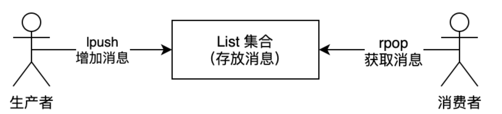

## List类型定义

List 列表是简单的字符串列表，**按照插入顺序排序**，可以从头部或尾部向 List 列表添加元素。

列表的最大长度为 `2^32 - 1`，也即每个列表支持超过 `40 亿`个元素。

特点与LinkedList一致

- 有序
- 元素可以重复
- 插入和删除快
- 查询速度一般

## 常见命令

- 获取元素
  - **`LINDEX KEY_NAME INDEX_POSITION`** ：通过索引获取列表中的元素。你也可以使用负数下标，以 -1 表示列表的最后一个元素， -2 表示列表的倒数第二个元素
- 插入元素
  - **`LPUSH KEY_NAME VALUE1.. VALUEN`** ：将一个或多个值插入到列表头部。 如果 key 不存在，一个空列表会被创建并执行 LPUSH 操作。 当 key 存在但不是列表类型时，返回一个错误。
  - **`LPUSHX KEY_NAME VALUE1.. VALUEN`** ：将一个值插入到已存在的列表头部，列表不存在时操作无效。
  - **`LINSERT key BEFORE|AFTER pivot value`** ：将值 value 插入到列表 key 当中，位于值 pivot 之前或之后。
  - **`RPUSH KEY_NAME VALUE1..VALUEN`** ：将一个或多个值插入到列表的尾部(最右边)
  - **`RPUSHX KEY_NAME VALUE1..VALUEN`** ：将一个值插入到已存在的列表尾部(最右边)。如果列表不存在，操作无效
  - **`BRPOPLPUSH LIST1 ANOTHER_LIST TIMEOUT`**  ：Redis Brpoplpush 命令从列表中取出最后一个元素，并插入到另外一个列表的头部； 如果列表没有元素会阻塞列表直到等待超时或发现可弹出元素为止。
- 删除元素
  - **`BLPOP LIST1 LIST2 .. LISTN TIMEOUT`** ：移出并获取列表的第一个元素， 如果列表没有元素会阻塞列表直到等待超时或发现可弹出元素为止
    - 如果列表为空，返回一个 nil 。 否则，返回一个含有两个元素的列表，第一个元素是被弹出元素所属的 key ，第二个元素是被弹出元素的值。
  - **`BRPOP LIST1 LIST2 .. LISTN TIMEOUT`** ：移出并获取列表的最后一个元素， 如果列表没有元素会阻塞列表直到等待超时或发现可弹出元素为止。
    - 假如在指定时间内没有任何元素被弹出，则返回一个 nil 和等待时长。 反之，返回一个含有两个元素的列表，第一个元素是被弹出元素所属的 key ，第二个元素是被弹出元素的值。
  - **`Lpop KEY_NAME`** ：移除并返回列表的第一个元素
  - **`RPOP KEY_NAME`** ：用于移除列表的最后一个元素，返回值为移除的元素

## 底层实现原理

List 类型的底层数据结构是由 **双向链表或压缩列表** 实现的：

- 如果列表的元素个数小于 `512` 个（默认值，可由 `list-max-ziplist-entries` 配置），列表每个元素的值都小于 `64` 字节（默认值，可由 `list-max-ziplist-value` 配置），Redis 会使用 **压缩列表（ziplist）** 作为 List 类型的底层数据结构；
- 如果列表的元素不满足上面的条件，Redis 会使用**双向链表**作为 List 类型的底层数据结构



**Ziplist**：

- 简单、紧凑、连续存储，适用于小数据量场景，但对大量数据或频繁的修改操作不太友好。
- 适合小数据量场景，例如短列表、小哈希表等，因为它的内存紧凑，可以大幅减少内存使用

**Quicklist**：

- 通过将链表和 Ziplist 结合，既实现了链表的灵活操作，又能节省内存
- Quicklist 是为了替代纯链表而设计的，适用于需要频繁对列表进行插入、删除、查找等操作的场景，并且数据量可能较大。它在存储多个元素时，既保留了链表的灵活性，又具备压缩列表的内存优势。
- Quicklist 由 list 和 ziplist 结合而成，它是一个由 ziplist 充当节点的双向链表。



## 应用场景

### 简单消息队列

- 消息保序性：使用 LPUSH + RPOP
  - 生产者使用 `LPUSH key value[value...]` 将消息插入到队列的头部，如果 key 不存在则会创建一个空的队列再插入消息。
  - 消费者使用 `RPOP key` 依次读取队列的消息，先进先出。
- 消息重复性：**自行为每个消息生成一个全局唯一ID**
- 消息可靠性：**让消费者程序从一个 List 中读取消息，同时，Redis 会把这个消息再插入到另一个 List（可以叫作备份 List）留存**。