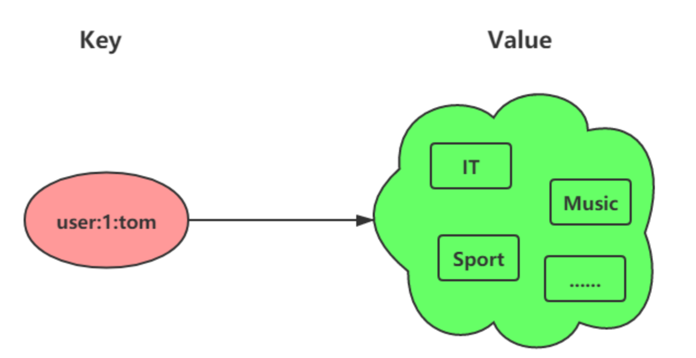

## set的定义

Set 类型是一个无序并唯一的键值集合，它的存储顺序不会按照插入的先后顺序进行存储。

## set的常见命令

- 添加元素
  - **`SADD KEY_NAME VALUE1..VALUEN`** ：将一个或多个成员元素加入到集合中，已经存在于集合的成员元素将被忽略。
    - 被添加到集合中的新元素的数量
  - **`SMOVE SOURCE DESTINATION MEMBER`**  ：将指定成员 member 元素从 source 集合移动到 destination 集合。
- 移除元素
  - **`SPOP key [count]`** ：移除集合中的指定 key 的一个或多个随机元素
    - 被移除的随机元素。 当集合不存在或是空集时，返回 nil 。
  - **`SREM KEY MEMBER1..MEMBERN`** ：移除集合中的一个或多个成员元素，不存在的成员元素会被忽略。
- 获取元素
  - **`SMEMBERS key`** ：返回集合中的所有成员
  - **`SISMEMBER KEY VALUE`**  ：判断成员元素是否是集合的成员
- 集合运算
  - **`SDIFF FIRST_KEY OTHER_KEY1..OTHER_KEYN`**  ：计算差集
    - **`SDIFFSTORE destination key [key ...]`**
  - **`SINTER KEY KEY1..KEYN`** ：计算交集
    - **`SINTERSTORE destination key [key ...]`**
  - **`SUNION KEY KEY1..KEYN`** ：计算并集
  - **`SUNIONSTORE destination key [key ...]`**

## 底层实现

Set 类型的底层数据结构是由**哈希表或整数集合**实现的：

- 如果集合中的元素都是整数且元素个数小于 `512` （默认值，`set-maxintset-entries`配置）个，Redis 会使用**整数集合**作为 Set 类型的底层数据结构；
- 如果集合中的元素不满足上面条件，则 Redis 使用**哈希表**作为 Set 类型的底层数据结构。