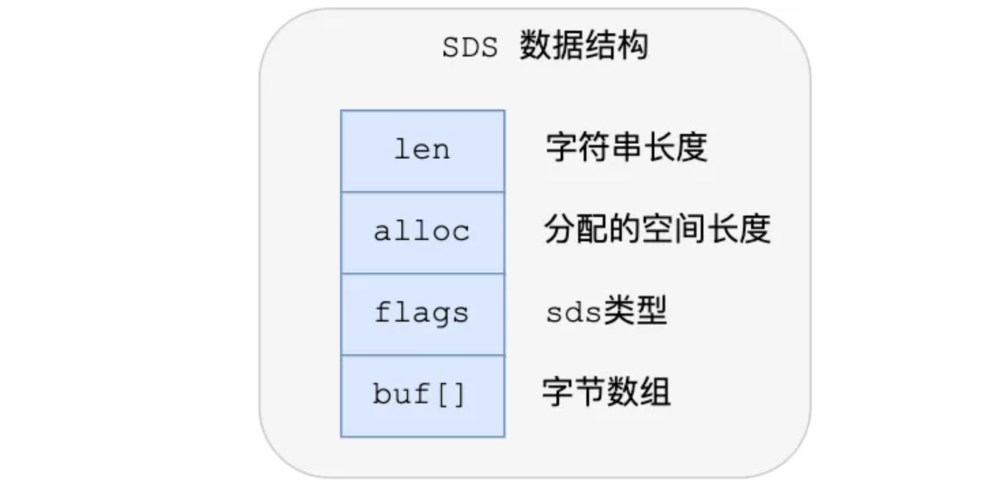

## String的定义

字符串是最基础的数据类型，value 可以是：

- 字符串（简单的字符串、复杂的字符串（例如 JSON、XML））
- 数字 （整数、浮点数）
- 是二进制（图片、音频、视频），但最大不能超过 512MB。

## String的常见命令

- 设置键值对

  - **`SET KEY_NAME VALUE`** ：设置给定 key 的值。如果 key 已经存储其他值， SET 就覆写旧值，且无视类型。

  - **`GETSET KEY_NAME VALUE`** ：设置指定 key 的值，并返回 key 的旧值

  - **`SETEX KEY_NAME TIMEOUT VALUE`** ：为指定的 key 设置值及其过期时间。如果 key 已经存在， SETEX 命令将会替换旧的值。

  - **`MSET key1 value1 key2 value2 .. keyN valueN`**  :同时设置一个或多个 key-value 对

    

- 根据键查找值： **`GET KEY_NAME`**

  - 返回 key 的值，如果 key 不存在时，返回 nil。 如果 key 不是字符串类型，那么返回一个错误。

- 获取指定 key 所储存的字符串值的长度：**`STRLEN KEY_NAME`**

## String的底层实现

Redis 中的 String 类型底层实现主要基于 SDS（Simple Dynamic String 简单动态字符串）结构，并结合 int、embstr、raw 等不同的编码方式进行优化存储。

### SDS的结构

- **en，记录了字符串长度**。这样获取字符串长度的时候，只需要返回这个成员变量值就行，时间复杂度只需要 O（1）。
- **alloc，分配给字符数组的空间长度**。这样在修改字符串的时候，可以通过 `alloc - len` 计算出剩余的空间大小，可以用来判断空间是否满足修改需求，如果不满足的话，就会自动将 SDS 的空间扩展至执行修改所需的大小，然后才执行实际的修改操作，所以使用 SDS 既不需要手动修改 SDS 的空间大小，也不会出现前面所说的缓冲区溢出的问题。
- **flags，用来表示不同类型的 SDS**。一共设计了 5 种类型，分别是 sdshdr5、sdshdr8、sdshdr16、sdshdr32 和 sdshdr64，后面在说明区别之处。
- **buf[]，字符数组，用来保存实际数据**。不仅可以保存字符串，也可以保存二进制数据。

### 编码方式

- 如果一个字符串对象保存的是整数值，并且这个整数值可以用`long`类型来表示，那么字符串对象会将整数值保存在字符串对象结构的`ptr`属性里面（将`void*`转换成 long），并将字符串对象的编码设置为`int`。
- 如果字符串对象保存的是一个短字符串，那么字符串对象将使用一个简单动态字符串（SDS）来保存这个字符串，并将对象的编码设置为`embstr`， `embstr`编码是专门用于保存短字符串的一种优化编码方式
- 如果字符串对象保存的是一个长字符串，那么字符串对象将使用一个简单动态字符串（SDS）来保存这个字符串，并将对象的编码设置为`raw`：