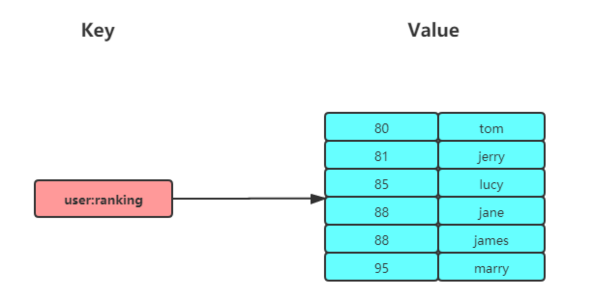
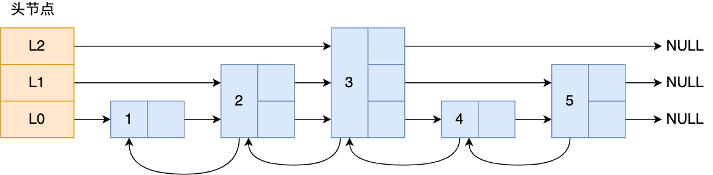

## ZSet的定义

Redis的ZSet是一个可排序的set集合，与Java中的TreeSet有些类似，但底层数据结构却差别很大。ZSet中的每一个元素都带有一个score属性，可以基于score属性对元素排序，底层的实现是一个跳表（SkipList）加 hash表。ZSet具备下列特性：可排序元素不重复查询速度快

## 常用命令

- 查看
  - **`ZSCORE key member`** ：返回有序集合key中元素member的分值
  - **`ZCARD key`**  ：返回有序集合key中元素个数
  - **`ZRANGE key start stop [WITHSCORES]`** ：正序获取有序集合key从start下标到stop下标的元素
  - **`ZRANGEBYSCORE key min max [WITHSCORES] [LIMIT offset count]`** ：返回有序集合中指定分数区间内的成员，分数由低到高排序。
  - **`ZCOUNT key min max`** ：计算有序集合中指定分数区间的成员数量。
- 加入元素
  - **`ZADD KEY_NAME SCORE1 VALUE1.. SCOREN VALUEN`** ：将一个或多个成员元素及其分数值加入到有序集当中
- 删除元素
  - **`ZREM key member [member ...]`** ：移除有序集中的一个或多个成员，不存在的成员将被忽略。

## 底层实现

Redis 中的 **ZSet（有序集合，Sorted Set）** 是一种由 **跳表（Skip List）** 和 **哈希表（Hash Table）** 组成的数据结构。ZSet 结合了集合（Set）的特性和排序功能，能够存储具有唯一性的成员，并根据成员的分数（score）进行排序。

ZSet 的实现由两个核心数据结构组成：

1. **跳表（Skip List）**：用于存储数据的排序和快速查找。
2. **哈希表（Hash Table）**：用于存储成员与其分数的映射，提供快速查找。

跳表的实现原理

**跳表是在链表基础上改进过来的，实现了一种「多层」的有序链表**

跳表的查找复杂度就是 $O(logN)$。

跳表是一个带有层级关系的链表，而且每一层级可以包含多个节点，每一个节点通过指针连接起来，实现这一特性就是靠跳表节点结构体中的**zskiplistLevel 结构体类型的 level 数组**。