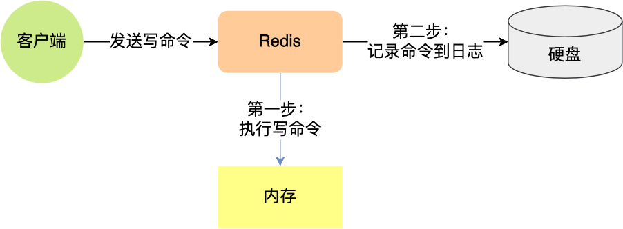

## 主要的持久化机制

Redis 提供两种主要的持久化机制：

**RDB（Redis Database）快照**：

- RDB 是通过生成某一时刻的数据快照来实现持久化的，可以在特定时间间隔内保存数据的快照。
- 适合灾难恢复和备份，能生成紧凑的二进制文件，但可能会在崩溃时丢失最后一次快照之后的数据。

**AOF（Append Only File）日志**：

- AOF 通过将每个写操作追加到日志文件中实现持久化，支持将所有写操作记录下来以便恢复。
- 数据恢复更为精确，但文件体积较大，重写时可能会消耗更多资源。

## AOF持久化机制

AOF 持久化机制是指 **将 Redis 写命令以追加的形式写入到磁盘中的 AOF 文件** ，AOF 文件记录了 Redis 在内存中的操作过程，只要在 Redis 重启后重新执行 AOF 文件中的写命令即可将数据恢复到内存中。

### 执行过程

实际上Redis先执行写操作命令后，才将该命令记录到 AOF 日志里

- 当 AOF 持久化机制被启用时，Redis 服务器会将接收到的所有写命令追加到 AOF 缓冲区的末尾。

- 根据写回策略将缓冲区中的命令刷新到磁盘的 AOF 文件中，此时数据并没有写入到硬盘，而是拷贝到了内核缓冲区 page cache，等待内核将数据写入硬盘；
- 随着 AOF 文件的不断增长，Redis 会启用重写机制来生成一个更小的 AOF 文件
- 当 Redis 服务器重启时，会读取 AOF 文件中的所有命令并重新执行它们，以恢复重启前的内存状态。

优缺点

- 优点
  - **避免额外的检查开销。**
    - 因为如果先将写操作命令记录到 AOF 日志里，再执行该命令的话，如果当前的命令语法有问题，那么如果不进行命令语法检查，该错误的命令记录到 AOF 日志里后，Redis 在使用日志恢复数据时，就可能会出错。
    - 而如果先执行写操作命令再记录日志的话，只有在该命令执行成功后，才将命令记录到 AOF 日志里，这样就不用额外的检查开销，保证记录在 AOF 日志里的命令都是可执行并且正确的。
  - **不会阻塞当前写操作命令的执行** ：因为当写操作命令执行成功后，才会将命令记录到 AOF 日志。
- 缺点
  -  **丢失的风险** ：执行写操作命令和记录日志是两个过程，那当 Redis 在还没来得及将命令写入到硬盘时，服务器发生宕机了，这个数据就会有丢失风险
  - 由于写操作命令执行成功后才记录到 AOF 日志，所以不会阻塞当前写操作命令的执行，但是 **可能会给「下一个」命令带来阻塞风险** 。
  - **恢复速度慢** ：因为记录了每一个写操作，所以AOF文件通常比RDB文件更大，消耗更多的磁盘空间。并且，频繁的磁盘IO操作可能会对Redis的写入性能造成一定影响。而且，当问个文件体积过大时，AOF会进行重写操作，AOF如果没有开启AOF重写或者重写频率较低，恢复过程可能较慢，因为它需要重放所有的操作命令。

### 写回策略

- **Always** ：每次写操作命令执行完后，同步将 AOF 日志数据写回硬盘；
- **Everysec** ：每次写操作命令执行完后，先将命令写入到 AOF 文件的内核缓冲区，然后每隔一秒将缓冲区里的内容写回到硬盘；
- **No** ：不由 Redis 控制写回硬盘的时机，转交给操作系统控制写回的时机，也就是每次写操作命令执行完后，先将命令写入到 AOF 文件的内核缓冲区，再由操作系统决定何时将缓冲区内容写回硬盘。

三种写回策略的缺点

- Always 策略：可以最大程度保证数据不丢失，但是由于它每执行一条写操作命令就同步将 AOF 内容写回硬盘，所以是不可避免会影响主进程的性能；
- No 策略：是交由操作系统来决定何时将 AOF 日志内容写回硬盘，相比于 Always 策略性能较好，但是操作系统写回硬盘的时机是不可预知的，如果 AOF 日志内容没有写回硬盘，一旦服务器宕机，就会丢失不定数量的数据。
- Everysec 策略：是折中的一种方式，避免了 Always 策略的性能开销，也比 No 策略更能避免数据丢失，当然如果上一秒的写操作命令日志没有写回到硬盘，发生了宕机，这一秒内的数据自然也会丢失。

### 重写机制

- 主进程在通过 `fork` 系统调用生成 bgrewriteaof 子进程时，操作系统会把主进程的「**页表**」复制一份给子进程，这个页表记录着虚拟地址和物理地址映射关系，而不会复制物理内存，也就是说，两者的虚拟空间不同，但其对应的物理空间是同一个。
- 当父进程或者子进程在向这个内存发起写操作时，CPU 就会触发 **写保护中断** ，这个写保护中断是由于违反权限导致的，然后操作系统会在「写保护中断处理函数」里进行 **物理内存的复制** ，并重新设置其内存映射关系，将父子进程的内存读写权限设置为 **可读写** ，最后才会对内存进行写操作。

重写 AOF 日志过程中，如果主进程修改了已经存在 key-value，此时这个 key-value 数据在子进程的内存数据就跟主进程的内存数据不一致了。为了解决这个问题，Redis 设置了一个 **AOF 重写缓冲区**，这个缓冲区在创建 bgrewriteaof 子进程之后开始使用。

在重写 AOF 期间，当 Redis 执行完一个写命令之后，它会 **同时将这个写命令写入到 「AOF 缓冲区」和 「AOF 重写缓冲区」** 。

当子进程完成 AOF 重写工作后，会向主进程发送一条信号，信号是进程间通讯的一种方式，且是异步的。

主进程收到该信号后，会调用一个信号处理函数，该函数主要做以下工作：

- 将 AOF 重写缓冲区中的所有内容追加到新的 AOF 的文件中，使得新旧两个 AOF 文件所保存的数据库状态一致；
- 新的 AOF 的文件进行改名，覆盖现有的 AOF 文件。

## RDB持久化机制

RDB 持久化通过创建快照来获取内存某个时间点上的副本，利用快照可以进行方便地进行主从复制。

redis.conf 文件可以配置在 x 秒内如果至少有 y 个 key 发生变化就会触发命令进行持久化操作。

- 优点
  - **恢复速度快** ： RDB通过快照的形式保存某一时刻的数据状态，文件体积小，备份和恢复的速度非常快。
  - **服务性能影响小** ：RDB是在主线程之外通过fork子进程来进行的，不会阻塞服务器处理命令请求，对Redis服务的性能影响较小。
  - **文件小** ：由于是定期快照，RDB文件通常比AOF文件小得多。
- 缺点
  - **数据丢失** ：RDB方式在两次快照之间，如果Redis服务器发生故障，这段时间的数据将会丢失。
  - **数据不一致** ：如果在RDB创建快照到恢复期间有写操作，恢复后的数据可能与故障前的数据不完全一致

### 生成RDB快照的过程

- 执行了 save 命令，就会在主线程生成 RDB 文件，由于和执行操作命令在同一个线程，所以如果写入 RDB 文件的时间太长，**会阻塞主线程**；
- 执行了 bgsave 命令，会创建一个子进程来生成 RDB 文件，这样可以**避免主线程的阻塞**

使用bgsave命令的流程

- 检查子进程（检查是否存在 AOF/RDB 的子进程正在进行），如果有返回错误
- 触发持久化，调用 rdbSaveBackground
- 开始 fork，子进程执行 rdb 操作，同时主进程响应其他操作。
- RDB 完成后，替换原来的旧 RDB 文件，子进程退出。

### 生成RDB快照的请求处理

在 Redis 生成 RDB 文件时是异步的（使用 bgsave 命令），**采用了 fork 子进程的方式来进行快照操作**。生成 RDB 文件的过程由子进程执行，主进程继续处理客户端请求，所以可以保证 Redis 在生成快照的过程中依然对外提供服务，不会影响正常请求。

在生成过程中依然能正常进行数据修改

主要原理就是 **写时复制**

- 当主进程 `fork` 出一个子进程后，并不会把主进程的所有内存数据重新复制一份给子进程，而是让主进程和子进程共享相同的内存页面。底层的实现仅仅复制了**页表**，但映射的物理内存还是同一个。
- 当主进程接收到写的请求时，主进程会将对应数据所在的页复制一份，对复制的副本进行修改。此时子进程指向的还是老的页，因此数据没有变化。

## RDB和AOF的选择

- 如果需要尽可能减少数据丢失，AOF 是更好的选择。尤其是在频繁写入的环境下，设置 AOF 每秒同步可以最大限度减少数据丢失。
- 如果性能是首要考虑，RDB 可能更适合。RDB 的快照生成通常对性能影响较小，并且数据恢复速度快。
- 如果系统需要经常重启，并且希望系统重启后快速恢复，RDB 可能是更好的选择。虽然 AOF 也提供了良好的恢复能力，但重写 AOF 文件可能会比较慢。

## BigKey问题

Redis 中的 "big Key" 是指一个内存空间占用比较大的键（Key）

- **工作线程阻塞** ：由于 Redis 单线程执行命令，操作大 Key 时耗时较长，从而导致 Redis 出现其它命令阻塞的问题。
- **网络阻塞** ：大 Key 对资源的占用巨大，在你进行网络 I/O 传输的时候，导致你获取过程中产生的网络流量较大，从而产生网络传输时间延长甚至网络传输发现阻塞的现象
- **客户端超时** ：因为操作大 Key 时耗时较长，可能导致客户端等待超时。

### 对持久化的影响

#### 对AOF的影响

- 对写回策略的影响

  - 当使用 Always 策略的时候：如果写入是一个大 Key，主线程在执行 fsync() 函数的时候，阻塞的时间会比较久，因为当写入的数据量很大的时候，数据同步到硬盘这个过程是很耗时的。

  - 当使用 Everysec 策略的时候，由于是异步执行 fsync() 函数，所以大 Key 持久化的过程（数据同步磁盘）不会影响主线程。

  - 当使用 No 策略的时候，由于永不执行 fsync() 函数，所以大 Key 持久化的过程不会影响主线程。

- 对AOF重写的影响

  - 当 AOF 日志写入了很多的大 Key，AOF 日志文件的大小会很大，那么很快就会触发 **AOF 重写机制**。
  - 创建子进程的途中，由于要复制父进程的页表等数据结构，阻塞的时间跟页表的大小有关，页表越大，阻塞的时间也越长；
  - 创建完子进程后，如果父进程修改了共享数据中的大 Key，就会发生写时复制，这期间会拷贝物理内存，由于大 Key 占用的物理内存会很大，那么在复制物理内存这一过程，就会比较耗时，所以有可能会阻塞父进程。

#### 对RDB的影响

- 创建子进程的途中，由于要复制父进程的页表等数据结构，阻塞的时间跟页表的大小有关，页表越大，阻塞的时间也越长；
- 创建完子进程后，如果父进程修改了共享数据中的大 Key，就会发生写时复制，这期间会拷贝物理内存，由于大 Key 占用的物理内存会很大，那么在复制物理内存这一过程，就会比较耗时，所以有可能会阻塞父进程。