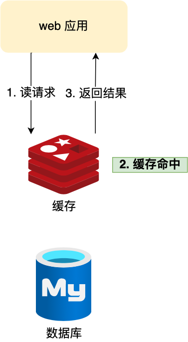
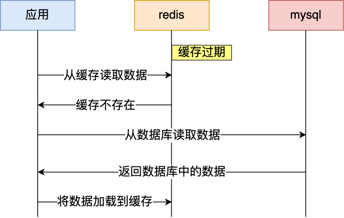
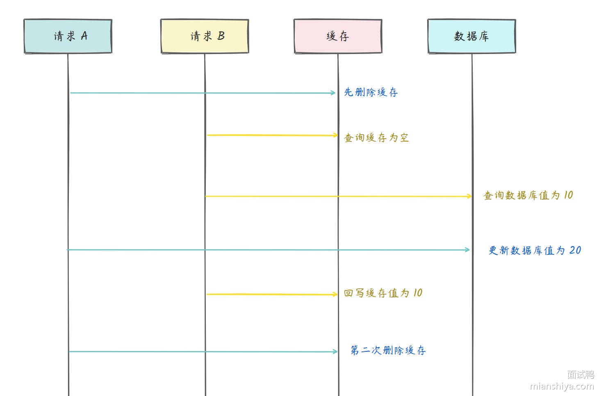

## Redis的缓存

Redis最常见的用途就是作为缓存系统。通过将热门数据存储在内存中，可以极大地提高访问速度，减轻数据库负载，这对于需要快速响应时间的应用程序非常重要。

用户的数据一般都是存储于数据库，数据库的数据是落在磁盘上的，磁盘的读写速度很慢了。当用户的请求，都访问数据库的话，请求数量一上来，数据库很容易就崩溃的了，所以为了避免用户直接访问数据库，会用 Redis 作为缓存层。

因为 Redis 是内存数据库，我们可以将数据库的数据缓存在 Redis 里，相当于数据缓存在内存，内存的读写速度比硬盘快好几个数量级，这样大大提高了系统性能。

## 缓存雪崩

### 定义

**缓存雪崩**：指多个缓存数据在同一时间过期或者Redis宕机，导致大量请求同时访问数据库，从而造成数据库瞬间负载激增。

通常为了保证缓存中的数据与数据库中的数据一致性，会给 Redis 里的数据设置过期时间，当缓存数据过期后，用户访问的数据如果不在缓存里，业务系统需要重新生成缓存，因此就会访问数据库，并将数据更新到 Redis 里，这样后续请求都可以直接命中缓存。

那么，当 **大量缓存数据在同一时间过期（失效）或者 Redis 故障宕机** 时，如果此时有大量的用户请求，都无法在 Redis 中处理，于是全部请求都直接访问数据库，从而导致数据库的压力骤增，严重的会造成数据库宕机，从而形成一系列连锁反应，造成整个系统崩溃。

### 数据大量过期的应对方法

#### 均匀设置过期时间

如果要给缓存数据设置过期时间，应该避免将大量的数据设置成同一个过期时间。我们可以在对缓存数据设置过期时间时， **给这些数据的过期时间加上一个随机数** ，这样就保证数据不会在同一时间过期。

#### 互斥锁

当业务线程在处理用户请求时， **如果发现访问的数据不在 Redis 里，就加个互斥锁，保证同一时间内只有一个请求来构建缓存** （从数据库读取数据，再将数据更新到 Redis 里），当缓存构建完成后，再释放锁。未能获取互斥锁的请求，要么等待锁释放后重新读取缓存，要么就返回空值或者默认值。

实现互斥锁的时候，最好设置**超时时间**，不然第一个请求拿到了锁，然后这个请求发生了某种意外而一直阻塞，一直不释放锁，这时其他请求也一直拿不到锁，整个系统就会出现无响应的现象。

### Redis故障宕机的应对方法

#### 服务熔断和请求限流机制

- **服务熔断机制** ：因为 Redis 故障宕机而导致缓存雪崩问题时， **暂停业务应用对缓存服务的访问，直接返回错误** ，不用再继续访问数据库，从而降低对数据库的访问压力，保证数据库系统的正常运行，然后等到 Redis 恢复正常后，再允许业务应用访问缓存服务。
- **请求限流** ：**只将少部分请求发送到数据库进行处理，再多的请求就在入口直接拒绝服务** ，等到 Redis 恢复正常并把缓存预热完后，再解除请求限流的机制。
  - 令牌桶算法
  - 漏斗算法



令牌桶算法的基本概念

- **令牌桶（Token Bucket）**：一个固定容量的桶，用于存放令牌。
- **令牌生成速率（Rate）**：令牌按固定速率 **r**（个/秒）加入桶中。
- **桶的最大容量（Capacity）**：最多可存放的令牌数量，超过部分被丢弃。

令牌桶算法的算法流程

- **系统初始化**

  - 令牌桶被创建，初始令牌数 **`C`**
  - 每秒会 **自动生成 `r ` 个新令牌**，但总令牌数不会超过 **`C`**。

  **请求到来**

  - **如果桶内 `T > 0`**，则允许请求通过，并消耗 1 个令牌。
  - **如果桶内 `T == 0`**，请求被 **拒绝（限流）**。

  **令牌自动填充**

  - 每 `1/r` 秒，系统会向桶内添加 **新令牌**。
  - 新增的令牌 **不会超过桶的最大容量**。

  **突发流量处理**

  - 当桶内 **有足够令牌时**，可支持短时间 **高并发请求**（比如 10 个请求瞬间到来）。
  - 但当桶内令牌 **耗尽** 时，系统会 **严格按照 `r` 速率处理请求**。



#### 多级缓存

对于关键数据，除了在主缓存中存储，还可以在备用缓存中保存一份。当主缓存不可用时，可以快速切换到备用缓存，确保系统的稳定性和可用性。

#### 构建Redis集群

服务熔断或请求限流机制是缓存雪崩发生后的应对方案，可以通过 **主从节点的方式构建 Redis 缓存高可靠集群**。如果 Redis 缓存的主节点故障宕机，从节点可以切换成为主节点，继续提供缓存服务，避免了由于 Redis 故障宕机而导致的缓存雪崩问题。

Redis 集群（Redis cluster）是通过多个 Redis 实例组成的，**每个实例存储部分的数据（即每个实例之间的数据是不重复的）**。

具体是采用哈希槽（Hash Slot）机制来分配数据，将整个键空间划分为 16384 个槽（slots）。每个 Redis 实例负责一定范围的哈希槽，数据的 key 经过哈希函数计算后对 16384 取余即可定位到对应的节点。

客户端在发送请求时，会通过集群的任意节点进行连接，如果该节点存储了对应的数据则直接返回，反之该节点会根据请求的键值计算哈希槽并路由到正确的节点。



信息同步机制

Redis 集群内每个节点都会保存集群的完整拓扑信息，包括每个节点的 ID、IP 地址、端口、负责的哈希槽范围等。节点之间使用 **`Gossip`** 协议进行状态交换，以保持集群的一致性和故障检测。每个节点会周期性地发送 PING 和 PONG 消息，交换集群信息，使得集群信息得以同步。

- **状态报告** ：每个节点在特定的时间间隔内，向随机选择的其他节点发送其自身的状态信息，包括节点的主从关系、槽位分布等。
- **信息更新** ：接收到状态信息的节点会根据所接收到的数据更新自己的状态，并将更新后的状态继续传播给其他节点。
- **节点检测**：通过周期性交换状态信息，节点可以检测到其他节点的存活状态。如果某个节点未能在预定时间内响应，则该节点会被标记为故障节点。
- **容错处理** ：在检测到节点故障后，集群中的其他节点可以采取措施（如重新分配槽位）以保持系统的高可用性。

节点路由机制

- 每个节点会拥有一部分的槽位，然后对应的键值会根据其本身的 key，映射到一个哈希槽中，其主要流程如下：
  - 根据键值的 key，按照 CRC 16 算法计算一个 16 bit 的值，然后将 16 bit 的值对 16384 进行取余运算，最后得到一个对应的哈希槽编号。
  - 根据每个节点分配的哈希槽区间，对应编号的数据落在对应的区间上，就能找到对应的分片实例。



## 缓存击穿

### 定义

**缓存击穿**：指某个热点数据在缓存中失效，导致大量请求直接访问数据库。此时，由于瞬间的高并发，可能导致数据库崩溃。

### 应对方案

#### 互斥锁方案

使用互斥锁保证同一时间只有一个业务线程更新缓存，未能获取互斥锁的请求，要么等待锁释放后重新读取缓存，要么就返回空值或者默认值。

假设现在线程1过来访问，他查询缓存没有命中，但是此时他获得到了锁的资源，那么线程1就会一个人去执行逻辑，假设现在线程2过来，线程2在执行过程中，并没有获得到锁，那么线程2就可以进行到休眠，直到线程1把锁释放后，线程2获得到锁，然后再来执行逻辑，此时就能够从缓存中拿到数据了。

**具体实现**

核心思路利用redis的 **`setnx`** 方法来表示获取锁

- 若redis中如果没有这个key，则插入成功，返回1，在stringRedisTemplate中返回true
- 如果有这个key则插入失败，则返回0，在stringRedisTemplate返回false

## 缓存穿透

### 定义

**缓存穿透**：指查询一个不存在（ **既不在缓存中，也不在数据库中** ）的数据，缓存中没有相应的记录，每次请求都会去数据库查询，造成数据库负担加重。

### 应对方案

#### 限制非法请求

当有大量请求访问不存在的数据的时候，也会发生缓存穿透，因此在 API 入口处我们要判断求请求参数是否合理，请求参数是否含有非法值、请求字段是否存在，如果判断出是恶意请求就直接返回错误，避免进一步访问缓存和数据库。

#### 缓存空值

当发现缓存穿透的现象时，可以针对查询的数据，在缓存中设置一个空值或者默认值，这样后续请求就可以从缓存中读取到空值或者默认值，返回给应用，而不会继续查询数据库。客户端请求某个 ID 的数据，首先检查缓存是否命中。如果缓存未命中，查询数据库。如果数据库查询结果为空，将该空结果（如 null 或 {}）缓存起来，并设置一个合理的过期时间。当后续请求再访问相同 ID 时，缓存直接返回空结果，避免每次都打到数据库。

#### 布隆过滤器

在写入数据库数据时，使用布隆过滤器做个标记，然后在用户请求到来时，业务线程确认缓存失效后，可以通过查询布隆过滤器快速判断数据是否存在，如果不存在，就不用通过查询数据库来判断数据是否存在。即使发生了缓存穿透，大量请求只会查询 Redis 和布隆过滤器，而不会查询数据库，保证了数据库能正常运行



布隆过滤器是一种空间效率极高的概率型数据结构，用于快速检查一个元素是否存在于一个集合中。

构造操作如下

- 开始时，布隆过滤器的每个位都被设置为 0。
- 当一个元素被添加到过滤器中时，它会被 k 个哈希函数分别计算得到 k 个位置，然后将位数组中对应的位设置为 1。
- 当检查一个元素是否存在于过滤器中时，同样使用 k 个哈希函数计算位置，如果任一位置的位为 0，则该元素肯定不在过滤器中；如果所有位置的位都为 1，则该元素可能在过滤器中。

误判问题

由于哈希冲突的原因，布隆过滤器存在误判问题，**查询布隆过滤器说数据存在，并不一定证明数据库中存在这个数据，但是查询到数据不存在，数据库中一定就不存在这个数据**。

误判率的决定因素：

- 位数组的大小（m）：位数组的大小决定了可以存储的标志位数量。如果位数组过小，那么哈希碰撞的几率就会增加，从而导致更高的误判率。
- 哈希函数的数量（k）：哈希函数的数量决定了每个元素在位数组中标记的位数。哈希函数越多，碰撞的概率也会相应变化。如果哈希函数太少，则过滤器很快会变得不精确；如果太多，误判率也会升高，效率下降。
- 存入的元素数量（n）：存入的元素越多，哈希碰撞的几率越大，从而导致更高的误判率。

优缺点

**优点**

- 高效性：插入和查询操作都非常高效，时间复杂度为 O(k)，k 为哈希函数的数量。
- 节省空间：相比于直接存储所有元素，布隆过滤器大幅度减少了内存使用。
- 可扩展性：可以根据需要调整位数组的大小和哈希函数的数量来平衡时间和空间效率。

**缺点**

- 误判率：可能会误认为不存在的元素在集合中，但不会漏报（不存在的元素不会被认为存在）。
- 不可删除：一旦插入元素，不能删除，因为无法确定哪些哈希值是由哪个元素设置的。
- 需要多个哈希函数：选择合适的哈希函数并保证它们独立性并不容易。

与哈希表的比较

- 布隆过滤器是一种基于位数组和多个哈希函数的概率型数据结构，适合在内存资源有限、数据量大且能容忍一定误判的场景下使用。

- 相比哈希表，布隆过滤器的内存开销非常小，能快速判断一个元素是否存在。虽然它存在误判，但不会漏报，因此在防止缓存穿透、黑名单过滤和推荐系统去重等场景中广泛使用。



## 缓存和数据库的一致性问题

### 旁路缓存策略

对于读操作：如果缓存不命中，则会从数据库读取数据，然后将数据库的数据回种到缓存中

对于写操作：先更新数据库，再删除缓存，后续等查询把数据库的数据回种到缓存中

缓存是通过牺牲强一致性来提高性能的。这是由 **CAP理论** 决定的。缓存系统适用的场景就是非强一致性的场景，它属于CAP中的AP。所以，如果需要数据库和缓存数据保持强一致，就不适合使用缓存。

所以使用缓存提升性能，就是会有数据更新的延迟。这需要我们在设计时结合业务仔细思考是否适合用缓存。然后缓存一定要设置过期时间，这个时间太短、或者太长都不好：

- 太短的话请求可能会比较多的落到数据库上，这也意味着失去了缓存的优势。
- 太长的话缓存中的脏数据会使系统长时间处于一个延迟的状态，而且系统中长时间没有人访问的数据一直存在内存中不过期，浪费内存。



CAP理论

理论描述：描述了在分区（Partition）发生的情况下，系统无法同时保证一致性（Consistency）和可用性（Availability），只能在两者之间做权衡。

核心属性

- **一致性（Consistency）**
  - 所有节点对同一份数据的访问必须是最新的（或者说是同步的）。
  - 任何一个读请求都应该返回最新的写入数据。
- **可用性（Availability）**
  - 每个请求都能在合理的时间内获得响应（无论返回的数据是否是最新的）。
  - 不能因为某些节点故障而影响整个系统的正常运行。
- **分区容忍性（Partition Tolerance）**
  - 系统能在网络分区的情况下继续运行，即使部分节点之间的通信被中断。
  - 分布式系统中，网络分区是不可避免的，因此任何实际系统都必须具备分区容忍性。





为什么选择删除缓存而不是更新缓存

相对而言，删除缓存的速度比更新缓存的速度要快得多。假如是更新缓存，那么可能请求 A 更新完 MySQL 后在更新 Redis 中，请求 B 已经读取到 Redis 中的旧值返回了，又一次导致了缓存和数据库不一致。



### 延时双删策略

- 更新数据库之前，删除一次缓存
- 更新完数据库后，再进行一次延迟删除

在**第一步删除缓存**后，仍然存在并发请求：

- 另一个线程可能 **读取旧数据并写回缓存** ，导致缓存回滚。
- **延迟一段时间** 后，第二次删除可以清理这类脏数据，保证缓存不包含旧数据。

