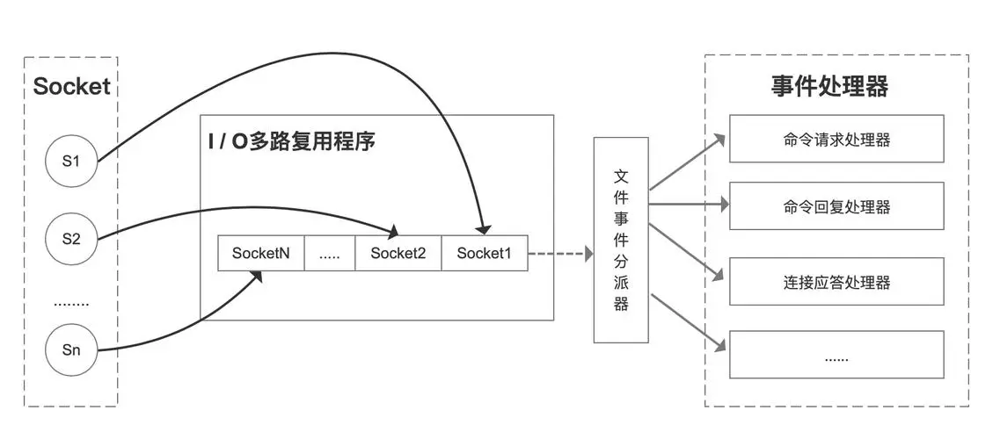

## Redis性能强大的原因

- **基于内存的数据存储** ：Redis 将数据存储在内存中，提供快速的读写速度，使得数据的读写操作避开了磁盘 I/O。而内存的访问速度远超硬盘。相比于传统的磁盘数据库，内存访问速度快得多。
- **单线程模型** ：Redis 使用单线程事件驱动模型，避免了多线程上下文切换和竞争条件，提高了并发处理效率。
- **高效的数据结构** ：Redis 提供多种高效的数据结构（如字符串、哈希、列表、集合等），这些结构经过优化，能够快速完成各种操作
- **IO多路复用** ：基于 Linux 的 select/epoll 机制。该机制允许内核中同时存在多个监听套接字和已连接套接字，内核会一直监听这些套接字上的连接请求或者数据请求，一旦有请求到达，就会交给 Redis 处理，就实现了所谓的 Redis 单个线程处理多个 IO 读写的请求。

## 单线程模型

### 使用原因

- Redis 的大部分操作**都在内存中完成**，并且采用了高效的数据结构，因此 Redis 瓶颈可能是机器的内存或者网络带宽，而并非 CPU，既然 CPU 不是瓶颈，那么自然就采用单线程的解决方案了。
- Redis 采用单线程模型可以**避免了多线程之间的竞争**，省去了多线程切换带来的时间和性能上的开销，而且也不会导致死锁问题。

### IO多路复用机制

IO 多路复用机制是指一个线程处理多个 IO 流，就是 select/epoll 机制。简单来说，在 Redis 只运行单线程的情况下，该机制允许内核中，同时存在多个监听 Socket 和已连接 Socket。内核会一直监听这些 Socket 上的连接请求或数据请求。一旦有请求到达，就会交给 Redis 线程处理，这就实现了一个 Redis 线程处理多个 IO 流的效果。

这里“多路”指的是多个网络连接客户端，“复用”指的是复用同一个线程(单进程)。

- 一个 socket 客户端与服务端连接时，会生成对应一个套接字描述符(套接字描述符是文件描述符的一种)，每一个 socket 网络连接其实都对应一个文件描述符。
- 多个客户端与服务端连接时，Redis 使用 I/O 多路复用程序 将客户端 socket 对应的 FD 注册到监听列表(一个队列)中。当客户端执行 read、write 等操作命令时，I/O 多路复用程序会将命令封装成一个事件，并绑定到对应的 FD 上。
- 文件事件处理器使用 I/O 多路复用模块同时监控多个文件描述符（fd）的读写情况，当 accept、read、write 和 close 文件事件产生时，文件事件处理器就会回调 FD 绑定的事件处理器进行处理相关命令操作。



select，epoll和epoll的实现原理

- select 使用位图管理 fd，每次调用都需要将 fd 集合从用户态复制到内核态。最大支持 1024 个文件描述符。
- poll 使用动态数组管理 fd，突破了 select 的数量限制。
- epoll 使用红黑树和链表管理 fd，每次调用只需要将 fd 集合从用户态复制到内核态一次，不需要重复复制。



### 多线程的引入

随着数据规模的增长、请求量的增多，Redis 的执行瓶颈主要在于⽹络 I/O。引入多线程处理可以提高网络 I/O处理速度。在 Redis 6.0 中，多线程主要用来处理网络 IO 操作，命令解析和执行仍然是单线程完成，这样既可以发挥多核 CPU 的优势，又能避免锁和上下文切换带来的性能损耗。