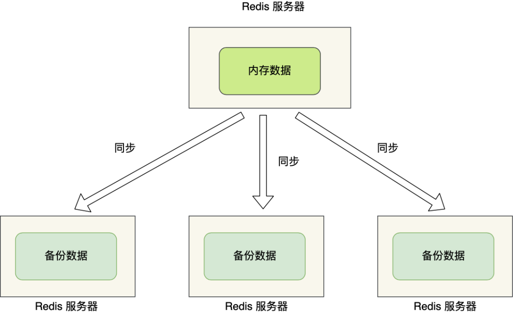
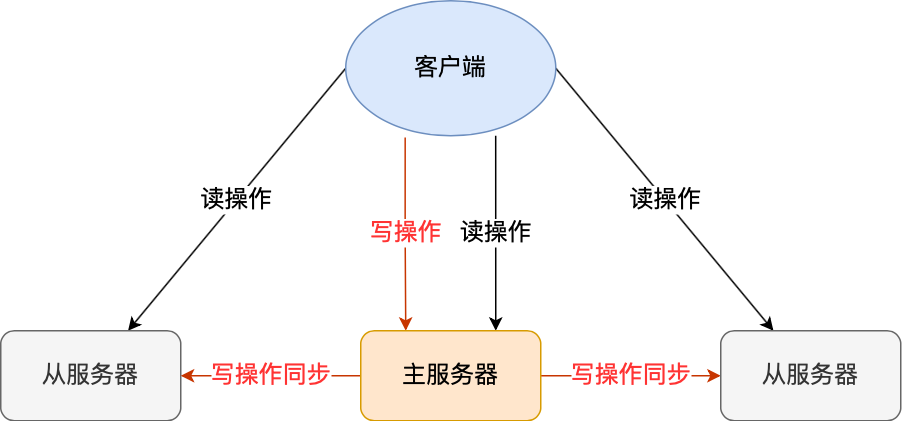
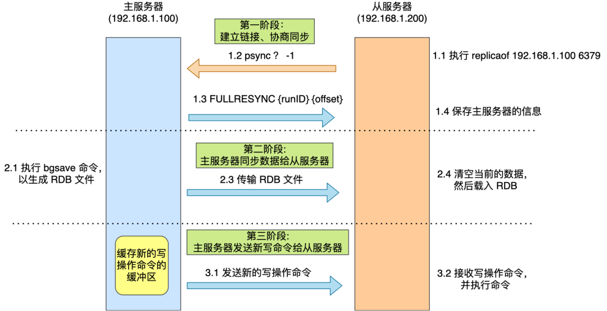
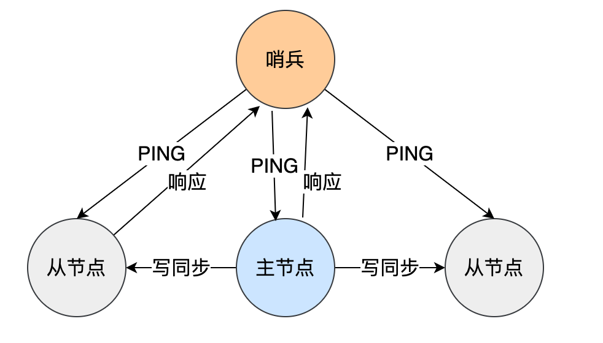

## Redis的集群部署

由于数据都是存储在一台服务器上，存在单点故障问题

- 如果服务器发生了宕机，由于数据恢复是需要点时间，那么这个期间是无法服务新的请求的；
- 如果这台服务器的硬盘出现了故障，可能数据就都丢失了。

要避免这种单点故障，最好的办法是将数据备份到其他服务器上，让这些服务器也可以对外提供服务，这样即使有一台服务器出现了故障，其他服务器依然可以继续提供服务。

Redis 集群（Redis cluster）是通过多个 Redis 实例组成的，**每个实例存储部分的数据（即每个实例之间的数据是不重复的）**。

具体是采用哈希槽（Hash Slot）机制来分配数据，将整个键空间划分为 16384 个槽（slots）。每个 Redis 实例负责一定范围的哈希槽，数据的 key 经过哈希函数计算后对 16384 取余即可定位到对应的节点。

客户端在发送请求时，会通过集群的任意节点进行连接，如果该节点存储了对应的数据则直接返回，反之该节点会根据请求的键值计算哈希槽并路由到正确的节点。

### 节点信息同步

Redis 集群内每个节点都会保存集群的完整拓扑信息，包括每个节点的 ID、IP 地址、端口、负责的哈希槽范围等。

节点之间使用 **Gossip 协议** 进行状态交换，以保持集群的一致性和故障检测。每个节点会周期性地发送 PING 和 PONG 消息，交换集群信息，使得集群信息得以同步。



Gossip协议的工作原理

- **状态报告**：每个节点在特定的时间间隔内，向随机选择的其他节点发送其自身的状态信息，包括节点的主从关系、槽位分布等。
- **信息更新**：接收到状态信息的节点会根据所接收到的数据更新自己的状态，并将更新后的状态继续传播给其他节点。
- **节点检测**：通过周期性交换状态信息，节点可以检测到其他节点的存活状态。如果某个节点未能在预定时间内响应，则该节点会被标记为故障节点。
- **容错处理**：在检测到节点故障后，集群中的其他节点可以采取措施（如重新分配槽位）以保持系统的高可用性。



### 请求节点流程

- **计算哈希槽**
  - 使用 CRC16 哈希算法计算键的 CRC16 值
  - 然后，计算该值对应的哈希槽
- **查询请求**：
  - 因为客户端连接的是集群中的 node1，所以客户端发送查询命令到 Node1。
- **Node1 响应**：
  - Node1 检测到请求的键属于 Node3，返回一个 `MOVED` 错误，指示客户端请求的键在另一个节点上。`MOVED` 错误会中返回目标节点的信息
- **重新连接**：
  - 客户端根据返回的目标节点信息，建立与 Node3 的连接。
- **再次发送查询请求**：
  - 客户端向 Node3 发送查询命令。
- **获取结果**：
  - Node3 查询到键的值并返回结果。

### 脑裂问题

脑裂是指在分布式系统中，由于网络分区或其他问题导致系统中的多个节点（特别是主节点）误以为自己是唯一的主节点。这种情况会导致多个主节点同时提供写入服务，从而引起数据不一致。

例如发生了网络分区，主节点与哨兵、从节点分区了。此时哨兵发现联系不上主节点，于是发起选举，选了新的主节点，此时 Redis 就出现了两个主节点

## Redis的集群模型

### 主从模式

Redis 的主从复制是指一个 Redis 实例（主节点）可以将数据复制到一个或多个从节点（从节点），从节点从主节点获取数据并保持同步。

- 一个主节点负责读写操作
- 多个从节点负责读操作。

主服务器可以进行读写操作，当发生写操作时自动将写操作同步给从服务器，而从服务器一般是只读，并接受主服务器同步过来写操作命令，然后执行这条命令。所有的数据修改只在主服务器上进行，然后将最新的数据同步给从服务器，这样就使得主从服务器的数据是一致的。

#### 第一次同步

主从服务器间的第一次同步的过程可分为三个阶段

- 建立链接、协商同步
  - 从服务器就会给主服务器发送 **`psync`** 命令，表示要进行数据同步
  - 主服务器收到 **`psync`** 命令后，会用 **`FULLRESYNC`** 作为响应命令返回给对方，表示为使用全量复制
- 主服务器同步数据给从服务器
  - 主服务器会执行 **`bgsave`** 命令来生成 RDB 文件，然后把文件发送给从服务器。
  - 从服务器收到 RDB 文件后，会先清空当前的数据，然后载入 RDB 文件。
- 主服务器发送新写操作命令给从服务器
  - 主服务器将缓冲区里所记录的写操作命令发送给从服务器，从服务器执行来自主服务器 replication buffer 缓冲区里发来的命令，这时主从服务器的数据就一致了。

#### 命令传播

主从服务器在完成第一次同步后，双方之间就会维护一个 TCP 连接。后续主服务器可以通过这个连接继续将写操作命令传播给从服务器，然后从服务器执行该命令，使得与主服务器的数据库状态相同。

而且这个连接是长连接的，目的是避免频繁的 TCP 连接和断开带来的性能开销。

#### 增量复制

如果主从服务器间的网络连接断开了，那么就无法进行命令传播了，这时从服务器的数据就没办法和主服务器保持一致了，客户端就可能从服务器读到旧的数据。

主从服务器会采用**增量复制**的方式继续同步，也就是只会把网络断开期间主服务器接收到的写操作命令，同步给从服务器。

### 哨兵机制

哨兵模式用于监控 Redis 主从集群，自动完成主从切换，以实现故障自动恢复和通知。

主要功能包括：

- **监控**：哨兵不断监控 Redis 主节点和从节点的运行状态，定期发送 PING 请求检查节点是否正常。
- **自动故障转移**：当主节点发生故障时，哨兵会选举一个从节点提升为新的主节点，并通知客户端更新主节点的地址，从而实现高可用。
- **通知**：哨兵可以向系统管理员或其他服务发送通知，以便快速处理 Redis 实例的状态变化。

#### 判断节点是否故障

哨兵会每隔 1 秒给所有主从节点发送 PING 命令，当主从节点收到 PING 命令后，会发送一个响应命令给哨兵，这样就可以判断它们是否在正常运行。

- 主观下线：哨兵每隔 1s 会发送 ping 命令给所有的节点。如果哨兵超过一段时间还未收到对应节点的 pong 回复，就会认为这个节点主观下线。
- 客观下线：当一个哨兵判断主节点为主观下线后，就会向其他哨兵发起命令，其他哨兵收到这个命令后，就会根据自身和主节点的网络状况，做出赞成投票或者拒绝投票的响应。（只有主节点才有客观下线）

#### 主从故障转移

为了更加“客观”的判断主节点故障了，一般不会只由单个哨兵的检测结果来判断，而是多个哨兵一起判断，这样可以减少误判概率，所以**哨兵是以哨兵集群的方式存在的**。

**哨兵leader的选举机制**

- 判断主节点主观下线的哨兵就是候选者，此时它想成为 leader。如果同时有两个哨兵判断主观下线，那么它们都是候选人，一起竞争成为 leader。
- 候选者们会先投自己一票，然后向其他哨兵发送命令让它们给自己投票。**每个哨兵手里只有一票，投了一个之后就不能投别人了**。
- 最后，如果某个候选者拿到哨兵集群半数及以上的赞成票，就会成为 leader。这里有一个注意的点，为了保证哨兵选举的时候尽量避免出现平票的情况，哨兵的节点个数一般都会是奇数，比如 3,5,7 这样。

**主节点的选举过程**

- 把一些已经下线的节点全部剔除，从正常的从节点中选择主节点
- 根据从节点的优先级进行选择，优先选择优先级的值比较小的节点
- 如果节点的优先级相同，则查看进行主从复制的 offset 的值，即复制的偏移量，偏移量越大则表示其同步的数据越多，优先级越高。
- 如果 offset 也相同了，那只能比较 ID 号，选择 ID 号比较小的那个作为主节点（每个实例 ID 不同）。

**主从故障转移的流程**

- 选举出新的主节点
- 将从节点指向新的主节点
  - 哨兵 leader 向所有从节点发送命令，让它们成为新主节点的从节点。
- 通知客户端主节点已经更换：通过 Redis 的发布者/订阅者机制来实现
- 将旧主节点转换为从节点：继续监视旧主节点，当旧主节点重新上线时，哨兵集群就会向它发送命令，让它成为新主节点的从节点