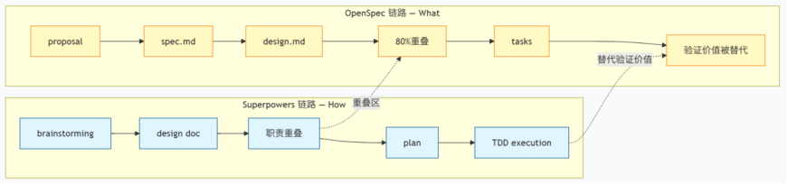
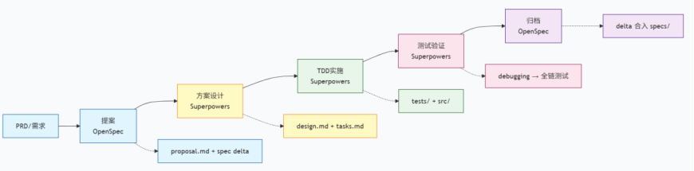

## 🛠️ 目前的落地方式
SDD（Spec-Driven Development）可以先简单理解成：先写一份“规格说明书”，再让 AI 按照说明书写代码。类比盖房子，就是先画图纸，再让施工队施工。

目前采用的是 OpenSpec + Superpowers 的融合方案。OpenSpec 负责定义“做什么”（What），产出 proposal、spec、design 等结构化文档；Superpowers 负责“怎么做”（How），用 Skills 推着 AI 走 brainstorming、writing-plans、TDD、code review 这条执行链路。

  

 一开始想得很理想：OpenSpec 像图纸，Superpowers 像施工队，各管一段。但真正跑起来以后，我们发现两套工具不是简单拼起来就能协作，很多地方反而互相抢活。最明显的冲突有三个：
- Superpowers 的 brainstorming 也会产出 design doc，和 OpenSpec 的 design 职责重叠。
- OpenSpec 里的验收标准，后面又会被 Superpowers 的 TDD plan 转成 test case，原来的 spec 反而不再是主要验证手段。
- 两层审批互不信任，开发者经常不知道到底该以哪一层为准。

---

## ⚖️ 不是所有需求都需要 Spec Coding，有的时候 Plan Mode 就足够
业界常说 Spec Coding 有三条铁律：No Spec, No Code；Spec is Truth；Reverse Sync。听起来很合理，实践里却很容易变成误区。
- No Spec, No Code。如果需求本身是“一个人半天能搞定”的小任务，写 spec 的时间可能已经超过直接改代码的时间。这时候坚持 no spec no code，最后就变成了为了流程而流程。
- Spec is Truth。Spec 是自然语言写的，AI 再按自己的理解生成代码。中间至少经历两次翻译：人把意图翻译成 spec，AI 把 spec 翻译成 code。每一层都会丢信息。

真正能代表系统状态的，不是 spec，而是跑得通、测得过、能在线上工作的代码。

### 📉 损耗发生在哪里
- 第一层损耗：意图 → spec。很多隐性知识很难完整写出来。比如你觉得“余额不能为负”显而易见，但如果没有写进约束里，AI 未必会自动补上。
- 第二层损耗：spec → code。AI 对同一段 spec 的理解并不完全稳定。通常能遵循 70%—90%，但复杂需求里，总会有一部分需要人工改。
- 两层叠加后，差距会被放大。如果每层损失 20% 信息，最终保真度大概是 0.8 × 0.8 ≈ 64%。这和我们在复杂需求里的体感很接近：生成代码经常需要改 30%—40%。

  

相比之下，Plan Mode 是“意图 → 代码”一步到位。人在交互过程中可以随时补充遗漏细节，用即时反馈替代静态文档。对简单任务来说，这种方式的对齐度反而更高。

因此建议做出以下调整
- Spec 不追求绝对精确。写得越像代码，成本越接近代码本身。
- Spec 更适合作为“验收基准”，不是“生成蓝图”。它应该回答怎么判断对不对，而不是要求 AI 一比一照抄。
- 简单任务优先 Plan Mode，不是偷懒，而是减少中间损耗。
- Code 才是最终事实依据。Spec 更像脚手架，帮 AI 生成第一版，后续真正被维护的是代码和测试。
- 过时的 spec 不只是没用，还可能误导 Agent。留在仓库里的错误前提，会变成下一次生成代码时的噪音。

---

## ⚠️ 业界主流 Spec 框架不一定适配模型能力
这个坑来自时间错配：工具的默认流程，往往跟不上模型能力的变化。Superpowers、Spec Kit、Kiro 等 SDD 工具，大多是在 2024—2025 年形成的。那时模型还没现在强，确实需要更细的 spec 才能生成可用代码。到了 2026 年，强模型在很多单模块任务里，已经能根据很短的意图描述生成 80% 以上可用代码。

问题是，很多工具的默认流程还停留在旧假设里：先写大段 spec，再写 design，再写 tasks，再审批，再执行。模型变强后，这套流程的边际收益变低，但写作、阅读、审批、维护成本仍然存在。

- OpenAI Codex 团队（Harness Engineering，2026.02）。他们更强调四象限轻量 prompt：Goal、Context、Constraints、Done-When，再配合 AGENTS.md 约束项目边界。架构一致性靠 linter、structural test 和 CI 守住，而不是靠人反复 review spec。

- Anthropic Claude Code 团队。CLAUDE.md 控制在较短篇幅，每个需求主要写验收标准和关键约束，而不是把完整实现方案写成蓝图。

一个趋势很明显：模型越强，spec 越薄。真正需要补足的不是流程控制，而是上下文、边界和验证。

换句话说，更应该追求 More Context, Less Control。Context 是信息，能帮助模型做判断；Control 是流程约束，过多时会变成负担。

---

## 📚 不是只有独立的 Spec 文件才是 SDD

| 实践 | 是不是 Spec | 为什么 |
|------|--------------|--------|
| OpenSpec 的 `spec.md` | 是 | 显式描述 What 的结构化文件 |
| Superpowers 的 `design doc` | 是 | 描述 What + How 的设计边界 |
| Plan Mode 的 prompt | 是 | "先调研、给方案、确认后再写代码"本身就是轻量 spec |
| `CLAUDE.md` / `AGENTS.md` | 是 | 项目级约束，是持久化的 spec |
| 验收测试 | 是 | 可执行的 spec，也是最强的约束形式 |
| 一句话口头意图 | 边界形态 | 很轻，但仍然在约束实现空间。|

经常有人说：“Plan Mode 不算 SDD，因为它没有写 spec 文件。”也有人说：“Superpowers 才是正统 SDD，因为它有 design doc。”这些说法背后有一个默认前提：只有独立的 spec 文件，才算 Spec-Driven。

实际上Spec 是一个光谱，不是某一种固定格式。从一句口头意图，到 AGENTS.md，再到验收测试，都是不同浓度的 spec。重新定义 SDD 的成功标准，也许更合理：不是“有没有写 spec 文件”，而是“AI 是否在正确的约束空间内工作”。例如
- Plan Mode 不是没有 spec，而是 spec 和执行发生在同一条交互链里。
- AGENTS.md 不是普通配置文件，它记录的是项目级行为边界。
- TDD 的测试不只是测试，它也是最严格、最可执行的 spec。

---

## 🎯 不需要 100% 走 Spec 流程
最开始，默认所有需求都走 Superpowers 完整流程。结果连改一行文案，也要先brainstorming，再生成 design doc，再 review，再写 plan，再 TDD，再执行，再code review。

对于“一个人半天能搞定”的小需求。它们走完整流程时，brainstorming + design 的时间约等于编码时间的 60%—80%，端到端反而更慢，也就是说，超过一半需求被套上了过重流程。

更合理的分流方式应该是
| 档位 | 示例 | 更适合的方式 |
|------|------|--------------|
| 零 spec | 改文案、修样式、hot fix | 直接改代码 |
| 轻 spec | 加筛选项、改接口参数 | Plan Mode + 一句话意图 |
| 中 spec | 新增业务模块、跨人协作 | 验收标准 + 关键约束 |
| 重 spec | 架构重构、新系统设计 | OpenSpec + Superpowers 全流程 |