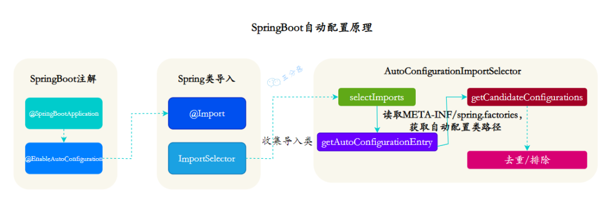

## 起步依赖

原理：SpringBoot框架提供的起步依赖通过**Maven的依赖传递**集成了开发中常见的依赖

## SpringBoot的启动流程

### @SpringBootApplication 注解

这是SpringBoot启动的核心注解

#### 组成部分

- **`@SpringBootConfiguration`**：

  - Spring 的 `@Configuration` 注解的特殊形式，表示这是一个 Spring 配置类，Spring 会根据该类来加载和注册 Bean。

  - 作用类似于传统的 XML 配置文件，它让类中的 `@Bean` 方法生效，并将其注册到 Spring 容器中。

- **`@EnableAutoConfiguration`**：

  - Spring Boot 的自动配置机制的核心，负责启用 Spring Boot 的自动配置功能。

  - Spring Boot 会根据应用的类路径、已添加的依赖以及定义的配置（如 `application.properties` 或 `application.yml`），自动配置 Spring 应用的相关组件和 Bean，简化了手动配置

- **`@ComponentScan`**：

  - 启用组件扫描功能，自动发现并注册 `@Component`、`@Service`、`@Repository`、`@Controller` 等注解标注的 Spring 组件。

  - 它会扫描 `@SpringBootApplication` 所在类的当前包及其子包，自动将符合条件的组件加载到 Spring 容器中。

#### 作用

- **简化配置** ：通过这个组合注解，Spring Boot 项目可以不用手动配置 `@Configuration`、`@EnableAutoConfiguration`、`@ComponentScan`，使应用更易于启动和管理。
- **自动配置** ：借助自动配置机制，开发者无需手动配置许多 Spring 组件，Spring Boot 会根据项目依赖来自动注入所需的 Bean。
- **组件扫描** ：自动扫描和加载定义在项目中的 Spring 组件，简化了 Bean 注册过程。

### 总体流程

- **启动 main() 方法**

  - 应用从 `main()` 方法启动，并通过 `SpringApplication.run()` 引导应用启动。

  - 应用会创建`SpringApplication` 对象，推断应用类型、设置初始化器、设置启动监听器、确定主应用类。

- **准备环境（ConfigurableEnvironment）**

  - Spring Boot 在启动过程中准备应用环境，加载配置文件、系统环境变量以及命令行参数。

- **创建ApplicationContext**

  - 创建应用上下文，加载配置类和自动配置类，注册 Bean 并执行依赖注入等初始化操作。

- **刷新ApplicationContext并启动内嵌 Web 服务器**

  - 对于 Web 应用，Spring Boot 会自动启动嵌入式 Web 容器（如 Tomcat），并注册相关的 Servlet 和 Filter。

- **自动配置**

  - 通过 **`@EnableAutoConfiguration`** 自动配置各种组件

- **请求处理**

  - 内嵌的 **`DispatcherServlet`** 负责处理 HTTP 请求。

## 自动配置

### 概念

当spring容器启动后，一些配置类、bean对象就自动存入到了IOC容器中，不需要手动去声明，从而简化了开发，省去了繁琐的配置操作。

### 实现方案

#### 方案一：@ComponentScan 组件扫描依赖

```java
@SpringBootApplication
@ComponentScan({"com.alibaba","com.google","org.springframework","org.mybatis",...}
public class springbootWebconfig2Application{
}
```

#### 方案二：@lmport 导入

使用 **`@lmport`** 导入的类会被Spring加载到I0C容器中，导入形式主要有以下几种:

- 导入 普通类
- 导入 配置类
- 导入 ImportSelector 接口实现类
- @EnableXXX注解，封装了@Import

```java
@Import({TokenParser.class,Headerconfig.class})
@SpringBootApplication
public class springbootWebconfig2Application{
    
}
```

### 源码分析

1. 查看启动类的注解 **`@SpringBootApplication`** 的源码

   ```java
   //自定义组件所需的元注解
   @Target({ElementType.TYPE})
   @Retention(RetentionPolicy.RUNTIME)
   @Documented
   @Inherited
   //表示启动类也是一个配置类
   @SpringBootConfiguration
   //自动配置功能
   @EnableAutoConfiguration
   @ComponentScan(
       excludeFilters = {@Filter(
       	type = FilterType.CUSTOM,
       	classes = {TypeExcludeFilter.class}
       ), @Filter(
       	type = FilterType.CUSTOM,
       	classes = {AutoConfigurationExcludeFilter.class}
       )}
   )
   ```

   

   为什么在启动类中可以声明第三方Bean对象？

   **`@SpringBootApplication`** 中封装了 **`@SpringBootConfiguration`** ，表明启动类也是一个配置类

   为什么启动类只会扫描启动类所在包及其子包的组件

   **`@SpringBootApplication`** 中封装了 **`@ComponentScan`** 的注解

   

2. 由 **`@SpringBootApplication`** 的注解源码可知自动配置由注解 **`@EnableAutoConfiguration`** 提供，查看 **`@EnableAutoConfiguration`** 的注解

   ```java
   @Target({ElementType.TYPE})
   @Retention(RetentionPolicy.RUNTIME)
   @Documented
   @Inherited
   @AutoConfigurationPackage
   @Import({AutoConfigurationImportSelector.class})
   public @interface EnableAutoConfiguration {
       String ENABLED_OVERRIDE_PROPERTY = "spring.boot.enableautoconfiguration";
   
       Class<?>[] exclude() default {};
   
       String[] excludeName() default {};
   }
   
   ```

   可以看出 **`@EnableAutoConfiguration`** 注解通过 **`@Import`** 注解导入 ImportSelector 接口实现类来实现自动配置

3. **查看 `AutoConfigurationImportSelector.class`**  的源码

   ```java
   public String[] selectImports(AnnotationMetadata annotationMetadata) {
           if (!this.isEnabled(annotationMetadata)) {
               return NO_IMPORTS;
           } else {
               AutoConfigurationEntry autoConfigurationEntry = 	             this.getAutoConfigurationEntry(annotationMetadata);
               return StringUtils.toStringArray(autoConfigurationEntry.getConfigurations());
           }
       }
   ```
   **`selectImports`** 方法返回要导入的Bean对象的全类名
   
4. 从 **`AutoConfigurationImportSelector.class`** 的源码可以知道返回值从 **`autoConfigurationEntry.getConfigurations()`** 获得而 **`autoConfigurationEntry`**  由 **`AutoConfigurationImportSelector.getAutoConfigurationEntry`** 方法获得。查看 **`getAutoConfigurationEntry`** 的源码

   ```java
   protected AutoConfigurationEntry getAutoConfigurationEntry(AnnotationMetadata annotationMetadata) {
           if (!this.isEnabled(annotationMetadata)) {
               return EMPTY_ENTRY;
           } else {
               AnnotationAttributes attributes = this.getAttributes(annotationMetadata);
               List<String> configurations = this.getCandidateConfigurations(annotationMetadata, attributes);
               configurations = this.removeDuplicates(configurations);
               Set<String> exclusions = this.getExclusions(annotationMetadata, attributes);
               this.checkExcludedClasses(configurations, exclusions);
               configurations.removeAll(exclusions);
               configurations = this.getConfigurationClassFilter().filter(configurations);
               this.fireAutoConfigurationImportEvents(configurations, exclusions);
               return new AutoConfigurationEntry(configurations, exclusions);
           }
       }
   ```

5. 从 **`AutoConfigurationImportSelector.getAutoConfigurationEntry`** 看出 **`configuration`** 是一个List\<String\>对象，从  **`AutoConfigurationImportSelector.getCandidateConfigurations(annotationMetadata, attributes)`**  中获得。查看 **`AutoConfigurationImportSelector.getCandidateConfigurations(annotationMetadata, attributes)`** 的源码

   ```java
   protected List<String> getCandidateConfigurations(AnnotationMetadata metadata, AnnotationAttributes attributes) {
           List<String> configurations = ImportCandidates.load(AutoConfiguration.class, this.getBeanClassLoader()).getCandidates();
           Assert.notEmpty(configurations, "No auto configuration classes found in META-INF/spring/org.springframework.boot.autoconfigure.AutoConfiguration.imports. If you are using a custom packaging, make sure that file is correct.");
           return configurations;
   }
   ```
   SpringBoot框架会自动加载 **META-INF/spring/org.springframework.boot.autoconfigure.AutoConfiguration.imports** 的配置文件并封装到 **configurations** 这个List集合中

### 实现过程

- **`@SpringBootApplication`** 注解封装了 **`@EnableAutoConfiguration`** 来实现自动配置

- **`@EnableAutoConfiguration`** 封装了 **`@Import`** 注解，该注解以引入 **`ImportSelector`** 接口的实现类 **`AutoConfigurationImportSelector`** 来完成自动装配

- **`AutoConfigurationImportSelector`** 获取 **`AutoConfigurationEntry`** 对象，该对象具有成员变量 **`Configurations`** 用于存储Bean对象的全类名

- **`AutoConfigurationEntry`** 使用 **`getCandidateConfigurations`** 方法，SpringBoot框架会自动加载 **`META-INF/spring/org.springframework.boot.autoconfigure.AutoConfiguration.imports`** 配置文件并封装到 **configurations** 这个List集合中

- **`META-INF/spring/org.springframework.boot.autoconfigure.AutoConfiguration.imports`** 中封装了Bean对象的声明

  



总而言之

- **`@SpringBootApplication`** 内封装了 **`@SpringBootConfiguration`** 表示SpringBoot启动类本身就是一个配置类，同时封装了**`@EnableConfiguration`** 注解实现自动装配
- **`@EnableConfiguration`** 通过 **`@Import`** 引入了 **`AutoConfigurationImportSelector`** 类，这个类实现了**`ImportSelector`** 接口，这个接口的作用就是收集需要导入的配置类，配合 **`@Import()`** 就将相应的类导入到 Spring 容器中。
- 扫描 classpath 下所有的 **`META-INF/spring.factories`** 中的文件，根据文件中指定的配置类加载相应的 Bean 的自动配置。

### 条件配置

**`@Conditional`**
作用：按照一定的条件进行判断，在满足给定条件后才会注册对应的bean对象到SpringIOC容器中。

位置：方法、类

**`@Conditional`** 本身是一个父注解，派生出大量的子注解:

- **`@Conditional0nClass`** ：判断环境中是否有对应字节码文件，才注册bean到IOC容器。
- **`@ConditionalOnMissingBean`** ：判断环境中没有对应的bean(类型或名称)，才注册bean到IOC容器。
- **`@ConditionalOnProperty`**：判断配置文件中有对应属性和值，才注册bean到IOC容器。
