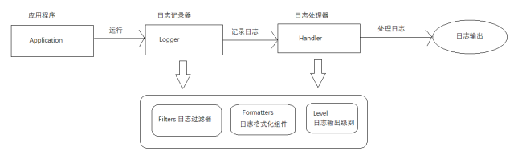
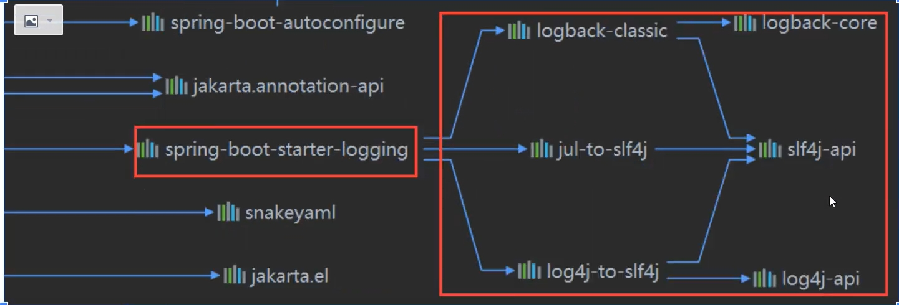
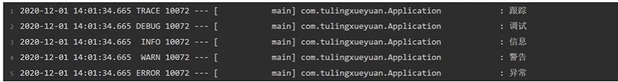

## devtool热部署

为了进一步提高开发效率,springboot为我们提供了全局项目热部署,日后在开发过程中修改了部分代码以及相关配置文件后,不需要每次重启使修改生效,在项目中开启springboot全局热部署之后只需要在修改之后等待几秒即可使修改生效。

### 开启热部署

1. 引入相关依赖

   ```xml
   <dependency>
   	<groupId>org.springframework.boot</groupId>
   	<artifactId>spring-boot-devtools</artifactId>
   	<optional>true</optional>
   </dependency>
   ```

## Java的日志体系

### 日志门面

每一种日志框架都有自己单独的API，要使用对应的框架就要使用其对应的API，这就大大的增加应用程序代码对于日志框架的耦合性。

为了解决这个问题，就是在日志框架和应用程序之间架设一个沟通的桥梁，对于应用程序来说，无论底层的日志框架如何变，都不需要有任何感知。只要门面服务做的足够好，随意换另外一个日志框架，应用程序不需要修改任意一行代码，就可以直接上线。总而言之，日志门面用于整合不同日志框架的日志（类似接口），不实现具体日志

常见的日志门面

- JCL（Java Common Logging）：Java自带的日志门面
- SLF4J：目前最常用的日志门面

#### JCL

用户可以自由选择第三方的日志组件作为具体实现，像log4j，或者jdk自带的jul， common-logging会通过动态查找的机制，在程序运行时自动找出真正使用的日志库。

JCL默认的情况下，会使用JUL日志框架做日志的记录操作。

JCL使用原则：如果有log4j，优先使用log4j，如果没有任何第三方日志框架的时候，使用的就是JUL。再没有则使用JCL内部提供的
SimpleLog 实现

**具体实现**

1. 导入相关依赖

2. 编写业务代码

   ```java
   public class JulMain
   {
       public static void main(String[] args){
           Log log= LogFactory.getLog(JulMain.class)
           log.info("Hello world");
       }
   }
   ```

   

#### SLF4J

简单日志门面(Simple Logging Facade For Java) SLF4J主要是为了给Java日志访问提供一套标准、规范的API框架，

**主要意义**：提供接口，具体的实现可以交由其他日志框架，例如log4j和logback等。

对于一般的Java项目而言，日志框架会选择slf4j-api作为门面，配上具体的实现框架（log4j、logback等），中间使用桥接器完成桥接。所以我们可以得出SLF4J最重要的两个功能就是对于日志框架的绑定以及日志框架的桥接。

**具体使用**

1. 引入相关依赖

   ```xml
   <!--slf4j 核心依赖-->
   <dependency>
       <groupId>org.slf4j</groupId>
       <artifactId>slf4j-api</artifactId>
       <version>1.7.25</version>
   </dependency>
   <!--slf4j 自带的简单日志实现 -->
   <dependency>
       <groupId>org.slf4j</groupId>
       <artifactId>slf4j-simple</artifactId>
       <version>1.7.25</version>
   </dependency>
   <!--具体日志框架的slf4j桥接器（可选）-->
   ```

   

2. 编写业务代码(如果在没有任何其他日志实现框架集成的基础之上，slf4j使用的就是自带的框架slf4j-simple，slf4j-simple也必须以单独依赖的形式导入进来。)

   ```java
   public class SLF4JTest01
   {
       // 都是slf4j包下的
       Logger logger = LoggerFactory.getLogger(SLF4JTest.class);
       logger.trace("trace信息");
       logger.debug("debug信息");
       logger.info("info信息");
       logger.warn("warn信息");
       logger.error("error信息");
   }
   ```

   

#### 日志实现和对应的日志门面

|         日志实现         | 日志门面  |
| :----------------------: | :-------: |
|    log4j（已经淘汰）     | JCL/SLF4J |
| JUL（java.utils.logging) |    JCL    |
|          log4j2          |   SLF4J   |
|         logback          |   SLF4J   |



记录日志不能直接使用日志实现框架，必须通过日志门面来实现



### 日志实现

#### JUL

JUL全称 **Java Util Logging**，核心类在java.util.logging包下，它是java原生的日志框架，使用时不需要另外引用第三方的类库，相对其他的框架使用方便，学习简单，主要是使用在小型应用中。

**组件构成**



- Logger：被称为记录器，应用程序通过获取Logger对象，调用其API来发布日志信息。Logger通常被认为是访问日志系统的入口程序。
- Handler：处理器，每个Logger都会关联一个或者是一组Handler，Logger会将日志交给关联的Handler去做处理，由Handler负责将日志做记录。Handler具体实现了日志的输出位置，比如可以输出到控制台或者是文件中等等。
- Filter：过滤器，根据需要定制哪些信息会被记录，哪些信息会被略过。
- Formatter：格式化组件，它负责对日志中的数据和信息进行转换和格式化，所以它决定了我们输出日志最终的形式。
- Level：日志的输出级别，每条日志消息都有一个关联的级别。我们根据输出级别的设置，用来展现最终所呈现的日志信息。根据不同的需求，去设置不同的级别。

**示例代码**

```java
// 日志示例
public static void test02() {
    /*
        日志的级别，总共七级
            Level.SEVERE：（最高级）错误
            Level.WARNING：警告
            Level.INFO：（默认级别）消息
            Level.CONFIG：配置级别
            Level.FINE：详细信息（少）
            Level.FINER：详细信息（中）
            Level.FINEST：（最低级）详细信息（多）

       两个特殊的级别：
            Level.OFF；可用来关闭日志记录
            Level.ALL：启用所有日志记录
	*/
    // Logger创建方式，参数为当前类全路径字符串com.demo.logger.jul.JULTest
    Logger logger = Logger.getLogger(JULTest.class.getCanonicalName());

    logger.severe("severe信息");
    logger.warning("warning信息");
    logger.info("info信息");
    logger.config("config信息");
    logger.fine("fine信息");
    logger.finer("finer信息");
    logger.finest("finest信息");
    /*
        输出内容：我们看到，默认是输出info及比info信息级别高的信息
            三月 20, 2023 9:47:27 下午 com.demo.logger.jul.JULTest test02
            严重: severe信息
            三月 20, 2023 9:47:27 下午 com.demo.logger.jul.JULTest test02
            警告: warning信息
            三月 20, 2023 9:47:27 下午 com.demo.logger.jul.JULTest test02
            信息: info信息
     */
}
```

## SpringBoot日志框架



SpringBoot框架底层使用slf4j+logback的方式进行日志记录同时对于其他日志实现都提供了slf4j日志门面的集成

## SpringBoot日志使用

### 日志级别

- trace：日志追踪信息
- debug：日志详细信息
- info：日志的关键信息 默认打印级别
- warn：日志警告信息
- error：日志错误信息

只有级别大于日志核心配置文件的 **rootlevel** 的信息才会输出，SpringBoot默认的 **rootlevel** 是**info**

可以在application.yml中进行 **rootlevel** 的修改

```yml
#修改全局的rootlevel
logging:
	level:
		root:
#可以只修改某个包下日志的rootlevel
#示例
logging:
	level:
		com:
			example:
```


### 日志记录器声明

方法一：Java语句声明

```java
//1.声明日志记录器
Logger logger=LoggerFactory.getLogger(全类名)
```

方法二：使用注解@Slf4j(这个注解基于lombok依赖)

```java
@Slf4j
public class userController{
	
}
```

​	

### 日志格式

#### 默认格式



- 日期和时间：毫秒精度，易于排序
- 日志级别：ERROR，WARN，INFO，DEBUG，或TRACE
- 进程ID
- ---：分离器来区分实际日志消息的开始。
- 线程名称:用方括号括起来(对于控制台输出可能会被截断)
- 记录器名称:这通常是源类名称(通常缩写)。
- 日志消息。

#### 修改默认格式

可以在application.yml中修改logging.pattern.console属性来修改格式详情常见SpringBoot官方文档

```yml
logging:
	pattern:
		console:
```

[SpringBoot官方文档](https://springdoc.cn/spring-boot/application-properties.html#appendix.application-properties.testing)

### 日志输出

日志默认在控制台输出，可以通过修改applicaiton.yml中的logging.file.name和logging.file.path来输出日志文件

```
logging:
	file:
		#只指定name属性不指定path属性则默认日志文件输出在项目的根目录中
		#name属性可以同时指定输出路径和日志文件名例如D:/mylog.log
		name:日志文件名
		
		#不可以指定文件名，只能指定一个物理文件夹路径，默认文件名为spring.log
		path:日志文件的输出路径
```

### 日志的归档和迭代

在application.yml中可以设置相关参数实现日志的归档和迭代

|                         名称                         |                  描述                  |
| :--------------------------------------------------: | :------------------------------------: |
|   logging.logback.rollingpolicy.file-name-pattern    |              归档的文件名              |
| logging.logback.rollingpolicy.clean-history-on-start | 是否在应用程序启动时进行日志归档清理。 |
|     logging.logback.rollingpolicy.max-file-size      |       归档前日志文件的最大大小。       |
|     logging.logback.rollingpolicy.total-size-cap     |   删除日志档案之前可以使用的最大大小   |
|      logging.logback.rollingpolicy.max-history       |      保留日志存档的天数(默认为7)       |

示例代码

```yml
logging:
	file:
		name: 日志文件名
		path: 日志文件的输出路径
		max-file-size: 日志文件的最大大小(日志文件超出该大小则生成归档的压缩包)
		max-history: 日志文件保留的时间
```

### 切换日志框架

将SpringBoot底层默认日志框架logback修改为log4j2

1. 排除logback的场景启动器

   ```xml
   <dependencies>
   	<dependency>
   	<!‐‐starter‐web里面自动添加starter‐logging 也就是logback的依赖‐‐>
   		 <groupId>org.springframework.boot</groupId>
   		 <artifactId>spring‐boot‐starter‐web</artifactId>
   		 <exclusions>
   	<!‐‐排除starter‐logging 也就是logback的依赖‐‐>
   		 	<exclusion>
   			 	<artifactId>spring‐boot‐starter‐logging</artifactId>
   			 	<groupId>org.springframework.boot</groupId>
   		 	</exclusion>
   		 </exclusions>
    	</dependency>
   </dependencies>
   ```

2. 添加log4j2的场景启动器

   ```xml
   <!‐‐Log4j2的场景启动器‐‐>
   <dependency>
      <groupId>org.springframework.boot</groupId>
      <artifactId>spring‐boot‐starter‐log4j2</artifactId>
   </dependency>
   ```
