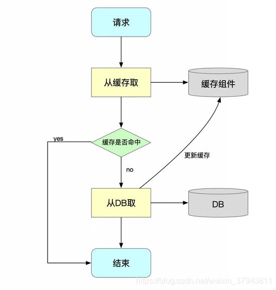

## SpringCache基础

Spring Cache是Spring框架提供的一种缓存解决方案，基于AOP原理，实现了基于注解的缓存功能，只需要简单地加一个注解就能实现缓存功能，对业务代码的侵入性很小。使用Spring Cache的方法很简单，只需要在方法上添加注解即可实现将方法返回数据存入缓存，以及清理缓存等注解的使用。

## SpringCache的大致原理



每次调用目标方法前，SpringCache都会先检查该方法是否正对给定参数执行，如果已经执行过，就直接返回缓存的结果。（通俗的讲，就是查看缓存里面是否有对应的数据，如果有就返回缓存的数据），而无需执行实际方法、如果该方法上位执行。则执行该方法（缓存中没有对应的数据就执行方法获取对应数据，并进行缓存），并缓存结果并返回给用户。这样就不用多次去执行数据库操作，减少cpu和io的消耗。 

## 与SpringBoot集成

- 引入相关的依赖

  ```xml
  <dependency>
  	<groupId>org.springframework.boot</groupId>
  	<artifactId>spring-boot-starter-cache</artifactId>  		            		       	 			     <version>2.7.3</version> 
  </dependency>
  ```

- 在启动类上使用注解 **`@EnableCaching`** 表示开启缓存功能

## 常用注解

- **@Cacheable：**
  - 作用：修饰方法，在方法执行前查看是否有缓存对应的数据，如果有直接返回数据，如果没有调用方法获取数据返回，并缓存起来。
  - 字段
    - value：指定缓存的名称（或名称数组）。缓存名称与CacheManager中配置的缓存对应。
    - key：用于生成缓存键的表达式（可选）。如果不指定，则默认使用方法的参数值作为键。
    - condition：条件表达式（可选），用于决定是否执行缓存操作。
    - unless：否定条件表达式（可选），用于在方法执行后决定是否缓存返回值。
- **@CacheEvict：**
  - 作用：将一条或多条数据从缓存中删除。
  - 字段
    - value：指定要删除的缓存的名称（或名称数组）。
    - key：用于指定要删除的缓存键（可选）。如果不指定，则默认使用方法的参数值作为键。
    - allEntries：布尔值，指定是否删除缓存中的所有条目（而不是仅删除与指定键匹配的条目）。
    - beforeInvocation：布尔值，指定是否在方法执行之前删除缓存（默认为false，即在方法执行之后删除）。
- **@CachePut**
  - **作用**：更新缓存中的数据，无论方法是否成功执行，都会将结果放入缓存。
  - 字段
    - value：指定缓存的名称（或名称数组）。缓存名称与CacheManager中配置的缓存对应。
    - key：用于生成缓存键的表达式（可选）。如果不指定，则默认使用方法的参数值作为键。
    - condition：条件表达式（可选），用于决定是否执行缓存操作。
    - unless：否定条件表达式（可选），用于在方法执行后决定是否缓存返回值。

