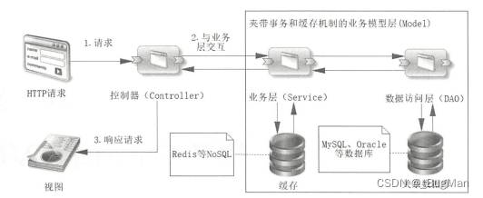

## MVC设计模式

MVC 是一种常见的软件设计模式，用于分离应用程序的不同部分以实现松散耦合和高内聚性。MVC 模式由三个核心组件组成：

- 模型（Model）：表示应用程序的数据和业务逻辑。模型处理应用程序的数据，并根据控制器的指令执行相应的操作。
- 视图（View）：提供模型数据的用户界面。视图通常是模板、HTML 页面、XML 文件或其他格式，可以呈现模型数据给用户。
- 控制器（Controller）：处理用户交互并更新模型和视图。控制器负责接收来自视图的用户输入，对模型进行相应的操作，并更新视图以反映更改。

MVC 模式的优点是可以将代码分离成三个独立的组件，使得应用程序更易于维护和扩展。例如，如果要更改视图的外观，可以修改视图而不影响模型和控制器；如果要更改数据存储方式，可以修改模型而不影响视图和控制器。同时，MVC 模式还有助于降低应用程序中的耦合度，使得各组件更加独立和可重用。
## SpringMVC框架

### 概述：

- Spring MVC 是非常著名的 Web 应用框架，现在的大多数 Web 项目都采用 Spring MVC。它与 Spring 有着紧密的关系。是 Spring 框架中的模块，专注 Web 应用，能够使用 Spring 提供的强大功能，IOC、AOP等。
- **Spring MVC 框架底层是基于 Servlct 技术。遵循 Servlet 规范**，Web 组件 Servlet 、Filter、Listener在 Spring MVC 中都能使用。同时 Spring MVC 也是基于 MVC 架构模式的，职责分离，每个组件只负责自己的功能，组件解耦。
- Spring Boot 的**自动配置**、**按约定编程**极大简化，提高了 Web 应用的开发效率。

### 响应流程：



大体流程：请求到控制器（controller），经过业务模型（model）处理后返回响应给视图层。

具体流程：

- DispatcherServlet 首先收到请求，将请求映射到对应的处理器（controller）上，映射到controller的时候会触发拦截器
- 处理器处理完后封装数据模型，交给视图解析器将数据模型解析为对应的视图返回给前端。

### SpringMVC组件

#### 控制器controller

控制器是一种由 Spring 管理的 Bean 对象，赋予角色是“控制器”。

作用：处理请求，接收浏览器发送过来的参数，将数据或视图应答给浏览器或者客户端 App等。

具体实现：一个Java类，使用@Controller或@RestController



**@Controller** 和 **@RestController** 注解的区别：

- **@RestController** 包含了 **@Controller** 的功能，同时加入了 **@ResponseBody** 的注解。
- 表示当前控制器类中的方法，都会默认加入 **@ResponseBody** 的功能。方法的返回值是数据可以通过 HttpServletResponse 输出给浏览器。



**接收请求**

- **@RequestMapping** ：用于将 Web 请求映射到控制器类的方法。此方法处理请求。可用作在类上或方法上。在类上和方法上同时使用。

  ```java
   @RequestMapping(value = "/updateProduct",method = RequestMethod.POST)
      public Result<String> updateProduct(@RequestParam MultipartFile file, @RequestParam String dname,
                                          @RequestParam String tname, @RequestParam String content,@RequestParam String olddname)
  ```

  

  - Value：别名 path 表示请求的 URI，在类和方法上同时使用 value，方法上的继承类上的 value。
  - method：请求方式，支持 GET、POST、HEAD、OPTIONS、PUT、PATCH、DELETE、TRACE。值为：RequestMethod[] method()，RquestMethod 是 enum 类型。

- 快捷注解：

  - @GetMapping: 表示 get 请求方式的@RequestMapping
  - @PostMapping:表示 post 请求方式的@RequestMapping
  - @PutMapping：表示 put 请求方式的@RequestMapping
  - @DeleteMapping: 表示 delete 请求方式的@RequestMapping


**接收请求参数**

- **@RequestParam**：把请求中的指定名称的参数传递给控制器中的形参赋值

  - value属性值指定请求中的参数
  -  required 属性指定请求中的参数是否必须，默认为 true ，如果加上 required=false，没对应上则不会报错，而是获取值为 null。
  - 如果参数前不写`@RequestParam(xxx)`的话，那么就前端可以有可以没有对应的参数名字都行，如果有参数名的话，那么就会自动匹配；没有的话，请求也能正确发送。

- ##### HttpServletRequest对象

  - 使用 `HttpServletRequest` 对象接收参数，`request.getParameter("XXX")`获取对应的值，这是原始的 `JavaWeb` 中的方式

- **@RequestBody**：主要用来接收前端传递给后端的json字符串中的数据的(`通常json字符串放在请求体中`)

  - `GET`方式`无请求体`，所以使用`@RequestBody`接收数据时，前端不能使用`GET`方式提交数据，而是用`POST`方式进行提交。
  - 在后端的同一个接收方法里，`@RequestBody`与`@RequestParam()`可以同时使用，`@RequestBody`最多只能有一个，而`@RequestParam()`可以有多个。
  - 如果后端参数是一个对象，且该参数前是以`@RequestBody`修饰的，那么前端传递`json`参数时，必须满足以下要求：后端`@RequestBody`注解对应的类在将HTTP的输入流(含请求体)装配到目标类(即：`@RequestBody`后面的类)时，会根据`json`字符串中的`key`来匹配对应实体类的属性，如果匹配一致且`json`中的该key对应的值符合(或可转换为)实体类的对应属性的类型要求时，会调用实体类的`setter`方法将值赋给该属性

- **@RequestHeader**：从请求头中获取某些值

  ```java
  import org.springframework.web.bind.annotation.GetMapping;
  import org.springframework.web.bind.annotation.RequestHeader;
  import org.springframework.web.bind.annotation.RestController;
  
  @RestController
  public class MyController {
  
      @GetMapping("/greet")
      public String greet(@RequestHeader("User-Agent") String userAgent) {
          return "Hello! You are using " + userAgent;
      }
  }
  ```


**返回值**

- 不使用 @ResponseBody的 String 返回值，返回的是一个页面视图
- 使用 @ResponseBody的 String 返回值，返回的是一个JSON数据
- 返回ModelAndView ，返回的是一个视图其中包含数据。（最后数据都是放到 Request 中的）
- 返回自定义的对像，默认的返回格式是json字符串（有jackson工具）
- 返回 Map，默认的返回格式是json字符串（有jackson工具）
- 返回ResponseEntity：包含数据和自定义的HttpStatus Code。（默认转为json格式的字符串）

#### 模型 Model

- 在许多实际项目需求中，后台要从控制层直接返回前端所需要的数据，这时 Model 大家族就派上用场了。
- Model Spring MVC 中的 ”M“，是用来传输数据的。从控制层直接返回数据给前端。内置的 JSP，模板技术能够展现 Model 中存储的数据。
- Model 可以是承载数据的，也可以是处理具体业务的类，这些都是指 Spring MVC 中的Model。

#### 视图 View

- Spring MVC 中的 View（视图）用于展示数据的，视图技术的使用是可插拔的。无论选择使用 thymleaf、jsp 还是其他技术，classpath 有 jar 就能使用视图了。开发者主要就是更改配置。SpringBoot3 不推荐使用 FreeMarker、JSP 这些了。建议使用 Thymeleaf。

## SpringBoot框架中对SpringMVC框架的集成

- 自动配置：SpringBoot会自动配置一个嵌入式的Servlet容器（如Tomcat），并为我们提供默认的SpringMVC配置。这样我们无需手动配置Servlet容器和SpringMVC，只需添加相应的依赖即可快速搭建一个Web应用。
- 视图解析器：SpringBoot默认使用Thymeleaf作为视图解析器，如果需要更换其他视图解析器，可以在pom.xml中修改对应的依赖。
- 静态资源处理：SpringBoot默认会处理静态资源（如HTML、CSS、JavaScript等），并将其放在项目的/static或/public目录下。如果需要自定义静态资源的处理方式，可以通过编写一个类实现WebMvcConfigurer接口，并重写addResourceHandlers方法来实现。
- 拦截器：SpringBoot支持自定义拦截器，可以通过实现HandlerInterceptor接口来创建拦截器，同时编写一个类实现WebMvcConfigurer接口，并重写addInterceptors方法来实现。
- 异常处理：SpringBoot默认使用WhitelabelErrorView来处理异常，如果需要自定义异常处理方式，可以通过编写一个类实现ErrorController接口，并重写errorHtml方法来实现。
- 参数绑定：SpringBoot支持多种参数绑定方式，如@RequestParam、@PathVariable、@RequestBody等。如果需要自定义参数绑定方式，可以通过编写一个类实现MethodArgumentResolver接口，并重写resolveArgument方法来实现。
- 跨域支持：SpringBoot默认支持CORS跨域请求，如果需要自定义跨域配置，可以通过编写一个类实现WebMvcConfigurer接口，并重写addCorsMappings方法来实现。

## Spring Boot中配置Spring MVC

### 配置方法

因为Spring Boot自动装配机制的存在，一般来说我们不需要对Spring MVC进行配置，如果要进行特别定制化的配置，Spring Boot也支持配置文件或者编写代码的两种方式来进行配置。

#### 方法一：修改application.xml

可以通过修改application.xml的spring.mvc属性来修改SpringBoot对SpringMVC的默认配置

```yml
spring:
	mvc:
		# 启用Spring MVC
		enabled: true
		
		# 配置静态资源路径
		static-path-pattern: /static/**
		static-locations: classpath:/static/

		# 配置视图解析器
		view.prefix: /WEB-INF/views/
		view.suffix: .jsp
		
		# 配置拦截器
		interceptor:
			exclude-path-patterns: /login,/logout
			include-path-patterns: /admin/**

	# 配置HTTP缓存
	resources:
		cache:
			period: 3600

	servlet:
		# 配置文件上传
		multipart:
			max-file-size: 10MB
			max-request-size: 10MB
		# 配置会话管理
			session:
				timeout: 1800
				cookie.max-age: 1800

	# 配置JSON序列化
	jackson:
		serialization:
			indent_output: true
		date-format: yyyy-MM-dd HH:mm:ss

	# 配置异常处理
	error:
		whitelabel:
			enabled: false
```

#### 方法二：编写一个被注解@WebMvcConfiguration修饰的Java配置类

**WebMvcConfigurer**接口是Spring提供的一个用于自定义Spring MVC配置的接口，主要提供了WebMvcConfigurer接口是Spring提供的一个用于自定义Spring MVC配置的接口，主要提供了多个回调方法，包括添加或修改Spring MVC的配置，如添加拦截器，自定义消息转换器等。具体来说，WebMvcConfigurer接口的主要方法包括：

- configurePathMatch（S）：此方法用于配置路由请求规则。
- configureContentNegotiation（S）：该方法用于内容协商配置。
- configureAsyncSupport（S）：该方法用于异步支持配置。
- configureDefaultServletHandling（S）：该方法用于配置默认静态资源处理器。
- addFormatters（S）：此方法用于注册自定义转化器。
- addInterceptors（S）：此方法用于拦截器配置。
- addResourceHandlers（S）：此方法用于资源处理。
- addCorsMappings（S）：此方法用于CORS配置。

在使用时，只需要实现WebMvcConfigurer接口，重写上述的方法即可完成自定义配置

```java
@Configuration
public class MyWebMvcConfig implements WebMvcConfigurer {
 
    // 配置视图解析器
    @Override
    public void configureViewResolvers(ViewResolverRegistry registry) {
        InternalResourceViewResolver resolver = new InternalResourceViewResolver();
        resolver.setPrefix("/WEB-INF/views/");
        resolver.setSuffix(".jsp");
        registry.viewResolver(resolver);
    }
 
    // 配置静态资源
    @Override
    public void addResourceHandlers(ResourceHandlerRegistry registry) {
        registry.addResourceHandler("/static/**").addResourceLocations("/static/");
    }
 
    // 配置拦截器
    @Autowired
    private MyInterceptor myInterceptor;
    @Override
    public void addInterceptors(InterceptorRegistry registry) {
        registry.addInterceptor(myInterceptor).addPathPatterns("/**");
    }
 
    // 配置消息转换器
    @Override
    public void configureMessageConverters(List<HttpMessageConverter<?>> converters) {
        MappingJackson2HttpMessageConverter converter = new MappingJackson2HttpMessageConverter();
        List<MediaType> supportedMediaTypes = new ArrayList<MediaType>();
        supportedMediaTypes.add(MediaType.APPLICATION_JSON);
        converter.setSupportedMediaTypes(supportedMediaTypes);
        converters.add(converter);
    }
 
    // 配置异常处理器
    @ControllerAdvice
    public class GlobalExceptionHandler {
        @ExceptionHandler(value = Exception.class)
        public ModelAndView handleException(HttpServletRequest req, Exception e) {
            ModelAndView mav = new ModelAndView();
            mav.addObject("exception", e);
            mav.addObject("url", req.getRequestURL());
            mav.setViewName("error");
            return mav;
        }
    }
 
    // 配置全局跨域资源共享（CORS）
    @Override
    public void addCorsMappings(CorsRegistry registry) {
       registry.addMapping("/user/*") // 映射服务器中那些http接口运行跨域访问
		.allowedOrigins("http://localhost:8081") // 配置哪些来源有权限跨域
		.allowedMethods("GET","POST","DELETE","PUT"); // 配置运行跨域访问的请求方法
    }
 
    // 配置文件上传
    @Bean
    public MultipartResolver multipartResolver() {
        CommonsMultipartResolver resolver = new CommonsMultipartResolver();
        resolver.setMaxUploadSize(10485760);
        resolver.setMaxInMemorySize(4096);
        return resolver;
    }
 
    // 配置请求缓存
    @Bean
    public KeyGenerator keyGenerator() {
        return new DefaultKeyGenerator();
    }
 
    @Bean
    public RequestCache requestCache() {
        return new HttpSessionRequestCache();
    }
 
    // 配置视图控制器
    @Override
    public void addViewControllers(ViewControllerRegistry registry) {
        registry.addViewController("/").setViewName("index");
        registry.addViewController("/login").setViewName("login");
    }
}
```



- 使用Springboot框架对SpringMVC的默认设置：直接编写控制器逻辑

- 手动设置SpringMVC的部分功能，定义MVC的底层组件：@Configuration+配置WebMvcConfiguration，不要使用@EnableWebMvc

- 手动设置SpringMVC的所有功能：@Configuration+配置WebMvcConfiguration+@EnableMvc

  使用 @EnableWebMvc 会完全覆盖 SpringBoot 对 SpringMVC 的自动配置，因此如果使用了 @EnableWebMvc，就需要自己配置 Spring MVC 的全部内容，包括视图解析器、资源处理、异常处理等。通常情况下，只有在需要非常精细的控制 Spring MVC 配置时才会使用 @EnableWebMvc。



