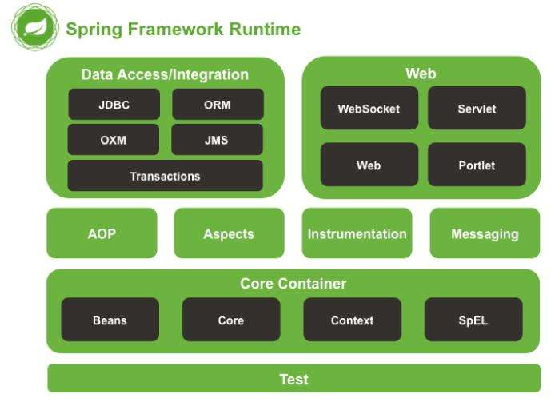

## Spring框架的基本认识

Spring 是一款开源的轻量级 Java 开发框架，旨在提高开发人员的开发效率以及系统的可维护性。

 Spring 框架指的都是 Spring Framework，它是很多模块的集合，使用这些模块可以很方便地协助我们进行开发

## Spring框架的基本特性

### 控制反转IOC和依赖注入DI

Spring通过控制反转实现了对象的创建和对象间的依赖关系管理。开发者只需要定义好Bean及其依赖关系，Spring容器负责创建和组装这些对象。实现了通过配置文件或注解来管理对象之间的依赖关系,降低了耦合度，提高了代码的可维护性和可测试性。

而依赖注入则是控制反转的实现方式

### 面向切面编程AOP

面向切面编程，允许开发者定义横切关注点，例如事务管理、安全控制等，独立于业务逻辑的代码。将那些与核心业务逻辑无关，但是对多个对象产生影响的公共行为封装起来，如日志记录、性能统计、事务等。通过AOP，可以将这些关注点模块化，提高代码的可维护性和可重用性。

### 事务管理

Spring提供了一致的事务管理接口，支持声明式和编程式事务。开发者可以轻松地进行事务管理，而无需关心具体的事务API。

## Spring框架的模块架构

Spring 框架是分模块存在，除了最核心的 **`Spring Core Container`** 是必要模块之外，其他模块都是可选的



### 核心模块 **`Core Container`**

- **Spring Core**：提供了依赖注入（Dependency Injection, DI）和控制反转（Inversion of Control, IoC）的实现，所有其他Spring模块的基础，别的模块都会依赖此模块。
- **Spring Beans**：负责管理Bean的定义和生命周期。通过IoC容器完成Bean的创建、依赖注入、初始化、销毁等操作。
- **Spring Context**：基于Core和Beans的高级容器，提供了类似JNDI的上下文功能，还包含了国际化、事件传播、资源访问等功能。
- **Spring Expression Language（SpEL）**：一个强大的表达式语言，用于在运行时查询和操作对象的值。

### 面向切面编程模块 **`AOP`**

- **Spring AOP**：提供面向切面编程的功能，可以在方法执行前后或抛出异常时动态插入额外的逻辑，比如日志记录、权限验证、事务管理等。
- **spring-aspects**：该模块为与 AspectJ 的集成提供支持。
- **spring-instrument**：提供了为 JVM 添加代理（agent）的功能。 具体来讲，它为 Tomcat 提供了一个织入代理，能够为 Tomcat 传递类文件，就像这些文件是被类加载器加载的一样。

### 数据访问/集成模块

- **Spring JDBC**：简化了原生JDBC的操作，提供模板方法来管理连接、资源的释放和异常处理。
- **Spring ORM**：支持与主流ORM框架（如Hibernate、JPA、MyBatis等）集成，简化持久层开发。
- **Spring Transaction（事务管理）**：提供声明式和编程式的事务管理机制，与数据库操作密切结合。

### Web模块

- **Spring Web**：提供基础的Web开发支持，包括Servlet API的集成，适用于构建MVC架构。
- **Spring MVC**：实现了Model-View-Controller（MVC）模式的框架，用于构建基于HTTP请求的Web应用。它是一个常用的模块，支持注解驱动的Web开发。
- **Spring WebFlux**：提供基于Reactive Streams的响应式编程模型，专为高并发的异步非阻塞请求设计。



Spring，SpringBoot，SpringMVC的关系和区别

- **Spring** 是基础框架，用来管理Bean对象，提供核心功能，如 IOC、AOP、事务管理等，同时方便整合各种框架。
- **Spring MVC** 是 **Spring** 的 Web 组件，是spring对web框架的解决方案，主要用于构建基于 MVC 模式的 Web 应用。
- **Spring Boot** 进一步简化了 Spring 和 Spring MVC 的使用，提供自动配置、嵌入式服务器、简化依赖管理，适用于快速开发 Web 和微服务应用。



## Spring的常用注解

### Web开发

- `@Controller`：用于标注控制层组件。

  - `@RestController`：是`@Controller` 和 `@ResponseBody` 的结合体，返回 JSON 数据时使用。

- `@RequestMapping`：用于映射请求 URL 到具体的方法上，还可以细分为：

  - `@GetMapping`：只能用于处理 GET 请求

  - `@PostMapping`：只能用于处理 POST 请求

  - `@DeleteMapping`：只能用于处理 DELETE 请求

- `@ResponseBody`：直接将返回的数据放入 HTTP 响应正文中，一般用于返回 JSON 数据。

- `@RequestBody`：表示一个方法参数应该绑定到 Web 请求体。

- `@PathVariable`：用于接收路径参数，比如 `@RequestMapping(“/hello/{name}”)`，这里的 name 就是路径参数。

- `@RequestParam`：用于接收请求参数。比如 `@RequestParam(name = "key") String key`，这里的 key 就是请求参数。

### 容器类

- `@Component`：标识一个类为 Spring 组件，使其能够被 Spring 容器自动扫描和管理。
- `@Service`：标识一个业务逻辑组件（服务层）。比如 `@Service("userService")`，这里的 userService 就是 Bean 的名称。
- `@Repository`：标识一个数据访问组件（持久层）。
- `@Autowired`：按类型自动注入依赖。
- `@Configuration`：用于定义配置类，可替换 XML 配置文件。
- `@Value`：用于将 Spring Boot 中 application.properties 配置的属性值赋值给变量。

### AOP

- `@Aspect` 用于声明一个切面，可以配合其他注解一起使用，比如：
  - `@After`：在方法执行之后执行。
  - `@Before`：在方法执行之前执行。
  - `@Around`：方法前后均执行。
  - `@PointCut`：定义切点，指定需要拦截的方法。

## Spring中的设计模式

### 工厂模式

Spring 使用工厂模式可以通过 `BeanFactory` 或 `ApplicationContext` 创建 bean 对象。

- `BeanFactory`：延迟注入（使用到某个 bean 的时候才会注入），相比于`ApplicationContext` 来说会占用更少的内存，程序启动速度更快。
- `ApplicationContext`：容器启动的时候，一次性创建所有 bean 。`BeanFactory` 仅提供了最基本的依赖注入支持，`ApplicationContext` 扩展了 `BeanFactory` ,除了有`BeanFactory`的功能还有额外更多功能，所以一般开发人员使用`ApplicationContext`会更多。

`ApplicationContext` 的三个实现类：

- `ClassPathXmlApplication`：把上下文文件当成类路径资源。
- `FileSystemXmlApplication`：从文件系统中的 XML 文件载入上下文定义信息。
- `XmlWebApplicationContext`：从 Web 系统中的 XML 文件载入上下文定义信息。

```java
ApplicationContext context = new ClassPathXmlApplicationContext("applicationContext.xml");
MyBean myBean = context.getBean(MyBean.class);
```

### 单例模式

在Bean对象的创建中使用了单例模式。**Spring 中 bean 的默认作用域就是 singleton(单例)的**

Spring中实现单例模式的核心代码

```java
// 通过 ConcurrentHashMap（线程安全） 实现单例注册表
private final Map<String, Object> singletonObjects = new ConcurrentHashMap<String, Object>(64);

public Object getSingleton(String beanName, ObjectFactory<?> singletonFactory) {
        Assert.notNull(beanName, "'beanName' must not be null");
        synchronized (this.singletonObjects) {
            // 检查缓存中是否存在实例
            Object singletonObject = this.singletonObjects.get(beanName);
            if (singletonObject == null) {
                //...省略了很多代码
                try {
                    singletonObject = singletonFactory.getObject();
                }
                //...省略了很多代码
                // 如果实例对象在不存在，我们注册到单例注册表中。
                addSingleton(beanName, singletonObject);
            }
            return (singletonObject != NULL_OBJECT ? singletonObject : null);
        }
    }
    //将对象添加到单例注册表
    protected void addSingleton(String beanName, Object singletonObject) {
            synchronized (this.singletonObjects) {
                this.singletonObjects.put(beanName, (singletonObject != null ? singletonObject : NULL_OBJECT));

            }
        }
}
```

Spring中的单例模式属于 **"注册式单例"** ，广泛用于 **Spring 容器的单例 Bean 管理**。它的优势是：

- **线程安全**
- **支持懒加载**
- **支持多个单例对象的管理**

### 代理模式

**Spring AOP 就是基于动态代理的**，如果要代理的对象，实现了某个接口，那么 Spring AOP 会使用 **JDK Proxy** 去创建代理对象，而对于没有实现接口的对象，就无法使用 JDK Proxy 去进行代理了，这时候 Spring AOP 会使用 **Cglib** 生成一个被代理对象的子类来作为代理

### 适配器模式

在 Spring MVC 中，`DispatcherServlet` 根据请求信息调用 `HandlerMapping`，解析请求对应的 `Handler`。解析到对应的 `Handler`（也就是 `Controller` 控制器）后，开始由`HandlerAdapter` 适配器处理。`HandlerAdapter` 作为期望接口，具体的适配器实现类用于对目标类进行适配，`Controller` 作为需要适配的类。

## Spring中的基本概念

### Bean对象

#### 定义

任何通过 Spring 容器实例化、组装和管理的 Java 对象都是 **Bean对象** 。Bean 可以在 Spring 容器中被定义并且通过依赖注入来与其他 Bean 进行互相依赖。

#### 生命周期

- **实例化**：当 Spring 容器启动时，根据配置文件或注解，Spring 会首先实例化 Bean。
- **依赖注入**：在实例化之后，Spring 容器会通过构造器、setter 方法或注解将其他 Bean 的依赖注入进来。
- **初始化**：如果 Bean 实现了 `InitializingBean` 接口或者使用了 `@PostConstruct` 注解，Spring 会在依赖注入完成后调用相应的初始化方法。
- **销毁**：如果 Bean 实现了 `DisposableBean` 接口或使用了 `@PreDestroy` 注解，Spring 会在容器关闭时调用销毁方法。

### IOC容器

#### 定义

**IOC（Inversion of Control，控制反转）** 容器是 **Spring 框架的核心**，用于**管理 Java 对象（Bean）的创建、初始化、配置、依赖注入和生命周期管理**。

IOC 容器是 **Spring 提供的一个工厂，专门负责创建和管理对象（Bean）**，并自动将它们的依赖关系组装起来。开发者无需手动创建对象，而是由 Spring 容器**自动注入**所需的对象。