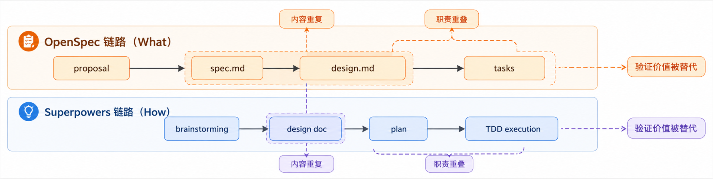
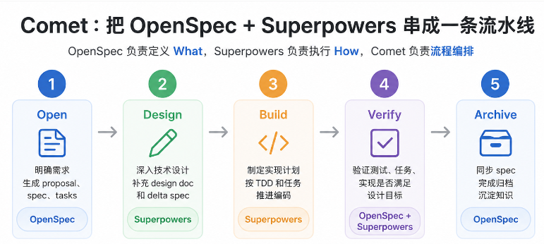

## 🧠 写在前面：AI 编程为什么需要"两件套"

2024 年到 2026 年，AI 编程助手的能力突飞猛进——几百行代码随手就能写出来。但只要真正把 Claude Code、Cursor、Copilot 之类工具放进真实项目里，你大概率会撞上这几面墙：

- **需求漂移**：你说"做个登录功能"，AI 心领神会地写出一整套 OAuth；你要的其实只是手机号 + 验证码。
- **缺乏流程**：AI 不会主动问"为什么"，拿到需求就开干，写完也不知道它按什么逻辑写的。
- **质量不稳**：今天生成的好，明天生成的差；改一个 Bug 引入三个新 Bug。
- **不可追溯**：改了很多版，没人记得为什么改；后来人不敢动这段代码。

这些问题的本质是：**AI 默认模式是"尽力完成当前指令"，而不是"遵循一套严谨的工程流程"**。

社区给出的答案是两个相互补位的工具：

- **OpenSpec**：管"做什么"——把需求变成可审查、可追溯的规范文档。
- **Superpowers**：管"怎么做"——强制 AI 走完"需求分析 → 制定计划 → TDD → 代码审查 → 验证"的工程流程。

一个管契约，一个管纪律。这两件套组合起来，被不少开发者称为 AI 编程的"黄金搭档"。

---

## 🧩 OpenSpec：给 AI 立一份"需求契约"

[OpenSpec](https://github.com/Fission-AI/OpenSpec) 是由 [Fission-AI](https://openspec.dev/) 开源的 **Spec-Driven Development（SDD）框架 + CLI 工具**，核心口号是 **"Align before code"（先对齐规格，再写代码）**。

它的形态很轻量：

- 一组本地 Markdown 文档（`openspec/specs/`、`openspec/changes/`）
- 一组斜杠命令（`/opsx:propose`、`/opsx:apply`、`/opsx:archive`）
- 一个 npm 包：`@fission-ai/openspec`

支持 25+ AI 工具，包括 Claude Code、Cursor、Codex、GitHub Copilot、Windsurf、Gemini CLI、Cline、Trae 等。

---

## 🛠️ Superpowers：给 AI 装一个"工程化大脑"

[Superpowers](https://github.com/obra/superpowers) 是 GitHub 用户 [`obra`](https://github.com/obra) 开源的一个 **Claude Skill 框架 + 软件开发方法论**。它由一组 Markdown 格式的 `SKILL.md` 文件组成，被 Claude Code / Codex / Cursor / Gemini CLI 等工具读取并执行。

它的设计哲学是：

> **不是让 AI 多会写代码，而是尽量让它少在错误的时机写代码。**

---
## 两者的关系
## 协同关系：契约 + 纪律

把两个工具叠在一起看，它们的边界其实非常清楚：

<div align="center">
  
</div>

| 维度 | Superpowers | OpenSpec |
|---|---|---|
| 定位 | AI 的执行纪律（怎么做） | 项目的规格说明书（做什么） |
| 解决问题 | 防止跳过设计、保证编码质量 | 防止需求遗忘、保证规范可追溯 |
| 核心产物 | 对话决策、实施计划、代码 | proposal.md、specs/、tasks.md |
| 工作流 | 单任务高质量闭环 | 长期增量变更管理 |
| 状态持久 | 依赖对话历史 | 基于文件系统，跨会话持久 |
| 擅长场景 | 执行阶段 | 设计阶段 |

**一句话总结：OpenSpec 让 AI 写代码前先签"合同"，锁定设计（做什么），Superpowers 让 AI 写代码时按"工艺"，保障执行（怎么做）**。两者合起来，AI 才真正像个能交付的高级工程师，而不是"按行计费"的代码打字机。

- 单独 OpenSpec：有规范但执行可能跳步，缺少 TDD 纪律。
- 单独 Superpowers：有纪律但设计共识仅存于对话，无法持久化。

组合价值：OpenSpec 将设计固化为文件资产，Superpowers 在执行中强制 TDD、调试、审查等纪律。

## 冲突关系：职责重叠
<div align="center">
  
</div>

两套工具不是简单拼起来就能协作，很多地方反而互相抢活。最明显的冲突有三个：
- Superpowers 的 brainstorming 也会产出 design doc，和 OpenSpec 的 design 职责重叠。
- OpenSpec 里的验收标准，后面又会被 Superpowers 的 TDD plan 转成 test case，原来的 spec 反而不再是主要验证手段,职责重叠。
- 两层审批互不信任，开发者经常不知道到底该以哪一层为准。

## 方案一:superpowers-openspec-team-skills
superpowers-openspec-team-skills 是 github上的一个解决方案，用于管理 OpenSpec 和 Superpowers 项目的开发流程。官方仓库地址：[superpowers-openspec-team-skills](https://github.com/SYZ-Coder/superpowers-openspec-team-skills)

### 具体使用

1）安装
```bash
npm install -g superpowers-openspec-team
```

2）项目初始化
```bash
sot init /path/to/your/project
```
3）工作流
选择具体的工作流
- superpowers-openspec-superpowers：先用 Superpowers 把问题想透，再用 OpenSpec 把事实锁准，最后回到 Superpowers 把实现、验证和归档做稳
- openspec-superpowers：先完成 OpenSpec 变更产物，再交给 Superpowers 继续实现、验证和归档
- superpowers-feature：只使用 Superpowers 的设计、计划、TDD、验证纪律(等价于单独使用superpowers)
- superpowers-learning：不是主交付流程，而是其他 workflow 完成后的增强收尾层，用来更新项目记忆、沉淀经验，并让下一次会话可以直接接上当前成果
- openspec-feature：先完成 OpenSpec proposal、design、specs、tasks，再进入实现(等价于单独使用Superpowers)

这些 workflow 只应在以下情况启用：

- 用户明确点名某个 workflow
- 用户明确要求按这种 workflow 风格执行
- 仓库策略明确要求使用该 workflow

它们不应该成为 AI 工具的默认后台流程。

示例：

```text
请使用 $superpowers-openspec-superpowers-workflow 处理这个功能。
```

4）预计产物
1.  docs/superpowers/specs/ 下的 Superpowers 设计草稿
2.  openspec/changes/<change-name>/ 下的 proposal、design、specs、tasks
3.  docs/superpowers/plans/ 下的实现计划
4.  已验证的代码变更
5.  完成后的 OpenSpec change 归档

### 工作流

#### 工作流的选取逻辑
- 想先用 Superpowers 做探索、再用 OpenSpec 锁定、最后回到 Superpowers 执行，用 `superpowers-openspec-superpowers`
- 想先从 OpenSpec 产物起步，再交给 Superpowers 继续交付，用 `openspec-superpowers`
- 只想要 Superpowers 工程纪律，不需要 OpenSpec change 产物，用 `superpowers-feature`
- 工作已经做完，想把这次经验、状态和可复用知识沉淀下来，并让下一次会话直接接上，用 `superpowers-learning`
- 只想先补齐 OpenSpec 变更文档，用 `openspec-feature`

其中 `superpowers-learning` 需要特别注意：它更像其他 workflow 的“增强收尾层”，不是一条替代开发流程的主入口。通常是在 `superpowers-feature`、`superpowers-openspec-superpowers`、`openspec-superpowers` 这类交付型 workflow 完成之后，再用它把本次会话里真正值得长期保留的内容写回 `.superpowers-memory/`，包括稳定项目事实、当前状态、简短会话记录，以及后续可沉淀成 skill、checklist 或知识库条目的经验。

对持续协作的项目，推荐这样串联：

1. 先运行一个交付型 workflow
2. 完成实现与验证
3. 再运行 `superpowers-learning`，把这次工作的稳定事实、当前状态、会话记录和可复用经验写回项目记忆

#### openspec-superpowers 工作流
openspec-superpowers-workflow 是完整功能交付的总入口。它把 Superpowers 的探索、设计确认、实现计划、TDD、验证纪律，与 OpenSpec 的 proposal、design、spec、tasks 产物组合在一起。适合用于“既要想清楚、又要留下正式规范记录、最后还要可靠实现”的功能开发。

适用场景
- 用户明确要求使用 OpenSpec + Superpowers。
- 功能不是简单改动，需要澄清、方案、规范、任务、实现、测试和验证。  
- 仓库或团队要求行为变更前先补齐 OpenSpec 产物。
- 希望用一个入口统一协调从想法到验证完成的完整流程。

工作流顺序
- 先用 Superpowers 探索上下文、澄清需求、比较方案，并确认设计方向。
- 再用 OpenSpec 创建或补齐 proposal.md、design.md、spec delta 和 tasks.md。
- 让用户确认生成出来的 OpenSpec tasks.md。
- 回到 Superpowers 编写实现计划，按 TDD 执行开发，并运行新的验证。
- 如果项目流程需要，再进入后续审查或归档步骤。

如果本次工作还需要沉淀项目记忆或可复用经验，可以在交付完成后继续使用 superpowers-learning-workflow。

示例提示词
```text
请使用 $openspec-superpowers-workflow 处理这个功能。在 OpenSpec 的 tasks 生成后，先展示给我，并等待我确认后再进入实现。
```
#### superpowers-openspec-superpowers 工作流
superpowers-openspec-superpowers-workflow 适合那些不想靠猜、不想抢跑、也不想把复杂功能做着做着做乱掉的团队。

工作流顺序
- 先用 Superpowers 探索上下文、澄清需求、比较方案，并确认设计方向
- 再用 OpenSpec 生成 proposal.md、design.md、specs/.../spec.md、tasks.md
- 展示并确认生成出来的 tasks.md
- tasks.md 确认后，先暂停并询问是否继续执行开发
- 回到 Superpowers，写实现计划，按 TDD 执行实现，并进行 fresh verification
- 开发与验证完成后，再暂停并询问是否继续代码审查
- 如果代码、测试和规格已经对齐，再归档 OpenSpec change

如果这次工作还产生了值得长期保留的经验，建议在归档后继续使用 superpowers-learning-workflow 更新项目记忆。

示例提示词
```text
请使用 $superpowers-openspec-superpowers-workflow 处理这个功能。在 OpenSpec 的 tasks 生成后，先展示给我，并等待我确认后再进入实现。
```

#### superpowers-feature 工作流
superpowers-feature-workflow 覆盖 Superpowers 侧的功能交付流程：需求探索、设计确认、实现计划、worktree、TDD 和最终验证。

它不会创建 OpenSpec 产物。适合只需要严谨实现流程，但不需要正式 OpenSpec change 记录的场景。

#### openspec-feature 工作流
openspec-feature-workflow 用于创建并补齐实现前需要的 OpenSpec change 产物：proposal、design、specs 和 tasks。
它专注于“把变更正式化”。它本身不负责 TDD、worktree 或实现后的验证流程。

#### superpowers-learning 工作流
superpowers-learning-workflow 是一个在重要工作结束后使用的反思型 workflow，用来把当前会话真正值得保留下来的内容沉淀到仓库里。
适合接在这些 workflow 后面使用：
- superpowers-feature-workflow
- superpowers-openspec-superpowers-workflow
- openspec-superpowers-workflow
它会帮助团队把最近的工作整理成四类内容：
- 稳定的项目事实
- 当前工作状态
- 简短的会话记录
- 未来可能沉淀成 workflow、skill 或 checklist 的可复用经验

## 方案二:Comet
Comet：github开源工具，1.7kstar，可以看作是OpenSpec + Superpowers 的流程编排层。它做的是流程调度：什么时候用 OpenSpec，什么时候用 Superpowers，什么时候验证，什么时候归档。
<div align="center">
  
</div>

在这个流程中：
- Open 阶段由 OpenSpec 负责，先明确需求、变更范围和任务拆解。
- Design 阶段由 Superpowers 负责，在 OpenSpec 的上下文中继续做深入技术设计。
- Build 阶段由 Superpowers 负责，根据计划和 TDD 节奏推进实现。
- Verify 阶段结合两者，检查测试、任务、设计目标和实现结果是否一致。
- Archive 阶段回到 OpenSpec，把变更同步回正式 spec，完成归档沉淀。

这样一来，OpenSpec 和 Superpowers 不再是两套互相抢活的流程，而是变成了前后衔接的工程链路：

- 职责边界更清楚。OpenSpec 负责 What，Superpowers 负责 How，Comet 负责什么时候进入哪一步。
- 流程可以恢复。长任务中途关闭会话后，Comet 可以根据状态文件识别当前阶段，让 Agent 不需要重新猜测进度。
- 文档可以衔接。OpenSpec 的 proposal、spec、tasks，和 Superpowers 的 design doc、plan，不再是几份分散文档，而是被流程串起来。
- 验证更可靠。不是 AI 说完成就完成，而是要经过 verify 阶段，检查任务、测试和归档条件是否满足。

## 🚀 标准 SOP：六阶段配合流程

下面给出一套经过社区验证的"六阶段标准操作流程"（SOP），把两个工具的指令串成一条完整的链路。

<div align="center">
  
</div>

### 阶段 1：创建分支

```bash
git checkout -b feature/user-registration
```

保持 `main` 分支干净，所有变更在独立分支进行。

### 阶段 2：提案定义（OpenSpec 主导）

```text
/opsx:propose user-registration-with-verification
```

AI 会在 `openspec/changes/user-registration-with-verification/` 下生成完整文档结构：

```text
openspec/changes/user-registration-with-verification/
├── proposal.md   ← 变更动机与范围
├── design.md     ← 技术方案
├── specs/        ← 需求与场景
└── tasks.md      ← 实施任务清单
```

**人工必做**：仔细 review `proposal.md`，确认需求方向正确后再继续。

### 阶段 3：深度设计（Superpowers 主导）

```text
/superpowers:brainstorming "用户注册功能的具体设计"
```

Superpowers 不会直接动代码，而是启动苏格拉底式追问，把 OpenSpec proposal 里没写清楚的边界条件、异常分支、验收标准再问一通，并产出设计问答记录。

### 阶段 4：计划拆分（Superpowers 主导）

```text
/superpowers:writing-plans
```

把设计拆成 2~5 分钟就能完成的小任务，每个任务写明：

- 精确的文件路径
- 完整的代码片段
- 验证步骤（如何知道这一步做对了）

输出物是一份**给"热情但无判断力的初级工程师"也能照着做**的计划文档。

### 阶段 5：TDD 执行（Superpowers + OpenSpec 共同主导）

```text
/superpowers:subagent-driven-development
# 或
/opsx:apply
```

两种用法可选：

- **想用子代理并行**：`/superpowers:subagent-driven-development`，Superpowers 会为每个任务派一个全新子代理，并通过两阶段审查（规范符合性 + 代码质量）。
- **想沿用 OpenSpec 节奏**：`/opsx:apply`，AI 按 `tasks.md` 逐项打勾实现。

无论哪种，**TDD 都不能跳过**——先写测试，看着它失败；再写最小代码让它通过；再重构。Superpowers 的 `test-driven-development` 技能会强制执行这条纪律。

### 阶段 6：归档收尾

```text
/opsx:archive user-registration-with-verification
```

实现完成后，OpenSpec 会把 `changes/` 下的产物归档，并把规范 delta 合并到 `openspec/specs/` 中。这步会留下完整的审计轨迹，方便后续人员回看"这个功能当时是怎么设计的"。

---

## 🧪 实操示例：用户注册功能

下面用一个最小例子把整套流程跑通。

### Step 1：初始化项目

```bash
mkdir demo-app && cd demo-app
npm init -y
openspec init --tools claude
```

按提示选择 Claude Code，确认后 `openspec/` 与 `.claude/` 目录会一并生成。

### Step 2：提案

在 Claude Code 对话框输入：

```text
/opsx:propose user-registration-with-email-verification
```

需求描述示例：

> 添加用户注册功能：邮箱 + 密码，注册成功后发送验证邮件，72 小时内未验证则账号失效。

OpenSpec 会输出 4 个文档，其中 `tasks.md` 大致长这样：

```markdown
## 1. 数据模型
- [ ] 1.1 创建 User 模型（email、passwordHash、status、emailVerifiedAt）
- [ ] 1.2 添加数据库迁移脚本

## 2. 接口实现
- [ ] 2.1 POST /api/register 入参校验
- [ ] 2.2 密码哈希存储（bcrypt）
- [ ] 2.3 发送验证邮件（含 72h 过期 token）

## 3. 测试
- [ ] 3.1 单元测试：邮箱格式校验
- [ ] 3.2 集成测试：注册 → 验证 → 登录完整流程
```

### Step 3：触发 Superpowers 设计追问

```text
/superpowers:brainstorming "用户注册中的边界条件：邮箱重复怎么办？验证邮件链接重复点击怎么办？"
```

Superpowers 会把"重复注册""邮件链接过期""重发验证邮件"这些边界条件逐条澄清，并写入设计文档。

### Step 4：拆任务并 TDD 执行

```text
/superpowers:writing-plans
/superpowers:test-driven-development
```

接下来 AI 会严格按红-绿-重构循环逐项推进。`tasks.md` 里的 checkbox 会一项项被勾掉。

### Step 5：归档

```text
/opsx:archive user-registration-with-email-verification
```

归档成功后 `openspec/specs/user/spec.md` 就会出现新的 Requirement / Scenario，整套变更历史可追溯。

---

## ⚠️ 注意事项与最佳实践

### 命令类型别搞混

- **CLI 命令**（`openspec init`、`git checkout -b`）：在终端里直接跑。
- **Skill 命令**（`/opsx:propose`、`/superpowers:brainstorming`）：在 AI 对话框里输入，由 AI 自动执行对应流程。

### 选对工作模式

OpenSpec 默认是 **Core 模式**（4 个命令够用）。如果项目复杂、需要更细的粒度，可以切换到 Expanded 模式：

```bash
openspec config profile   # 勾选 new/continue/ff/verify/bulk-archive/onboard
openspec update           # 让 AI 识别这些新命令
```

### 模型选型有讲究

OpenSpec 的 `propose` 与 Superpowers 的 `brainstorming` 都很吃推理能力，建议使用 Opus、GPT-5、Claude Sonnet 4.5 这一档；执行阶段（`apply`、TDD）可以用更便宜的模型，**因为有规范文档兜底，弱模型也能稳住**。

### 上下文要保持干净

OpenSpec 的精髓是"规范是上下文"。在 `/opsx:apply` 之前，建议新开一个干净的对话窗口，让 AI 只能从 `specs/` 与 `tasks.md` 里读上下文，**避免旧对话污染判断**。

### 变更结束立刻归档

完成一个变更就 `/opsx:archive`，不要堆十几个 `changes/` 不归档，否则规范库会越积越乱。

### 两种工具的"分工"再强调

| 阶段 | 谁主导 | 为什么 |
|---|---|---|
| 需求对齐 | OpenSpec | 需要结构化文档作为契约 |
| 设计澄清 | Superpowers | 需要反复追问，文档很难替代对话 |
| 计划拆分 | Superpowers | 需要按"工程师可执行"粒度拆 |
| 代码实现 | 两者皆可 | 看团队习惯 |
| 质量审查 | Superpowers | 强制 TDD 与 code-review 闭环 |
| 变更归档 | OpenSpec | 需要把 delta 合并到活文档 |

---

## 📝 总结

Superpowers 与 OpenSpec 不是一个二选一的问题，而是 **"上规矩 + 下工艺"** 的互补关系：

- **OpenSpec** 把"想做什么"变成可审查、可追溯的规范文档，解决"AI 跑偏"的问题。
- **Superpowers** 把"应该怎么写"变成强制的工程工作流，解决"AI 偷工减料"的问题。

两者配合后，AI 不再是一个"需要时刻盯着的实习生"，而是一个**按规范交付、按流程实施、按纪律收尾** 的工程师。比起单打独斗，组合使用至少带来三方面收益：

1. **可审计**：每个变更都有 `proposal.md`、`specs/`、`tasks.md` 留痕。
2. **可复用**：规范合并到 `specs/` 后是活文档，新成员 onboarding 直接读 spec 即可。
3. **可规模化**：多人/多 Agent 协作时，规则在文档里、纪律在 Skill 里，AI 行为是一致的。


---

### 参考资料

- OpenSpec 官方仓库：<https://github.com/Fission-AI/OpenSpec>
- Superpowers 官方仓库：<https://github.com/obra/superpowers>
