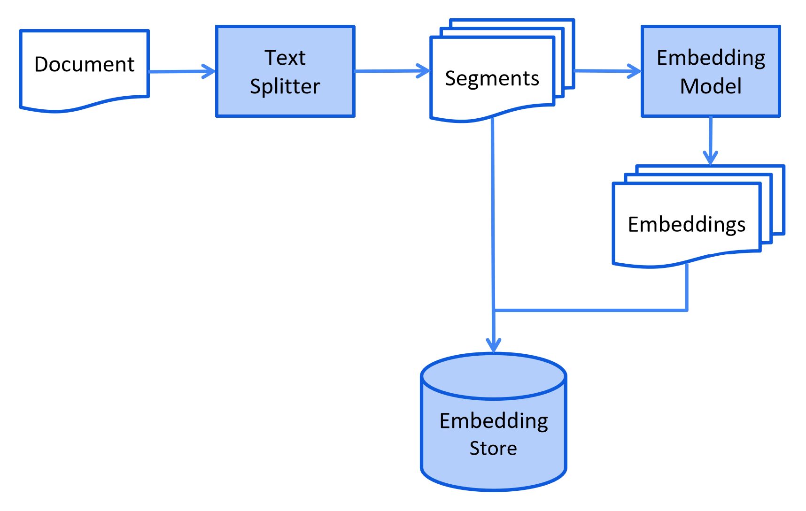

## RAG基础

### RAG概念

**RAG（检索增强生成，Retrieval-Augmented Generation）** 是一种结合 **信息检索（Retrieval）** 和 **文本生成（Generation）** 的 AI 方法，主要用于 **提高大语言模型（LLM）的知识覆盖范围和回答准确性**。**个人理解为RAG 让 AI 在回答问题时，先从外部知识库中检索相关信息，再结合检索到的内容生成最终回答。** 这样可以减少 AI 依赖自身训练数据的局限性，并提供最新、准确的信息。

- **检索** ：检索外部知识库
- **增强生成** ：将检索到的知识送给大语言模型以此来优化大模型的生成结果 ，使得大模型在生成更精确、更贴合上下文答案的同时，也能有效减少产生误导性信息的可能。

### RAG的业务场景

- 知识的局限性 ：大模型自身的知识完全源于它的训练数据，基本都是构建于网络公开的数据，对于一些实时性的、非公开的或离线的数据是无法获取到的，这部分知识也就无从具备。
- 幻觉问题： 所有的 AI 大模型的底层原理都是基于数学概率，其模型输出实质上是一系列数值运算，大模型也不例外，所以它有时候会一本正经地胡说八道，尤其是在大模型自身不具备某一方面的知识或不擅长的场景。

在之前的识物探趣的项目中，大模型不具备展馆内的展品相关知识，因此需要将展馆方提供的文档作为外部知识库。

### 上下文学习

在上下文学习方法中，模型不仅考虑 当前任务所提供的信息 ，还会考虑 上下文环境中的其他信息 。例如先前的句子或文本段落。在这种情况下，模型可以更好地理解任务的背景和目的，从而输出更
准确的信息。例如，如果要求模型生成一段关于“猫”的文本，那么在Prompt 中加入一些关于“猫”的 上下文信息，例如“猫是一种宠物，它们很可爱” ”，可以帮助模型更好地理解任务的背景和目的，从而输出更准确的信息。 **RAG其实就是上下文学习的一种，查询与问题相关的知识，并将该知识作为上下文传给大语言模型**

### RAG的过程

#### 索引阶段

嵌入模型是将文本数据（如词汇、短语或句子）转换为数值向量（文本向量化）的工具，这些向量捕捉了文本的语义信息，可用于各种自然语言处理（NLP）任务。文本向量化的本质 **将文本映射到高维空间中的点，使语义相似的文本在这个空间中距离较近。** 例如，“猫”和”狗”的向量可能会比”猫”和”汽车”的向量更接近。


在索引阶段，文档经过向量化，以便在检索阶段实现高效搜索。对于向量搜索，这通常涉及用额外的数据和 **元数据** 丰富它们，将它们分成更小的片段，**嵌入** 这些片段，最后将它们存储在向量数据库中。

#### 检索阶段

将用户的查询通过嵌入模型转换成向量 ，以便与向量数据库中存储的知识相关的向量进行比对。通过相似性搜索 ，从向量数据库中找出最匹配的前 K 个数据。

#### 增强生成阶段

将用户的查询内容和检索到的相关知识 一起嵌入到一个预设的提示词模板，将经过检索增强的提示词内容输入到大语言模型中，以此生成所需的输出。


## LangChain4j提供的解决方案

### EasyRAG

langchain4j提供的最简单的RAG实现，只需提供文档和指定向量数据库即可实现最基础的RAG，langchain4j的默认嵌入模型bge-small-en-v1.5在量化后仅仅需要24MB内存

- 引入依赖

  ```xml
  <dependency>
      <groupId>dev.langchain4j</groupId>
      <artifactId>langchain4j-easy-rag</artifactId>
      <version>1.0.0-beta1</version>
  </dependency>
  ```

  

- 在AiService中配置向量数据库，内容检索器，easyrag中内置了嵌入模型

  ```java
  // 嵌入存储 (简易内存存储)
  @Bean
  public InMemoryEmbeddingStore<TextSegment> embeddingStore() {
      return new InMemoryEmbeddingStore<>();
  }
  
  
  @Bean
  public ChatAssistant assistant(ChatLanguageModel chatLanguageModel, EmbeddingStore<TextSegment> embeddingStore) {
      return AiServices.builder(ChatAssistant.class)
              .chatLanguageModel(chatLanguageModel)
              .chatMemory(MessageWindowChatMemory.withMaxMessages(10))
              .contentRetriever(EmbeddingStoreContentRetriever.from(embeddingStore))
              .build();
  }
  ```

  

- 文档向量化后保存入向量数据库

  ```java
  Document document = FileSystemDocumentLoader.loadDocument("/Users/lengleng/Downloads/test.docx");
  EmbeddingStoreIngestor.ingest(document,embeddingStore);
  ```

  

- 调用AIService即可

### 自定义RAG

#### 核心概念

- **`Document`**：一个完整的文档,例如单个 PDF 文件或网页
- **`Metadata`** ：存储文档的额外信息,如名称、来源、最后更新时间等。
- **`TextSegment`** ：文档的一个片段,专用于文本信息。
- **`Embedding`**  ：封装了一个数值向量,表示嵌入内容的语义含义。

#### 文档处理

- **`Document Loader`** ：文档加载器用于从不同来源加载文档（可以不指定文档解析器，langchain4j会自动选择合适的文档解析器
- **`Document Parser`** ：文档解析器用于解析不同格式的文档
- **`DocumentTransformer`**  ：文档转换器，用于对文档执行各种转换,如清理、过滤、增强或总结。
- **`DocumentSplitter`** ：文档拆分器，用于将文档拆分成更小的片段:

#### 嵌入处理

- **`EmbeddingModel`**  ：表示一种将文本转换为 `Embedding` 向量的模型。需要接入外部的嵌入模型进行文本向量化
- **`EmbeddingStore`**  ：表示一个嵌入存储库(向量数据库),用于存储和高效搜索相似的嵌入。
- **`EmbeddingStoreIngestor`**  ：负责将文档嵌入并存储到 `EmbeddingStore` 中的嵌入存储摄取器

#### 内容检索

- **`ContentRetriever`**  ：内容检索器，根据用户的查询从底层数据源中获取内容

#### 检索增强

- **`RetrievalAugmentor`** ：检索增强器是 RAG的核心，它通过从不同的数据源中检索相关内容来增强用户的消息。
- **`QueryTransformer`** ：查询转换器用于将原始查询转换为一个或多个新的查询，以提高检索的准确性。常见的转换策略
  - 查询压缩：使用大语言模型（LLM）压缩查询和对话上下文，生成一个简明的查询。
  - 查询扩展：将简单的查询扩展为多个相关的查询。
  - 查询重写：对查询进行改写，使其更适合检索。
- **`QueryRouter`**  ：查询路由器负责将查询分配到合适的内容检索器。
  - 默认实现为查询会路由到所有的内容检索器中
  - 目前的实现为使用LLM来决定路由

- **`ContentAggregator`** ：内容聚合器，负责聚合多个来源的排序列表。它可以从多个查询和多个内容检索器中汇总结果，并将它们整合成一个统一的排序列表。
  - 默认的内容聚合器使用 **两阶段倒数排名融合**（Reciprocal Rank Fusion）方法来对多个排名列表进行融合。
  - **Re-Ranking Content Aggregator** ：这个聚合器使用特定的 **评分模型** 进行重新排序。
- **`ContentInjector`** ：内容注入器负责将从内容聚合器返回的内容（`s`）注入到用户消息中。
  - 默认实现：将返回的内容简单地附加到用户消息的末尾，并为这些内容加上一个前缀。

### RAG构建步骤

- 构建对应的大语言模型
- 构建嵌入模型EmbeddingModel和向量数据库EmbeddingStore
- 构建内容检索器，配置内容检索器中嵌入模型和向量数据库，同时根据需要构建内容检索器的其他属性
  - 嵌入模型
  - 向量数据库
  - 返回结果条数
  - 得分的最低值
- 构建查询转换器：使用压缩查询转换器的情况比较多
- 如果数据源只有一个可以不配置查询路由器和内容聚合器
- 构建检索增强器，需要配置以下属性
  - 查询转换器：配置查询优化策略
  - 内容检索器：配置数据源
  - 查询路由器（可选）：配置多个数据源时的路由策略
  - 内容聚合器（可选）：配置多个数据源时的内容聚合模型
  - 内容注入器：配置提示词的注入策略

### RAG管道

- **加载文档** ：使用适当的文档加载器和文档解析器载入文档
- **转换文档** ：使用文档转换器清理或增强文档
- **拆分文档** ：使用合适的文档拆分器将文档拆分为更小的片段
- **嵌入文档** ：使用嵌入模型将文档片段转换为嵌入向量再用摄取器将向量存储到向量数据库中
- **检索相关内容** : 使用配置好的检索增强器对文档进行检索
- **聚合注入内容** : 使用内容聚合器将检索到的相关内容进行结果重排后聚合再使用内容注入器注入到用户查询中，提供给语言模型,生成最终响应
